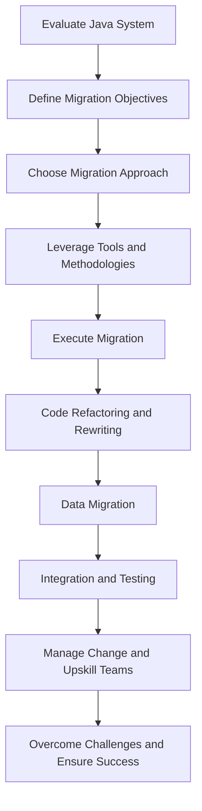

## 19.2 Migration Process and Strategies

Migrating from Java's Object-Oriented Programming (OOP) paradigm to Clojure's functional programming model is a transformative journey that can significantly enhance the scalability, maintainability, and productivity of enterprise applications. In this section, we will explore the comprehensive steps and strategies involved in this migration process, focusing on tools and methodologies that facilitate a smooth transition.

### **Understanding the Migration Landscape**

Before embarking on the migration journey, it is crucial to understand the landscape of your current Java applications. This involves evaluating the existing architecture, identifying critical components, and understanding the dependencies and integrations within your system.

#### **1. Evaluating the Current Java System**

- **Conduct a System Audit**: Begin by conducting a thorough audit of your existing Java applications. Identify the core components, libraries, and frameworks in use. Document the architecture and data flow to understand how different parts of the system interact.

- **Identify Key Business Logic**: Determine which parts of the application contain critical business logic that must be preserved during the migration. This will help prioritize components for migration and ensure that essential functionality is maintained.

- **Assess Dependencies**: Evaluate the dependencies and integrations with other systems. This includes third-party libraries, databases, and external APIs. Understanding these dependencies is crucial for planning the migration strategy.

#### **2. Defining Migration Objectives**

- **Set Clear Goals**: Define the objectives of the migration. Are you looking to improve performance, enhance maintainability, or leverage Clojure's concurrency features? Setting clear goals will guide the migration process and help measure success.

- **Prioritize Components**: Based on the system audit, prioritize components for migration. Consider factors such as complexity, business impact, and potential benefits of migration.

- **Engage Stakeholders**: Involve key stakeholders in defining migration objectives. This includes developers, architects, and business leaders. Their input will ensure that the migration aligns with organizational goals and priorities.

### **Strategizing the Migration Process**

With a clear understanding of the current system and defined objectives, the next step is to strategize the migration process. This involves choosing the right approach, tools, and methodologies to facilitate a successful transition.

#### **1. Choosing the Migration Approach**

- **Phased Approach vs. Big Bang**: Decide whether to adopt a phased approach or a big bang migration. A phased approach involves migrating components incrementally, while a big bang approach involves migrating the entire system at once. Consider factors such as risk tolerance, resource availability, and project timelines when choosing the approach.

- **Incremental Refactoring**: For many enterprises, an incremental refactoring approach is ideal. This involves gradually refactoring Java components into Clojure, allowing for continuous integration and testing. This approach minimizes risk and allows for iterative improvements.

- **Parallel Development**: Consider running Java and Clojure components in parallel during the migration. This allows for gradual transition and testing of Clojure components while maintaining the stability of the existing Java system.

#### **2. Leveraging Tools and Methodologies**

- **Build Automation with Leiningen**: Use Leiningen, a popular build automation tool for Clojure, to manage dependencies, build processes, and project configurations. Leiningen simplifies the development workflow and integrates seamlessly with existing Java build tools.

- **Testing Frameworks**: Employ testing frameworks such as `clojure.test` and `Midje` to ensure robust testing of Clojure components. Automated testing is crucial for validating functionality and catching issues early in the migration process.

- **Code Analysis Tools**: Utilize code analysis tools to identify refactoring opportunities and ensure code quality. Tools like `Eastwood` and `Kibit` provide linting and static analysis for Clojure code, helping maintain high standards.

- **Interoperability Techniques**: Leverage Clojure's interoperability features to call Java code from Clojure and vice versa. This allows for gradual migration and integration of Clojure components into existing Java systems.

### **Executing the Migration**

With a strategy in place, the next step is to execute the migration. This involves refactoring code, managing data migration, and ensuring seamless integration of Clojure components.

#### **1. Code Refactoring and Rewriting**

- **Identify Refactoring Opportunities**: Analyze the Java codebase to identify areas that can benefit from refactoring. Focus on simplifying complex logic, removing redundant code, and improving readability.

- **Translate Java Patterns to Clojure**: Translate common Java patterns into Clojure equivalents. For example, replace Java classes with Clojure namespaces and functions, and use Clojure's immutable data structures instead of Java's mutable objects.

```clojure
;; Example: Translating a Java class to a Clojure namespace

;; Java Class
public class Calculator {
    public int add(int a, int b) {
        return a + b;
    }
}

;; Clojure Namespace
(ns myapp.calculator)

(defn add [a b]
  (+ a b))
```

- **Automate Refactoring Tasks**: Use tools and scripts to automate repetitive refactoring tasks. This reduces manual effort and ensures consistency across the codebase.

#### **2. Data Migration**

- **Handle Persistent Data Stores**: Plan for data migration by assessing the current data storage solutions. Consider using Clojure libraries such as `Datomic` or `next.jdbc` for database interactions.

- **Data Transformation Techniques**: Use data transformation techniques to convert data formats and structures as needed. Clojure's rich set of data manipulation functions can simplify this process.

- **Testing and Validation**: Ensure thorough testing and validation of migrated data. Use automated tests to verify data integrity and consistency.

#### **3. Integration and Testing**

- **Maintain Test Coverage**: Maintain high test coverage throughout the migration process. This includes unit tests, integration tests, and acceptance tests.

- **Automated Testing Strategies**: Implement automated testing strategies to catch issues early and ensure continuous integration. Use tools like `CircleCI` or `Jenkins` for continuous integration and deployment.

- **Integration and Acceptance Testing**: Conduct integration and acceptance testing to validate the functionality and performance of the migrated system. Involve stakeholders in acceptance testing to ensure that the system meets business requirements.

### **Managing Change and Upskilling Teams**

Migration is not just a technical challenge; it also involves managing change and upskilling development teams.

#### **1. Training and Upskilling**

- **Training Programs for Clojure**: Invest in training programs to upskill developers in Clojure. This can include workshops, online courses, and hands-on projects.

- **Pair Programming and Mentorship**: Encourage pair programming and mentorship to facilitate knowledge transfer and collaboration. Pair experienced Clojure developers with those new to the language.

- **Building a Clojure Community**: Foster a community of Clojure developers within the organization. Encourage knowledge sharing, collaboration, and innovation.

#### **2. Adjusting Development Processes**

- **Agile Practices with Clojure**: Adapt agile practices to the Clojure development process. This includes iterative development, continuous feedback, and regular retrospectives.

- **Continuous Integration and Deployment**: Implement continuous integration and deployment pipelines to automate the build, test, and deployment processes.

- **Code Reviews and Quality Assurance**: Establish code review processes to ensure code quality and adherence to best practices. Use tools like `GitHub` or `GitLab` for code reviews and collaboration.

### **Overcoming Challenges and Ensuring Success**

Migration can present challenges, but with the right strategies and mindset, these can be overcome.

#### **1. Overcoming Resistance to Change**

- **Promote Functional Paradigm Benefits**: Educate stakeholders on the benefits of the functional programming paradigm. Highlight improvements in code maintainability, scalability, and performance.

- **Encourage Innovation and Experimentation**: Foster a culture of innovation and experimentation. Encourage developers to explore new ideas and approaches.

#### **2. Risk Mitigation Strategies**

- **Identify and Mitigate Risks**: Identify potential risks early in the migration process and develop mitigation strategies. This includes technical risks, resource constraints, and stakeholder resistance.

- **Leverage Community and Support**: Leverage the Clojure community and support resources. Participate in forums, attend conferences, and engage with open-source projects.

### **Visualizing the Migration Process**

To better understand the migration process, let's visualize the key steps and data flow using a flowchart.



**Figure 1**: Migration Process Flowchart

### **Conclusion**

Migrating from Java OOP to Clojure's functional programming paradigm is a transformative journey that requires careful planning, execution, and management. By following the strategies outlined in this section, enterprises can achieve a successful migration, unlocking the full potential of Clojure's expressive language features and enhancing their systems' scalability, maintainability, and productivity.

For further reading and resources, explore the [Clojure Official Documentation](https://clojure.org/reference) and [Clojure Community Resources](https://clojure.org/community/resources).

## **Quiz: Are You Ready to Migrate from Java to Clojure?**



### What is the first step in the migration process from Java to Clojure?

- [x] Conduct a system audit
- [ ] Define migration objectives
- [ ] Choose the migration approach
- [ ] Execute migration

> **Explanation:** Conducting a system audit is the first step to understand the current Java system and identify critical components.

### Which approach involves migrating components incrementally?

- [x] Phased approach
- [ ] Big bang approach
- [ ] Parallel development
- [ ] Incremental refactoring

> **Explanation:** The phased approach involves migrating components incrementally, allowing for continuous integration and testing.

### What tool is recommended for build automation in Clojure?

- [x] Leiningen
- [ ] Maven
- [ ] Gradle
- [ ] Ant

> **Explanation:** Leiningen is a popular build automation tool for Clojure, simplifying the development workflow.

### Which Clojure feature allows calling Java code from Clojure?

- [x] Interoperability
- [ ] Multimethods
- [ ] Protocols
- [ ] Macros

> **Explanation:** Clojure's interoperability features allow calling Java code from Clojure, facilitating gradual migration.

### What is a key benefit of using immutable data structures in Clojure?

- [x] Improved maintainability
- [ ] Faster execution
- [ ] Easier debugging
- [ ] Reduced memory usage

> **Explanation:** Immutable data structures improve maintainability by preventing unintended side effects.

### Which testing framework is commonly used in Clojure?

- [x] clojure.test
- [ ] JUnit
- [ ] TestNG
- [ ] Mockito

> **Explanation:** `clojure.test` is a commonly used testing framework in Clojure for unit testing.

### What is the purpose of data transformation techniques during migration?

- [x] Convert data formats and structures
- [ ] Improve data security
- [ ] Increase data storage capacity
- [ ] Reduce data redundancy

> **Explanation:** Data transformation techniques are used to convert data formats and structures as needed during migration.

### How can organizations overcome resistance to change during migration?

- [x] Promote functional paradigm benefits
- [ ] Enforce strict policies
- [ ] Limit stakeholder involvement
- [ ] Delay migration timelines

> **Explanation:** Promoting the benefits of the functional paradigm can help overcome resistance to change.

### What is a key component of managing change during migration?

- [x] Training and upskilling
- [ ] Reducing team size
- [ ] Increasing project timelines
- [ ] Limiting communication

> **Explanation:** Training and upskilling development teams is crucial for managing change during migration.

### True or False: A big bang migration approach involves migrating the entire system at once.

- [x] True
- [ ] False

> **Explanation:** A big bang migration approach involves migrating the entire system at once, as opposed to incrementally.


