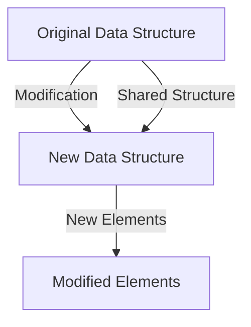
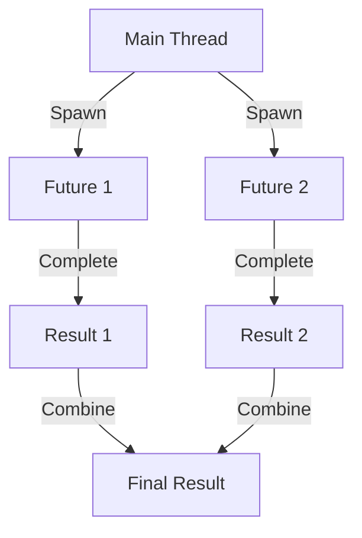

## 19.3 Outcomes and Benefits

In this section, we delve into the tangible outcomes and benefits realized by enterprises that have successfully migrated from Java Object-Oriented Programming (OOP) to Clojure's functional programming paradigm. This transition is not merely a change in syntax or language but a profound shift in how software is conceptualized, designed, and maintained. By examining both quantitative and qualitative results, we aim to provide a comprehensive understanding of the advantages that Clojure brings to enterprise applications.

### Quantitative Improvements

#### 1. Enhanced Performance and Scalability

One of the most significant quantitative benefits of migrating to Clojure is the improvement in application performance and scalability. Clojure's immutable data structures and efficient concurrency models enable applications to handle increased loads with ease.

**Java Example:**

```java
// Java code for handling concurrent tasks using ExecutorService
ExecutorService executor = Executors.newFixedThreadPool(10);
for (int i = 0; i < 100; i++) {
    executor.submit(() -> {
        // Task logic here
    });
}
executor.shutdown();
```

**Clojure Example:**

```clojure
;; Clojure code using futures for concurrency
(doseq [i (range 100)]
  (future
    ;; Task logic here
    ))
```

In the Clojure example, the use of `future` allows for lightweight concurrency without the overhead of managing thread pools explicitly. This leads to better resource utilization and improved scalability.

#### 2. Reduced Memory Footprint

Clojure's persistent data structures are designed to share structure and minimize memory usage. This results in a reduced memory footprint compared to Java's mutable collections.

**Java Example:**

```java
// Java code using ArrayList
List<Integer> numbers = new ArrayList<>();
for (int i = 0; i < 1000; i++) {
    numbers.add(i);
}
```

**Clojure Example:**

```clojure
;; Clojure code using vectors
(def numbers (vec (range 1000)))
```

The Clojure vector is immutable and shares structure with its previous versions, reducing the need for copying and thus saving memory.

#### 3. Faster Development Cycles

Clojure's REPL (Read-Eval-Print Loop) facilitates rapid prototyping and iterative development, significantly reducing the time from concept to deployment.

**Java Development Cycle:**

1. Write code
2. Compile
3. Run tests
4. Deploy

**Clojure Development Cycle:**

1. Write code in REPL
2. Test interactively
3. Deploy

The interactive nature of the REPL allows developers to test and refine their code in real-time, leading to faster development cycles.

### Qualitative Benefits

#### 1. Improved Code Maintainability

Clojure's emphasis on immutability and pure functions leads to code that is easier to reason about and maintain. This reduces the likelihood of bugs and simplifies debugging.

**Java Example:**

```java
// Java code with mutable state
public class Counter {
    private int count = 0;
    
    public void increment() {
        count++;
    }
    
    public int getCount() {
        return count;
    }
}
```

**Clojure Example:**

```clojure
;; Clojure code with immutable state
(defn increment [count]
  (inc count))

(def count 0)
(def new-count (increment count))
```

By eliminating mutable state, Clojure reduces the complexity associated with tracking changes over time, making the codebase more maintainable.

#### 2. Increased Developer Productivity

Clojure's concise syntax and powerful abstractions allow developers to express complex ideas with less code. This not only increases productivity but also reduces the cognitive load on developers.

**Java Example:**

```java
// Java code for filtering a list
List<String> names = Arrays.asList("Alice", "Bob", "Charlie");
List<String> filteredNames = names.stream()
    .filter(name -> name.startsWith("A"))
    .collect(Collectors.toList());
```

**Clojure Example:**

```clojure
;; Clojure code for filtering a list
(def names ["Alice" "Bob" "Charlie"])
(def filtered-names (filter #(clojure.string/starts-with? % "A") names))
```

The Clojure example achieves the same result with fewer lines of code, demonstrating the language's expressiveness.

#### 3. Enhanced Collaboration and Innovation

The functional programming paradigm encourages a different way of thinking about problems, fostering innovation and collaboration among team members. By focusing on functions and data transformations, teams can more easily share and reuse code.

### Visual Aids

To further illustrate these benefits, let's explore some diagrams that highlight key concepts in Clojure's functional programming paradigm.

#### Immutability and Persistent Data Structures



*Diagram: This diagram illustrates how Clojure's persistent data structures share structure with their previous versions, reducing memory usage and improving performance.*

#### Concurrency Model



*Diagram: This diagram represents Clojure's concurrency model using futures, which allows for efficient parallel execution of tasks.*

### References and Links

- [Official Clojure Documentation](https://clojure.org/)
- [ClojureDocs](https://clojuredocs.org/)
- [GitHub - Clojure](https://github.com/clojure/clojure)

### Knowledge Check

To ensure you've grasped the key concepts, consider the following questions:

1. How does Clojure's immutability contribute to reduced memory usage?
2. What are the benefits of using Clojure's REPL in the development process?
3. How does Clojure's concurrency model differ from Java's?

### Encouraging Tone

Now that we've explored the outcomes and benefits of migrating to Clojure, let's apply these insights to enhance your enterprise applications. Embrace the functional programming paradigm to unlock new levels of scalability, maintainability, and productivity.

### Quiz: Are You Ready to Migrate from Java to Clojure?



### How does Clojure's immutability contribute to reduced memory usage?

- [x] By sharing structure between data versions
- [ ] By copying data on every change
- [ ] By using mutable collections
- [ ] By increasing memory allocation

> **Explanation:** Clojure's persistent data structures share structure between versions, reducing the need for copying and saving memory.

### What is a key advantage of using Clojure's REPL?

- [x] Rapid prototyping and testing
- [ ] Slower development cycles
- [ ] Increased compilation time
- [ ] Reduced interactivity

> **Explanation:** The REPL allows for interactive development, enabling rapid prototyping and testing.

### How does Clojure's concurrency model differ from Java's?

- [x] It uses lightweight futures for concurrency
- [ ] It relies on heavy thread pools
- [ ] It does not support concurrency
- [ ] It uses only single-threaded execution

> **Explanation:** Clojure's concurrency model uses lightweight futures, allowing for efficient parallel execution without managing thread pools.

### What is a benefit of Clojure's concise syntax?

- [x] Increased developer productivity
- [ ] Increased code verbosity
- [ ] Reduced expressiveness
- [ ] Higher cognitive load

> **Explanation:** Clojure's concise syntax allows developers to express complex ideas with less code, increasing productivity.

### How does Clojure improve code maintainability?

- [x] By emphasizing immutability and pure functions
- [ ] By using mutable state extensively
- [ ] By increasing code complexity
- [ ] By reducing code readability

> **Explanation:** Clojure's emphasis on immutability and pure functions leads to code that is easier to reason about and maintain.

### What is a qualitative benefit of migrating to Clojure?

- [x] Enhanced collaboration and innovation
- [ ] Increased code duplication
- [ ] Reduced team communication
- [ ] Higher bug rates

> **Explanation:** The functional programming paradigm encourages a different way of thinking, fostering innovation and collaboration.

### How does Clojure's vector differ from Java's ArrayList?

- [x] It is immutable and shares structure
- [ ] It is mutable and copies data
- [ ] It does not support indexing
- [ ] It is slower in performance

> **Explanation:** Clojure's vector is immutable and shares structure with previous versions, unlike Java's mutable ArrayList.

### What is a key outcome of using Clojure's functional programming paradigm?

- [x] Improved application scalability
- [ ] Increased application complexity
- [ ] Reduced performance
- [ ] Higher memory usage

> **Explanation:** Clojure's functional programming paradigm, with its efficient concurrency models, improves application scalability.

### How does Clojure facilitate faster development cycles?

- [x] Through its interactive REPL
- [ ] By requiring more compilation steps
- [ ] By increasing code verbosity
- [ ] By reducing interactivity

> **Explanation:** Clojure's interactive REPL allows developers to test and refine code in real-time, leading to faster development cycles.

### True or False: Clojure's persistent data structures require copying data on every change.

- [ ] True
- [x] False

> **Explanation:** Clojure's persistent data structures share structure between versions, avoiding the need for copying data on every change.


