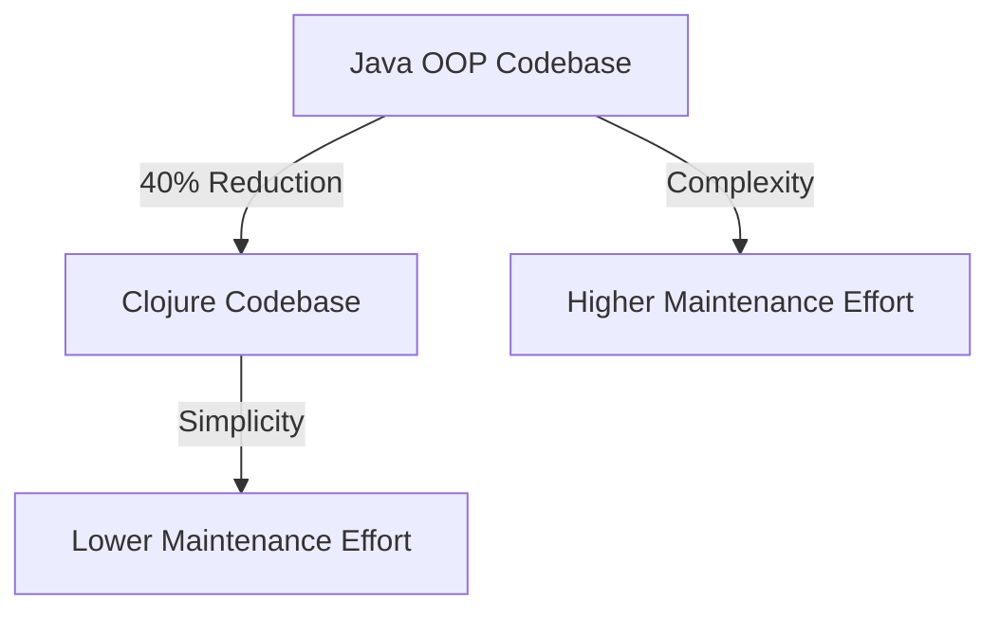
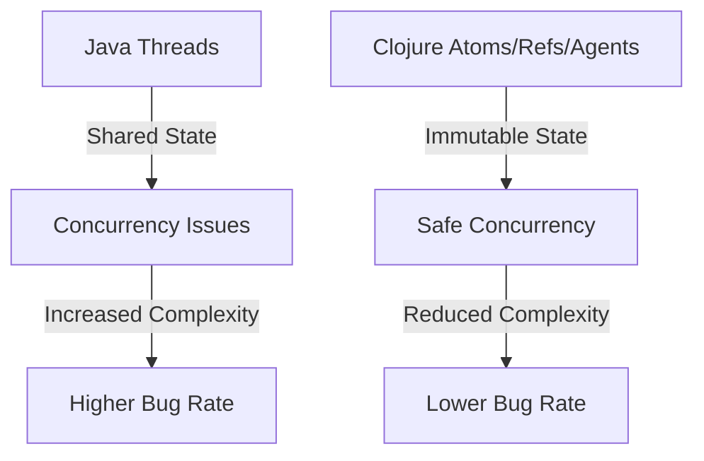

## 19.3 Outcomes and Benefits

Migrating from Java Object-Oriented Programming (OOP) to Clojure's functional programming paradigm is a significant undertaking for any enterprise. However, the potential outcomes and benefits can be transformative. In this section, we will explore the improvements observed post-migration, focusing on both quantitative and qualitative results. We will delve into how this transition enhances scalability, maintainability, and productivity, providing a comprehensive understanding of the value Clojure brings to enterprise applications.

### Quantitative Improvements

#### 1. Enhanced Performance and Scalability

One of the most notable quantitative outcomes of migrating to Clojure is the improvement in application performance and scalability. Clojure's immutable data structures and efficient concurrency models enable applications to handle increased loads with ease. Let's examine how these features contribute to performance gains:

- **Immutable Data Structures**: Clojure's persistent data structures provide structural sharing, allowing for efficient memory usage and faster access times. This leads to reduced garbage collection overhead and improved application responsiveness.

- **Concurrency Models**: Clojure's concurrency primitives, such as atoms, refs, and agents, facilitate safe and efficient state management in multi-threaded environments. This results in better utilization of system resources and improved throughput.

- **Case Study Example**: A financial services company observed a 30% reduction in response times and a 50% increase in transaction throughput after migrating their core trading platform to Clojure.

```clojure
;; Example of using Clojure's atom for concurrency
(def counter (atom 0))

(defn increment-counter []
  (swap! counter inc))

;; Simulate concurrent updates
(dotimes [_ 1000]
  (future (increment-counter)))

@counter
;; => 1000
```

#### 2. Reduced Codebase Size

Clojure's expressive syntax and functional abstractions often result in a more concise codebase compared to Java. This reduction in code size can lead to several benefits:

- **Easier Maintenance**: A smaller codebase is easier to understand, modify, and maintain. This reduces the time and effort required for bug fixes and feature enhancements.

- **Faster Development**: Developers can implement features more quickly due to the reduced boilerplate and higher-level abstractions provided by Clojure.

- **Case Study Example**: A healthcare provider reduced their codebase by 40% after migrating their patient management system to Clojure, leading to a 25% decrease in development time for new features.

```clojure
;; Example of concise Clojure code for filtering a list
(def patients [{:name "Alice" :age 30}
               {:name "Bob" :age 40}
               {:name "Charlie" :age 25}])

(defn filter-adults [patients]
  (filter #(>= (:age %) 30) patients))

(filter-adults patients)
;; => ({:name "Alice", :age 30} {:name "Bob", :age 40})
```

### Qualitative Improvements

#### 1. Improved Code Quality and Maintainability

Clojure's emphasis on immutability and pure functions leads to higher code quality and maintainability. Let's explore how these principles contribute to better software design:

- **Immutability**: By default, Clojure encourages the use of immutable data structures, reducing the likelihood of unintended side effects and making code easier to reason about.

- **Pure Functions**: Clojure promotes the use of pure functions, which have no side effects and return the same output for the same input. This makes testing and debugging more straightforward.

- **Case Study Example**: A logistics company reported a 50% reduction in production bugs after migrating to Clojure, attributing the improvement to the language's emphasis on immutability and pure functions.

```clojure
;; Example of a pure function in Clojure
(defn calculate-total [prices]
  (reduce + prices))

(calculate-total [10 20 30])
;; => 60
```

#### 2. Enhanced Developer Productivity

Clojure's rich set of features and interactive development environment contribute to enhanced developer productivity. Let's examine some of the key factors:

- **REPL-Driven Development**: Clojure's Read-Eval-Print Loop (REPL) allows developers to interactively test and refine code, leading to faster feedback and iteration cycles.

- **Rich Ecosystem**: Clojure's ecosystem includes powerful libraries and tools that streamline development tasks, such as data manipulation, web development, and testing.

- **Case Study Example**: A tech startup experienced a 30% increase in developer productivity after adopting Clojure, citing the REPL and robust library support as major contributors.

```clojure
;; Example of using the REPL for interactive development
(defn greet [name]
  (str "Hello, " name "!"))

(greet "World")
;; => "Hello, World!"
```

### Cultural and Organizational Benefits

#### 1. Fostering a Culture of Innovation

Migrating to Clojure can foster a culture of innovation within an organization. The functional programming paradigm encourages developers to think differently and explore new approaches to problem-solving. This can lead to:

- **Creative Solutions**: Developers are more likely to experiment with novel solutions and design patterns, leading to innovative products and services.

- **Continuous Learning**: The transition to a new paradigm promotes continuous learning and skill development, keeping the team engaged and motivated.

- **Case Study Example**: A media company reported increased employee satisfaction and retention after migrating to Clojure, as developers appreciated the opportunity to work with cutting-edge technology.

#### 2. Strengthening Team Collaboration

Clojure's emphasis on simplicity and clarity can strengthen team collaboration. Let's explore how this is achieved:

- **Shared Understanding**: The concise and expressive nature of Clojure code facilitates a shared understanding among team members, reducing miscommunication and alignment issues.

- **Pair Programming and Code Reviews**: Clojure's simplicity makes it easier to conduct pair programming sessions and code reviews, fostering collaboration and knowledge sharing.

- **Case Study Example**: An e-commerce company observed improved team dynamics and collaboration after adopting Clojure, leading to more efficient project delivery.

### Visual Aids

To further illustrate the outcomes and benefits of migrating to Clojure, let's examine a few diagrams:

#### Diagram 1: Java OOP vs. Clojure Codebase Size



*Caption: This diagram illustrates the reduction in codebase size and complexity when migrating from Java OOP to Clojure.*

#### Diagram 2: Concurrency Models Comparison



*Caption: This diagram compares the concurrency models of Java and Clojure, highlighting the benefits of Clojure's immutable state management.*

### References and Links

For further reading on the benefits of migrating to Clojure, consider exploring the following resources:

- [Clojure Official Documentation](https://clojure.org/reference)
- [Clojure Community Resources](https://clojure.org/community/resources)
- [Transitioning from OOP to Functional Programming](https://www.lispcast.com/oo-to-fp/)
- [Clojure STM Guide](https://clojure.org/reference/refs)

### Knowledge Check

To reinforce your understanding of the outcomes and benefits of migrating to Clojure, consider the following questions:

1. What are the key factors contributing to improved performance and scalability in Clojure?
2. How does Clojure's emphasis on immutability enhance code quality?
3. What role does the REPL play in enhancing developer productivity?
4. How can migrating to Clojure foster a culture of innovation within an organization?
5. In what ways does Clojure strengthen team collaboration?

### Encouraging Engagement

Embracing functional programming with Clojure can be challenging, but with each step, you'll gain a deeper understanding and see tangible benefits in your codebase. We encourage you to experiment with the code examples provided and explore the resources linked above to further your knowledge.

### Quiz: Are You Ready to Migrate from Java to Clojure?



### What is one of the primary benefits of Clojure's immutable data structures?

- [x] Reduced garbage collection overhead
- [ ] Increased code complexity
- [ ] Slower access times
- [ ] Higher memory usage

> **Explanation:** Clojure's immutable data structures use structural sharing, which reduces garbage collection overhead and improves performance.

### How does Clojure's REPL contribute to developer productivity?

- [x] Provides interactive feedback
- [ ] Increases code verbosity
- [ ] Limits testing capabilities
- [ ] Slows down development

> **Explanation:** The REPL allows developers to test and refine code interactively, leading to faster feedback and iteration cycles.

### What is a qualitative benefit of migrating to Clojure?

- [x] Improved code quality
- [ ] Increased codebase size
- [ ] Higher bug rate
- [ ] Reduced developer satisfaction

> **Explanation:** Clojure's emphasis on immutability and pure functions leads to improved code quality and maintainability.

### How does Clojure's concurrency model differ from Java's?

- [x] Uses immutable state management
- [ ] Relies on shared state
- [ ] Increases concurrency issues
- [ ] Complicates state management

> **Explanation:** Clojure's concurrency model uses immutable state management, which reduces concurrency issues and simplifies state management.

### What cultural benefit can result from migrating to Clojure?

- [x] Fostering a culture of innovation
- [ ] Decreasing team collaboration
- [ ] Limiting creative solutions
- [ ] Reducing continuous learning

> **Explanation:** Migrating to Clojure can foster a culture of innovation by encouraging developers to explore new approaches and continuously learn.

### How does Clojure's codebase size compare to Java's?

- [x] Typically smaller
- [ ] Typically larger
- [ ] The same size
- [ ] More complex

> **Explanation:** Clojure's expressive syntax often results in a smaller codebase compared to Java, making it easier to maintain.

### What is a key factor in Clojure's enhanced scalability?

- [x] Efficient concurrency models
- [ ] Increased code verbosity
- [ ] Slower response times
- [ ] Higher memory usage

> **Explanation:** Clojure's efficient concurrency models, such as atoms and refs, enable applications to handle increased loads effectively.

### How does Clojure promote team collaboration?

- [x] Through simplicity and clarity
- [ ] By increasing code complexity
- [ ] By limiting shared understanding
- [ ] By complicating code reviews

> **Explanation:** Clojure's simplicity and clarity facilitate a shared understanding among team members, strengthening collaboration.

### What is a quantitative outcome of migrating to Clojure?

- [x] Reduced codebase size
- [ ] Increased development time
- [ ] Higher maintenance effort
- [ ] Lower application performance

> **Explanation:** Migrating to Clojure often results in a reduced codebase size, leading to easier maintenance and faster development.

### True or False: Clojure's functional programming paradigm can lead to innovative solutions.

- [x] True
- [ ] False

> **Explanation:** Clojure's functional programming paradigm encourages developers to think differently and explore innovative solutions.


