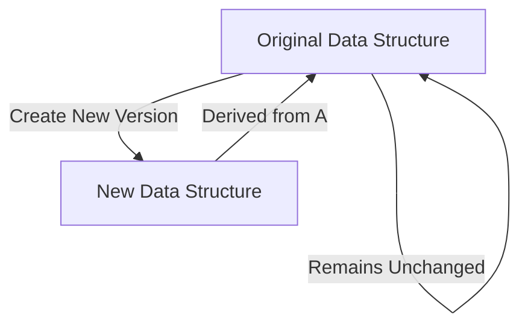
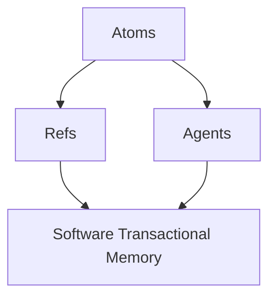

## 19.4 Lessons Learned

Transitioning from Java's Object-Oriented Programming (OOP) to Clojure's functional programming paradigm is a significant undertaking for any enterprise. This section distills the key lessons learned from a successful migration case study, providing valuable insights and recommendations for organizations considering a similar path.

### Understanding the Paradigm Shift

#### Embrace the Functional Mindset

One of the most profound lessons learned is the necessity of embracing a functional mindset. Java developers are accustomed to thinking in terms of objects, classes, and inheritance. In contrast, Clojure emphasizes functions, immutability, and data transformation. This shift requires a fundamental change in how problems are approached and solutions are designed.

- **Recommendation:** Encourage developers to immerse themselves in functional programming concepts early in the migration process. Provide training and resources that focus on the core principles of functional programming, such as pure functions, immutability, and higher-order functions.

#### Leverage Immutability for Robustness

Immutability is a cornerstone of Clojure's design, offering significant advantages in terms of robustness and predictability. By default, data structures in Clojure are immutable, meaning they cannot be changed once created. This leads to fewer side effects and easier reasoning about code behavior.

- **Recommendation:** Educate teams on the benefits of immutability and how it can lead to more reliable and maintainable code. Demonstrate how immutable data structures can simplify concurrency and state management.

```clojure
;; Example of immutable data structure in Clojure
(def person {:name "Alice" :age 30})

;; Attempting to change the age will create a new map
(def updated-person (assoc person :age 31))

;; Original map remains unchanged
(println person) ; => {:name "Alice", :age 30}
(println updated-person) ; => {:name "Alice", :age 31}
```

### Navigating the Technical Transition

#### Gradual Migration Strategy

A gradual migration strategy proved to be effective in minimizing disruption and risk. By incrementally transitioning components or services to Clojure, the enterprise was able to maintain operational stability while progressively adopting new practices.

- **Recommendation:** Adopt a phased migration approach, starting with non-critical components or new features. This allows teams to gain experience with Clojure and refine their processes before tackling more complex or critical systems.

#### Interoperability with Java

Clojure's seamless interoperability with Java was a critical factor in the migration's success. This capability allowed the enterprise to leverage existing Java libraries and frameworks, reducing the need to rewrite large portions of code.

- **Recommendation:** Identify key Java libraries and components that can be reused in the Clojure environment. Develop a strategy for integrating Java and Clojure codebases, ensuring smooth communication and data exchange between them.

```clojure
;; Example of calling Java code from Clojure
(import '(java.util Date))

(defn current-time []
  (.toString (Date.)))

(println (current-time)) ; Outputs the current date and time
```

### Enhancing Team Dynamics

#### Upskilling and Training

Investing in upskilling and training was crucial to the migration's success. Developers needed to acquire new skills and adapt to different ways of thinking about software design and implementation.

- **Recommendation:** Implement comprehensive training programs that cover both the theoretical and practical aspects of Clojure and functional programming. Encourage pair programming and mentorship to facilitate knowledge transfer and collaboration.

#### Building a Collaborative Culture

The migration process highlighted the importance of fostering a collaborative culture. Teams that embraced open communication and shared learning experiences were more successful in overcoming challenges and achieving their goals.

- **Recommendation:** Promote a culture of collaboration and continuous learning. Encourage teams to share their experiences, insights, and best practices through regular meetings, workshops, and internal documentation.

### Addressing Organizational Challenges

#### Managing Resistance to Change

Resistance to change is a common challenge in any organizational transformation. The migration to Clojure was no exception, with some team members initially hesitant to adopt new practices and technologies.

- **Recommendation:** Address resistance by clearly communicating the benefits of the migration and how it aligns with the organization's strategic goals. Involve stakeholders in the decision-making process and provide support to those who may be struggling with the transition.

#### Aligning with Business Objectives

Ensuring that the migration aligned with broader business objectives was essential for securing executive support and resources. The enterprise needed to demonstrate how Clojure could enhance scalability, maintainability, and productivity.

- **Recommendation:** Develop a clear business case that outlines the expected benefits of the migration, such as improved performance, reduced technical debt, and increased agility. Regularly communicate progress and successes to stakeholders to maintain momentum and support.

### Technical Insights and Best Practices

#### Emphasizing Code Simplicity

Clojure's emphasis on simplicity and expressiveness was a key factor in improving code quality and maintainability. By reducing boilerplate and focusing on concise, declarative code, developers were able to create more understandable and efficient solutions.

- **Recommendation:** Encourage developers to embrace Clojure's idiomatic practices, such as using higher-order functions and leveraging the power of the language's core abstractions. Regularly review code to ensure it adheres to these principles.

```clojure
;; Example of using higher-order functions for simplicity
(defn process-numbers [numbers]
  (->> numbers
       (filter even?)
       (map #(* % 2))
       (reduce +)))

(println (process-numbers [1 2 3 4 5 6])) ; => 24
```

#### Optimizing Performance

Performance optimization was an ongoing focus throughout the migration. Clojure's performance characteristics differ from Java's, requiring careful consideration of factors such as JVM tuning and efficient data handling.

- **Recommendation:** Utilize profiling and optimization tools to identify performance bottlenecks. Experiment with different JVM settings and data structures to achieve optimal performance for your specific use case.

### Visual Aids and Diagrams

To further enhance understanding, let's incorporate some visual aids to illustrate key concepts.

#### Immutability and Persistent Data Structures



*Diagram 1: Immutability and Persistent Data Structures in Clojure*

This diagram illustrates how Clojure's persistent data structures allow for efficient creation of new versions without modifying the original data.

#### Concurrency Models in Clojure



*Diagram 2: Concurrency Models in Clojure*

This diagram provides an overview of the different concurrency models available in Clojure, highlighting the relationships between atoms, refs, agents, and software transactional memory.

### Conclusion and Final Recommendations

The migration from Java OOP to Clojure was a transformative journey that offered numerous lessons and insights. By embracing functional programming principles, leveraging Clojure's unique features, and fostering a collaborative culture, the enterprise was able to achieve significant improvements in scalability, maintainability, and productivity.

#### Final Recommendations

1. **Start Small:** Begin with a pilot project or non-critical component to gain experience with Clojure and refine your migration strategy.
2. **Invest in Training:** Provide comprehensive training and resources to help developers transition to functional programming.
3. **Foster Collaboration:** Encourage open communication and knowledge sharing among teams to overcome challenges and drive innovation.
4. **Align with Business Goals:** Ensure that the migration aligns with broader business objectives and regularly communicate progress to stakeholders.
5. **Embrace Clojure's Strengths:** Leverage Clojure's features, such as immutability and interoperability, to create robust and efficient solutions.

By following these recommendations and learning from the experiences of others, your enterprise can successfully navigate the transition to Clojure and unlock the full potential of functional programming.

## **Quiz: Are You Ready to Migrate from Java to Clojure?**



### What is a key advantage of using immutable data structures in Clojure?

- [x] They lead to fewer side effects and easier reasoning about code behavior.
- [ ] They allow for direct modification of data.
- [ ] They require less memory than mutable data structures.
- [ ] They are only useful for concurrent programming.

> **Explanation:** Immutable data structures lead to fewer side effects and make it easier to reason about code behavior, which is a key advantage in functional programming.

### How does Clojure's interoperability with Java benefit a migration process?

- [x] It allows the reuse of existing Java libraries and frameworks.
- [ ] It eliminates the need for any Java code.
- [ ] It requires rewriting all Java code in Clojure.
- [ ] It only works with specific Java versions.

> **Explanation:** Clojure's interoperability with Java allows the reuse of existing Java libraries and frameworks, reducing the need to rewrite large portions of code.

### What is a recommended strategy for managing resistance to change during a migration?

- [x] Clearly communicate the benefits of the migration and involve stakeholders in the decision-making process.
- [ ] Ignore resistance and proceed with the migration.
- [ ] Only involve technical teams in the migration process.
- [ ] Delay addressing resistance until after the migration is complete.

> **Explanation:** Managing resistance involves clearly communicating the benefits and involving stakeholders in the decision-making process to gain their support.

### What is a key characteristic of Clojure's concurrency models?

- [x] They provide different mechanisms for managing state, such as atoms, refs, and agents.
- [ ] They rely solely on traditional locking mechanisms.
- [ ] They do not support concurrent programming.
- [ ] They require external libraries for implementation.

> **Explanation:** Clojure's concurrency models provide different mechanisms for managing state, such as atoms, refs, and agents, which are integral to its approach to concurrency.

### Why is a gradual migration strategy recommended?

- [x] It minimizes disruption and risk by incrementally transitioning components.
- [ ] It allows for a complete overhaul of the system at once.
- [ ] It requires less planning and preparation.
- [ ] It is only suitable for small projects.

> **Explanation:** A gradual migration strategy minimizes disruption and risk by incrementally transitioning components, allowing for a smoother transition.

### What is a benefit of fostering a collaborative culture during a migration?

- [x] It helps teams overcome challenges and achieve their goals through open communication and shared learning experiences.
- [ ] It reduces the need for documentation.
- [ ] It eliminates the need for formal training.
- [ ] It allows for individual work without team input.

> **Explanation:** Fostering a collaborative culture helps teams overcome challenges and achieve their goals through open communication and shared learning experiences.

### How can performance optimization be achieved in Clojure?

- [x] Utilize profiling and optimization tools to identify bottlenecks and experiment with JVM settings.
- [ ] Ignore performance issues until after the migration.
- [ ] Rely solely on Clojure's default settings.
- [ ] Avoid using any Java libraries.

> **Explanation:** Performance optimization in Clojure can be achieved by utilizing profiling and optimization tools to identify bottlenecks and experimenting with JVM settings.

### What is a key lesson learned about code simplicity in Clojure?

- [x] Emphasizing simplicity and expressiveness improves code quality and maintainability.
- [ ] Complexity is necessary for advanced functionality.
- [ ] Simplicity leads to less efficient code.
- [ ] Expressiveness is not a priority in Clojure.

> **Explanation:** Emphasizing simplicity and expressiveness in Clojure improves code quality and maintainability, making it easier to understand and work with.

### What role does training play in a successful migration to Clojure?

- [x] It helps developers acquire new skills and adapt to different ways of thinking about software design.
- [ ] It is only necessary for junior developers.
- [ ] It can be skipped if developers have Java experience.
- [ ] It is only useful after the migration is complete.

> **Explanation:** Training helps developers acquire new skills and adapt to different ways of thinking about software design, which is crucial for a successful migration.

### True or False: Clojure requires rewriting all existing Java code for a successful migration.

- [ ] True
- [x] False

> **Explanation:** False. Clojure's interoperability with Java allows for the reuse of existing Java libraries and frameworks, reducing the need to rewrite all existing Java code.


