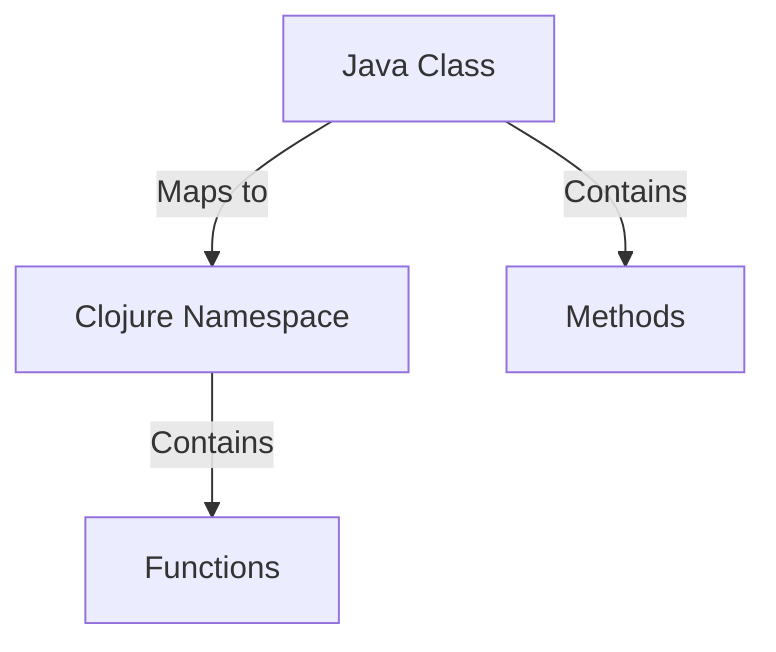
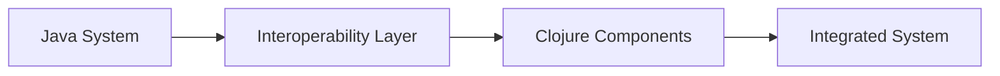

## 19.4 Lessons Learned

Migrating from Java's Object-Oriented Programming (OOP) paradigm to Clojure's functional programming model is a transformative journey that can yield significant benefits for enterprise applications. However, it also presents unique challenges that require careful planning and execution. In this section, we will delve into the key lessons learned from a successful enterprise migration, providing actionable insights and recommendations for organizations considering a similar transition.

### Embrace the Paradigm Shift

One of the most profound lessons learned is the importance of fully embracing the paradigm shift from OOP to functional programming. This transition is not merely a change in syntax or tools; it requires a fundamental shift in how developers think about software design and problem-solving.

#### Understand the Core Principles

- **Immutability**: In Clojure, data is immutable by default, which contrasts with Java's mutable state. Embrace immutability to reduce side effects and enhance code reliability.
- **Pure Functions**: Focus on writing pure functions that produce the same output for the same input, without side effects. This approach simplifies reasoning about code and facilitates testing.
- **Higher-Order Functions**: Leverage higher-order functions to create reusable and composable code. Functions can be passed as arguments, returned from other functions, and stored in data structures.

#### Code Example: Pure Functions and Immutability

```clojure
;; A pure function that calculates the square of a number
(defn square [x]
  (* x x))

;; Using immutability to transform a list of numbers
(def numbers [1 2 3 4 5])
(def squared-numbers (map square numbers))

;; Output: [1 4 9 16 25]
```

### Foster a Culture of Learning

Transitioning to Clojure requires a commitment to continuous learning and adaptation. Encourage your development team to embrace new concepts and practices through training, mentorship, and collaboration.

#### Training and Upskilling

- **Formal Training Programs**: Invest in structured training programs to build foundational knowledge of Clojure and functional programming.
- **Pair Programming**: Encourage pair programming sessions to facilitate knowledge sharing and collaborative problem-solving.
- **Mentorship**: Establish mentorship programs where experienced Clojure developers guide newcomers through the learning process.

### Redefine Code Organization

In Java, code organization often revolves around classes and packages. In Clojure, namespaces and functions take center stage. Redefining how code is organized can lead to more modular and maintainable systems.

#### Use Namespaces Effectively

- **Logical Grouping**: Organize code into namespaces that logically group related functions and data structures.
- **Avoid Over-Nesting**: Keep namespace hierarchies shallow to avoid complexity and improve readability.

#### Code Example: Organizing Code with Namespaces

```clojure
(ns myapp.core
  (:require [myapp.utils :as utils]))

(defn process-data [data]
  (utils/transform data))
```

### Prioritize Incremental Migration

A phased approach to migration can mitigate risks and allow for gradual adaptation. Prioritize incremental migration over a "big bang" approach to ensure stability and continuity.

#### Define Clear Phases

- **Assessment Phase**: Evaluate existing Java systems to identify components suitable for migration.
- **Pilot Projects**: Start with small, non-critical projects to gain experience and confidence.
- **Iterative Rollout**: Gradually expand the scope of migration, incorporating feedback and lessons learned.

### Leverage Interoperability

Clojure's seamless interoperability with Java is a significant advantage during migration. Leverage this feature to integrate Clojure components with existing Java systems, enabling a smooth transition.

#### Interoperability Strategies

- **Calling Java from Clojure**: Utilize Clojure's ability to call Java methods and use Java libraries.
- **Embedding Clojure in Java**: Embed Clojure code within Java applications to introduce functional programming incrementally.

#### Code Example: Calling Java from Clojure

```clojure
;; Importing a Java class
(import 'java.util.Date)

;; Creating a new Date instance
(def current-date (Date.))

;; Calling a Java method
(.toString current-date)
```

### Address Concurrency with Clojure's Primitives

Concurrency is a critical aspect of enterprise applications. Clojure offers powerful concurrency primitives that simplify managing shared state and parallel execution.

#### Concurrency Models

- **Atoms**: Use atoms for managing independent, synchronous state changes.
- **Refs and Software Transactional Memory (STM)**: Leverage refs and STM for coordinated, atomic state changes across multiple variables.
- **Agents**: Utilize agents for asynchronous state updates.

#### Code Example: Using Atoms for Concurrency

```clojure
;; Define an atom to manage shared state
(def counter (atom 0))

;; Safely update the atom's value
(swap! counter inc)

;; Output: 1
```

### Encourage Experimentation and Innovation

Clojure's expressive language features and functional paradigm encourage experimentation and innovation. Foster a culture where developers feel empowered to explore new ideas and approaches.

#### Promote a Growth Mindset

- **Hackathons and Innovation Days**: Organize events that encourage creative problem-solving and experimentation.
- **Open Source Contributions**: Encourage contributions to open-source Clojure projects to gain exposure to diverse use cases and solutions.

### Recommendations for Similar Enterprises

Based on the lessons learned from this case study, we offer the following recommendations for enterprises considering a migration from Java OOP to Clojure:

1. **Start Small and Scale Gradually**: Begin with small, manageable projects to build confidence and expertise before scaling up.
2. **Invest in Training and Support**: Provide comprehensive training and support to help your team transition smoothly.
3. **Leverage Existing Java Investments**: Use Clojure's interoperability to integrate with existing Java systems, preserving valuable investments.
4. **Embrace Functional Design Principles**: Fully embrace functional programming principles to unlock the full potential of Clojure.
5. **Foster a Collaborative Culture**: Encourage collaboration and knowledge sharing to accelerate learning and innovation.

### Visual Aids

#### Diagram: Java Classes to Clojure Namespaces



*Diagram 1: Mapping Java classes to Clojure namespaces and functions.*

#### Diagram: Data Flow During Migration



*Diagram 2: Data flow between components during migration.*

### References and Links

- [Clojure Official Documentation](https://clojure.org/reference)
- [Clojure Community Resources](https://clojure.org/community/resources)
- [Transitioning from OOP to Functional Programming](https://www.lispcast.com/oo-to-fp/)
- [Clojure STM Guide](https://clojure.org/reference/refs)

### Knowledge Check

To reinforce your understanding of the lessons learned from migrating Java OOP to Clojure, consider the following questions:

1. What are the key principles of functional programming that differ from OOP?
2. How can Clojure's interoperability with Java be leveraged during migration?
3. What are the benefits of using Clojure's concurrency primitives over traditional Java concurrency models?

### Encouraging Engagement

Embracing functional programming can be challenging, but with each step, you'll gain a deeper understanding and see tangible benefits in your codebase. Remember, the journey from Java OOP to Clojure is not just about adopting a new language—it's about transforming how you approach software development.

### Quiz: Are You Ready to Migrate from Java to Clojure?



### What is a key advantage of using Clojure's immutable data structures?

- [x] They reduce side effects and enhance code reliability.
- [ ] They allow for faster execution of code.
- [ ] They simplify syntax compared to Java.
- [ ] They enable dynamic typing.

> **Explanation:** Immutable data structures reduce side effects by ensuring that data cannot be modified after creation, leading to more reliable and predictable code.

### How can Clojure's interoperability with Java benefit a migration process?

- [x] By allowing Clojure to call Java methods and use Java libraries.
- [ ] By converting Java code directly into Clojure code.
- [ ] By eliminating the need for Java developers.
- [ ] By providing a graphical user interface for Java applications.

> **Explanation:** Clojure's interoperability allows it to seamlessly call Java methods and use Java libraries, facilitating integration with existing Java systems during migration.

### What is the primary purpose of using higher-order functions in Clojure?

- [x] To create reusable and composable code.
- [ ] To improve performance of the application.
- [ ] To simplify error handling.
- [ ] To enable dynamic typing.

> **Explanation:** Higher-order functions allow for the creation of reusable and composable code by enabling functions to be passed as arguments, returned from other functions, and stored in data structures.

### Which Clojure concurrency primitive is best suited for managing independent, synchronous state changes?

- [x] Atoms
- [ ] Refs
- [ ] Agents
- [ ] Vars

> **Explanation:** Atoms are used for managing independent, synchronous state changes, providing a simple and efficient way to handle concurrency.

### What is a recommended approach for migrating enterprise applications from Java to Clojure?

- [x] Start with small, manageable projects and scale gradually.
- [ ] Migrate the entire system in one go.
- [ ] Focus only on critical projects initially.
- [ ] Avoid using Java interoperability features.

> **Explanation:** Starting with small, manageable projects allows for building confidence and expertise before scaling up, reducing risks associated with migration.

### Why is it important to foster a culture of learning during the migration process?

- [x] To encourage continuous learning and adaptation to new concepts.
- [ ] To ensure that all developers become experts in Java.
- [ ] To reduce the need for external consultants.
- [ ] To eliminate the need for documentation.

> **Explanation:** Fostering a culture of learning encourages continuous adaptation to new concepts and practices, which is essential for a successful transition to Clojure.

### What is the role of namespaces in Clojure?

- [x] To logically group related functions and data structures.
- [ ] To define classes and objects.
- [ ] To manage memory allocation.
- [ ] To enforce security protocols.

> **Explanation:** Namespaces in Clojure are used to logically group related functions and data structures, improving code organization and maintainability.

### How can organizations encourage experimentation and innovation during migration?

- [x] By organizing hackathons and innovation days.
- [ ] By enforcing strict coding standards.
- [ ] By limiting access to new technologies.
- [ ] By focusing solely on legacy systems.

> **Explanation:** Organizing hackathons and innovation days encourages creative problem-solving and experimentation, fostering a culture of innovation.

### What is a benefit of using pure functions in Clojure?

- [x] They produce the same output for the same input, simplifying reasoning about code.
- [ ] They allow for dynamic typing.
- [ ] They improve execution speed.
- [ ] They enable direct hardware access.

> **Explanation:** Pure functions produce the same output for the same input without side effects, simplifying reasoning about code and facilitating testing.

### True or False: Clojure's functional programming model requires a fundamental shift in how developers think about software design.

- [x] True
- [ ] False

> **Explanation:** True. Clojure's functional programming model requires a fundamental shift in thinking, focusing on immutability, pure functions, and higher-order functions.



By reflecting on these lessons and recommendations, enterprises can navigate the migration from Java OOP to Clojure with greater confidence and success.
