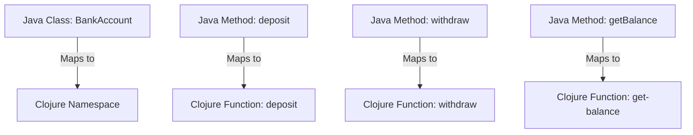

## 2.1 Evaluating Current Java Systems

Embarking on a migration journey from Java Object-Oriented Programming (OOP) to Clojure's functional programming paradigm requires a thorough evaluation of your current Java systems. This evaluation is crucial to identify components that are suitable for migration and to understand the scope and complexity of the transition. In this section, we will guide you through the process of conducting a comprehensive audit of your existing Java applications and infrastructure.

### Conducting an Audit of Existing Java Applications

The first step in evaluating your current Java systems is to conduct a detailed audit. This audit will help you understand the architecture, dependencies, and performance characteristics of your applications. Here's how to approach this task:

#### 1. **Inventory Your Applications**

Begin by creating an inventory of all Java applications within your enterprise. This inventory should include:

- **Application Name**: The name of the application.
- **Version**: The current version of the application.
- **Purpose**: A brief description of what the application does.
- **Dependencies**: A list of libraries, frameworks, and external services the application relies on.
- **Deployment Environment**: Information about where the application is deployed (e.g., on-premises, cloud, hybrid).
- **User Base**: The number of users or departments that rely on the application.

#### 2. **Analyze Codebase Complexity**

Evaluate the complexity of each application's codebase. This involves:

- **Code Size**: Measure the lines of code (LOC) and the number of classes and methods.
- **Code Quality**: Use static analysis tools to assess code quality, identifying issues such as code smells, technical debt, and adherence to coding standards.
- **Modularity**: Determine how modular the code is by examining the separation of concerns and the use of design patterns.

#### 3. **Assess Performance and Scalability**

Performance and scalability are critical factors in determining the suitability of an application for migration. Consider the following:

- **Performance Metrics**: Gather data on response times, throughput, and resource utilization.
- **Scalability**: Evaluate the application's ability to handle increased load and its current scalability limitations.
- **Bottlenecks**: Identify any performance bottlenecks or areas where the application struggles under load.

#### 4. **Review Architectural Design**

Understanding the architectural design of your Java applications is essential for planning a migration. Focus on:

- **Architecture Style**: Identify whether the application follows a monolithic, microservices, or other architectural styles.
- **Integration Points**: Document how the application integrates with other systems and services.
- **State Management**: Analyze how the application manages state, including session management and data persistence.

#### 5. **Evaluate Security and Compliance**

Security and compliance are paramount in enterprise environments. Ensure you:

- **Security Posture**: Review the application's security measures, including authentication, authorization, and data encryption.
- **Compliance Requirements**: Identify any regulatory or compliance requirements the application must adhere to.

### Identifying Components Suitable for Migration

Once you have a comprehensive understanding of your Java systems, the next step is to identify components that are suitable for migration to Clojure. This involves:

#### 1. **Prioritizing Components**

Not all components are equally suited for migration. Prioritize components based on:

- **Business Value**: Focus on components that deliver significant business value or are critical to operations.
- **Technical Feasibility**: Consider components that are technically feasible to migrate, such as those with minimal dependencies or those that can benefit from Clojure's strengths.
- **Risk Assessment**: Evaluate the risks associated with migrating each component, including potential downtime and impact on users.

#### 2. **Mapping Java OOP Concepts to Clojure**

To facilitate the migration, map Java OOP concepts to their Clojure equivalents. This includes:

- **Classes and Objects**: Identify classes and objects that can be replaced with Clojure's immutable data structures and functions.
- **Inheritance and Polymorphism**: Determine how inheritance hierarchies can be refactored using Clojure's protocols and multimethods.
- **State Management**: Plan how to transition from mutable state in Java to Clojure's immutable state management.

#### 3. **Evaluating Integration Points**

Consider how the components interact with other systems and services. This includes:

- **APIs and Services**: Identify APIs and services that need to be re-implemented or adapted in Clojure.
- **Data Sources**: Evaluate how data sources, such as databases and message queues, will be accessed from Clojure.

#### 4. **Assessing Concurrency Requirements**

Clojure offers powerful concurrency primitives that can enhance performance and scalability. Assess:

- **Concurrency Needs**: Identify components that require concurrent processing and can benefit from Clojure's concurrency models.
- **Current Limitations**: Determine any limitations in the current Java implementation that can be addressed with Clojure's concurrency features.

### Code Examples

To illustrate the evaluation process, let's consider a simple Java application and how we might evaluate it for migration to Clojure.

#### Java Code Example

```java
// Java class representing a simple bank account
public class BankAccount {
    private String accountNumber;
    private double balance;

    public BankAccount(String accountNumber, double initialBalance) {
        this.accountNumber = accountNumber;
        this.balance = initialBalance;
    }

    public void deposit(double amount) {
        if (amount > 0) {
            balance += amount;
        }
    }

    public boolean withdraw(double amount) {
        if (amount > 0 && balance >= amount) {
            balance -= amount;
            return true;
        }
        return false;
    }

    public double getBalance() {
        return balance;
    }
}
```

#### Clojure Code Example

```clojure
;; Clojure representation of a bank account using immutable data structures
(defn create-account [account-number initial-balance]
  {:account-number account-number
   :balance initial-balance})

(defn deposit [account amount]
  (if (pos? amount)
    (update account :balance + amount)
    account))

(defn withdraw [account amount]
  (if (and (pos? amount) (>= (:balance account) amount))
    (update account :balance - amount)
    account))

(defn get-balance [account]
  (:balance account))
```

### Visual Aids

To further aid understanding, let's include a diagram that maps Java classes to Clojure namespaces and functions.



**Diagram Description:** This diagram illustrates how a Java class and its methods map to a Clojure namespace and functions, highlighting the transition from OOP to functional programming.

### References and Links

For further reading and resources, consider the following links:

- [Clojure Official Documentation](https://clojure.org/reference)
- [Clojure Community Resources](https://clojure.org/community/resources)
- [Transitioning from OOP to Functional Programming](https://www.lispcast.com/oo-to-fp/)

### Knowledge Check

To reinforce your understanding, consider the following questions:

- What are the key factors to consider when evaluating the complexity of a Java codebase?
- How can you prioritize components for migration based on business value and technical feasibility?
- What are the benefits of using Clojure's immutable data structures over Java's mutable objects?

### Exercises

1. **Inventory Exercise**: Create an inventory of a sample Java application, listing its dependencies, deployment environment, and user base.

2. **Code Complexity Analysis**: Use a static analysis tool to evaluate the code quality of a Java application and identify areas for improvement.

3. **Performance Assessment**: Gather performance metrics for a Java application and identify any bottlenecks or scalability issues.

### Summary

In this section, we have explored the process of evaluating current Java systems in preparation for migration to Clojure. By conducting a thorough audit and identifying components suitable for migration, you can ensure a smooth transition to Clojure's functional programming paradigm. Embrace the challenge, and you'll unlock new levels of scalability, maintainability, and productivity in your enterprise applications.

## **Quiz: Are You Ready to Migrate from Java to Clojure?**



### What is the first step in evaluating your current Java systems for migration?

- [x] Conducting an audit of existing Java applications
- [ ] Identifying components suitable for migration
- [ ] Mapping Java OOP concepts to Clojure
- [ ] Assessing concurrency requirements

> **Explanation:** Conducting an audit of existing Java applications is the first step to understand the architecture, dependencies, and performance characteristics.

### Which factor is NOT critical when evaluating the complexity of a Java codebase?

- [ ] Code Size
- [ ] Code Quality
- [ ] Modularity
- [x] User Interface Design

> **Explanation:** User Interface Design is not directly related to the complexity of the codebase itself.

### What should be included in the inventory of Java applications?

- [x] Application Name, Version, Purpose, Dependencies, Deployment Environment, User Base
- [ ] Only Application Name and Version
- [ ] Purpose and User Base
- [ ] Dependencies and Deployment Environment

> **Explanation:** A comprehensive inventory includes all these elements to provide a full picture of the application.

### How can you prioritize components for migration?

- [x] Based on business value and technical feasibility
- [ ] By focusing on the largest components first
- [ ] By migrating the easiest components first
- [ ] By considering only the technical feasibility

> **Explanation:** Prioritizing based on business value and technical feasibility ensures that the most impactful components are migrated first.

### What is a key benefit of using Clojure's immutable data structures?

- [x] Enhanced concurrency and reduced side effects
- [ ] Faster execution speed
- [ ] Easier debugging
- [ ] Simplified syntax

> **Explanation:** Immutable data structures enhance concurrency and reduce side effects, which are key benefits in functional programming.

### Which Java concept maps to Clojure's protocols and multimethods?

- [x] Inheritance and Polymorphism
- [ ] Classes and Objects
- [ ] State Management
- [ ] Exception Handling

> **Explanation:** Inheritance and Polymorphism in Java can be refactored using Clojure's protocols and multimethods.

### What is the purpose of assessing performance and scalability?

- [x] To identify bottlenecks and scalability limitations
- [ ] To determine the user interface design
- [ ] To evaluate code quality
- [ ] To assess security measures

> **Explanation:** Assessing performance and scalability helps identify bottlenecks and scalability limitations that need to be addressed during migration.

### What should be considered when evaluating integration points?

- [x] APIs, Services, and Data Sources
- [ ] Only APIs
- [ ] Only Services
- [ ] Only Data Sources

> **Explanation:** Evaluating integration points involves considering APIs, services, and data sources to ensure seamless migration.

### Which concurrency primitive is NOT part of Clojure's concurrency model?

- [ ] Atoms
- [ ] Refs
- [ ] Agents
- [x] Threads

> **Explanation:** Threads are a lower-level concurrency primitive, whereas Clojure provides Atoms, Refs, and Agents for managing concurrency.

### True or False: Security and compliance are not important when evaluating Java systems for migration.

- [ ] True
- [x] False

> **Explanation:** Security and compliance are critical factors to consider when evaluating Java systems for migration to ensure that all regulatory and security requirements are met.


