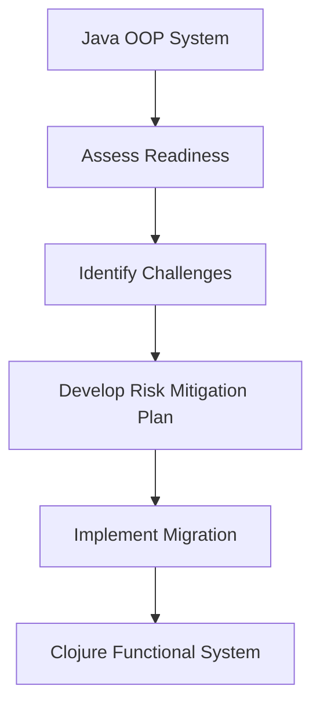

## 2.2 Identifying Challenges and Risks

As enterprises embark on the journey of migrating from Java Object-Oriented Programming (OOP) to Clojure's functional programming paradigm, it is crucial to identify and understand the challenges and risks that may arise during this transition. This section will delve into both technical and organizational obstacles, providing insights and strategies to develop an effective risk mitigation plan.

### Understanding the Technical Challenges

#### 1. Paradigm Shift: From OOP to Functional Programming

**Explain the Shift:** Transitioning from Java's OOP to Clojure's functional programming requires a fundamental change in how developers think about code structure and execution. In Java, developers are accustomed to organizing code around classes and objects, encapsulating state and behavior. In contrast, Clojure emphasizes functions, immutability, and data transformation.

**Key Differences:**

- **State Management:** Java relies on mutable state, whereas Clojure promotes immutability. This shift can be challenging as developers must learn to manage state changes through pure functions and data transformations.
- **Code Organization:** Java uses classes and inheritance, while Clojure uses namespaces and functions. Developers need to adapt to organizing code without the traditional class hierarchy.

**Code Example:**

Java OOP Example:
```java
public class Car {
    private String model;
    private int speed;

    public Car(String model) {
        this.model = model;
        this.speed = 0;
    }

    public void accelerate(int increment) {
        this.speed += increment;
    }

    public int getSpeed() {
        return this.speed;
    }
}
```

Clojure Functional Example:
```clojure
(defn create-car [model]
  {:model model :speed 0})

(defn accelerate [car increment]
  (update car :speed + increment))

(def car (create-car "Sedan"))
(def faster-car (accelerate car 10))
```

**Try It Yourself:** Modify the Clojure example to include a `decelerate` function that decreases the car's speed.

#### 2. Tooling and Ecosystem Differences

**Explain the Differences:** Java has a mature ecosystem with a wide range of tools and libraries. Clojure, while powerful, has a different set of tools and libraries that may not be as familiar to Java developers.

**Key Tools:**

- **Build Tools:** Java developers often use Maven or Gradle, whereas Clojure uses Leiningen or deps.edn.
- **IDEs:** While IntelliJ IDEA and Eclipse are popular for Java, Clojure developers might prefer Emacs with CIDER or IntelliJ with Cursive.

**Code Example:**

Leiningen `project.clj` Example:
```clojure
(defproject my-clojure-project "0.1.0-SNAPSHOT"
  :dependencies [[org.clojure/clojure "1.10.3"]]
  :main ^:skip-aot my-clojure-project.core
  :target-path "target/%s"
  :profiles {:uberjar {:aot :all}})
```

**Try It Yourself:** Set up a simple Clojure project using Leiningen and explore the project structure.

#### 3. Interoperability Challenges

**Explain Interoperability:** While Clojure runs on the JVM and can interoperate with Java, there are challenges in integrating existing Java code with new Clojure components.

**Key Considerations:**

- **Calling Java from Clojure:** Clojure can call Java methods directly, but developers need to understand the syntax and nuances.
- **Embedding Clojure in Java:** Embedding Clojure code in Java applications requires understanding how to manage dependencies and execution contexts.

**Code Example:**

Calling Java from Clojure:
```clojure
(import '(java.util Date))

(defn current-time []
  (.toString (Date.)))
```

**Try It Yourself:** Modify the example to format the date using Java's `SimpleDateFormat`.

### Organizational Challenges

#### 1. Skill Gap and Training Needs

**Explain the Skill Gap:** Transitioning to Clojure requires developers to learn new concepts and paradigms. This can be a significant challenge if the team lacks experience with functional programming.

**Strategies:**

- **Training Programs:** Invest in training programs to upskill developers in Clojure and functional programming concepts.
- **Pair Programming:** Encourage pair programming to facilitate knowledge sharing and collaboration.

#### 2. Resistance to Change

**Explain Resistance:** Organizational inertia and resistance to change can hinder the migration process. Developers and stakeholders may be comfortable with existing Java systems and reluctant to adopt new technologies.

**Strategies:**

- **Promote Benefits:** Clearly communicate the benefits of Clojure, such as improved scalability and maintainability.
- **Engage Stakeholders:** Involve stakeholders in the decision-making process to gain their support and buy-in.

#### 3. Project Management and Coordination

**Explain Coordination:** Coordinating the migration process across teams and departments can be complex, especially in large enterprises.

**Strategies:**

- **Define Clear Objectives:** Establish clear migration objectives and timelines to guide the process.
- **Phased Approach:** Consider a phased migration approach to minimize disruption and allow for gradual adaptation.

### Developing a Risk Mitigation Plan

#### 1. Risk Identification

**Explain Risk Identification:** Identify potential risks that could impact the migration process, including technical, organizational, and project management risks.

**Key Risks:**

- **Technical Debt:** Accumulating technical debt during migration can hinder progress and increase maintenance costs.
- **Integration Issues:** Challenges in integrating Clojure components with existing Java systems.
- **Skill Shortages:** Lack of skilled developers to support the migration and ongoing development.

#### 2. Risk Assessment

**Explain Risk Assessment:** Assess the likelihood and impact of identified risks to prioritize mitigation efforts.

**Assessment Criteria:**

- **Likelihood:** How likely is the risk to occur?
- **Impact:** What is the potential impact on the project if the risk materializes?

#### 3. Risk Mitigation Strategies

**Explain Mitigation Strategies:** Develop strategies to mitigate identified risks and ensure a smooth migration process.

**Key Strategies:**

- **Technical Debt Management:** Implement practices to manage and reduce technical debt, such as code reviews and refactoring.
- **Integration Testing:** Conduct thorough integration testing to identify and resolve issues early.
- **Skill Development:** Invest in training and development programs to build the necessary skills within the team.

### Visual Aids

#### Diagram: Java to Clojure Migration Process



**Diagram Description:** This flowchart illustrates the migration process from a Java OOP system to a Clojure functional system, highlighting the key steps of assessing readiness, identifying challenges, developing a risk mitigation plan, and implementing the migration.

### References and Links

- [Clojure Official Documentation](https://clojure.org/reference)
- [Clojure Community Resources](https://clojure.org/community/resources)
- [Transitioning from OOP to Functional Programming](https://www.lispcast.com/oo-to-fp/)
- [Leiningen Documentation](https://leiningen.org/)
- [Clojure Interoperability with Java](https://clojure.org/reference/java_interop)

### Knowledge Check

**Questions:**

1. What are the key differences between Java OOP and Clojure's functional programming paradigm?
2. How can organizations address the skill gap when transitioning to Clojure?
3. What are some common technical challenges in integrating Clojure with existing Java systems?
4. Why is it important to develop a risk mitigation plan during migration?
5. How can resistance to change be managed in an organization?

**Exercises:**

1. Set up a simple Clojure project using Leiningen and create a function that interacts with a Java library.
2. Identify potential risks in your organization's migration process and develop a risk mitigation plan.

### Encouraging Engagement

Embracing functional programming can be challenging, but with each step, you'll gain a deeper understanding and see tangible benefits in your codebase. Remember, the transition to Clojure is not just a technical change but an opportunity to innovate and improve your development processes.

### Quiz: Are You Ready to Migrate from Java to Clojure?



### What is a key difference between Java OOP and Clojure's functional programming?

- [x] Immutability in Clojure vs. mutable state in Java
- [ ] Use of classes in Clojure
- [ ] Lack of functions in Java
- [ ] Clojure's reliance on inheritance

> **Explanation:** Clojure emphasizes immutability, whereas Java often relies on mutable state.

### How can organizations address the skill gap when transitioning to Clojure?

- [x] Invest in training programs
- [ ] Ignore the skill gap
- [ ] Only hire new developers
- [ ] Rely solely on existing knowledge

> **Explanation:** Training programs are essential to upskill current developers in Clojure and functional programming.

### What is a common technical challenge in integrating Clojure with existing Java systems?

- [x] Interoperability issues
- [ ] Lack of libraries
- [ ] Clojure's inability to run on JVM
- [ ] Java's lack of functions

> **Explanation:** Interoperability issues can arise when integrating Clojure with Java, despite both running on the JVM.

### Why is it important to develop a risk mitigation plan during migration?

- [x] To identify and address potential risks
- [ ] To increase project costs
- [ ] To delay the migration process
- [ ] To avoid stakeholder engagement

> **Explanation:** A risk mitigation plan helps identify and address potential risks, ensuring a smoother migration process.

### How can resistance to change be managed in an organization?

- [x] Engage stakeholders and communicate benefits
- [ ] Ignore resistance
- [ ] Force changes without explanation
- [ ] Avoid involving stakeholders

> **Explanation:** Engaging stakeholders and clearly communicating the benefits of change can help manage resistance.

### What is a key tool for building Clojure projects?

- [x] Leiningen
- [ ] Maven
- [ ] Gradle
- [ ] Eclipse

> **Explanation:** Leiningen is a popular build tool for Clojure projects.

### What is a benefit of using Clojure's functional programming paradigm?

- [x] Improved scalability and maintainability
- [ ] Increased complexity
- [ ] More mutable state
- [ ] Less readable code

> **Explanation:** Clojure's functional programming paradigm can lead to improved scalability and maintainability.

### What is a strategy to manage technical debt during migration?

- [x] Implement code reviews and refactoring
- [ ] Ignore technical debt
- [ ] Accumulate more debt
- [ ] Avoid testing

> **Explanation:** Code reviews and refactoring are effective strategies to manage and reduce technical debt.

### What is a key consideration when calling Java from Clojure?

- [x] Understanding Java method syntax
- [ ] Avoiding Java libraries
- [ ] Using only Clojure functions
- [ ] Ignoring Java's capabilities

> **Explanation:** Understanding Java method syntax is crucial when calling Java from Clojure.

### True or False: Clojure cannot interoperate with Java.

- [ ] True
- [x] False

> **Explanation:** Clojure can interoperate with Java, as it runs on the JVM and can call Java methods.


