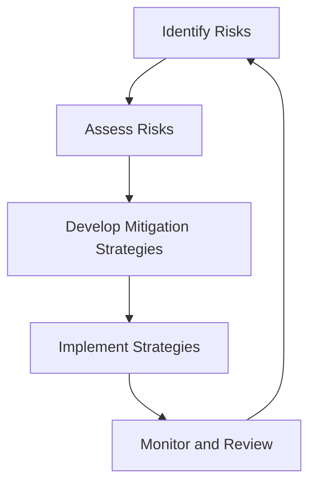

## 2.2 Identifying Challenges and Risks

Transitioning from Java's Object-Oriented Programming (OOP) paradigm to Clojure's functional programming model is a significant shift that can offer numerous benefits, such as enhanced scalability, maintainability, and productivity. However, this transition is not without its challenges and risks. In this section, we will explore the potential technical and organizational obstacles you may encounter during this migration and provide strategies for developing a robust risk mitigation plan.

### Recognizing Potential Technical Challenges

#### 1. Paradigm Shift

**Understanding the Shift:** Moving from Java's OOP to Clojure's functional programming requires a fundamental change in how developers think about and structure their code. In Java, developers are accustomed to organizing code around classes and objects, whereas Clojure emphasizes functions and immutable data.

**Key Differences:**

- **Java OOP:** Focuses on encapsulation, inheritance, and polymorphism. Code is organized into classes that define objects with state and behavior.
- **Clojure FP:** Emphasizes pure functions, immutability, and first-class functions. Code is organized around functions that transform data.

**Code Example:**

Java OOP example:
```java
public class Car {
    private String model;
    private int year;

    public Car(String model, int year) {
        this.model = model;
        this.year = year;
    }

    public String getModel() {
        return model;
    }

    public int getYear() {
        return year;
    }
}
```

Clojure FP equivalent:
```clojure
(defn create-car [model year]
  {:model model :year year})

(defn get-model [car]
  (:model car))

(defn get-year [car]
  (:year car))
```

**Challenge:** Developers must adapt to thinking in terms of data transformations rather than object interactions.

**Mitigation Strategy:** Provide training and resources on functional programming concepts. Encourage pair programming and code reviews to facilitate knowledge transfer.

#### 2. Immutable Data Structures

**Understanding Immutability:** In Clojure, data structures are immutable by default, meaning they cannot be changed after creation. This contrasts with Java, where mutable objects are common.

**Benefits of Immutability:**

- **Thread Safety:** Immutable data structures are inherently thread-safe, reducing concurrency issues.
- **Predictability:** Functions that operate on immutable data are easier to reason about.

**Code Example:**

Java mutable list:
```java
List<String> names = new ArrayList<>();
names.add("Alice");
names.add("Bob");
```

Clojure immutable vector:
```clojure
(def names ["Alice" "Bob"])
```

**Challenge:** Developers need to learn how to work with immutable data and understand the performance implications.

**Mitigation Strategy:** Educate teams on the benefits of immutability and provide examples of idiomatic Clojure code. Use tools like Clojure's `transient` for performance optimization when necessary.

#### 3. Concurrency Model

**Understanding Concurrency:** Clojure offers a different approach to concurrency compared to Java. While Java uses threads and locks, Clojure provides abstractions like atoms, refs, and agents.

**Clojure Concurrency Primitives:**

- **Atoms:** For managing independent, synchronous state changes.
- **Refs:** For coordinated, synchronous state changes using Software Transactional Memory (STM).
- **Agents:** For asynchronous state changes.

**Code Example:**

Java concurrency with synchronized block:
```java
synchronized (this) {
    // critical section
}
```

Clojure concurrency with atoms:
```clojure
(def counter (atom 0))

(defn increment-counter []
  (swap! counter inc))
```

**Challenge:** Developers must understand Clojure's concurrency model and how to apply it effectively.

**Mitigation Strategy:** Provide training on Clojure's concurrency primitives and encourage experimentation with small projects.

### Recognizing Potential Organizational Challenges

#### 1. Resistance to Change

**Understanding Resistance:** Organizational inertia can be a significant barrier to adopting new technologies. Team members may be comfortable with Java and hesitant to learn a new language.

**Challenge:** Overcoming resistance to change and fostering a culture of continuous learning.

**Mitigation Strategy:** Communicate the benefits of Clojure clearly and involve stakeholders in the decision-making process. Highlight success stories and provide incentives for learning.

#### 2. Skill Gap

**Understanding the Skill Gap:** Transitioning to Clojure may require upskilling existing team members or hiring new talent with functional programming expertise.

**Challenge:** Bridging the skill gap and ensuring team members are proficient in Clojure.

**Mitigation Strategy:** Invest in training programs, workshops, and mentorship. Encourage pair programming and knowledge sharing.

#### 3. Integration with Existing Systems

**Understanding Integration Challenges:** Migrating to Clojure may require integrating with existing Java systems and libraries.

**Challenge:** Ensuring seamless interoperability between Java and Clojure components.

**Mitigation Strategy:** Leverage Clojure's Java interoperability features and gradually migrate components. Use tools like `clojure.java.api.Clojure` for calling Clojure from Java.

### Developing a Risk Mitigation Plan

#### 1. Risk Identification

**Identify Risks:** Conduct a thorough assessment of potential risks associated with the migration. Consider both technical and organizational factors.

**Tools and Techniques:**

- **SWOT Analysis:** Identify strengths, weaknesses, opportunities, and threats.
- **Risk Register:** Document identified risks, their impact, and likelihood.

#### 2. Risk Assessment

**Assess Risks:** Evaluate the impact and likelihood of each identified risk. Prioritize risks based on their potential impact on the migration.

**Tools and Techniques:**

- **Risk Matrix:** Visualize risks based on their impact and likelihood.
- **Quantitative Analysis:** Use metrics and data to assess risk levels.

#### 3. Risk Mitigation Strategies

**Develop Strategies:** Create strategies to mitigate identified risks. Consider both preventive and corrective actions.

**Examples:**

- **Training Programs:** Address skill gaps through targeted training and workshops.
- **Pilot Projects:** Test Clojure adoption with small, non-critical projects before full-scale migration.
- **Stakeholder Engagement:** Involve stakeholders in the migration process to gain buy-in and support.

#### 4. Monitoring and Review

**Monitor Risks:** Continuously monitor risks throughout the migration process. Adjust mitigation strategies as needed.

**Tools and Techniques:**

- **Regular Reviews:** Conduct regular risk reviews and update the risk register.
- **Feedback Loops:** Gather feedback from team members and stakeholders to identify new risks.

### Visual Aids

#### Diagram: Risk Mitigation Process



**Description:** This diagram illustrates the cyclical process of risk mitigation, emphasizing continuous monitoring and review.

### References and Links

- [Official Clojure Documentation](https://clojure.org/)
- [ClojureDocs](https://clojuredocs.org/)
- [GitHub - Clojure](https://github.com/clojure/clojure)

### Knowledge Check

- **Question:** What are the key differences between Java OOP and Clojure FP?
- **Exercise:** Refactor a simple Java class into a Clojure function-based equivalent.

### Encouraging Tone

Now that we've explored the challenges and risks associated with migrating from Java OOP to Clojure, let's take proactive steps to address these obstacles. By understanding the potential hurdles and developing a comprehensive risk mitigation plan, you can ensure a smooth and successful transition to Clojure's functional programming paradigm.

### Quiz: Are You Ready to Migrate from Java to Clojure?



### What is a key benefit of Clojure's immutability?

- [x] Thread safety
- [ ] Easier debugging
- [ ] Faster execution
- [ ] Smaller code size

> **Explanation:** Immutability ensures that data cannot be changed, which makes concurrent programming safer and reduces the risk of race conditions.

### Which Clojure concurrency primitive is used for asynchronous state changes?

- [ ] Atoms
- [ ] Refs
- [x] Agents
- [ ] Futures

> **Explanation:** Agents in Clojure are used for managing state changes asynchronously.

### What is a common challenge when migrating from Java OOP to Clojure?

- [x] Paradigm shift
- [ ] Lack of libraries
- [ ] Poor performance
- [ ] Limited community support

> **Explanation:** The shift from object-oriented to functional programming requires a change in mindset and approach to coding.

### How can organizations overcome resistance to change during migration?

- [x] Communicate benefits clearly
- [ ] Force adoption
- [ ] Ignore feedback
- [ ] Reduce training

> **Explanation:** Clear communication of benefits and involving stakeholders can help overcome resistance to change.

### What is a risk mitigation strategy for addressing skill gaps?

- [x] Training programs
- [ ] Hiring freezes
- [ ] Reducing project scope
- [ ] Ignoring the issue

> **Explanation:** Providing training programs helps bridge the skill gap and ensures team members are proficient in Clojure.

### Which tool can be used to visualize risks based on impact and likelihood?

- [ ] SWOT Analysis
- [x] Risk Matrix
- [ ] Risk Register
- [ ] Quantitative Analysis

> **Explanation:** A risk matrix helps visualize risks by plotting them based on their impact and likelihood.

### What is the purpose of a pilot project in the context of migration?

- [x] Test adoption with small projects
- [ ] Replace existing systems
- [ ] Train new hires
- [ ] Reduce project costs

> **Explanation:** Pilot projects allow organizations to test Clojure adoption on a smaller scale before full-scale migration.

### How does Clojure's Java interoperability feature help during migration?

- [x] Allows seamless integration with Java systems
- [ ] Eliminates the need for Java
- [ ] Improves Clojure performance
- [ ] Reduces code complexity

> **Explanation:** Clojure's Java interoperability allows for seamless integration with existing Java systems, facilitating gradual migration.

### What is the first step in developing a risk mitigation plan?

- [x] Identify risks
- [ ] Implement strategies
- [ ] Monitor risks
- [ ] Assess risks

> **Explanation:** The first step in developing a risk mitigation plan is to identify potential risks associated with the migration.

### True or False: Clojure's immutable data structures are inherently thread-safe.

- [x] True
- [ ] False

> **Explanation:** Clojure's immutable data structures are inherently thread-safe because they cannot be changed after creation.



By understanding and addressing the challenges and risks associated with migrating from Java OOP to Clojure, you can pave the way for a successful transition to functional programming. Embrace the opportunity to modernize your systems and enhance your organization's scalability, maintainability, and productivity.
