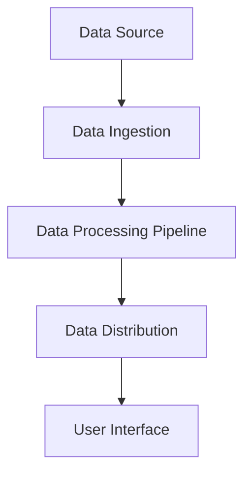

## 5.6 Real-Time Data Feeds with Clojure: A Case Study

In the ever-evolving world of software development, real-time data processing has become a cornerstone of modern applications. Whether it's financial markets, social media feeds, or IoT data streams, the ability to handle data in real-time is crucial. This case study delves into the implementation of a real-time data feed, specifically a stock ticker, using Clojure's functional programming paradigms and the `core.async` library.

### Introduction to Real-Time Data Feeds

Real-time data feeds are systems that continuously process and deliver data as it becomes available. In the context of financial applications, a stock ticker is a classic example, providing up-to-the-second updates on stock prices and market movements. Implementing such a system requires handling high-throughput data streams, ensuring low latency, and maintaining accuracy and reliability.

#### Key Challenges

1. **Concurrency and Parallelism**: Handling multiple data streams concurrently without blocking.
2. **Latency**: Minimizing the delay between data generation and consumption.
3. **Scalability**: Supporting an increasing number of data sources and consumers.
4. **Fault Tolerance**: Ensuring the system remains operational despite failures.

### Why Clojure and `core.async`?

Clojure, with its emphasis on immutability and functional programming, provides a robust foundation for building real-time systems. The `core.async` library extends this capability by offering powerful abstractions for asynchronous programming, enabling developers to manage concurrency without the complexity of traditional thread-based models.

#### Benefits of Using Clojure and `core.async`

- **Immutable Data Structures**: Simplify state management and reduce bugs related to mutable state.
- **Functional Abstractions**: Encourage composability and reuse of code.
- **`core.async` Channels**: Provide a flexible mechanism for asynchronous communication and coordination.
- **Go Blocks**: Allow for lightweight concurrency, similar to goroutines in Go.

### Designing a Real-Time Stock Ticker

The design of our stock ticker will focus on the following components:

1. **Data Source**: Simulated or real-time stock data feed.
2. **Data Processing Pipeline**: Transform and filter incoming data.
3. **Data Distribution**: Deliver processed data to consumers.
4. **User Interface**: Display real-time updates to end-users.

#### High-Level Architecture



### Implementing the Stock Ticker

#### Setting Up the Environment

Before diving into the implementation, ensure your development environment is set up with Clojure and Leiningen. Refer to [Appendix A: Setting Up the Development Environment](#) for detailed instructions.

#### Simulating a Data Source

For demonstration purposes, we'll simulate a stock data feed. In a real-world scenario, this could be replaced with an API call to a financial data provider.

```clojure
(ns stock-ticker.data-source
  (:require [clojure.core.async :refer [chan >!! timeout go-loop]]))

(defn generate-stock-data []
  {:symbol "AAPL"
   :price (+ 100 (rand-int 50))
   :timestamp (System/currentTimeMillis)})

(defn start-data-source [output-channel]
  (go-loop []
    (let [data (generate-stock-data)]
      (>!! output-channel data)
      (<! (timeout 1000)) ; Simulate data arrival every second
      (recur))))
```

#### Data Processing Pipeline

The data processing pipeline will transform and filter the incoming data. We'll use `core.async` channels to manage the flow of data through the pipeline.

```clojure
(ns stock-ticker.data-processing
  (:require [clojure.core.async :refer [chan >!! <!! go-loop]]))

(defn process-data [input-channel output-channel]
  (go-loop []
    (when-let [data (<!! input-channel)]
      (let [processed-data (assoc data :processed true)]
        (>!! output-channel processed-data))
      (recur))))
```

#### Data Distribution

Once the data is processed, it needs to be distributed to consumers. We'll implement a simple publish-subscribe mechanism using `core.async` channels.

```clojure
(ns stock-ticker.data-distribution
  (:require [clojure.core.async :refer [chan pub sub >!! <!! go-loop]]))

(defn start-distribution [input-channel]
  (let [pub-channel (pub input-channel :symbol)]
    (go-loop []
      (when-let [data (<!! input-channel)]
        (println "Distributing data:" data)
        (recur)))
    pub-channel))

(defn subscribe [pub-channel symbol]
  (let [sub-channel (chan)]
    (sub pub-channel symbol sub-channel)
    sub-channel))
```

#### User Interface

For the user interface, we'll use a simple command-line application that prints updates to the console. In a production system, this could be a web application or a desktop client.

```clojure
(ns stock-ticker.ui
  (:require [clojure.core.async :refer [<!! go-loop]]))

(defn start-ui [input-channel]
  (go-loop []
    (when-let [data (<!! input-channel)]
      (println "Stock Update:" data)
      (recur))))
```

### Bringing It All Together

With all components in place, we can now wire them together to create a functioning stock ticker.

```clojure
(ns stock-ticker.core
  (:require [stock-ticker.data-source :as ds]
            [stock-ticker.data-processing :as dp]
            [stock-ticker.data-distribution :as dd]
            [stock-ticker.ui :as ui]
            [clojure.core.async :refer [chan]]))

(defn -main []
  (let [data-source-channel (chan)
        processed-channel (chan)
        pub-channel (chan)]
    (ds/start-data-source data-source-channel)
    (dp/process-data data-source-channel processed-channel)
    (let [distribution-channel (dd/start-distribution processed-channel)]
      (ui/start-ui (dd/subscribe distribution-channel "AAPL")))))
```

### Best Practices and Optimization Tips

1. **Use Backpressure**: Implement backpressure to handle slow consumers and prevent data loss.
2. **Monitor Latency**: Regularly measure and optimize latency to ensure timely data delivery.
3. **Error Handling**: Implement robust error handling to manage failures gracefully.
4. **Scalability**: Design the system to scale horizontally by adding more nodes as needed.

### Common Pitfalls

- **Blocking Operations**: Avoid blocking operations in go blocks, as they can lead to deadlocks.
- **Resource Leaks**: Ensure channels are properly closed to prevent resource leaks.
- **Overloading Channels**: Monitor channel usage to prevent overloading and ensure smooth data flow.

### Conclusion

Building a real-time data feed with Clojure and `core.async` demonstrates the power of functional programming and asynchronous processing. By leveraging Clojure's immutable data structures and `core.async`'s concurrency primitives, developers can create efficient, scalable, and maintainable real-time systems.

For further reading and exploration, consider the following resources:

- [Clojure Documentation](https://clojure.org/reference/documentation)
- [core.async Guide](https://clojure.github.io/core.async/)
- [Clojure for the Brave and True](https://www.braveclojure.com/)

## Quiz Time!



### What is the primary benefit of using immutable data structures in real-time data feeds?

- [x] Simplifies state management and reduces bugs
- [ ] Increases data processing speed
- [ ] Allows for mutable state changes
- [ ] Reduces memory usage

> **Explanation:** Immutable data structures simplify state management by preventing unintended modifications, which reduces bugs related to mutable state.

### Which Clojure library is used for asynchronous programming in this case study?

- [x] core.async
- [ ] clojure.test
- [ ] ring
- [ ] test.check

> **Explanation:** The `core.async` library is used for asynchronous programming, providing channels and go blocks for managing concurrency.

### What is the purpose of the `pub` function in the data distribution component?

- [x] To create a publish-subscribe mechanism
- [ ] To process incoming data
- [ ] To simulate stock data
- [ ] To handle user interface updates

> **Explanation:** The `pub` function creates a publish-subscribe mechanism, allowing data to be distributed to multiple consumers based on topics.

### What is a common pitfall when using go blocks in Clojure?

- [x] Blocking operations can lead to deadlocks
- [ ] They increase memory usage
- [ ] They are difficult to implement
- [ ] They reduce code readability

> **Explanation:** Blocking operations in go blocks can lead to deadlocks, as go blocks are designed for non-blocking asynchronous operations.

### How can backpressure be implemented in a real-time data feed system?

- [x] By controlling the flow of data to slow consumers
- [ ] By increasing the number of channels
- [ ] By reducing the data processing speed
- [ ] By using mutable state

> **Explanation:** Backpressure controls the flow of data to slow consumers, preventing data loss and ensuring smooth data processing.

### What is the role of the `timeout` function in the data source simulation?

- [x] To simulate data arrival intervals
- [ ] To process data more quickly
- [ ] To handle errors in data processing
- [ ] To close channels after use

> **Explanation:** The `timeout` function simulates data arrival intervals by pausing execution for a specified duration.

### Which component is responsible for transforming and filtering incoming data?

- [x] Data Processing Pipeline
- [ ] Data Source
- [ ] Data Distribution
- [ ] User Interface

> **Explanation:** The Data Processing Pipeline is responsible for transforming and filtering incoming data before distribution.

### What is a key challenge in implementing real-time data feeds?

- [x] Handling multiple data streams concurrently
- [ ] Increasing data processing speed
- [ ] Reducing memory usage
- [ ] Simplifying user interface design

> **Explanation:** Handling multiple data streams concurrently is a key challenge, requiring efficient concurrency management.

### What is the main advantage of using `core.async` channels?

- [x] They provide a flexible mechanism for asynchronous communication
- [ ] They increase data processing speed
- [ ] They allow for mutable state changes
- [ ] They reduce memory usage

> **Explanation:** `core.async` channels provide a flexible mechanism for asynchronous communication and coordination between components.

### True or False: Clojure's functional programming paradigms are not suitable for real-time systems.

- [ ] True
- [x] False

> **Explanation:** False. Clojure's functional programming paradigms, with their emphasis on immutability and composability, are well-suited for building efficient and maintainable real-time systems.


