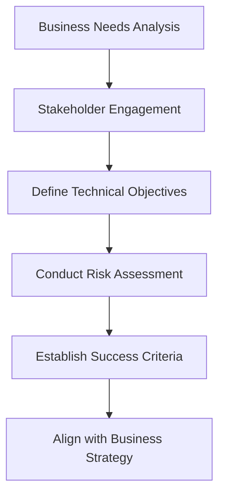

## 2.3 Defining Migration Objectives

Transitioning from Java's Object-Oriented Programming (OOP) paradigm to Clojure's functional programming approach is a significant undertaking for any enterprise. To ensure a successful migration, it's crucial to define clear objectives that align with your organization's broader business strategy. This section will guide you through setting these objectives, ensuring that your migration is not only technically sound but also strategically beneficial.

### Understanding the Importance of Migration Objectives

Before diving into the specifics of defining migration objectives, let's first understand why they are essential:

1. **Clarity and Focus**: Objectives provide a clear direction for the migration process, helping teams focus on what truly matters.
2. **Alignment with Business Goals**: By aligning migration objectives with business strategy, you ensure that the technical transformation supports broader organizational goals.
3. **Measurement of Success**: Well-defined objectives allow you to measure the success of the migration, providing benchmarks against which progress can be assessed.
4. **Risk Mitigation**: Clear objectives help identify potential risks early in the process, allowing for proactive management and mitigation.

### Key Considerations for Defining Migration Objectives

When defining migration objectives, consider the following key aspects:

#### 1. Business Alignment

Aligning migration objectives with business strategy is paramount. This involves understanding the organization's long-term goals and ensuring that the migration supports these aims. For example, if your business strategy focuses on improving scalability, your migration objectives should emphasize leveraging Clojure's capabilities to build scalable systems.

#### 2. Technical Requirements

Identify the technical requirements that the migration must fulfill. This includes performance improvements, enhanced maintainability, and better resource utilization. Consider how Clojure's features, such as immutability and concurrency support, can address these requirements.

#### 3. Stakeholder Engagement

Engage with key stakeholders to gather input and ensure that their needs are reflected in the migration objectives. This includes developers, architects, and business leaders. Their insights can provide valuable perspectives on what the migration should achieve.

#### 4. Risk Assessment

Conduct a thorough risk assessment to identify potential challenges and obstacles. Define objectives that address these risks, such as ensuring data integrity during migration or maintaining system uptime.

#### 5. Success Criteria

Define clear success criteria for the migration. These criteria should be specific, measurable, achievable, relevant, and time-bound (SMART). For example, a success criterion could be reducing system downtime by 50% within six months of migration.

### Steps to Define Migration Objectives

Let's explore a step-by-step approach to defining migration objectives:

#### Step 1: Conduct a Business Needs Analysis

Begin by conducting a comprehensive analysis of your business needs. This involves:

- **Identifying Key Business Goals**: Determine the primary goals of your organization, such as increasing market share, improving customer satisfaction, or reducing operational costs.
- **Mapping Goals to Technical Requirements**: Translate these business goals into technical requirements that the migration should address.

#### Step 2: Engage Stakeholders

Engage with stakeholders across the organization to gather their input. This includes:

- **Workshops and Meetings**: Organize workshops and meetings to discuss the migration and gather feedback from stakeholders.
- **Surveys and Interviews**: Conduct surveys and interviews to understand stakeholder expectations and concerns.

#### Step 3: Define Technical Objectives

Based on the business needs analysis and stakeholder input, define the technical objectives of the migration. Consider:

- **Performance Improvements**: Define objectives related to improving system performance, such as reducing latency or increasing throughput.
- **Scalability and Flexibility**: Set objectives that focus on enhancing the scalability and flexibility of your systems.
- **Maintainability and Code Quality**: Establish objectives aimed at improving code maintainability and quality.

#### Step 4: Conduct a Risk Assessment

Perform a risk assessment to identify potential challenges and obstacles. This involves:

- **Identifying Risks**: List potential risks, such as data loss, system downtime, or resistance to change.
- **Developing Mitigation Strategies**: Define strategies to mitigate these risks, such as implementing robust testing procedures or providing training for development teams.

#### Step 5: Establish Success Criteria

Define clear success criteria for the migration. These criteria should be:

- **Specific**: Clearly define what success looks like.
- **Measurable**: Ensure that success can be measured quantitatively.
- **Achievable**: Set realistic and attainable goals.
- **Relevant**: Align success criteria with business goals.
- **Time-bound**: Specify a timeline for achieving success.

### Example: Defining Migration Objectives for a Financial Services Company

Let's consider an example of a financial services company looking to migrate from Java to Clojure. Here's how they might define their migration objectives:

#### Business Needs Analysis

- **Key Business Goals**: Improve customer experience, reduce operational costs, and enhance system security.
- **Technical Requirements**: Increase system responsiveness, reduce infrastructure costs, and implement robust security measures.

#### Stakeholder Engagement

- **Workshops and Meetings**: Conducted with IT, finance, and customer service teams to gather input.
- **Surveys and Interviews**: Gathered feedback from key stakeholders on migration expectations.

#### Technical Objectives

- **Performance Improvements**: Reduce transaction processing time by 30%.
- **Scalability and Flexibility**: Enable the system to handle a 50% increase in transaction volume.
- **Maintainability and Code Quality**: Improve code readability and reduce technical debt.

#### Risk Assessment

- **Identified Risks**: Potential data loss during migration, resistance to adopting new technology, and system downtime.
- **Mitigation Strategies**: Implement comprehensive testing procedures, provide training for development teams, and establish a rollback plan.

#### Success Criteria

- **Specific**: Achieve a 30% reduction in transaction processing time.
- **Measurable**: Measure transaction processing time before and after migration.
- **Achievable**: Ensure that the reduction is realistic based on current system performance.
- **Relevant**: Align with the goal of improving customer experience.
- **Time-bound**: Achieve the reduction within six months of migration.

### Code Examples: Java vs. Clojure

To illustrate the transition from Java to Clojure, let's compare a simple example of processing a list of transactions.

#### Java Example

```java
import java.util.List;
import java.util.stream.Collectors;

public class TransactionProcessor {
    public List<Transaction> processTransactions(List<Transaction> transactions) {
        return transactions.stream()
                .filter(transaction -> transaction.getAmount() > 100)
                .collect(Collectors.toList());
    }
}
```

#### Clojure Example

```clojure
(defn process-transactions [transactions]
  (filter #(> (:amount %) 100) transactions))
```

**Key Differences:**

- **Simplicity**: The Clojure code is more concise and expressive, leveraging functional programming constructs like `filter`.
- **Immutability**: Clojure's data structures are immutable by default, reducing the risk of unintended side effects.

### Visual Aids: Aligning Migration Objectives with Business Strategy

Below is a flowchart illustrating the process of aligning migration objectives with business strategy:



**Description**: This flowchart outlines the steps involved in defining migration objectives, ensuring alignment with business strategy.

### References and Links

- [Official Clojure Documentation](https://clojure.org/)
- [ClojureDocs](https://clojuredocs.org/)
- [GitHub: Clojure Examples](https://github.com/clojure)

### Knowledge Check

To reinforce your understanding, consider the following questions:

1. Why is it important to align migration objectives with business strategy?
2. What are some key considerations when defining migration objectives?
3. How can stakeholder engagement contribute to successful migration objectives?
4. What is the significance of conducting a risk assessment during the migration planning process?
5. How do you define success criteria for a migration project?

### Encouraging Tone

Now that we've explored how to define migration objectives, let's apply these concepts to ensure a successful transition from Java to Clojure. Remember, setting clear objectives is the foundation of a successful migration, providing direction and alignment with your organization's strategic goals.

### Quiz: Are You Ready to Migrate from Java to Clojure?



### Why is it important to align migration objectives with business strategy?

- [x] To ensure the migration supports organizational goals
- [ ] To make the migration process faster
- [ ] To reduce the cost of migration
- [ ] To avoid technical challenges

> **Explanation:** Aligning migration objectives with business strategy ensures that the technical transformation supports broader organizational goals.

### What is a key benefit of defining clear migration objectives?

- [x] Provides clarity and focus
- [ ] Reduces the need for stakeholder engagement
- [ ] Eliminates all risks
- [ ] Guarantees immediate success

> **Explanation:** Clear migration objectives provide direction and focus, helping teams concentrate on what truly matters.

### How can stakeholder engagement contribute to successful migration objectives?

- [x] By providing valuable insights and perspectives
- [ ] By reducing the number of objectives
- [ ] By eliminating the need for risk assessment
- [ ] By ensuring immediate success

> **Explanation:** Engaging stakeholders provides valuable insights and perspectives, ensuring that their needs are reflected in the migration objectives.

### What is the significance of conducting a risk assessment during migration planning?

- [x] To identify potential challenges and obstacles
- [ ] To reduce the number of stakeholders
- [ ] To eliminate the need for success criteria
- [ ] To guarantee immediate success

> **Explanation:** Conducting a risk assessment helps identify potential challenges and obstacles, allowing for proactive management and mitigation.

### How do you define success criteria for a migration project?

- [x] By ensuring they are specific, measurable, achievable, relevant, and time-bound
- [ ] By making them as broad as possible
- [ ] By focusing only on technical aspects
- [ ] By excluding stakeholder input

> **Explanation:** Success criteria should be specific, measurable, achievable, relevant, and time-bound to effectively measure the success of the migration.

### What is a potential risk during a migration from Java to Clojure?

- [x] Data loss
- [ ] Increased system uptime
- [ ] Improved performance
- [ ] Enhanced scalability

> **Explanation:** Data loss is a potential risk during migration, requiring careful planning and mitigation strategies.

### What is an example of a technical objective for a migration project?

- [x] Reduce transaction processing time by 30%
- [ ] Increase the number of stakeholders
- [ ] Eliminate all risks
- [ ] Guarantee immediate success

> **Explanation:** Reducing transaction processing time by 30% is a specific technical objective that can be measured and achieved.

### Why is it important to establish success criteria for a migration project?

- [x] To measure the success of the migration
- [ ] To reduce the number of objectives
- [ ] To eliminate the need for stakeholder engagement
- [ ] To guarantee immediate success

> **Explanation:** Establishing success criteria allows you to measure the success of the migration, providing benchmarks against which progress can be assessed.

### What is a key consideration when defining migration objectives?

- [x] Aligning with business strategy
- [ ] Reducing the number of stakeholders
- [ ] Eliminating all risks
- [ ] Guaranteeing immediate success

> **Explanation:** Aligning migration objectives with business strategy ensures that the technical transformation supports broader organizational goals.

### True or False: Engaging stakeholders is unnecessary when defining migration objectives.

- [ ] True
- [x] False

> **Explanation:** Engaging stakeholders is essential when defining migration objectives, as it provides valuable insights and ensures that their needs are reflected in the migration plan.



By following these guidelines and setting clear migration objectives, your organization can successfully transition from Java to Clojure, leveraging the benefits of functional programming to achieve your strategic goals.
