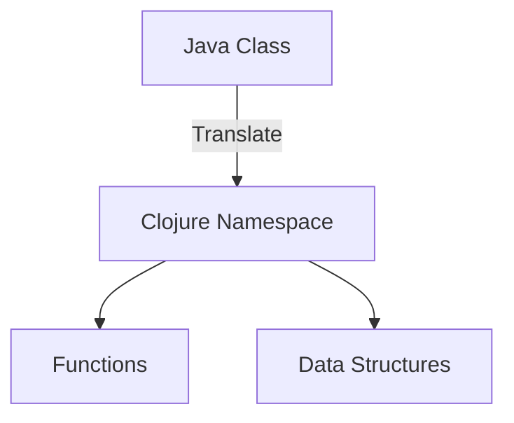

## 2.3 Defining Migration Objectives

In the journey of migrating from Java Object-Oriented Programming (OOP) to Clojure's functional programming paradigm, defining clear migration objectives is crucial. These objectives not only guide the technical transition but also ensure alignment with broader business strategies. This section will delve into the process of setting migration goals, establishing success criteria, and aligning these objectives with your enterprise's strategic vision.

### Understanding the Importance of Migration Objectives

**Explain the Role of Objectives:** Migration objectives serve as the foundation for the entire transition process. They provide direction, help prioritize tasks, and offer a benchmark against which progress can be measured. Without well-defined objectives, the migration process can become unfocused, leading to wasted resources and potential failure.

**Align with Business Strategy:** It's essential that migration objectives are not just technical but also aligned with the organization's business strategy. This alignment ensures that the migration contributes to the overall goals of the enterprise, such as improving scalability, enhancing maintainability, or increasing developer productivity.

### Setting Clear Goals and Success Criteria

**Identify Key Drivers:** Begin by identifying the key drivers behind the migration. Are you looking to improve system performance, reduce technical debt, or enhance the ability to innovate? Understanding these drivers will help shape your objectives.

**Define Measurable Outcomes:** Objectives should be specific and measurable. For example, an objective might be to reduce the time to market for new features by 30% or to decrease system downtime by 50%. These measurable outcomes provide clear targets to aim for.

**Incorporate Stakeholder Input:** Engage with stakeholders across the organization to gather input on what they hope to achieve through the migration. This collaboration ensures that the objectives are comprehensive and address the needs of all parties involved.

**Establish Success Criteria:** Define what success looks like for each objective. This might include specific performance metrics, user satisfaction scores, or cost savings. Success criteria provide a way to evaluate whether the migration has met its goals.

### Aligning Migration Objectives with Business Strategy

**Map Objectives to Business Goals:** Once objectives are defined, map them to the broader business goals of the organization. For example, if a business goal is to enhance customer satisfaction, a migration objective might be to improve system reliability and reduce downtime.

**Prioritize Objectives Based on Business Impact:** Not all objectives will have the same impact on the business. Prioritize objectives based on their potential to drive business value. This prioritization helps focus efforts on the most critical areas.

**Ensure Executive Buy-In:** Gaining executive support is crucial for the success of the migration. Present the migration objectives in the context of business strategy to secure buy-in from leadership. This support can provide the necessary resources and authority to drive the migration forward.

### Practical Steps for Defining Migration Objectives

#### Step 1: Conduct a Comprehensive Assessment

**Evaluate Current Systems:** Begin by evaluating your current Java systems. Identify areas where they fall short in terms of performance, scalability, or maintainability. This evaluation will highlight the areas where Clojure can provide the most benefit.

**Identify Pain Points:** Gather feedback from developers, users, and other stakeholders to identify pain points in the current system. These pain points can inform the objectives of the migration.

**Analyze Business Needs:** Work with business leaders to understand the strategic needs of the organization. How can the migration to Clojure support these needs?

#### Step 2: Define Technical and Business Objectives

**Technical Objectives:** These might include improving code quality, reducing system complexity, or enhancing performance. Technical objectives should be specific and measurable.

**Business Objectives:** These could involve reducing costs, increasing customer satisfaction, or enabling faster innovation. Business objectives should align with the strategic goals of the organization.

#### Step 3: Develop a Roadmap

**Create a Migration Plan:** Develop a detailed migration plan that outlines the steps needed to achieve each objective. This plan should include timelines, resources, and responsibilities.

**Set Milestones:** Break the migration process into manageable phases with clear milestones. These milestones provide opportunities to assess progress and make adjustments as needed.

**Monitor and Adjust:** Regularly monitor progress against the objectives and be prepared to adjust the plan as necessary. Flexibility is key to responding to challenges and opportunities that arise during the migration.

### Code Examples and Visual Aids

To illustrate how migration objectives can be translated into actionable steps, let's consider a simple example of migrating a Java class to a Clojure namespace.

#### Java Example: A Simple User Class

```java
public class User {
    private String name;
    private int age;

    public User(String name, int age) {
        this.name = name;
        this.age = age;
    }

    public String getName() {
        return name;
    }

    public int getAge() {
        return age;
    }
}
```

#### Clojure Equivalent: Using a Map

```clojure
(defn create-user [name age]
  {:name name
   :age age})

(defn get-name [user]
  (:name user))

(defn get-age [user]
  (:age user))
```

**Explanation:** In this example, we have translated a Java class into a Clojure map. The `create-user` function creates a user map, and the `get-name` and `get-age` functions retrieve values from the map. This demonstrates how Clojure's data-centric approach can simplify code and reduce complexity.

#### Visual Aid: Mapping Java Classes to Clojure Namespaces



**Description:** This diagram illustrates the process of translating a Java class into a Clojure namespace, highlighting the shift from object-oriented to functional programming.

### References and Further Reading

- [Clojure Official Documentation](https://clojure.org/reference)
- [Clojure Community Resources](https://clojure.org/community/resources)
- [Transitioning from OOP to Functional Programming](https://www.lispcast.com/oo-to-fp/)

### Knowledge Check

**Pose Questions:** Consider the following questions to test your understanding of migration objectives:

1. What are the key drivers behind your migration to Clojure?
2. How do your migration objectives align with your organization's business strategy?
3. What are the measurable outcomes you hope to achieve through the migration?

**Exercises:** Try translating a more complex Java class into Clojure, focusing on how to maintain functionality while embracing Clojure's functional paradigm.

### Encouraging Engagement

Embracing functional programming can be challenging, but with each step, you'll gain a deeper understanding and see tangible benefits in your codebase. Remember, the goal is not just to translate code but to transform your approach to software development.

### Best Practices for Setting Migration Objectives

- **Engage Stakeholders:** Involve stakeholders from across the organization to ensure comprehensive objectives.
- **Focus on Business Value:** Prioritize objectives that drive the most business value.
- **Be Flexible:** Be prepared to adjust objectives as new information and challenges arise.

### Conclusion

Defining migration objectives is a critical step in the transition from Java OOP to Clojure. By setting clear, measurable goals and aligning them with business strategy, you can ensure a successful migration that delivers real value to your organization.

## **Quiz: Are You Ready to Migrate from Java to Clojure?**



### What is the primary purpose of setting migration objectives?

- [x] To provide direction and benchmarks for the migration process
- [ ] To create a detailed technical plan
- [ ] To ensure all stakeholders are informed
- [ ] To reduce the cost of migration

> **Explanation:** Migration objectives provide direction, help prioritize tasks, and offer benchmarks for measuring progress.

### How should migration objectives align with business strategy?

- [x] They should support the organization's strategic goals
- [ ] They should focus solely on technical improvements
- [ ] They should be independent of business considerations
- [ ] They should prioritize cost reduction above all else

> **Explanation:** Migration objectives should align with the organization's strategic goals to ensure the migration contributes to overall business success.

### What is an example of a measurable migration objective?

- [x] Reduce system downtime by 50%
- [ ] Improve code quality
- [ ] Enhance user satisfaction
- [ ] Increase developer productivity

> **Explanation:** A measurable objective provides a specific target, such as reducing system downtime by a certain percentage.

### Why is stakeholder input important in defining migration objectives?

- [x] It ensures objectives address the needs of all parties involved
- [ ] It simplifies the migration process
- [ ] It reduces the time required for migration
- [ ] It guarantees executive buy-in

> **Explanation:** Engaging stakeholders ensures that migration objectives are comprehensive and address the needs of all parties involved.

### What is a key step in developing a migration roadmap?

- [x] Setting clear milestones
- [ ] Reducing the number of objectives
- [ ] Focusing solely on technical challenges
- [ ] Ignoring business considerations

> **Explanation:** Setting clear milestones helps break the migration process into manageable phases and assess progress.

### What is the benefit of mapping migration objectives to business goals?

- [x] It helps prioritize objectives based on business impact
- [ ] It simplifies the technical transition
- [ ] It reduces the need for stakeholder engagement
- [ ] It guarantees cost savings

> **Explanation:** Mapping objectives to business goals helps prioritize them based on their potential to drive business value.

### What is a common pitfall when defining migration objectives?

- [x] Focusing only on technical improvements
- [ ] Engaging too many stakeholders
- [ ] Setting too few objectives
- [ ] Overemphasizing business strategy

> **Explanation:** Focusing only on technical improvements can lead to objectives that do not align with business strategy.

### How can executive buy-in be secured for migration objectives?

- [x] Present objectives in the context of business strategy
- [ ] Focus solely on technical benefits
- [ ] Reduce the number of objectives
- [ ] Simplify the migration plan

> **Explanation:** Presenting objectives in the context of business strategy helps secure executive support by demonstrating their alignment with organizational goals.

### What is a practical step in defining technical migration objectives?

- [x] Evaluating current Java systems
- [ ] Reducing the number of stakeholders
- [ ] Focusing solely on cost reduction
- [ ] Ignoring business needs

> **Explanation:** Evaluating current Java systems helps identify areas where Clojure can provide the most benefit, informing technical objectives.

### True or False: Migration objectives should be flexible and open to adjustment.

- [x] True
- [ ] False

> **Explanation:** Flexibility is key to responding to challenges and opportunities that arise during the migration process.


