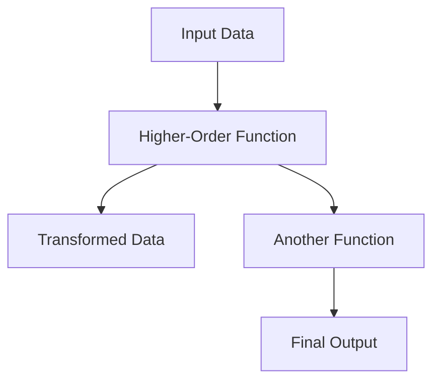
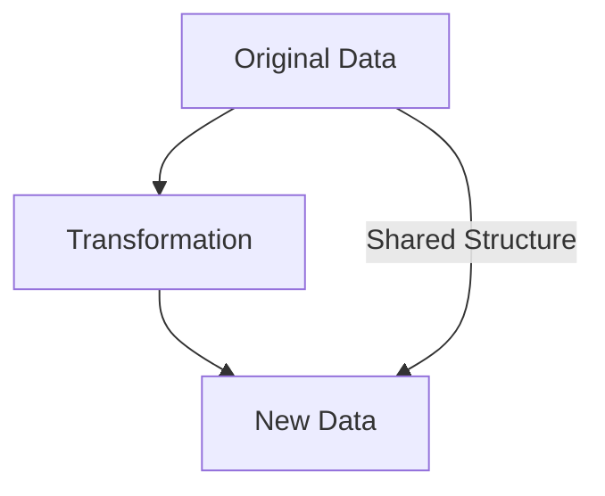

## 20.1 Technical Pitfalls

Transitioning from Java's Object-Oriented Programming (OOP) paradigm to Clojure's functional programming (FP) model can be a transformative journey for enterprise software development. However, this transition is not without its challenges. In this section, we will explore common technical pitfalls encountered during this migration and provide strategies to overcome them. By understanding these pitfalls, you can better navigate the complexities of adopting Clojure and leverage its full potential in your enterprise applications.

### Misconceptions About Functional Programming

#### Misconception 1: Functional Programming is Just About Using Functions

Many developers new to functional programming mistakenly believe that it is merely about using functions. While functions are central to FP, the paradigm encompasses much more, including immutability, higher-order functions, and function composition.

**Java Example:**

```java
// Java method to calculate the square of a number
public int square(int x) {
    return x * x;
}
```

**Clojure Example:**

```clojure
;; Clojure function to calculate the square of a number
(defn square [x]
  (* x x))
```

**Key Differences:**

- **Immutability**: In Clojure, data structures are immutable by default, meaning they cannot be changed after creation. This contrasts with Java, where mutable state is common.
- **First-Class Functions**: In Clojure, functions are first-class citizens, meaning they can be passed as arguments, returned from other functions, and assigned to variables.

#### Misconception 2: Immutability is Inefficient

A common concern is that immutability leads to inefficiency due to the creation of new data structures. However, Clojure uses persistent data structures that share structure and minimize copying, making operations efficient.

**Clojure Example:**

```clojure
;; Using a persistent vector
(def original-vector [1 2 3])
(def new-vector (conj original-vector 4))

;; original-vector remains unchanged
```

**Explanation:**

- **Persistent Data Structures**: Clojure's persistent data structures allow for efficient updates by sharing structure between the old and new versions.

#### Misconception 3: Lack of Familiar OOP Constructs

Java developers may miss familiar OOP constructs such as classes and inheritance. Clojure offers alternative mechanisms like protocols and multimethods to achieve polymorphism.

**Java Example:**

```java
// Java class with inheritance
class Animal {
    void speak() {
        System.out.println("Animal sound");
    }
}

class Dog extends Animal {
    @Override
    void speak() {
        System.out.println("Bark");
    }
}
```

**Clojure Example:**

```clojure
;; Clojure protocol and implementation
(defprotocol Speak
  (speak [this]))

(defrecord Dog []
  Speak
  (speak [this] (println "Bark")))

(def dog (->Dog))
(speak dog)
```

**Key Differences:**

- **Protocols**: Clojure protocols provide a way to define a set of functions that can be implemented by different types, offering polymorphism without inheritance.

### Overcoming Integration Issues

#### Integration Challenge 1: Interoperability with Existing Java Code

Integrating Clojure with existing Java code can be challenging, especially when dealing with complex Java libraries or frameworks.

**Solution:**

- **Java Interop**: Clojure provides seamless interoperability with Java, allowing you to call Java methods and use Java libraries directly from Clojure code.

**Clojure Example:**

```clojure
;; Calling a Java method from Clojure
(.toUpperCase "hello")
```

**Explanation:**

- **Dot Notation**: Use the dot notation to call Java methods on objects.

#### Integration Challenge 2: Managing State Across Boundaries

Managing state across Java and Clojure boundaries can be tricky, especially when dealing with mutable Java objects.

**Solution:**

- **Encapsulation of State**: Use Clojure's immutable data structures to encapsulate state and minimize mutable state exposure.

**Clojure Example:**

```clojure
;; Encapsulating state in an atom
(def state (atom {:count 0}))

;; Updating state
(swap! state update :count inc)
```

**Explanation:**

- **Atoms**: Atoms provide a way to manage shared, mutable state in a controlled manner.

#### Integration Challenge 3: Handling Concurrency

Concurrency models differ significantly between Java and Clojure. Java developers may be accustomed to using synchronized blocks and locks, while Clojure offers a different approach.

**Solution:**

- **Clojure Concurrency Primitives**: Leverage Clojure's concurrency primitives like atoms, refs, and agents to manage state changes in a concurrent environment.

**Clojure Example:**

```clojure
;; Using an agent for asynchronous updates
(def counter (agent 0))

;; Send an update to the agent
(send counter inc)
```

**Explanation:**

- **Agents**: Agents allow for asynchronous updates to state, providing a simple model for concurrency.

### Visual Aids

To better understand these concepts, let's visualize the flow of data through higher-order functions and the concept of immutability.

#### Flow of Data Through Higher-Order Functions



**Diagram Explanation:**

- **Higher-Order Functions**: Functions that take other functions as arguments or return them as results, allowing for flexible data transformations.

#### Immutability and Persistent Data Structures



**Diagram Explanation:**

- **Shared Structure**: Persistent data structures share structure between versions, enabling efficient updates without full copies.

### References and Links

- [Official Clojure Documentation](https://clojure.org/)
- [ClojureDocs](https://clojuredocs.org/)
- [Clojure GitHub Repository](https://github.com/clojure/clojure)

### Knowledge Check

- **Question**: What is a common misconception about functional programming?
  - **Answer**: That it is just about using functions.

- **Question**: How does Clojure handle immutability efficiently?
  - **Answer**: Through persistent data structures that share structure.

- **Question**: What is a protocol in Clojure?
  - **Answer**: A way to define a set of functions that can be implemented by different types.

### Encouraging Tone

Now that we've explored the technical pitfalls of migrating from Java OOP to Clojure, let's apply these insights to ensure a smooth transition and unlock the full potential of functional programming in your enterprise applications.

### Best Practices for Tags

- **Use Specific and Relevant Tags**: "Clojure", "Functional Programming", "Java Interoperability", "Immutability", "Concurrency", "Higher-Order Functions", "Migration Challenges", "Enterprise Software".

## **Quiz: Are You Ready to Migrate from Java to Clojure?**



### What is a common misconception about functional programming?

- [x] It is just about using functions.
- [ ] It is only about immutability.
- [ ] It is the same as procedural programming.
- [ ] It does not support polymorphism.

> **Explanation:** Functional programming is often misunderstood as just using functions, but it encompasses immutability, higher-order functions, and more.

### How does Clojure handle immutability efficiently?

- [x] Through persistent data structures that share structure.
- [ ] By copying data structures every time.
- [ ] By using mutable data structures.
- [ ] By avoiding data structures altogether.

> **Explanation:** Clojure uses persistent data structures that share structure between versions, making updates efficient.

### What is a protocol in Clojure?

- [x] A way to define a set of functions that can be implemented by different types.
- [ ] A class inheritance mechanism.
- [ ] A method for handling concurrency.
- [ ] A type of data structure.

> **Explanation:** Protocols in Clojure provide a way to define polymorphic functions that can be implemented by various types.

### How can you call a Java method from Clojure?

- [x] Using dot notation.
- [ ] Using a special Java keyword.
- [ ] By converting Clojure code to Java.
- [ ] By writing a Java wrapper.

> **Explanation:** Clojure allows calling Java methods directly using dot notation.

### What is the purpose of an agent in Clojure?

- [x] To manage asynchronous updates to state.
- [ ] To synchronize threads.
- [ ] To handle exceptions.
- [ ] To define protocols.

> **Explanation:** Agents in Clojure are used for managing state changes asynchronously.

### Why might Java developers find Clojure's lack of classes challenging?

- [x] They are accustomed to OOP constructs like classes and inheritance.
- [ ] They prefer procedural programming.
- [ ] They do not understand functional programming.
- [ ] They dislike immutability.

> **Explanation:** Java developers are used to OOP constructs, which are replaced by different mechanisms in Clojure.

### What is a higher-order function?

- [x] A function that takes other functions as arguments or returns them.
- [ ] A function that only works with numbers.
- [ ] A function that is always recursive.
- [ ] A function that cannot be composed.

> **Explanation:** Higher-order functions can take other functions as arguments or return them, enabling flexible data transformations.

### How does Clojure achieve polymorphism without inheritance?

- [x] Through protocols and multimethods.
- [ ] By using classes.
- [ ] By using interfaces.
- [ ] By avoiding polymorphism.

> **Explanation:** Clojure uses protocols and multimethods to achieve polymorphism without traditional inheritance.

### What is the benefit of using atoms in Clojure?

- [x] They provide a way to manage shared, mutable state in a controlled manner.
- [ ] They allow for synchronous updates only.
- [ ] They replace all data structures.
- [ ] They are used for error handling.

> **Explanation:** Atoms in Clojure are used to manage shared, mutable state safely and efficiently.

### True or False: Clojure's immutability makes it inefficient.

- [ ] True
- [x] False

> **Explanation:** Clojure's immutability is efficient due to its use of persistent data structures that share structure.


