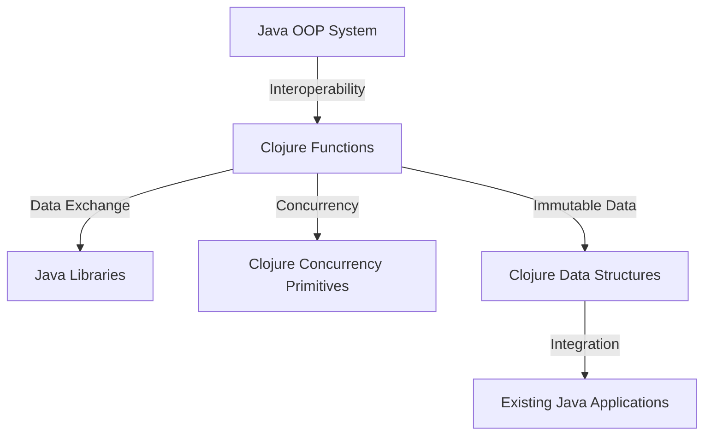

## 20.1 Technical Pitfalls

Transitioning from Java's Object-Oriented Programming (OOP) to Clojure's functional programming paradigm can be a transformative journey for enterprise applications. However, this transition is not without its challenges. In this section, we will explore the technical pitfalls that organizations may encounter during this migration and provide strategies to overcome them. By understanding these pitfalls, you can ensure a smoother transition and fully leverage the benefits of Clojure.

### Misconceptions About Functional Programming

One of the primary challenges in migrating to Clojure is overcoming misconceptions about functional programming. Let's address some common misconceptions and clarify the reality of functional programming in Clojure.

#### Misconception 1: Functional Programming is Only for Academics

**Reality:** While functional programming has its roots in academia, it has become increasingly popular in industry due to its benefits in scalability, maintainability, and concurrency. Clojure, in particular, is designed for practical use in real-world applications, offering robust tools for enterprise development.

#### Misconception 2: Functional Programming is Inefficient

**Reality:** Functional programming emphasizes immutability and pure functions, which can lead to more predictable and efficient code. Clojure's persistent data structures are optimized for performance, allowing for efficient updates and access patterns. Additionally, Clojure's integration with the Java Virtual Machine (JVM) ensures that it can leverage the performance optimizations of the JVM.

#### Misconception 3: Functional Code is Hard to Understand

**Reality:** While functional programming requires a shift in mindset, it often leads to more concise and expressive code. Clojure's syntax is designed to be simple and consistent, reducing the cognitive load on developers. By embracing functional concepts such as higher-order functions and immutability, developers can write code that is easier to reason about and maintain.

### Overcoming Integration Issues

Integration is a critical aspect of any migration process. When transitioning from Java to Clojure, you may encounter integration challenges related to existing systems, libraries, and tools. Let's explore some common integration issues and strategies to address them.

#### Issue 1: Interoperability with Java Libraries

**Solution:** Clojure provides excellent interoperability with Java, allowing you to call Java methods and use Java libraries seamlessly. You can leverage Java classes and methods directly in Clojure code using the `.` operator. Here's an example:

```clojure
;; Using a Java class in Clojure
(import 'java.util.Date)

(defn current-time []
  (let [now (Date.)]
    (.toString now)))

(println (current-time))
```

In this example, we import the `java.util.Date` class and use its `toString` method to get the current time. This interoperability allows you to gradually migrate your codebase by reusing existing Java libraries.

#### Issue 2: Data Serialization and Deserialization

**Solution:** When migrating to Clojure, you may need to handle data serialization and deserialization between Java and Clojure systems. Clojure provides libraries such as `cheshire` for JSON serialization and `clojure.data.xml` for XML serialization. These libraries facilitate data exchange between Clojure and other systems.

#### Issue 3: Integrating with Existing Java Applications

**Solution:** Gradual migration is a practical approach to integrating Clojure with existing Java applications. You can start by embedding Clojure code within Java applications using the `clojure.java.api.Clojure` class. This allows you to call Clojure functions from Java code, enabling a phased migration strategy.

```java
// Calling a Clojure function from Java
import clojure.java.api.Clojure;
import clojure.lang.IFn;

public class ClojureIntegration {
    public static void main(String[] args) {
        IFn clojureFunction = Clojure.var("my-namespace", "my-function");
        Object result = clojureFunction.invoke("Hello, Clojure!");
        System.out.println(result);
    }
}
```

In this example, we call a Clojure function `my-function` from Java code, demonstrating how to integrate Clojure into existing Java applications.

### Embracing Clojure's Concurrency Model

Concurrency is a critical aspect of modern enterprise applications. Clojure offers a powerful concurrency model that differs from Java's traditional threading model. Understanding and embracing Clojure's concurrency primitives can help you avoid common pitfalls.

#### Pitfall: Misusing Java's Threading Model

**Solution:** Clojure provides several concurrency primitives, including atoms, refs, and agents, which offer different levels of coordination and state management. These primitives are designed to handle concurrency in a more predictable and safe manner than Java's traditional threading model.

- **Atoms**: Use atoms for managing independent, synchronous state changes. Atoms provide a simple way to manage shared state without locks.

```clojure
(def counter (atom 0))

(defn increment-counter []
  (swap! counter inc))

(increment-counter)
(println @counter) ; Output: 1
```

- **Refs**: Use refs for coordinated, synchronous state changes. Refs provide software transactional memory (STM) for managing complex state changes.

```clojure
(def account-balance (ref 100))

(defn withdraw [amount]
  (dosync
    (alter account-balance - amount)))

(withdraw 50)
(println @account-balance) ; Output: 50
```

- **Agents**: Use agents for managing asynchronous state changes. Agents allow you to perform state changes in the background without blocking the main thread.

```clojure
(def log-agent (agent []))

(defn log-message [message]
  (send log-agent conj message))

(log-message "Hello, Clojure!")
(println @log-agent) ; Output: ["Hello, Clojure!"]
```

By leveraging these concurrency primitives, you can write concurrent code that is more robust and easier to reason about.

### Navigating Clojure's Immutable Data Structures

Clojure's emphasis on immutability is a fundamental shift from Java's mutable data structures. Understanding how to work with immutable data structures is crucial to avoid common pitfalls.

#### Pitfall: Attempting to Mutate Immutable Data

**Solution:** In Clojure, data structures such as lists, vectors, maps, and sets are immutable by default. Instead of modifying data in place, you create new data structures with the desired changes. This approach leads to more predictable and thread-safe code.

```clojure
(def original-vector [1 2 3])

;; Creating a new vector with an additional element
(def new-vector (conj original-vector 4))

(println original-vector) ; Output: [1 2 3]
(println new-vector)      ; Output: [1 2 3 4]
```

In this example, we use the `conj` function to create a new vector with an additional element, leaving the original vector unchanged.

### Understanding Clojure's Namespace and Dependency Management

Proper code organization and dependency management are essential for maintaining a clean and scalable codebase. Clojure's approach to namespaces and dependencies differs from Java's package system.

#### Pitfall: Mismanaging Namespaces

**Solution:** In Clojure, namespaces are used to organize code and manage dependencies. Each namespace corresponds to a file, and you can use the `ns` macro to declare a namespace and its dependencies.

```clojure
(ns my-namespace
  (:require [clojure.string :as str]))

(defn greet [name]
  (str/join " " ["Hello," name "!"]))

(println (greet "Clojure")) ; Output: Hello, Clojure!
```

By using namespaces effectively, you can avoid naming conflicts and manage dependencies more efficiently.

### Leveraging Clojure's Rich Ecosystem

Clojure has a rich ecosystem of libraries and tools that can enhance your development experience. However, navigating this ecosystem can be challenging for newcomers.

#### Pitfall: Overlooking Clojure's Libraries and Tools

**Solution:** Take advantage of Clojure's extensive library ecosystem to accelerate development. Libraries such as `Ring` for web applications, `Compojure` for routing, and `Re-frame` for front-end development provide powerful abstractions and tools for building robust applications.

Additionally, tools like `Leiningen` and `deps.edn` simplify project management and dependency resolution. Familiarize yourself with these tools to streamline your development workflow.

### Visualizing the Migration Process

To better understand the migration process from Java OOP to Clojure, let's visualize the data flow and integration between components using a Mermaid.js diagram.



**Diagram Description:** This flowchart illustrates the integration between Java OOP systems and Clojure components. It highlights the interoperability between Java libraries and Clojure functions, the use of Clojure's concurrency primitives, and the management of immutable data structures.

### References and Further Reading

- [Clojure Official Documentation](https://clojure.org/reference)
- [Clojure Community Resources](https://clojure.org/community/resources)
- [Transitioning from OOP to Functional Programming](https://www.lispcast.com/oo-to-fp/)
- [Clojure STM Guide](https://clojure.org/reference/refs)

### Knowledge Check

To reinforce your understanding of the technical pitfalls in migrating from Java OOP to Clojure, consider the following questions:

1. What are some common misconceptions about functional programming, and how can they be addressed?
2. How does Clojure's concurrency model differ from Java's threading model?
3. What are the benefits of using immutable data structures in Clojure?
4. How can you integrate Clojure with existing Java applications?
5. What tools and libraries are available in the Clojure ecosystem to support enterprise development?

### Encouraging Engagement

Embracing functional programming can be challenging, but with each step, you'll gain a deeper understanding and see tangible benefits in your codebase. Remember to leverage Clojure's rich ecosystem and community resources to support your migration journey.

### Quiz: Are You Ready to Migrate from Java to Clojure?



### What is a common misconception about functional programming?

- [x] It is only for academics
- [ ] It is easy to learn
- [ ] It is always faster than OOP
- [ ] It is not suitable for enterprise applications

> **Explanation:** Functional programming is often mistakenly seen as purely academic, but it is increasingly used in industry for its benefits in scalability and maintainability.

### How does Clojure handle concurrency differently from Java?

- [x] Through atoms, refs, and agents
- [ ] By using synchronized blocks
- [ ] By using Java's threading model
- [ ] By avoiding concurrency altogether

> **Explanation:** Clojure offers concurrency primitives like atoms, refs, and agents, which provide more predictable and safe concurrency management than Java's traditional threading model.

### What is the benefit of using immutable data structures in Clojure?

- [x] Predictable and thread-safe code
- [ ] Faster execution
- [ ] Easier to mutate
- [ ] Reduced memory usage

> **Explanation:** Immutable data structures lead to more predictable and thread-safe code, as they cannot be changed once created.

### How can you integrate Clojure with existing Java applications?

- [x] By embedding Clojure code using clojure.java.api.Clojure
- [ ] By rewriting all Java code in Clojure
- [ ] By using Java's native methods
- [ ] By avoiding integration altogether

> **Explanation:** You can embed Clojure code within Java applications using the `clojure.java.api.Clojure` class, allowing for a phased migration strategy.

### Which tool is used for project management in Clojure?

- [x] Leiningen
- [ ] Maven
- [ ] Gradle
- [ ] Ant

> **Explanation:** Leiningen is a popular tool for project management and dependency resolution in Clojure.

### What is a key feature of Clojure's concurrency model?

- [x] Software transactional memory
- [ ] Synchronized methods
- [ ] Thread pools
- [ ] Lock-based synchronization

> **Explanation:** Clojure's concurrency model includes software transactional memory (STM) for managing complex state changes.

### What is the purpose of Clojure's namespaces?

- [x] To organize code and manage dependencies
- [ ] To define classes and objects
- [ ] To handle exceptions
- [ ] To manage memory

> **Explanation:** Namespaces in Clojure are used to organize code and manage dependencies, similar to packages in Java.

### What is the role of agents in Clojure?

- [x] Managing asynchronous state changes
- [ ] Handling synchronous state changes
- [ ] Managing memory allocation
- [ ] Performing I/O operations

> **Explanation:** Agents in Clojure are used for managing asynchronous state changes, allowing state changes to occur in the background.

### How can you serialize data in Clojure?

- [x] Using libraries like cheshire for JSON
- [ ] By writing custom serialization code
- [ ] By using Java's serialization
- [ ] By avoiding serialization

> **Explanation:** Libraries like `cheshire` provide JSON serialization capabilities in Clojure, facilitating data exchange.

### True or False: Clojure's syntax is designed to be simple and consistent.

- [x] True
- [ ] False

> **Explanation:** Clojure's syntax is intentionally simple and consistent, reducing the cognitive load on developers.



By understanding and addressing these technical pitfalls, you can ensure a successful migration from Java OOP to Clojure, unlocking the full potential of functional programming for your enterprise applications.
