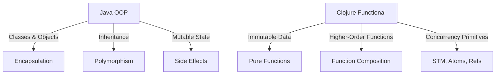

## 20.2 Organizational Pitfalls

Transitioning from Java Object-Oriented Programming (OOP) to Clojure's functional programming paradigm is not just a technical shift; it is a significant organizational change that can impact team dynamics, departmental alignment, and overall enterprise culture. In this section, we will explore the common organizational pitfalls encountered during this migration and provide strategies to address them effectively.

### Addressing Team Skepticism

One of the most significant challenges in migrating to Clojure is overcoming team skepticism. Developers accustomed to Java's OOP principles may be resistant to adopting a new paradigm that requires a different way of thinking. Let's explore how to address this skepticism:

#### Understanding the Root Causes

1. **Fear of the Unknown**: Developers may fear losing their expertise and becoming less valuable to the organization.
2. **Perceived Complexity**: Functional programming can initially seem more complex due to its abstract concepts like immutability and higher-order functions.
3. **Comfort with Current Tools**: Teams may be comfortable with their existing Java tools and workflows, making them hesitant to change.

#### Strategies to Overcome Skepticism

- **Provide Comprehensive Training**: Offer training programs that gradually introduce Clojure concepts, starting with basic syntax and gradually moving to more complex topics like concurrency and state management. Consider using resources like the [Clojure Official Documentation](https://clojure.org/reference) and [Clojure Community Resources](https://clojure.org/community/resources).

- **Highlight Success Stories**: Share real-world success stories from other organizations that have successfully transitioned to Clojure. This can help demonstrate the tangible benefits of the migration.

- **Encourage Experimentation**: Create a safe environment for developers to experiment with Clojure through hackathons or side projects. This can help them gain confidence and see the language's potential.

- **Pair Programming and Mentorship**: Implement pair programming sessions where experienced Clojure developers work alongside Java developers. This hands-on approach can accelerate learning and build trust.

- **Demonstrate Quick Wins**: Identify small, non-critical projects that can be quickly implemented in Clojure to showcase its advantages in terms of code simplicity and maintainability.

### Avoiding Misalignment Between Departments

Organizational misalignment can occur when different departments have conflicting priorities or lack a shared vision for the migration. This misalignment can lead to delays, increased costs, and reduced effectiveness of the transition.

#### Identifying Misalignment Issues

1. **Lack of Clear Objectives**: Without clearly defined migration objectives, departments may pursue conflicting goals.
2. **Inconsistent Communication**: Poor communication can lead to misunderstandings and misaligned expectations.
3. **Resource Allocation Conflicts**: Departments may compete for limited resources, hindering the migration process.

#### Strategies to Foster Alignment

- **Define Clear Objectives**: Establish clear, organization-wide objectives for the migration. These should align with the company's strategic goals and be communicated to all stakeholders.

- **Facilitate Cross-Departmental Collaboration**: Encourage collaboration between departments by forming cross-functional teams. These teams can work together to address migration challenges and ensure alignment.

- **Implement Regular Check-ins**: Schedule regular meetings to discuss progress, address concerns, and realign objectives as needed. This ensures that all departments remain on the same page.

- **Leverage Leadership Support**: Secure support from senior leadership to champion the migration. Their backing can help align departmental goals and provide the necessary resources.

- **Utilize Agile Practices**: Adopt agile methodologies to enhance flexibility and responsiveness. Agile practices can help teams adapt to changes and maintain alignment throughout the migration process.

### Code Examples and Visual Aids

To further illustrate the concepts discussed, let's explore some code examples and visual aids that highlight the differences between Java OOP and Clojure's functional approach.

#### Java OOP Example

```java
// Java OOP Example: Simple Bank Account Class
public class BankAccount {
    private double balance;

    public BankAccount(double initialBalance) {
        this.balance = initialBalance;
    }

    public void deposit(double amount) {
        if (amount > 0) {
            balance += amount;
        }
    }

    public void withdraw(double amount) {
        if (amount > 0 && amount <= balance) {
            balance -= amount;
        }
    }

    public double getBalance() {
        return balance;
    }
}
```

#### Clojure Functional Example

```clojure
;; Clojure Functional Example: Simple Bank Account
(defn create-account [initial-balance]
  {:balance initial-balance})

(defn deposit [account amount]
  (if (> amount 0)
    (update account :balance + amount)
    account))

(defn withdraw [account amount]
  (if (and (> amount 0) (<= amount (:balance account)))
    (update account :balance - amount)
    account))

(defn get-balance [account]
  (:balance account))

;; Usage
(let [account (create-account 100)]
  (-> account
      (deposit 50)
      (withdraw 30)
      get-balance))
```

In the Clojure example, we use immutable data structures and pure functions to manage the bank account state. This approach reduces side effects and enhances code maintainability.

#### Visual Aid: Java OOP vs. Clojure Functional Paradigm



**Diagram Description**: This diagram compares Java OOP and Clojure's functional paradigm. Java OOP relies on classes, objects, and mutable state, while Clojure emphasizes immutable data, pure functions, and concurrency primitives.

### Knowledge Check

To reinforce your understanding of organizational pitfalls, consider the following questions:

1. What are the common root causes of team skepticism when migrating to Clojure?
2. How can cross-departmental collaboration be facilitated during the migration process?
3. Why is it important to secure leadership support for the migration?
4. How does Clojure's use of immutable data structures differ from Java's mutable state?

### Encouraging Engagement

Embracing functional programming can be challenging, but with each step, you'll gain a deeper understanding and see tangible benefits in your codebase. Remember, the journey to Clojure is not just about learning a new language; it's about transforming your organization's approach to software development.

### Quiz: Are You Ready to Migrate from Java to Clojure?



### What is a common root cause of team skepticism when migrating to Clojure?

- [x] Fear of the unknown
- [ ] Lack of resources
- [ ] Overconfidence in skills
- [ ] Excessive training

> **Explanation:** Fear of the unknown is a common root cause of skepticism, as developers may worry about losing their expertise and becoming less valuable.

### How can cross-departmental collaboration be facilitated during the migration process?

- [x] Form cross-functional teams
- [ ] Isolate departments
- [ ] Limit communication
- [ ] Increase competition

> **Explanation:** Forming cross-functional teams encourages collaboration and ensures alignment across departments.

### Why is it important to secure leadership support for the migration?

- [x] To align departmental goals
- [ ] To reduce training costs
- [ ] To limit resource allocation
- [ ] To avoid agile practices

> **Explanation:** Leadership support helps align departmental goals and provides the necessary resources for a successful migration.

### How does Clojure's use of immutable data structures differ from Java's mutable state?

- [x] Reduces side effects
- [ ] Increases complexity
- [ ] Limits functionality
- [ ] Enhances inheritance

> **Explanation:** Clojure's immutable data structures reduce side effects, enhancing code maintainability and reliability.

### What is a benefit of using pair programming during the migration?

- [x] Accelerates learning
- [ ] Increases isolation
- [x] Builds trust
- [ ] Limits experimentation

> **Explanation:** Pair programming accelerates learning and builds trust between experienced Clojure developers and Java developers.

### What is a strategy to overcome perceived complexity in functional programming?

- [x] Provide comprehensive training
- [ ] Limit documentation
- [ ] Reduce experimentation
- [ ] Increase isolation

> **Explanation:** Comprehensive training helps developers understand functional programming concepts, reducing perceived complexity.

### How can regular check-ins help during the migration process?

- [x] Ensure alignment
- [ ] Increase competition
- [x] Address concerns
- [ ] Limit communication

> **Explanation:** Regular check-ins ensure alignment and provide a platform to address concerns and realign objectives as needed.

### What is a quick win in the context of migration?

- [x] Small, non-critical projects
- [ ] Large, complex systems
- [ ] Complete system overhaul
- [ ] Isolated experiments

> **Explanation:** Quick wins involve small, non-critical projects that can be quickly implemented in Clojure to showcase its advantages.

### What role do agile practices play in the migration process?

- [x] Enhance flexibility
- [ ] Limit communication
- [ ] Increase rigidity
- [ ] Reduce collaboration

> **Explanation:** Agile practices enhance flexibility and responsiveness, helping teams adapt to changes and maintain alignment.

### True or False: Misalignment between departments can lead to increased costs and reduced effectiveness of the migration.

- [x] True
- [ ] False

> **Explanation:** Misalignment can lead to delays, increased costs, and reduced effectiveness, highlighting the importance of fostering alignment.



By addressing these organizational pitfalls and implementing the strategies outlined, your organization can successfully navigate the transition from Java OOP to Clojure, unlocking the full potential of functional programming.
