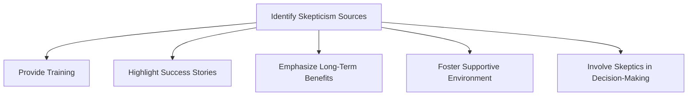
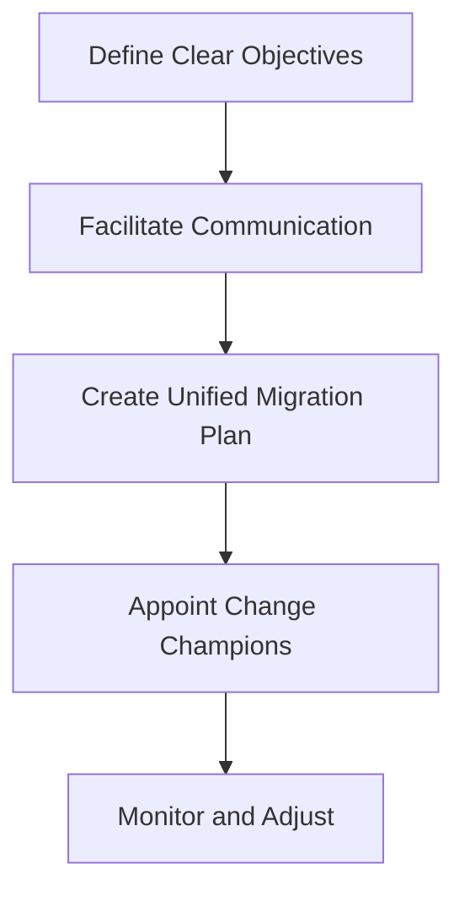

## 20.2 Organizational Pitfalls

Transitioning from Java Object-Oriented Programming (OOP) to Clojure's functional programming paradigm is not just a technical shift; it is a significant organizational change that can impact team dynamics, departmental alignment, and overall enterprise culture. In this section, we will delve into the common organizational pitfalls that enterprises may encounter during this migration and provide strategies to address these challenges effectively.

### Addressing Team Skepticism

#### Understanding the Roots of Skepticism

When introducing a new technology like Clojure, team skepticism is a natural response. Developers who have spent years mastering Java may feel uncertain about the necessity and benefits of switching to a functional programming language. This skepticism can stem from several factors:

- **Fear of the Unknown**: Developers may be unfamiliar with functional programming concepts and worry about their ability to adapt.
- **Perceived Complexity**: Clojure's syntax and functional paradigm may initially seem more complex compared to Java's OOP approach.
- **Concerns About Productivity**: There may be concerns that the learning curve associated with Clojure will lead to decreased productivity in the short term.

#### Strategies to Overcome Skepticism

1. **Provide Comprehensive Training**: Offer training programs that focus on Clojure's syntax, functional programming principles, and practical applications. Encourage hands-on workshops and pair programming sessions to build confidence.

2. **Highlight Success Stories**: Share case studies and success stories from other organizations that have successfully transitioned to Clojure. Demonstrating real-world benefits can help alleviate concerns.

3. **Emphasize Long-Term Benefits**: Communicate the long-term advantages of Clojure, such as improved scalability, maintainability, and productivity. Highlight how these benefits align with the organization's strategic goals.

4. **Foster a Supportive Environment**: Create a culture of support and collaboration. Encourage team members to share their experiences and challenges, and provide mentorship opportunities to facilitate knowledge sharing.

5. **Involve Skeptics in Decision-Making**: Engage skeptical team members in the decision-making process. Solicit their input and address their concerns to foster a sense of ownership and commitment to the transition.

### Avoiding Misalignment Between Departments

#### Identifying Sources of Misalignment

Organizational misalignment can occur when different departments have conflicting priorities, goals, or understandings of the migration process. Common sources of misalignment include:

- **Differing Objectives**: Departments may have different objectives for the migration, leading to conflicting priorities and resource allocation.
- **Lack of Communication**: Inadequate communication between departments can result in misunderstandings and misaligned expectations.
- **Resistance to Change**: Some departments may resist changes to established processes and workflows, hindering the migration effort.

#### Strategies to Ensure Alignment

1. **Establish Clear Objectives**: Define clear, organization-wide objectives for the migration to Clojure. Ensure that all departments understand how these objectives align with their specific goals and responsibilities.

2. **Facilitate Cross-Departmental Communication**: Implement regular cross-departmental meetings to discuss progress, challenges, and opportunities. Encourage open dialogue and collaboration to ensure alignment.

3. **Create a Unified Migration Plan**: Develop a comprehensive migration plan that outlines roles, responsibilities, and timelines for each department. Ensure that all stakeholders are involved in the planning process.

4. **Appoint Change Champions**: Identify change champions within each department who can advocate for the migration and facilitate communication between teams. These individuals can help address concerns and promote a positive attitude towards change.

5. **Monitor and Adjust**: Continuously monitor the migration process and be prepared to adjust plans as needed. Solicit feedback from all departments to identify areas of misalignment and address them promptly.

### Visual Aids

To further illustrate the organizational challenges and strategies discussed, let's incorporate a few diagrams using Hugo-compatible Mermaid.js.

#### Diagram: Addressing Team Skepticism

*Caption: A flowchart illustrating the steps to address team skepticism during the migration to Clojure.*

#### Diagram: Ensuring Cross-Departmental Alignment

*Caption: A flowchart depicting strategies to ensure cross-departmental alignment during the migration process.*

### Knowledge Check

To reinforce the concepts covered in this section, consider the following questions:

1. What are some common sources of team skepticism when transitioning to Clojure?
2. How can organizations address concerns about decreased productivity during the migration?
3. Why is cross-departmental communication important in ensuring a successful migration?
4. What role do change champions play in facilitating organizational alignment?

### Encouraging Tone

Now that we've explored the organizational challenges of migrating from Java OOP to Clojure, let's focus on building a supportive and collaborative environment within your organization. By addressing team skepticism and ensuring cross-departmental alignment, you can pave the way for a successful transition to Clojure's functional programming paradigm.

### References and Links

For further reading on organizational change management and functional programming, consider the following resources:

- [Official Clojure Documentation](https://clojure.org/)
- [ClojureDocs](https://clojuredocs.org/)
- [Change Management in IT](https://www.prosci.com/resources/articles/change-management-in-it)

### Quiz: Are You Ready to Migrate from Java to Clojure?



### What is a common source of team skepticism when transitioning to Clojure?

- [x] Fear of the unknown
- [ ] Lack of resources
- [ ] Overconfidence in skills
- [ ] Excessive training

> **Explanation:** Fear of the unknown is a common source of skepticism as developers may be unfamiliar with functional programming concepts.

### How can organizations address concerns about decreased productivity during the migration?

- [x] Provide comprehensive training
- [ ] Reduce project timelines
- [ ] Increase workload
- [ ] Limit communication

> **Explanation:** Comprehensive training helps developers gain confidence and skills, addressing concerns about decreased productivity.

### Why is cross-departmental communication important in ensuring a successful migration?

- [x] It ensures alignment of objectives and expectations
- [ ] It increases workload
- [ ] It limits resource allocation
- [ ] It reduces team size

> **Explanation:** Cross-departmental communication ensures that all departments are aligned in their objectives and expectations for the migration.

### What role do change champions play in facilitating organizational alignment?

- [x] They advocate for the migration and facilitate communication
- [ ] They limit resource allocation
- [ ] They increase project timelines
- [ ] They reduce team size

> **Explanation:** Change champions advocate for the migration and facilitate communication between teams, promoting alignment.

### How can organizations foster a supportive environment during the migration?

- [x] Encourage open dialogue and collaboration
- [ ] Limit communication
- [ ] Increase workload
- [ ] Reduce training opportunities

> **Explanation:** Encouraging open dialogue and collaboration fosters a supportive environment, helping teams adapt to change.

### What is a key benefit of highlighting success stories from other organizations?

- [x] It demonstrates real-world benefits and alleviates concerns
- [ ] It limits resource allocation
- [ ] It increases workload
- [ ] It reduces team size

> **Explanation:** Highlighting success stories demonstrates real-world benefits, helping to alleviate concerns and build confidence.

### How can organizations ensure alignment of objectives during the migration?

- [x] Define clear, organization-wide objectives
- [ ] Limit communication
- [ ] Increase workload
- [ ] Reduce training opportunities

> **Explanation:** Defining clear, organization-wide objectives ensures that all departments are aligned in their goals for the migration.

### What is a potential consequence of inadequate communication between departments?

- [x] Misunderstandings and misaligned expectations
- [ ] Increased workload
- [ ] Reduced team size
- [ ] Limited resource allocation

> **Explanation:** Inadequate communication can lead to misunderstandings and misaligned expectations, hindering the migration effort.

### How can organizations address resistance to change during the migration?

- [x] Engage skeptical team members in decision-making
- [ ] Limit communication
- [ ] Increase workload
- [ ] Reduce training opportunities

> **Explanation:** Engaging skeptical team members in decision-making helps address resistance to change by fostering a sense of ownership.

### True or False: Appointing change champions can help promote a positive attitude towards change.

- [x] True
- [ ] False

> **Explanation:** Appointing change champions can help promote a positive attitude towards change by advocating for the migration and facilitating communication.



By addressing these organizational pitfalls and implementing the strategies outlined in this section, your enterprise can successfully navigate the transition from Java OOP to Clojure, unlocking the full potential of functional programming.
