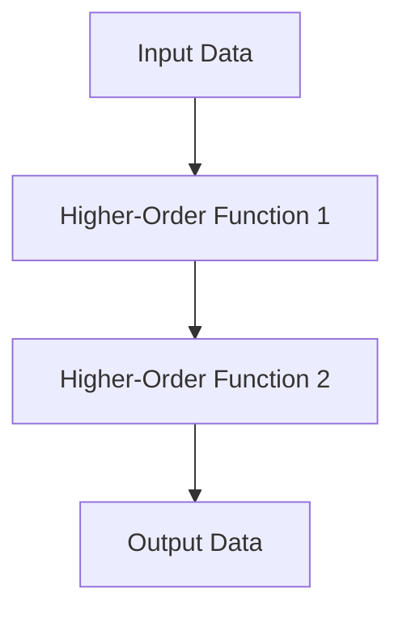

## 20.3 Risk Mitigation Strategies

Transitioning from Java Object-Oriented Programming (OOP) to Clojure's functional programming paradigm is a significant undertaking that can bring transformative benefits to enterprise applications. However, such a migration also presents various risks that need to be carefully managed to ensure a successful outcome. In this section, we will explore comprehensive risk mitigation strategies that can help you navigate the complexities of this transition. We will cover proactive measures to prevent issues, contingency planning, and best practices to minimize potential disruptions.

### Understanding the Risks

Before diving into specific strategies, it's essential to understand the types of risks involved in migrating from Java to Clojure. These risks can be broadly categorized into technical, organizational, and process-related risks.

#### Technical Risks

- **Compatibility Issues**: Ensuring that existing Java components can interoperate with new Clojure code.
- **Performance Concerns**: Addressing potential performance bottlenecks due to differences in language paradigms.
- **Data Integrity**: Maintaining data consistency and integrity during the migration process.

#### Organizational Risks

- **Skill Gaps**: Bridging the knowledge gap for developers unfamiliar with functional programming.
- **Cultural Resistance**: Overcoming resistance to change within the organization.
- **Resource Allocation**: Ensuring adequate resources are allocated for the migration effort.

#### Process-Related Risks

- **Project Delays**: Managing timelines and avoiding delays in the migration process.
- **Scope Creep**: Preventing uncontrolled changes to the project scope.
- **Communication Breakdowns**: Ensuring effective communication among stakeholders.

### Proactive Measures to Prevent Issues

Proactive measures are essential to prevent issues from arising during the migration process. These measures involve planning, preparation, and continuous monitoring to identify and address potential risks early.

#### Conduct a Thorough Assessment

- **Evaluate Current Systems**: Conduct a comprehensive evaluation of your existing Java systems to identify components that are suitable for migration and those that may require significant rework.
- **Identify Dependencies**: Map out dependencies between different components to understand the impact of migration on the overall system.

#### Develop a Detailed Migration Plan

- **Define Objectives**: Clearly define the objectives of the migration, including desired outcomes and success criteria.
- **Set Priorities**: Prioritize components for migration based on factors such as business impact, complexity, and resource availability.
- **Create a Timeline**: Develop a realistic timeline for the migration process, including key milestones and deliverables.

#### Build a Skilled Team

- **Upskill Developers**: Provide training and resources to help developers transition from Java to Clojure. Consider workshops, online courses, and pair programming sessions.
- **Leverage Expertise**: Engage experienced Clojure developers or consultants to guide the migration process and provide insights into best practices.

#### Establish Robust Testing Practices

- **Automated Testing**: Implement automated testing frameworks to ensure that migrated components function correctly and meet performance expectations.
- **Continuous Integration**: Set up continuous integration pipelines to catch issues early and ensure that changes are tested and validated promptly.

### Contingency Planning

Contingency planning involves preparing for potential setbacks and having strategies in place to address them. This ensures that the migration process can continue smoothly even when unexpected challenges arise.

#### Develop a Risk Management Plan

- **Identify Potential Risks**: List potential risks and their impact on the migration process. Consider both technical and organizational risks.
- **Assign Risk Owners**: Designate individuals responsible for monitoring and managing specific risks.
- **Define Mitigation Strategies**: Outline specific actions to mitigate each identified risk, including preventive measures and response plans.

#### Implement a Rollback Strategy

- **Backup Systems**: Ensure that comprehensive backups of existing systems are in place before starting the migration. This allows for a rollback if necessary.
- **Version Control**: Use version control systems to manage changes and maintain a history of modifications. This facilitates reverting to previous states if issues occur.

#### Monitor Progress and Adapt

- **Regular Check-ins**: Schedule regular check-ins with the migration team to assess progress and address any emerging issues.
- **Adjust Plans as Needed**: Be prepared to adjust the migration plan based on feedback and changing circumstances. Flexibility is key to managing risks effectively.

### Best Practices for Minimizing Disruptions

Implementing best practices can help minimize disruptions during the migration process and ensure a smoother transition.

#### Foster a Collaborative Environment

- **Encourage Communication**: Promote open communication among team members and stakeholders to facilitate knowledge sharing and problem-solving.
- **Build a Supportive Culture**: Foster a culture that supports experimentation and learning, allowing developers to explore new approaches without fear of failure.

#### Leverage Clojure's Strengths

- **Embrace Immutability**: Take advantage of Clojure's immutable data structures to simplify state management and reduce the risk of bugs.
- **Utilize Functional Composition**: Use higher-order functions and functional composition to create modular and reusable code.

#### Optimize Performance

- **Profile and Optimize**: Use profiling tools to identify performance bottlenecks and optimize code as needed.
- **Tune the JVM**: Adjust JVM settings to optimize performance for Clojure applications, considering factors such as memory allocation and garbage collection.

### Code Examples

To illustrate the concepts discussed, let's explore some code examples that demonstrate risk mitigation strategies in Clojure.

#### Example 1: Interoperability Between Java and Clojure

```java
// Java code to be called from Clojure
public class JavaComponent {
    public String greet(String name) {
        return "Hello, " + name;
    }
}
```

```clojure
;; Clojure code to call the Java component
(ns myproject.core
  (:import [JavaComponent]))

(defn greet-user [name]
  (let [java-comp (JavaComponent.)]
    (.greet java-comp name)))

;; Usage
(greet-user "Alice") ;; => "Hello, Alice"
```

#### Example 2: Handling Immutability and State

```clojure
;; Using atoms for state management
(def counter (atom 0))

(defn increment-counter []
  (swap! counter inc))

;; Usage
(increment-counter)
@counter ;; => 1
```

### Visual Aids

To further enhance understanding, let's incorporate a diagram that illustrates the flow of data through higher-order functions in Clojure.



**Diagram Description**: This flowchart represents the transformation of input data through a series of higher-order functions, resulting in the final output data. Each function takes the output of the previous function as its input, demonstrating functional composition.

### References and Links

For further reading and exploration, consider the following resources:

- [Official Clojure Documentation](https://clojure.org/)
- [ClojureDocs](https://clojuredocs.org/)
- [Clojure GitHub Repository](https://github.com/clojure/clojure)

### Knowledge Check

To reinforce your understanding of risk mitigation strategies, consider the following questions:

1. What are the key technical risks involved in migrating from Java to Clojure?
2. How can you proactively prevent issues during the migration process?
3. What is the importance of contingency planning in risk mitigation?
4. How can you leverage Clojure's strengths to minimize disruptions during migration?

### Encouraging Tone

Now that we've explored risk mitigation strategies for migrating from Java to Clojure, you're well-equipped to tackle the challenges of this transition. Remember, proactive planning and continuous adaptation are key to a successful migration. Embrace the strengths of Clojure and foster a collaborative environment to drive innovation and success in your enterprise applications.

### Quiz: Are You Ready to Migrate from Java to Clojure?



### What is a key technical risk in migrating from Java to Clojure?

- [x] Compatibility issues
- [ ] Lack of documentation
- [ ] Insufficient hardware
- [ ] Network latency

> **Explanation:** Compatibility issues arise when integrating Java components with new Clojure code, making it a key technical risk.

### How can you proactively prevent issues during migration?

- [x] Conduct a thorough assessment
- [ ] Ignore dependencies
- [ ] Skip testing
- [ ] Avoid planning

> **Explanation:** Conducting a thorough assessment helps identify potential issues early, allowing for proactive prevention.

### What is the purpose of contingency planning?

- [x] Prepare for potential setbacks
- [ ] Increase project scope
- [ ] Reduce team size
- [ ] Eliminate testing

> **Explanation:** Contingency planning involves preparing for potential setbacks to ensure the migration process can continue smoothly.

### How can you leverage Clojure's strengths during migration?

- [x] Embrace immutability
- [ ] Use global variables
- [ ] Avoid functional composition
- [ ] Rely on inheritance

> **Explanation:** Embracing immutability and functional composition are strengths of Clojure that can be leveraged during migration.

### What is a benefit of automated testing in migration?

- [x] Ensures migrated components function correctly
- [ ] Increases manual workload
- [ ] Delays project timelines
- [ ] Reduces code quality

> **Explanation:** Automated testing ensures that migrated components function correctly and meet performance expectations.

### Why is it important to build a skilled team for migration?

- [x] Bridge the knowledge gap
- [ ] Reduce project scope
- [ ] Eliminate communication
- [ ] Increase resistance to change

> **Explanation:** Building a skilled team helps bridge the knowledge gap and ensures a smoother migration process.

### What is a key element of a risk management plan?

- [x] Define mitigation strategies
- [ ] Ignore potential risks
- [ ] Avoid assigning risk owners
- [ ] Increase project scope

> **Explanation:** Defining mitigation strategies is a key element of a risk management plan to address potential risks.

### How can you optimize performance in Clojure applications?

- [x] Profile and optimize code
- [ ] Ignore JVM settings
- [ ] Avoid profiling tools
- [ ] Increase memory usage

> **Explanation:** Profiling and optimizing code helps identify performance bottlenecks and improve application performance.

### What is the role of regular check-ins during migration?

- [x] Assess progress and address issues
- [ ] Increase project scope
- [ ] Eliminate communication
- [ ] Reduce team size

> **Explanation:** Regular check-ins help assess progress and address any emerging issues during the migration process.

### True or False: Flexibility is key to managing risks effectively during migration.

- [x] True
- [ ] False

> **Explanation:** Flexibility allows for adjustments to the migration plan based on feedback and changing circumstances, making it key to managing risks effectively.


