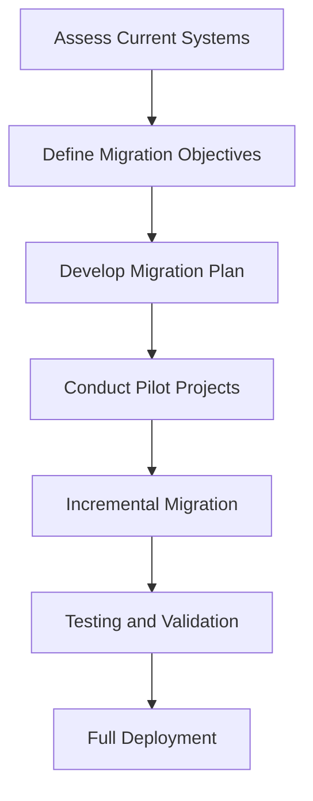

## 20.3 Risk Mitigation Strategies

Transitioning from Java Object-Oriented Programming (OOP) to Clojure's functional programming paradigm is a significant undertaking for any enterprise. While the benefits of such a migration are substantial, including enhanced scalability, maintainability, and productivity, the process is not without its risks. In this section, we will explore comprehensive risk mitigation strategies to ensure a successful migration. By proactively addressing potential issues and implementing robust contingency plans, your organization can navigate the transition smoothly and effectively.

### Understanding the Risks

Before diving into specific strategies, it's crucial to understand the types of risks associated with migrating from Java to Clojure. These risks can be broadly categorized into technical, organizational, and process-related challenges.

#### Technical Risks

1. **Compatibility Issues**: Ensuring that existing Java components work seamlessly with new Clojure code.
2. **Performance Degradation**: Potential slowdowns due to differences in language paradigms and execution models.
3. **Data Integrity**: Ensuring that data transformations and migrations do not lead to loss or corruption.
4. **Concurrency Challenges**: Adapting to Clojure's concurrency model, which differs significantly from Java's.

#### Organizational Risks

1. **Skill Gaps**: The need for developers to learn and adapt to a new programming paradigm.
2. **Resistance to Change**: Cultural resistance within the organization to adopting new technologies.
3. **Resource Allocation**: Ensuring that sufficient resources are dedicated to the migration effort.

#### Process-Related Risks

1. **Project Delays**: Potential for extended timelines due to unforeseen challenges.
2. **Scope Creep**: The risk of expanding project scope beyond initial plans.
3. **Inadequate Testing**: Ensuring comprehensive testing to validate the new system's functionality.

### Proactive Measures for Risk Mitigation

To mitigate these risks, we must adopt a proactive approach that includes thorough planning, continuous monitoring, and adaptive strategies. Let's explore these measures in detail.

#### 1. Comprehensive Planning and Assessment

**Evaluate Current Systems**: Begin by conducting a detailed assessment of your existing Java systems. Identify components that are critical to business operations and those that can be incrementally migrated.

**Define Clear Objectives**: Establish clear migration objectives aligned with business goals. This includes defining success criteria, timelines, and resource requirements.

**Conduct a Feasibility Study**: Analyze the feasibility of migrating specific components to Clojure. Consider technical dependencies, data flow, and integration points.

**Develop a Detailed Migration Plan**: Create a step-by-step migration plan that outlines tasks, responsibilities, and timelines. Include risk assessments and contingency plans for each phase.

#### 2. Skill Development and Training

**Upskill Development Teams**: Invest in training programs to equip your development teams with the necessary skills in Clojure and functional programming concepts. This can include workshops, online courses, and hands-on projects.

**Encourage Pair Programming**: Facilitate pair programming sessions where experienced Clojure developers work alongside Java developers. This fosters knowledge transfer and accelerates learning.

**Build a Clojure Community**: Encourage the formation of a Clojure community within your organization. This can include regular meetups, knowledge-sharing sessions, and collaborative projects.

#### 3. Incremental Migration Approach

**Adopt a Phased Migration Strategy**: Instead of a "big bang" approach, consider migrating components incrementally. This reduces risk by allowing for testing and validation at each stage.

**Leverage Interoperability**: Utilize Clojure's interoperability with Java to gradually introduce Clojure components into your existing Java applications. This allows for a smoother transition and minimizes disruptions.

**Pilot Projects**: Start with pilot projects to test the migration process and gather insights. Use these projects to refine your strategies and address any challenges that arise.

#### 4. Robust Testing and Validation

**Maintain Comprehensive Test Coverage**: Ensure that your test suite covers all critical functionalities. This includes unit tests, integration tests, and acceptance tests.

**Automate Testing Processes**: Implement automated testing frameworks to streamline testing efforts and ensure consistency. Tools like `clojure.test` and `Midje` can be valuable for testing Clojure code.

**Conduct Performance Testing**: Perform thorough performance testing to identify and address any potential bottlenecks. Compare the performance of Java and Clojure components to ensure that the migration does not degrade system performance.

#### 5. Effective Communication and Stakeholder Engagement

**Engage Stakeholders Early**: Involve key stakeholders in the planning and decision-making process. This includes business leaders, developers, and end-users.

**Communicate Benefits and Progress**: Regularly communicate the benefits of the migration and progress updates to all stakeholders. Highlight success stories and milestones achieved.

**Address Concerns and Feedback**: Create channels for stakeholders to voice concerns and provide feedback. Use this feedback to make informed decisions and adjustments to the migration plan.

#### 6. Contingency Planning

**Identify Potential Failure Points**: Analyze the migration process to identify potential failure points. Develop contingency plans to address these risks.

**Establish Rollback Procedures**: Define clear rollback procedures in case of critical failures. This ensures that you can revert to the previous state without significant disruptions.

**Allocate Buffer Resources**: Allocate additional resources, such as time and personnel, to handle unexpected challenges. This provides flexibility to address issues as they arise.

### Code Examples and Practical Applications

To illustrate these strategies, let's explore some code examples and practical applications.

#### Example 1: Interoperability Between Java and Clojure

One of the key strategies for incremental migration is leveraging interoperability between Java and Clojure. Here's a simple example demonstrating how to call a Java method from Clojure:

```clojure
;; Define a Java class with a simple method
public class Greeting {
    public static String sayHello(String name) {
        return "Hello, " + name + "!";
    }
}

;; Call the Java method from Clojure
(ns myproject.core
  (:import [Greeting]))

(defn greet [name]
  (Greeting/sayHello name))

;; Usage
(println (greet "Clojure Developer")) ; Output: Hello, Clojure Developer!
```

**Explanation**: In this example, we define a Java class `Greeting` with a static method `sayHello`. We then import this class in our Clojure namespace and call the method using Clojure's interop capabilities. This demonstrates how Java and Clojure can coexist, allowing for a gradual migration.

#### Example 2: Testing Clojure Code

Testing is a critical component of risk mitigation. Here's an example of a simple Clojure test using the `clojure.test` framework:

```clojure
(ns myproject.core-test
  (:require [clojure.test :refer :all]
            [myproject.core :refer :all]))

(deftest test-greet
  (testing "Greeting function"
    (is (= "Hello, Clojure Developer!" (greet "Clojure Developer")))))

;; Run the tests
(run-tests 'myproject.core-test)
```

**Explanation**: This test suite verifies the functionality of the `greet` function. By maintaining comprehensive test coverage, we can ensure that our Clojure code behaves as expected, reducing the risk of introducing bugs during migration.

### Visual Aids

To further enhance understanding, let's incorporate some visual aids.

#### Diagram: Incremental Migration Process



**Description**: This flowchart illustrates the incremental migration process, starting from assessing current systems to full deployment. Each step is designed to mitigate risks and ensure a smooth transition.

### References and Links

For further reading and resources, consider the following links:

- [Clojure Official Documentation](https://clojure.org/reference)
- [Clojure Community Resources](https://clojure.org/community/resources)
- [Transitioning from OOP to Functional Programming](https://www.lispcast.com/oo-to-fp/)
- [Clojure STM Guide](https://clojure.org/reference/refs)

### Knowledge Check

To reinforce your understanding, consider the following questions:

1. What are the key technical risks associated with migrating from Java to Clojure?
2. How can you leverage Clojure's interoperability with Java during migration?
3. Why is it important to maintain comprehensive test coverage during migration?
4. What are some effective strategies for engaging stakeholders in the migration process?
5. How can contingency planning help mitigate risks during migration?

### Encouraging Engagement

Embracing functional programming can be challenging, but with each step, you'll gain a deeper understanding and see tangible benefits in your codebase. Remember, the journey from Java OOP to Clojure is not just a technical transition but a cultural shift towards more expressive and maintainable code.

### Quiz: Are You Ready to Migrate from Java to Clojure?



### What is a key technical risk when migrating from Java to Clojure?

- [x] Compatibility Issues
- [ ] Lack of Libraries
- [ ] Poor Documentation
- [ ] Limited Community Support

> **Explanation:** Compatibility issues arise when integrating Java components with new Clojure code, making it a key technical risk.

### How can you ensure a smooth transition during migration?

- [x] Adopt a Phased Migration Strategy
- [ ] Migrate All Components at Once
- [ ] Ignore Stakeholder Feedback
- [ ] Avoid Testing

> **Explanation:** A phased migration strategy allows for testing and validation at each stage, ensuring a smoother transition.

### What is an effective way to upskill development teams for Clojure?

- [x] Invest in Training Programs
- [ ] Rely on Self-Learning
- [ ] Limit Access to Resources
- [ ] Avoid Pair Programming

> **Explanation:** Investing in training programs equips teams with the necessary skills in Clojure and functional programming.

### Why is stakeholder engagement important during migration?

- [x] To Involve Key Stakeholders in Planning
- [ ] To Delay Decision-Making
- [ ] To Minimize Communication
- [ ] To Avoid Feedback

> **Explanation:** Engaging stakeholders early ensures their involvement in planning and decision-making, facilitating a smoother migration.

### What is a benefit of maintaining comprehensive test coverage?

- [x] Ensures Code Functionality
- [ ] Increases Migration Time
- [ ] Reduces Code Quality
- [ ] Limits Developer Creativity

> **Explanation:** Comprehensive test coverage ensures that the code functions as expected, reducing the risk of introducing bugs.

### How can contingency planning mitigate risks?

- [x] By Defining Rollback Procedures
- [ ] By Ignoring Potential Failures
- [ ] By Limiting Resources
- [ ] By Avoiding Testing

> **Explanation:** Contingency planning includes defining rollback procedures to address potential failures, mitigating risks.

### What is a key organizational risk during migration?

- [x] Skill Gaps
- [ ] Abundant Resources
- [ ] Overqualified Staff
- [ ] Excessive Training

> **Explanation:** Skill gaps arise when developers need to learn a new programming paradigm, posing an organizational risk.

### How can you address resistance to change within an organization?

- [x] Communicate Benefits and Progress
- [ ] Ignore Employee Concerns
- [ ] Limit Communication
- [ ] Avoid Change Management

> **Explanation:** Communicating benefits and progress helps address resistance to change by highlighting the advantages of migration.

### What is a potential process-related risk during migration?

- [x] Project Delays
- [ ] Accelerated Timelines
- [ ] Excessive Resources
- [ ] Overstaffing

> **Explanation:** Project delays can occur due to unforeseen challenges, making it a potential process-related risk.

### True or False: Interoperability allows for a gradual introduction of Clojure components into Java applications.

- [x] True
- [ ] False

> **Explanation:** Interoperability between Java and Clojure allows for a gradual introduction of Clojure components, facilitating a smoother transition.



By implementing these risk mitigation strategies, your organization can confidently navigate the migration from Java OOP to Clojure, unlocking the full potential of functional programming.
