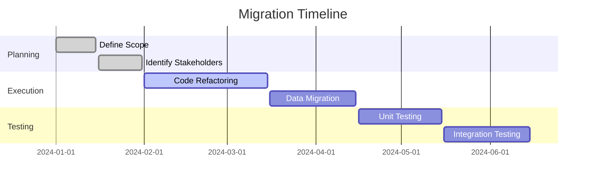

## 21.1 Effective Communication

In the journey of migrating from Java Object-Oriented Programming (OOP) to Clojure's functional programming paradigm, effective communication is paramount. This section delves into strategies for keeping all stakeholders informed, ensuring transparent reporting of progress and challenges, and fostering a collaborative environment that supports a successful transition.

### The Importance of Communication in Migration

Migrating enterprise applications from Java to Clojure is a complex process that involves multiple teams, departments, and stakeholders. Effective communication ensures that everyone is aligned with the migration goals, understands the challenges, and collaborates effectively to overcome obstacles. Let's explore the key components of effective communication in this context.

### Keeping Stakeholders Informed

#### Identify Key Stakeholders

Begin by identifying all relevant stakeholders involved in the migration process. These may include:

- **Technical Teams**: Developers, architects, and testers who will be directly involved in the migration.
- **Management**: Project managers, technical managers, and executives who oversee the migration.
- **Business Units**: Departments that rely on the applications being migrated.
- **External Partners**: Vendors or consultants who may assist in the migration.

#### Establish Clear Communication Channels

Establishing clear communication channels is crucial for keeping stakeholders informed. Consider the following:

- **Regular Meetings**: Schedule regular meetings to discuss progress, challenges, and next steps. Use these meetings to align on goals and address any concerns.
- **Digital Platforms**: Utilize digital platforms such as Slack, Microsoft Teams, or email for ongoing communication. Ensure that all stakeholders have access to these platforms.
- **Documentation**: Maintain comprehensive documentation of the migration process, including timelines, objectives, and technical details. Share this documentation with stakeholders to provide transparency.

#### Tailor Communication to Stakeholder Needs

Different stakeholders have different information needs. Tailor your communication to address these needs:

- **Technical Teams**: Provide detailed technical updates, including code changes, testing results, and architectural decisions.
- **Management**: Focus on high-level progress reports, timelines, and risk assessments.
- **Business Units**: Highlight the impact of the migration on business operations and any changes to application functionality.

### Transparent Reporting of Progress and Challenges

Transparency is key to building trust and ensuring that stakeholders remain engaged throughout the migration process. Here are some strategies for transparent reporting:

#### Regular Progress Updates

Provide regular updates on the migration progress. These updates should include:

- **Milestones Achieved**: Highlight key milestones that have been reached, such as the completion of a migration phase or successful testing of a module.
- **Current Status**: Share the current status of the migration, including what is currently being worked on and what is planned next.
- **Challenges Faced**: Be open about any challenges or roadblocks encountered. Discuss how these challenges are being addressed and any potential impact on timelines.

#### Use of Visual Aids

Visual aids can enhance understanding and engagement. Consider using:

- **Gantt Charts**: Use Gantt charts to visualize the migration timeline and track progress against planned milestones.
- **Flowcharts**: Create flowcharts to illustrate the migration process, including dependencies and decision points.
- **Diagrams**: Use diagrams to compare Java OOP concepts with their Clojure equivalents, helping stakeholders understand the technical changes.

*Caption: Gantt chart illustrating the migration timeline with key phases and milestones.*

#### Open Channels for Feedback

Encourage stakeholders to provide feedback and raise concerns. This can be facilitated through:

- **Surveys**: Conduct regular surveys to gather feedback on the migration process and identify areas for improvement.
- **Feedback Sessions**: Hold dedicated feedback sessions where stakeholders can voice their opinions and suggestions.
- **Anonymous Feedback**: Provide options for anonymous feedback to encourage honest and open communication.

### Fostering Collaboration

Collaboration is essential for a successful migration. Here are some ways to foster a collaborative environment:

#### Cross-Functional Teams

Form cross-functional teams that bring together diverse expertise. This can include:

- **Developers and Architects**: Collaborate on code refactoring and architectural decisions.
- **Testers and QA**: Work closely with developers to ensure thorough testing and quality assurance.
- **Business Analysts**: Provide insights into business requirements and ensure that the migrated applications meet these needs.

#### Pair Programming and Code Reviews

Encourage pair programming and code reviews to facilitate knowledge sharing and improve code quality. This approach can help:

- **Identify Issues Early**: Detect potential issues early in the development process.
- **Share Knowledge**: Promote knowledge sharing among team members, especially those new to Clojure.
- **Enhance Code Quality**: Improve code quality through collaborative review and feedback.

#### Collaborative Tools

Utilize collaborative tools to support teamwork and communication. Consider:

- **Version Control Systems**: Use version control systems like Git to manage code changes and facilitate collaboration.
- **Project Management Tools**: Implement project management tools such as Jira or Trello to track tasks and progress.
- **Shared Repositories**: Maintain shared repositories for documentation and resources, ensuring that all team members have access to the latest information.

### Overcoming Communication Barriers

Despite best efforts, communication barriers can arise. Here are some strategies to overcome them:

#### Addressing Technical Jargon

Technical jargon can be a barrier to effective communication, especially for non-technical stakeholders. To address this:

- **Simplify Language**: Use simple language and avoid unnecessary technical terms when communicating with non-technical stakeholders.
- **Provide Glossaries**: Include glossaries of technical terms in documentation to aid understanding.
- **Use Analogies**: Use analogies to explain complex technical concepts in relatable terms.

#### Bridging Cultural Differences

Cultural differences can impact communication, especially in global teams. To bridge these differences:

- **Cultural Awareness**: Promote cultural awareness and sensitivity among team members.
- **Inclusive Communication**: Encourage inclusive communication practices that respect diverse perspectives.
- **Team Building Activities**: Organize team-building activities to foster camaraderie and understanding.

### Encouraging Engagement and Participation

Engagement and participation are crucial for a successful migration. Here are some ways to encourage them:

#### Recognize Contributions

Recognize and celebrate the contributions of team members and stakeholders. This can include:

- **Acknowledgments**: Publicly acknowledge the efforts and achievements of individuals and teams.
- **Incentives**: Offer incentives or rewards for outstanding contributions to the migration process.
- **Celebrations**: Organize celebrations or events to mark key milestones and successes.

#### Provide Training and Support

Provide training and support to help team members adapt to Clojure and the functional programming paradigm. This can include:

- **Training Programs**: Offer training programs and workshops on Clojure and functional programming concepts.
- **Mentorship**: Establish mentorship programs to support team members in their learning journey.
- **Resources**: Provide access to resources such as books, online courses, and community forums.

### Conclusion

Effective communication is the backbone of a successful migration from Java OOP to Clojure. By keeping stakeholders informed, ensuring transparent reporting, and fostering collaboration, organizations can navigate the complexities of migration and achieve their goals. Embrace these communication strategies to build a cohesive and engaged team that is ready to tackle the challenges of migration and reap the benefits of Clojure's functional programming paradigm.

## **Quiz: Are You Ready to Migrate from Java to Clojure?**



### What is the first step in keeping stakeholders informed during a migration?

- [x] Identify key stakeholders
- [ ] Establish communication channels
- [ ] Provide regular updates
- [ ] Tailor communication to stakeholder needs

> **Explanation:** Identifying key stakeholders is crucial to understanding who needs to be informed and involved in the migration process.

### Which tool is recommended for visualizing the migration timeline?

- [x] Gantt Chart
- [ ] Flowchart
- [ ] Sequence Diagram
- [ ] Class Diagram

> **Explanation:** Gantt charts are effective for visualizing timelines and tracking progress against planned milestones.

### How can technical jargon be addressed in communication?

- [x] Simplify language
- [ ] Use more technical terms
- [ ] Avoid communication
- [ ] Increase meeting frequency

> **Explanation:** Simplifying language helps ensure that all stakeholders, including non-technical ones, understand the communication.

### What is a benefit of cross-functional teams?

- [x] Diverse expertise
- [ ] Increased complexity
- [ ] More meetings
- [ ] Longer timelines

> **Explanation:** Cross-functional teams bring together diverse expertise, which is beneficial for tackling complex migration challenges.

### How can feedback be encouraged from stakeholders?

- [x] Conduct surveys
- [ ] Limit communication
- [ ] Use technical jargon
- [ ] Avoid feedback sessions

> **Explanation:** Surveys are an effective way to gather feedback and identify areas for improvement.

### What is a key component of transparent reporting?

- [x] Regular progress updates
- [ ] Sporadic communication
- [ ] Technical jargon
- [ ] Limited stakeholder involvement

> **Explanation:** Regular progress updates ensure that stakeholders are informed about the migration status and any challenges encountered.

### Which practice can enhance code quality during migration?

- [x] Code reviews
- [ ] Avoiding collaboration
- [ ] Limiting feedback
- [ ] Reducing testing

> **Explanation:** Code reviews facilitate knowledge sharing and improve code quality through collaborative review and feedback.

### How can cultural differences be bridged in global teams?

- [x] Promote cultural awareness
- [ ] Ignore differences
- [ ] Limit communication
- [ ] Increase technical jargon

> **Explanation:** Promoting cultural awareness helps bridge differences and fosters a collaborative environment.

### What should be included in documentation to aid understanding?

- [x] Glossaries of technical terms
- [ ] Only technical details
- [ ] Limited information
- [ ] Personal opinions

> **Explanation:** Including glossaries of technical terms helps stakeholders understand complex concepts.

### True or False: Effective communication is not necessary for a successful migration.

- [ ] True
- [x] False

> **Explanation:** Effective communication is essential for aligning stakeholders, addressing challenges, and ensuring a successful migration.


