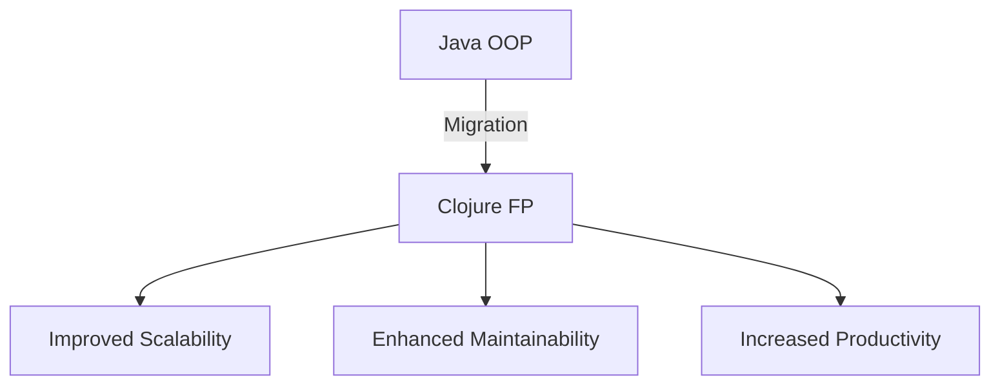
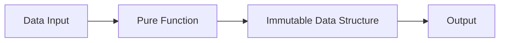

## 21.1 Effective Communication

In the journey of migrating from Java Object-Oriented Programming (OOP) to Clojure's functional programming paradigm, effective communication is the linchpin that holds the entire process together. This section will delve into the strategies and practices necessary to ensure that all stakeholders are kept informed, progress is transparently reported, and challenges are addressed collaboratively. 

### The Importance of Communication in Migration

Migrating an enterprise application from Java to Clojure is a complex endeavor that involves multiple teams, stakeholders, and moving parts. Effective communication is crucial for several reasons:

1. **Alignment of Goals**: Ensuring that everyone involved understands the objectives and benefits of the migration.
2. **Risk Management**: Identifying potential risks early through open dialogue.
3. **Stakeholder Engagement**: Keeping stakeholders informed to maintain their support and trust.
4. **Problem Solving**: Facilitating collaborative problem-solving by sharing challenges and solutions.
5. **Morale and Motivation**: Maintaining team morale by celebrating successes and learning from setbacks.

### Building a Communication Plan

A well-structured communication plan is essential for a successful migration. Here are the key components:

#### 1. Define Communication Objectives

- **Explain the Purpose**: Clearly articulate why the migration is happening and what it aims to achieve.
- **Set Expectations**: Outline what stakeholders can expect in terms of timelines, deliverables, and potential challenges.

#### 2. Identify Stakeholders

- **Internal Stakeholders**: Include developers, project managers, and executives.
- **External Stakeholders**: Consider clients, partners, and vendors who might be affected by the migration.

#### 3. Determine Communication Channels

- **Meetings**: Regularly scheduled meetings for updates and discussions.
- **Reports**: Written reports for detailed progress tracking.
- **Digital Platforms**: Use collaboration tools like Slack or Microsoft Teams for ongoing communication.

#### 4. Establish a Communication Schedule

- **Regular Updates**: Weekly or bi-weekly updates to keep everyone informed.
- **Milestone Reports**: Detailed reports at key stages of the migration.

#### 5. Assign Communication Roles

- **Communication Lead**: Designate a person responsible for overseeing communication efforts.
- **Team Representatives**: Ensure each team has a representative to relay information.

### Transparent Reporting of Progress and Challenges

Transparency is vital in maintaining trust and ensuring that all parties are on the same page. Here’s how to achieve it:

#### 1. Use Clear and Concise Language

- **Avoid Jargon**: Use language that is accessible to all stakeholders, not just technical team members.
- **Be Direct**: Clearly state progress, challenges, and next steps.

#### 2. Visualize Data

- **Charts and Graphs**: Use visual aids to represent progress and data.
- **Diagrams**: Employ diagrams to illustrate complex concepts or processes.



*Figure 1: Migration from Java OOP to Clojure Functional Programming*

#### 3. Regularly Update Stakeholders

- **Progress Reports**: Share updates on what has been accomplished and what remains.
- **Challenge Reports**: Transparently discuss any obstacles encountered and potential solutions.

#### 4. Solicit Feedback

- **Open Channels**: Encourage stakeholders to provide feedback and ask questions.
- **Iterative Improvements**: Use feedback to make continuous improvements to the migration process.

### Overcoming Communication Barriers

Despite best efforts, communication barriers can arise. Here’s how to address them:

#### 1. Cultural Differences

- **Acknowledge Diversity**: Recognize and respect cultural differences in communication styles.
- **Adapt Communication**: Tailor communication methods to suit diverse audiences.

#### 2. Technical Jargon

- **Simplify Language**: Break down complex technical terms into simpler concepts.
- **Provide Context**: Always provide context when introducing new terms or concepts.

#### 3. Resistance to Change

- **Address Concerns**: Listen to concerns and address them with empathy and facts.
- **Highlight Benefits**: Continuously emphasize the benefits of the migration.

### Code Examples: Communicating Through Code

Code can be a powerful communication tool, especially when illustrating the differences between Java and Clojure.

#### Java Example: A Simple Class

```java
public class Calculator {
    private int result;

    public Calculator() {
        this.result = 0;
    }

    public int add(int value) {
        this.result += value;
        return this.result;
    }

    public int getResult() {
        return this.result;
    }
}
```

#### Clojure Example: A Simple Function

```clojure
(defn add [result value]
  (+ result value))

;; Usage
(def result (add 0 5))
```

*Key Differences*:
- **Immutability**: Clojure's `add` function returns a new result without modifying the original state.
- **Simplicity**: Clojure's code is more concise and focuses on pure functions.

### Encouraging Experimentation

Encourage your team to experiment with Clojure's features to better understand its advantages. Here’s a "Try It Yourself" exercise:

#### Exercise: Refactor a Java Method to Clojure

**Java Method**:
```java
public int multiply(int a, int b) {
    return a * b;
}
```

**Clojure Function**:
```clojure
(defn multiply [a b]
  (* a b))
```

*Try modifying the Clojure function to handle more than two arguments using `reduce`.*

### Visual Aids: Enhancing Understanding

Visual aids can significantly enhance understanding, especially when dealing with complex concepts like data flow and concurrency.



*Figure 2: Data Flow in Clojure's Functional Programming*

### References and Further Reading

For more in-depth information, consider exploring the following resources:

- [Official Clojure Documentation](https://clojure.org/)
- [ClojureDocs](https://clojuredocs.org/)
- [GitHub Clojure Repositories](https://github.com/clojure)

### Knowledge Check

To ensure understanding, here are some questions and exercises:

1. **What are the key components of a communication plan?**
2. **How can visual aids improve communication?**
3. **Refactor a Java method to a Clojure function and explain the differences.**

### Summary

Effective communication is the backbone of a successful migration from Java to Clojure. By establishing clear objectives, maintaining transparency, and overcoming barriers, you can ensure a smooth transition that benefits all stakeholders.

## **Quiz: Are You Ready to Migrate from Java to Clojure?**



### What is a key reason for effective communication during migration?

- [x] To align goals and manage risks
- [ ] To reduce the number of meetings
- [ ] To avoid using new technology
- [ ] To increase project costs

> **Explanation:** Effective communication helps align goals and manage risks by ensuring all stakeholders are informed and engaged.

### Which component is essential in a communication plan?

- [x] Communication Objectives
- [ ] Budget Allocation
- [ ] Office Location
- [ ] Employee Salaries

> **Explanation:** Communication objectives are crucial for setting expectations and guiding the communication strategy.

### What is a benefit of using visual aids in communication?

- [x] They enhance understanding of complex concepts
- [ ] They replace the need for meetings
- [ ] They are only useful for technical teams
- [ ] They increase project costs

> **Explanation:** Visual aids help clarify complex concepts and make information more accessible to all stakeholders.

### How can feedback be used in the communication process?

- [x] To make iterative improvements
- [ ] To ignore stakeholder concerns
- [ ] To delay project timelines
- [ ] To increase project costs

> **Explanation:** Feedback allows for continuous improvement and adaptation of the communication strategy.

### What is a common barrier to effective communication?

- [x] Cultural Differences
- [ ] Increased Budget
- [ ] More Resources
- [ ] Shorter Timelines

> **Explanation:** Cultural differences can affect communication styles and need to be acknowledged and addressed.

### How can resistance to change be addressed?

- [x] By listening to concerns and highlighting benefits
- [ ] By ignoring stakeholder feedback
- [ ] By enforcing strict rules
- [ ] By reducing project scope

> **Explanation:** Addressing concerns with empathy and emphasizing benefits helps overcome resistance to change.

### What role does a communication lead play?

- [x] Overseeing communication efforts
- [ ] Managing project budgets
- [ ] Hiring new employees
- [ ] Designing software architecture

> **Explanation:** The communication lead is responsible for coordinating and managing communication strategies.

### What is a key difference between Java and Clojure code?

- [x] Clojure emphasizes immutability and pure functions
- [ ] Java is more concise
- [ ] Clojure uses classes and objects
- [ ] Java supports functional programming

> **Explanation:** Clojure focuses on immutability and pure functions, which is a key difference from Java's OOP approach.

### Why is it important to use clear and concise language in communication?

- [x] To ensure all stakeholders understand the information
- [ ] To reduce the length of reports
- [ ] To avoid technical discussions
- [ ] To increase project complexity

> **Explanation:** Clear and concise language ensures that all stakeholders, regardless of technical expertise, can understand the information.

### True or False: Effective communication can help maintain team morale.

- [x] True
- [ ] False

> **Explanation:** Effective communication helps maintain team morale by celebrating successes and addressing challenges collaboratively.


