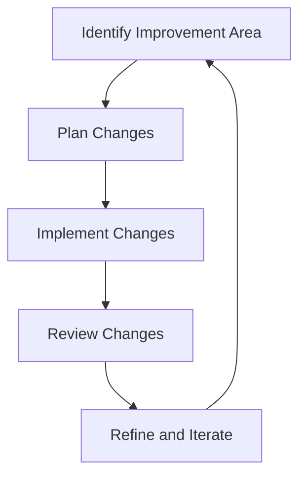

## 21.2 Incremental Improvements

Transitioning from Java Object-Oriented Programming (OOP) to Clojure's functional paradigm can be a daunting task for any enterprise. However, by focusing on **incremental improvements**, you can make this transition more manageable and less risky. This approach involves implementing small, manageable changes over time, allowing your team to adapt gradually and continuously improve the system. In this section, we will explore the strategy of incremental improvements, drawing parallels between Java OOP and Clojure, and providing practical guidance for a successful migration.

### Understanding Incremental Improvements

Incremental improvements are about making small, iterative changes to your codebase and processes. This approach is rooted in the philosophy of continuous improvement, which emphasizes ongoing, incremental changes rather than large, disruptive overhauls. By focusing on small changes, you can:

- **Reduce Risk**: Smaller changes are easier to test and validate, minimizing the risk of introducing bugs or breaking existing functionality.
- **Enhance Learning**: Each change provides an opportunity for your team to learn and adapt to the new paradigm, building confidence and expertise over time.
- **Facilitate Feedback**: Frequent, small changes allow for quicker feedback from stakeholders, enabling you to adjust your approach based on real-world results.

### The Role of Continuous Improvement Cycles

Continuous improvement cycles are iterative processes that involve planning, implementing, reviewing, and refining changes. These cycles are essential for maintaining momentum and ensuring that each change contributes to the overall goals of the migration. The typical cycle includes:

1. **Plan**: Identify a specific area for improvement and define clear objectives.
2. **Implement**: Make the necessary changes, ensuring they are small and manageable.
3. **Review**: Evaluate the impact of the changes, gathering feedback from stakeholders.
4. **Refine**: Use the feedback to make further adjustments or plan the next set of changes.

### Mapping Java OOP Concepts to Clojure

To facilitate the transition, it's helpful to draw parallels between Java OOP concepts and their equivalents in Clojure. This mapping can guide your incremental improvements by providing a clear path from the familiar to the new.

#### Classes and Objects vs. Namespaces and Functions

In Java, classes and objects are the primary building blocks of your application. In Clojure, these are replaced by namespaces and functions. Here's how you can incrementally transition:

- **Start by Identifying Core Classes**: Focus on the core classes in your Java application that can be refactored into Clojure namespaces.
- **Convert Methods to Functions**: Gradually convert Java methods into Clojure functions, ensuring each function is pure and side-effect free.
- **Use Namespaces for Organization**: Organize related functions into namespaces, mirroring the structure of your Java classes.

```java
// Java Example: A simple class with methods
public class Calculator {
    public int add(int a, int b) {
        return a + b;
    }
    
    public int subtract(int a, int b) {
        return a - b;
    }
}
```

```clojure
;; Clojure Example: A namespace with functions
(ns calculator)

(defn add [a b]
  (+ a b))

(defn subtract [a b]
  (- a b))
```

#### Inheritance vs. Composition

Java relies heavily on inheritance for code reuse and polymorphism. In Clojure, composition is favored over inheritance. Here's how to approach this transition:

- **Identify Inheritance Hierarchies**: Start by identifying inheritance hierarchies in your Java code.
- **Refactor to Use Protocols and Multimethods**: Use Clojure's protocols and multimethods to achieve polymorphism through composition.
- **Leverage Higher-Order Functions**: Use higher-order functions to compose behavior, reducing the need for inheritance.

```java
// Java Example: Inheritance
public class Animal {
    public void speak() {
        System.out.println("Animal sound");
    }
}

public class Dog extends Animal {
    @Override
    public void speak() {
        System.out.println("Bark");
    }
}
```

```clojure
;; Clojure Example: Composition with Protocols
(defprotocol Speak
  (speak [this]))

(defrecord Animal []
  Speak
  (speak [this] (println "Animal sound")))

(defrecord Dog []
  Speak
  (speak [this] (println "Bark")))
```

### Implementing Incremental Improvements in Practice

To effectively implement incremental improvements, follow these best practices:

#### Start with Low-Risk Areas

Begin by identifying low-risk areas of your application that can be refactored without significant impact on the overall system. This might include utility classes, helper functions, or non-critical components.

#### Prioritize High-Impact Changes

Focus on changes that will have the most significant impact on your system's performance, maintainability, or scalability. This might include refactoring complex algorithms, optimizing data structures, or improving concurrency models.

#### Leverage Automated Testing

Automated testing is crucial for validating each incremental change. Ensure that you have comprehensive test coverage for both your existing Java code and your new Clojure code. Use testing frameworks like `clojure.test` to write unit tests for your Clojure functions.

```clojure
;; Clojure Example: Unit Test
(ns calculator-test
  (:require [clojure.test :refer :all]
            [calculator :refer :all]))

(deftest test-add
  (is (= 5 (add 2 3))))

(deftest test-subtract
  (is (= 1 (subtract 3 2))))
```

#### Encourage Collaboration and Feedback

Involve your team in the planning and review stages of each improvement cycle. Encourage collaboration and open communication to gather diverse perspectives and insights.

### Visualizing the Transition Process

To better understand the transition process, let's visualize the flow of incremental improvements using a flowchart. This diagram illustrates the continuous improvement cycle and how it applies to migrating from Java OOP to Clojure.



**Figure 1**: Continuous Improvement Cycle for Incremental Migration

### Real-World Example: Incremental Migration Case Study

Let's consider a real-world example of an enterprise migrating from Java OOP to Clojure using incremental improvements. This case study will illustrate the practical application of the concepts discussed.

#### Background

A financial services company with a large Java-based application decided to migrate to Clojure to improve scalability and reduce maintenance costs. The application consisted of several modules, each responsible for different aspects of financial transactions.

#### Approach

The company adopted an incremental improvement strategy, focusing on one module at a time. They started with the least critical module, refactoring Java classes into Clojure namespaces and functions. They used automated testing to validate each change and gathered feedback from stakeholders after each improvement cycle.

#### Outcomes

The incremental approach allowed the company to gradually transition to Clojure without disrupting their operations. They achieved significant performance improvements and reduced their codebase complexity. The team also gained valuable experience and confidence in Clojure, enabling them to tackle more complex modules in subsequent cycles.

### Try It Yourself: Experiment with Incremental Improvements

To reinforce your understanding of incremental improvements, try the following exercises:

1. **Identify a Simple Java Class**: Choose a simple Java class from your codebase and refactor it into a Clojure namespace with functions. Focus on maintaining the same functionality while embracing Clojure's functional paradigm.

2. **Implement a Continuous Improvement Cycle**: Plan and implement a continuous improvement cycle for a specific area of your application. Document each stage of the cycle, including planning, implementation, review, and refinement.

3. **Experiment with Protocols and Multimethods**: Refactor a Java inheritance hierarchy into Clojure using protocols and multimethods. Compare the resulting code with the original Java code and note the differences in design and flexibility.

### Knowledge Check

To ensure you've grasped the key concepts of incremental improvements, consider the following questions:

- What are the benefits of focusing on incremental improvements during a migration?
- How can continuous improvement cycles facilitate a smooth transition from Java OOP to Clojure?
- What are some strategies for mapping Java OOP concepts to Clojure?
- How can automated testing support incremental improvements?

### Conclusion

Embracing incremental improvements is a powerful strategy for transitioning from Java OOP to Clojure. By focusing on small, manageable changes and leveraging continuous improvement cycles, you can reduce risk, enhance learning, and facilitate feedback. This approach not only ensures a smoother migration but also empowers your team to embrace Clojure's functional paradigm with confidence.

For further reading and resources, explore the [Clojure Official Documentation](https://clojure.org/reference) and [Clojure Community Resources](https://clojure.org/community/resources). Additionally, consider reviewing the [Transitioning from OOP to Functional Programming](https://www.lispcast.com/oo-to-fp/) guide for more insights into the functional programming paradigm.

## **Quiz: Are You Ready to Migrate from Java to Clojure?**



### What is the primary benefit of focusing on incremental improvements during a migration?

- [x] Reducing risk by making small, manageable changes
- [ ] Accelerating the migration process
- [ ] Eliminating the need for testing
- [ ] Ensuring immediate cost savings

> **Explanation:** Incremental improvements reduce risk by allowing for small, manageable changes that are easier to test and validate.

### How do continuous improvement cycles facilitate a smooth transition from Java OOP to Clojure?

- [x] By providing a structured approach to planning, implementing, reviewing, and refining changes
- [ ] By eliminating the need for stakeholder feedback
- [ ] By focusing solely on performance improvements
- [ ] By ensuring all changes are made simultaneously

> **Explanation:** Continuous improvement cycles provide a structured approach that includes planning, implementing, reviewing, and refining changes, facilitating a smooth transition.

### Which of the following is a strategy for mapping Java OOP concepts to Clojure?

- [x] Converting Java methods to Clojure functions
- [ ] Using inheritance to organize Clojure code
- [ ] Eliminating all Java classes without replacement
- [ ] Relying on mutable data structures

> **Explanation:** Converting Java methods to Clojure functions is a key strategy for mapping Java OOP concepts to Clojure.

### How can automated testing support incremental improvements?

- [x] By validating each incremental change and ensuring functionality is preserved
- [ ] By eliminating the need for manual testing
- [ ] By focusing only on performance testing
- [ ] By reducing the need for code reviews

> **Explanation:** Automated testing validates each incremental change, ensuring that functionality is preserved and reducing the risk of introducing bugs.

### What is a key advantage of using protocols and multimethods in Clojure?

- [x] Achieving polymorphism through composition
- [ ] Simplifying inheritance hierarchies
- [ ] Increasing code verbosity
- [ ] Relying on mutable state

> **Explanation:** Protocols and multimethods in Clojure achieve polymorphism through composition, offering a flexible alternative to inheritance.

### Which of the following best describes the role of namespaces in Clojure?

- [x] Organizing related functions and data structures
- [ ] Replacing Java interfaces
- [ ] Enforcing access control
- [ ] Managing memory allocation

> **Explanation:** Namespaces in Clojure are used to organize related functions and data structures, similar to how classes are used in Java.

### What is the primary focus of incremental improvements in a migration context?

- [x] Implementing small, manageable changes over time
- [ ] Completing the migration as quickly as possible
- [ ] Eliminating all Java code immediately
- [ ] Focusing solely on user interface changes

> **Explanation:** Incremental improvements focus on implementing small, manageable changes over time, allowing for a gradual and controlled migration.

### How can feedback from stakeholders enhance the migration process?

- [x] By providing insights that inform future improvements
- [ ] By delaying the implementation of changes
- [ ] By focusing only on technical aspects
- [ ] By eliminating the need for automated testing

> **Explanation:** Feedback from stakeholders provides valuable insights that can inform future improvements and adjustments in the migration process.

### What is a common challenge when transitioning from Java OOP to Clojure?

- [x] Adapting to the functional programming paradigm
- [ ] Maintaining existing inheritance hierarchies
- [ ] Increasing code verbosity
- [ ] Relying on mutable state

> **Explanation:** Adapting to the functional programming paradigm is a common challenge when transitioning from Java OOP to Clojure.

### True or False: Incremental improvements eliminate the need for comprehensive testing during migration.

- [ ] True
- [x] False

> **Explanation:** Incremental improvements do not eliminate the need for comprehensive testing; rather, they emphasize the importance of testing each small change to ensure functionality is preserved.


