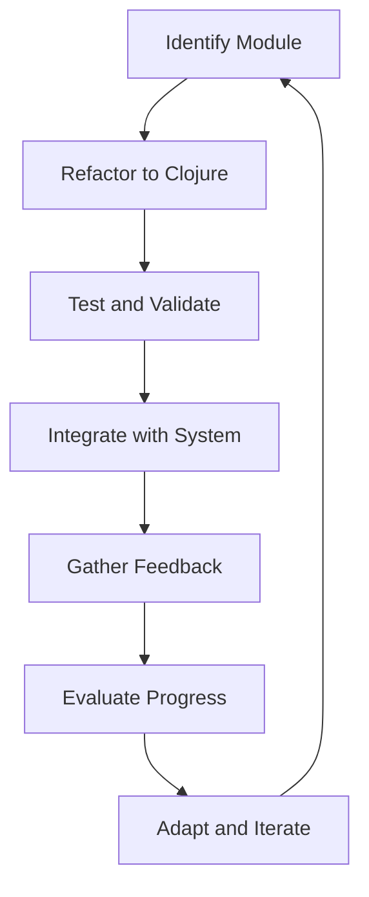

## 21.2 Incremental Improvements: Mastering the Transition from Java OOP to Clojure

Transitioning from Java's Object-Oriented Programming (OOP) paradigm to Clojure's functional programming model can be a daunting task for any enterprise. However, by focusing on incremental improvements, you can make this transition smoother and more manageable. In this section, we will explore the concept of incremental improvements, how they can be applied to your migration strategy, and the benefits they bring to your development process.

### Understanding Incremental Improvements

Incremental improvements involve making small, manageable changes over time rather than attempting a complete overhaul all at once. This approach aligns well with the principles of continuous improvement, which emphasize iterative progress and adaptation. By focusing on incremental improvements, you can:

- **Reduce Risk**: Smaller changes are easier to test and validate, minimizing the risk of introducing significant issues.
- **Enhance Flexibility**: Incremental changes allow for adjustments based on feedback and evolving requirements.
- **Improve Team Morale**: Achieving small wins boosts team confidence and motivation.
- **Facilitate Learning**: Gradual changes provide opportunities for team members to learn and adapt to new paradigms.

### Applying Incremental Improvements to Migration

When migrating from Java OOP to Clojure, incremental improvements can be applied in several ways:

#### 1. Modular Code Refactoring

Begin by identifying modules or components within your Java application that can be refactored independently. This modular approach allows you to isolate changes and test them thoroughly before integrating them into the larger system.

**Java Example:**

```java
public class UserService {
    public User getUserById(String userId) {
        // Fetch user from database
    }

    public void updateUser(User user) {
        // Update user in database
    }
}
```

**Clojure Example:**

```clojure
(ns user-service)

(defn get-user-by-id [user-id]
  ;; Fetch user from database
  )

(defn update-user [user]
  ;; Update user in database
  )
```

In this example, the `UserService` class in Java is refactored into a Clojure namespace with pure functions. This change can be implemented and tested independently before moving on to other components.

#### 2. Gradual Adoption of Functional Concepts

Introduce functional programming concepts gradually. Start by incorporating pure functions and immutability into your existing Java codebase. As your team becomes more comfortable, you can increase the use of higher-order functions and functional composition.

**Java Example:**

```java
public int add(int a, int b) {
    return a + b;
}
```

**Clojure Example:**

```clojure
(defn add [a b]
  (+ a b))
```

By starting with simple functions like `add`, you can familiarize your team with Clojure's syntax and functional style without overwhelming them.

#### 3. Continuous Integration and Testing

Implement continuous integration (CI) practices to ensure that each incremental change is tested and validated. Automated testing frameworks can help catch issues early and provide confidence in the stability of your codebase.

**Clojure Testing Example:**

```clojure
(ns user-service-test
  (:require [clojure.test :refer :all]
            [user-service :refer :all]))

(deftest test-get-user-by-id
  (is (= (get-user-by-id "123") {:id "123" :name "John Doe"})))
```

By writing tests for each function, you can ensure that your incremental changes do not introduce regressions.

#### 4. Leveraging Java Interoperability

Clojure's seamless interoperability with Java allows you to integrate Clojure code into your existing Java applications incrementally. You can call Java methods from Clojure and vice versa, enabling a gradual transition.

**Calling Java from Clojure:**

```clojure
(import 'java.util.Date)

(defn current-time []
  (.toString (Date.)))
```

This example demonstrates how you can use Java's `Date` class within a Clojure function, allowing you to leverage existing Java libraries and code.

### Continuous Improvement Cycles

Continuous improvement cycles are essential for maintaining momentum and ensuring the success of your migration. These cycles involve regular evaluation and adaptation of your processes and practices. Here are some key steps to implement continuous improvement cycles:

#### 1. Set Clear Objectives

Define clear, measurable objectives for each phase of your migration. These objectives should align with your overall migration goals and provide a roadmap for your incremental improvements.

#### 2. Gather Feedback

Regularly gather feedback from your development team and stakeholders. This feedback can provide valuable insights into the effectiveness of your changes and highlight areas for further improvement.

#### 3. Evaluate Progress

Evaluate your progress against your objectives at regular intervals. Use metrics and data to assess the impact of your changes and identify any obstacles or challenges.

#### 4. Adapt and Iterate

Based on your evaluation, adapt your approach and iterate on your improvements. This iterative process allows you to refine your migration strategy and ensure continuous progress.

### Visualizing Incremental Improvements

To better understand the flow of incremental improvements, let's visualize the process using a flowchart.



**Caption:** This flowchart illustrates the cycle of incremental improvements, from identifying a module to refactoring, testing, integrating, gathering feedback, evaluating progress, and iterating.

### Encouraging Team Collaboration

Encouraging collaboration among your development team is crucial for successful incremental improvements. Here are some strategies to foster collaboration:

- **Pair Programming**: Pair programming allows team members to work together, share knowledge, and learn from each other.
- **Code Reviews**: Regular code reviews provide opportunities for feedback and knowledge sharing.
- **Mentorship**: Experienced developers can mentor those new to Clojure, providing guidance and support.

### Try It Yourself

To practice incremental improvements, try refactoring a small Java module into Clojure. Start with a simple class or function, and gradually introduce functional programming concepts. Test your changes thoroughly and gather feedback from your team.

### Knowledge Check

- What are the benefits of incremental improvements in a migration strategy?
- How can continuous improvement cycles enhance the migration process?
- What role does Java interoperability play in incremental improvements?

### Summary

In this section, we've explored the concept of incremental improvements and how they can be applied to your migration from Java OOP to Clojure. By focusing on small, manageable changes and continuous improvement cycles, you can reduce risk, enhance flexibility, and facilitate learning within your team. Remember to leverage Java interoperability, encourage collaboration, and iterate on your improvements to ensure a successful transition.

## **Quiz: Are You Ready to Migrate from Java to Clojure?**



### What is the primary benefit of incremental improvements in a migration strategy?

- [x] Reducing risk by making small, manageable changes
- [ ] Completing the migration faster
- [ ] Avoiding the need for testing
- [ ] Eliminating the need for stakeholder engagement

> **Explanation:** Incremental improvements reduce risk by allowing for small, manageable changes that can be tested and validated independently.

### How can continuous improvement cycles enhance the migration process?

- [x] By providing regular evaluation and adaptation opportunities
- [ ] By eliminating the need for feedback
- [ ] By ensuring all changes are made at once
- [ ] By reducing the need for testing

> **Explanation:** Continuous improvement cycles involve regular evaluation and adaptation, allowing for iterative progress and refinement of the migration strategy.

### What role does Java interoperability play in incremental improvements?

- [x] It allows for gradual integration of Clojure code into existing Java applications
- [ ] It eliminates the need for Java code
- [ ] It requires rewriting all Java code in Clojure
- [ ] It prevents the use of Java libraries

> **Explanation:** Java interoperability allows for the gradual integration of Clojure code into existing Java applications, enabling a smoother transition.

### Which of the following is a key step in implementing continuous improvement cycles?

- [x] Setting clear objectives
- [ ] Avoiding feedback
- [ ] Making all changes at once
- [ ] Eliminating testing

> **Explanation:** Setting clear objectives is a key step in implementing continuous improvement cycles, providing a roadmap for incremental improvements.

### What is the purpose of gathering feedback during the migration process?

- [x] To gain insights into the effectiveness of changes and identify areas for improvement
- [ ] To avoid making changes
- [ ] To eliminate the need for testing
- [ ] To ensure all changes are made at once

> **Explanation:** Gathering feedback provides valuable insights into the effectiveness of changes and highlights areas for further improvement.

### How can pair programming benefit the migration process?

- [x] By allowing team members to work together and share knowledge
- [ ] By eliminating the need for testing
- [ ] By ensuring all changes are made at once
- [ ] By avoiding feedback

> **Explanation:** Pair programming allows team members to collaborate, share knowledge, and learn from each other, enhancing the migration process.

### What is the role of code reviews in incremental improvements?

- [x] Providing opportunities for feedback and knowledge sharing
- [ ] Eliminating the need for testing
- [ ] Ensuring all changes are made at once
- [ ] Avoiding feedback

> **Explanation:** Code reviews provide opportunities for feedback and knowledge sharing, supporting incremental improvements.

### What is a key benefit of modular code refactoring?

- [x] Isolating changes and testing them thoroughly before integration
- [ ] Eliminating the need for testing
- [ ] Ensuring all changes are made at once
- [ ] Avoiding feedback

> **Explanation:** Modular code refactoring allows for isolating changes and testing them thoroughly before integration, reducing risk.

### How can mentorship support the migration process?

- [x] By providing guidance and support to those new to Clojure
- [ ] By eliminating the need for testing
- [ ] By ensuring all changes are made at once
- [ ] By avoiding feedback

> **Explanation:** Mentorship provides guidance and support to those new to Clojure, facilitating learning and adaptation.

### True or False: Incremental improvements eliminate the need for stakeholder engagement.

- [ ] True
- [x] False

> **Explanation:** Incremental improvements do not eliminate the need for stakeholder engagement; they require regular feedback and collaboration with stakeholders.


