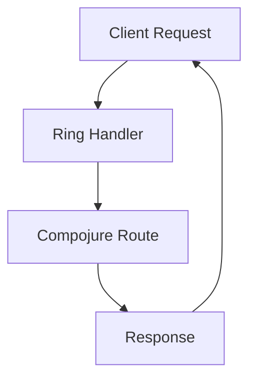

## 21.3 Leveraging Community and Support

Transitioning from Java's Object-Oriented Programming (OOP) to Clojure's functional programming paradigm can be a transformative journey for any enterprise. One of the most powerful assets available to you during this transition is the vibrant and supportive Clojure community. In this section, we will explore how to effectively leverage community resources and support networks to ensure a smooth and successful migration.

### Utilizing Open-Source Resources

Open-source resources are a cornerstone of the Clojure ecosystem. They provide a wealth of tools, libraries, and frameworks that can significantly accelerate your migration process. Let's delve into how you can harness these resources effectively.

#### Exploring Clojure Libraries and Tools

Clojure boasts a rich collection of libraries and tools that cater to various aspects of software development. Here are some key libraries and tools you should consider:

- **Leiningen**: A build automation tool for Clojure, similar to Maven in Java. It simplifies project management, dependency resolution, and build processes.

- **Ring**: A library for building web applications, akin to Java's Servlet API. It provides a simple and flexible way to handle HTTP requests and responses.

- **Compojure**: A routing library for Ring, similar to Java's Spring MVC. It allows you to define routes and handlers in a concise and expressive manner.

- **ClojureScript**: A compiler that targets JavaScript, enabling you to write client-side code in Clojure. It is comparable to Java's GWT (Google Web Toolkit).

- **Re-frame**: A framework for building reactive web applications, similar to Java's Vaadin. It leverages ClojureScript and provides a structured way to manage application state.

- **Datomic**: A distributed database designed for immutability and scalability, offering features that are not typically found in traditional relational databases.

By exploring and integrating these libraries and tools into your projects, you can leverage the collective expertise of the Clojure community and accelerate your development efforts.

#### Contributing to Open-Source Projects

Contributing to open-source projects is an excellent way to deepen your understanding of Clojure and give back to the community. Here are some steps to get started:

1. **Identify Projects of Interest**: Explore popular Clojure projects on platforms like GitHub. Look for projects that align with your interests and expertise.

2. **Engage with the Community**: Join project mailing lists, forums, or chat channels to connect with maintainers and contributors. Introduce yourself and express your interest in contributing.

3. **Start Small**: Begin by addressing small issues or bugs. This will help you familiarize yourself with the project's codebase and development practices.

4. **Submit Pull Requests**: Once you've made changes, submit pull requests for review. Be open to feedback and iterate on your contributions.

5. **Collaborate and Learn**: Engage in discussions with other contributors, share your insights, and learn from their experiences.

By actively participating in open-source projects, you can enhance your skills, build a network of like-minded developers, and contribute to the growth of the Clojure ecosystem.

### Seeking Guidance from the Clojure Community

The Clojure community is known for its inclusivity, friendliness, and willingness to help newcomers. Here are some ways to seek guidance and support from the community:

#### Joining Online Forums and Discussion Groups

Online forums and discussion groups are valuable platforms for connecting with Clojure enthusiasts and experts. Here are some popular options:

- **ClojureVerse**: A community forum where developers discuss Clojure-related topics, share knowledge, and seek advice.

- **Reddit's r/Clojure**: A subreddit dedicated to Clojure, where you can find discussions, news, and resources.

- **Stack Overflow**: A question-and-answer platform where you can ask Clojure-related questions and receive answers from experienced developers.

- **Clojurians Slack**: A Slack workspace with various channels dedicated to different aspects of Clojure development. It's a great place to ask questions, share ideas, and collaborate with others.

By actively participating in these forums and groups, you can gain insights, solve problems, and stay updated on the latest developments in the Clojure ecosystem.

#### Attending Clojure Conferences and Meetups

Conferences and meetups provide opportunities to learn from industry experts, network with peers, and gain inspiration for your projects. Here are some notable events:

- **Clojure/conj**: An annual conference that brings together Clojure developers from around the world. It features talks, workshops, and networking sessions.

- **Clojure/north**: A conference focused on the Clojure community in North America, offering talks and workshops on various topics.

- **Local Meetups**: Many cities have local Clojure meetups where developers gather to discuss projects, share knowledge, and collaborate.

Attending these events can help you stay informed about the latest trends, discover new tools and techniques, and build relationships with fellow developers.

#### Engaging with Clojure Experts and Mentors

Mentorship is a powerful way to accelerate your learning and development. Here are some ways to engage with Clojure experts and mentors:

- **Seek Out Mentors**: Identify experienced Clojure developers who are willing to mentor you. Reach out to them with specific questions or challenges you're facing.

- **Participate in Pair Programming**: Pair programming sessions with experienced developers can provide valuable insights and feedback on your code.

- **Join Mentorship Programs**: Some organizations and communities offer formal mentorship programs that pair newcomers with experienced developers.

By engaging with mentors, you can gain personalized guidance, receive constructive feedback, and accelerate your journey to becoming a proficient Clojure developer.

### Code Examples

To illustrate the power of leveraging community resources, let's explore some code examples that demonstrate the use of popular Clojure libraries.

#### Example 1: Building a Simple Web Application with Ring and Compojure

```clojure
(ns myapp.core
  (:require [ring.adapter.jetty :refer [run-jetty]]
            [compojure.core :refer [defroutes GET]]
            [compojure.route :as route]))

;; Define routes
(defroutes app-routes
  (GET "/" [] "Welcome to my Clojure web app!")
  (route/not-found "Page not found"))

;; Start the server
(defn -main []
  (run-jetty app-routes {:port 3000}))
```

In this example, we use the Ring library to create a simple web server and Compojure to define routes. This setup is similar to creating a basic web application in Java using servlets and a framework like Spring MVC.

#### Example 2: Managing Application State with Re-frame

```clojure
(ns myapp.core
  (:require [re-frame.core :as rf]))

;; Define a subscription to access application state
(rf/reg-sub
  :get-message
  (fn [db _]
    (:message db)))

;; Define an event to update application state
(rf/reg-event-db
  :set-message
  (fn [db [_ new-message]]
    (assoc db :message new-message)))

;; Initialize application state
(defn init []
  (rf/dispatch-sync [:set-message "Hello, Clojure!"]))

;; Start the application
(defn -main []
  (init)
  (println @(rf/subscribe [:get-message])))
```

In this example, we use the Re-frame library to manage application state in a reactive manner. This approach is similar to using state management libraries in JavaScript frameworks like React.

### Visual Aids

To enhance your understanding of how data flows through Clojure applications, let's explore a flowchart that illustrates the process of handling HTTP requests in a Ring-based web application.



**Figure 1:** Flow of data through a Ring-based web application. The client sends a request, which is handled by a Ring handler. The request is routed using Compojure, and a response is generated and sent back to the client.

### References and Links

For further reading and exploration, here are some reputable resources:

- [Official Clojure Documentation](https://clojure.org/)
- [ClojureDocs](https://clojuredocs.org/)
- [ClojureVerse Community Forum](https://clojureverse.org/)
- [Clojurians Slack](https://clojurians.slack.com/)
- [Clojure on GitHub](https://github.com/clojure)

### Knowledge Check

To reinforce your understanding of leveraging community and support, consider the following questions:

- How can open-source resources accelerate your migration to Clojure?
- What are some effective ways to engage with the Clojure community?
- How can mentorship benefit your transition to Clojure?

### Encouraging Tone

Now that we've explored how to leverage community and support during your migration to Clojure, let's apply these strategies to build a robust network of resources and collaborators. By actively engaging with the Clojure community, you can enhance your skills, gain valuable insights, and contribute to the growth of the ecosystem.

### Quiz: Are You Ready to Migrate from Java to Clojure?



### Which of the following is a build automation tool for Clojure?

- [x] Leiningen
- [ ] Maven
- [ ] Gradle
- [ ] Ant

> **Explanation:** Leiningen is a build automation tool specifically designed for Clojure, similar to Maven for Java.

### What is the purpose of the Ring library in Clojure?

- [x] To handle HTTP requests and responses
- [ ] To manage application state
- [ ] To compile Clojure to JavaScript
- [ ] To perform database operations

> **Explanation:** Ring is a library for building web applications in Clojure, providing a simple way to handle HTTP requests and responses.

### How can you contribute to open-source Clojure projects?

- [x] By submitting pull requests
- [ ] By attending conferences
- [ ] By writing blog posts
- [ ] By using the libraries

> **Explanation:** Contributing to open-source projects involves submitting pull requests with code changes or improvements.

### What is the ClojureVerse?

- [x] A community forum for Clojure developers
- [ ] A Clojure library for web development
- [ ] A Clojure-based database
- [ ] A Clojure conference

> **Explanation:** ClojureVerse is a community forum where Clojure developers discuss topics, share knowledge, and seek advice.

### Which library is used for routing in Clojure web applications?

- [x] Compojure
- [ ] Re-frame
- [ ] Datomic
- [ ] ClojureScript

> **Explanation:** Compojure is a routing library for Ring, used to define routes and handlers in Clojure web applications.

### What is the benefit of attending Clojure conferences?

- [x] Networking with peers and learning from experts
- [ ] Receiving free Clojure books
- [ ] Getting discounts on Clojure tools
- [ ] Accessing exclusive Clojure libraries

> **Explanation:** Attending conferences provides opportunities to network with peers, learn from industry experts, and gain inspiration for projects.

### How can mentorship accelerate your learning in Clojure?

- [x] By providing personalized guidance and feedback
- [ ] By offering free Clojure tools
- [ ] By writing code for you
- [ ] By attending conferences on your behalf

> **Explanation:** Mentorship provides personalized guidance and feedback, helping you learn and grow as a Clojure developer.

### What is the role of Re-frame in Clojure applications?

- [x] To manage application state in a reactive manner
- [ ] To handle HTTP requests
- [ ] To compile Clojure to JavaScript
- [ ] To perform database operations

> **Explanation:** Re-frame is a framework for managing application state in a reactive manner, similar to state management libraries in JavaScript frameworks.

### How can you engage with the Clojure community online?

- [x] By joining forums and discussion groups
- [ ] By attending local meetups
- [ ] By writing Clojure books
- [ ] By developing proprietary Clojure tools

> **Explanation:** Engaging with the community online involves joining forums and discussion groups to connect with other Clojure developers.

### True or False: Contributing to open-source projects can help you build a network of like-minded developers.

- [x] True
- [ ] False

> **Explanation:** Contributing to open-source projects allows you to connect with other developers, share insights, and build a network of collaborators.



By leveraging the Clojure community and support networks, you can navigate the challenges of migrating from Java to Clojure with confidence and success. Embrace the collaborative spirit of the community, and you'll find yourself well-equipped to tackle any obstacles that come your way.
