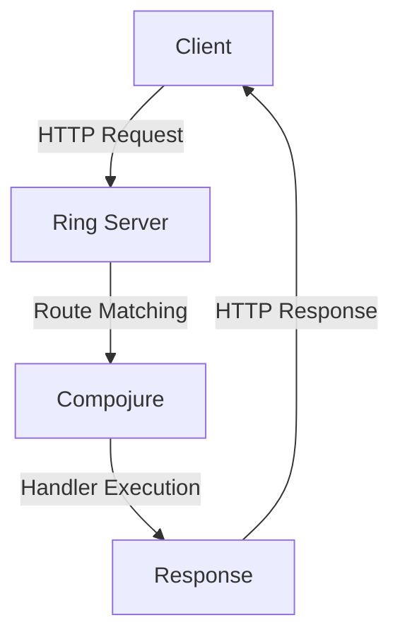

## 21.3 Leveraging Community and Support

Transitioning from Java's Object-Oriented Programming (OOP) to Clojure's functional paradigm is a significant shift that can be both challenging and rewarding. One of the most effective strategies to ensure a smooth transition is to leverage the vibrant Clojure community and the wealth of open-source resources available. In this section, we will explore how to utilize these resources and seek guidance from the Clojure community to enhance your migration process.

### Utilizing Open-Source Resources

Open-source resources are invaluable when migrating to a new programming paradigm. They provide access to a wide range of tools, libraries, and frameworks that can simplify the transition process. Here are some key open-source resources to consider:

#### Clojure Libraries and Frameworks

Clojure boasts a rich ecosystem of libraries and frameworks that can help you build robust applications. Some popular libraries include:

- **Ring**: A Clojure web applications library that provides a simple and flexible way to handle HTTP requests and responses.
- **Compojure**: A routing library for Ring that allows you to define routes in a concise and expressive manner.
- **Luminus**: A framework for building web applications in Clojure, offering a comprehensive set of tools and libraries to streamline development.

These libraries can significantly reduce the time and effort required to build applications in Clojure. For more information on Clojure libraries, visit the [Clojure Libraries](https://clojure.org/libraries) page.

#### Open-Source Projects

Engaging with open-source projects can provide practical insights into how Clojure is used in real-world applications. By contributing to these projects, you can gain hands-on experience and learn best practices from seasoned Clojure developers. Some notable open-source projects include:

- **ClojureScript**: A compiler for Clojure that targets JavaScript, enabling you to write Clojure code that runs in the browser.
- **Pedestal**: A set of libraries for building web applications in Clojure, focusing on simplicity and performance.

Exploring these projects can deepen your understanding of Clojure and its capabilities. You can find a list of open-source Clojure projects on [GitHub](https://github.com/clojure).

#### Documentation and Tutorials

Comprehensive documentation and tutorials are essential for mastering any new technology. The Clojure community has produced a wealth of high-quality resources, including:

- **Clojure Documentation**: The official documentation provides detailed information on Clojure's syntax, data structures, and core functions. Access it at [Clojure Documentation](https://clojure.org/reference).
- **ClojureBridge**: An initiative to increase diversity in the Clojure community by providing free workshops and resources for underrepresented groups. Learn more at [ClojureBridge](https://www.clojurebridge.org/).

These resources can help you build a solid foundation in Clojure and accelerate your learning process.

### Seeking Guidance from the Clojure Community

The Clojure community is known for its welcoming and supportive nature. Engaging with the community can provide valuable insights, feedback, and encouragement as you navigate the migration process. Here are some ways to connect with the Clojure community:

#### Online Forums and Discussion Groups

Participating in online forums and discussion groups is a great way to connect with other Clojure developers, ask questions, and share knowledge. Some popular platforms include:

- **ClojureVerse**: A community forum where Clojure enthusiasts discuss various topics, share projects, and seek advice. Join the conversation at [ClojureVerse](https://clojureverse.org/).
- **Reddit**: The Clojure subreddit is a vibrant community where developers share news, tutorials, and discussions related to Clojure. Visit [r/Clojure](https://www.reddit.com/r/Clojure/) to participate.

These platforms offer a wealth of information and can help you stay updated on the latest developments in the Clojure ecosystem.

#### Meetups and Conferences

Attending meetups and conferences is an excellent way to network with other Clojure developers and learn from experts in the field. Some notable events include:

- **Clojure/conj**: An annual conference that brings together Clojure developers from around the world to share knowledge and experiences. Learn more at [Clojure/conj](https://clojure.org/community/conferences).
- **Local Meetups**: Many cities have local Clojure meetups where developers gather to discuss projects, share insights, and collaborate. Check platforms like [Meetup.com](https://www.meetup.com/) to find events near you.

These events provide opportunities to learn from experienced developers and gain new perspectives on Clojure development.

#### Mentorship and Pair Programming

Mentorship and pair programming are powerful tools for accelerating your learning and gaining practical experience. By working closely with experienced Clojure developers, you can receive personalized guidance and feedback. Consider the following approaches:

- **Mentorship Programs**: Some organizations and communities offer formal mentorship programs where experienced developers guide newcomers through the learning process.
- **Pair Programming**: Collaborating with another developer on a project can help you learn new techniques, improve your coding skills, and gain confidence in your abilities.

These approaches can help you build a strong foundation in Clojure and develop the skills needed for a successful migration.

### Code Examples and Exercises

To reinforce your understanding of Clojure and its community resources, let's explore some practical code examples and exercises.

#### Example: Building a Simple Web Application with Ring and Compojure

```clojure
(ns myapp.core
  (:require [ring.adapter.jetty :refer [run-jetty]]
            [compojure.core :refer [defroutes GET]]
            [compojure.route :as route]))

;; Define routes
(defroutes app-routes
  (GET "/" [] "Welcome to my Clojure web app!")
  (route/not-found "Page not found"))

;; Start the server
(defn -main []
  (run-jetty app-routes {:port 3000}))
```

In this example, we use Ring and Compojure to create a simple web application that responds with a welcome message. The `GET` route defines the endpoint, and `run-jetty` starts the server on port 3000.

**Try It Yourself:** Modify the code to add a new route that returns a personalized greeting based on a query parameter.

#### Exercise: Contribute to an Open-Source Clojure Project

1. Choose an open-source Clojure project on GitHub that interests you.
2. Clone the repository and explore the codebase.
3. Identify an issue or feature request that you can work on.
4. Implement the changes and submit a pull request.

This exercise will help you gain practical experience with Clojure and contribute to the community.

### Visual Aids

To better understand the flow of data and interactions within a Clojure web application, let's examine a simple architecture diagram:



**Diagram Description:** This diagram illustrates the flow of an HTTP request from the client to the Ring server, where it is matched to a route by Compojure. The handler executes the request and returns a response to the client.

### References and Links

- [Clojure Official Documentation](https://clojure.org/reference)
- [Clojure Community Resources](https://clojure.org/community/resources)
- [Transitioning from OOP to Functional Programming](https://www.lispcast.com/oo-to-fp/)
- [Clojure Libraries](https://clojure.org/libraries)
- [ClojureVerse](https://clojureverse.org/)
- [Clojure/conj](https://clojure.org/community/conferences)

### Knowledge Check

To ensure you've grasped the key concepts covered in this section, consider the following questions:

1. What are some popular Clojure libraries that can aid in building web applications?
2. How can contributing to open-source projects benefit your Clojure learning journey?
3. What are some platforms where you can connect with the Clojure community?
4. How can mentorship and pair programming accelerate your transition to Clojure?

### Encouraging Engagement

Embracing functional programming with Clojure can be challenging, but with each step, you'll gain a deeper understanding and see tangible benefits in your codebase. Remember to leverage the community and support networks available to you, as they can provide invaluable guidance and encouragement throughout your journey.

### Best Practices for Tags

- "Clojure"
- "Java"
- "Functional Programming"
- "Migration"
- "Open Source"
- "Community Support"
- "Enterprise Transition"
- "Software Development"

### Quiz: Are You Ready to Migrate from Java to Clojure?



### What is a key benefit of using open-source resources during migration?

- [x] Access to a wide range of tools and libraries
- [ ] Guaranteed bug-free software
- [ ] Automatic code conversion
- [ ] Free technical support

> **Explanation:** Open-source resources provide access to a wide range of tools and libraries that can simplify the transition process.

### Which Clojure library is commonly used for routing in web applications?

- [x] Compojure
- [ ] Ring
- [ ] Luminus
- [ ] Pedestal

> **Explanation:** Compojure is a routing library for Ring that allows you to define routes in a concise and expressive manner.

### How can contributing to open-source projects benefit your learning?

- [x] Gain hands-on experience
- [ ] Ensure job security
- [ ] Avoid learning new concepts
- [ ] Guarantee high salaries

> **Explanation:** Contributing to open-source projects allows you to gain hands-on experience and learn best practices from seasoned developers.

### What is ClojureVerse?

- [x] A community forum for Clojure enthusiasts
- [ ] A Clojure web framework
- [ ] A Clojure IDE
- [ ] A Clojure compiler

> **Explanation:** ClojureVerse is a community forum where Clojure enthusiasts discuss various topics, share projects, and seek advice.

### What is the purpose of Clojure/conj?

- [x] An annual conference for Clojure developers
- [ ] A Clojure testing framework
- [ ] A Clojure build tool
- [ ] A Clojure library for data processing

> **Explanation:** Clojure/conj is an annual conference that brings together Clojure developers from around the world to share knowledge and experiences.

### How can mentorship accelerate your transition to Clojure?

- [x] Personalized guidance and feedback
- [ ] Guaranteed job placement
- [ ] Automatic code generation
- [ ] Free software licenses

> **Explanation:** Mentorship provides personalized guidance and feedback, helping you build a strong foundation in Clojure.

### What is a benefit of pair programming?

- [x] Learn new techniques and improve coding skills
- [ ] Avoid writing tests
- [ ] Reduce code quality
- [ ] Increase development time

> **Explanation:** Pair programming allows you to learn new techniques, improve your coding skills, and gain confidence in your abilities.

### What is the role of Ring in a Clojure web application?

- [x] Handle HTTP requests and responses
- [ ] Provide database connectivity
- [ ] Generate user interfaces
- [ ] Manage application state

> **Explanation:** Ring is a Clojure web applications library that provides a simple and flexible way to handle HTTP requests and responses.

### How can local meetups benefit your Clojure journey?

- [x] Network with other developers and learn from experts
- [ ] Guarantee project funding
- [ ] Avoid learning new concepts
- [ ] Ensure high salaries

> **Explanation:** Local meetups provide opportunities to network with other developers and learn from experts in the field.

### True or False: The Clojure community is known for being welcoming and supportive.

- [x] True
- [ ] False

> **Explanation:** The Clojure community is known for its welcoming and supportive nature, providing valuable insights and encouragement to newcomers.



By leveraging the community and support networks available, you can navigate the transition from Java OOP to Clojure with confidence and success. Embrace the resources and opportunities provided by the Clojure ecosystem, and you'll find yourself well-equipped to tackle the challenges and reap the rewards of functional programming.
