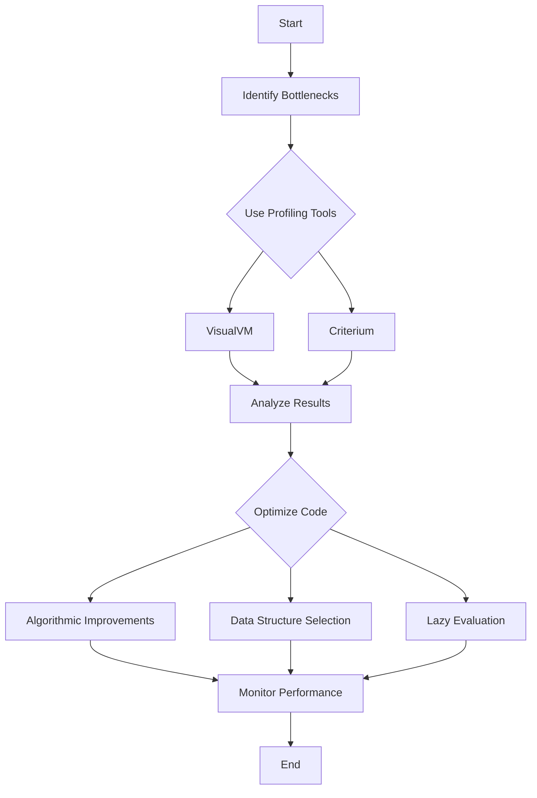

## 22.1 Profiling and Optimization Tools

In the realm of software development, performance optimization is a critical aspect that ensures applications run efficiently and effectively. As you transition from Java Object-Oriented Programming (OOP) to Clojure's functional programming paradigm, understanding how to identify and resolve performance bottlenecks becomes essential. This section delves into the tools and techniques available for profiling and optimizing Clojure applications, drawing parallels with familiar Java OOP practices to facilitate a smooth transition.

### Identifying Performance Bottlenecks

Before diving into specific tools, it's important to understand the concept of performance bottlenecks. These are points in your application where the performance is significantly hindered, often due to inefficient code or resource constraints. Identifying these bottlenecks is the first step towards optimization.

#### Key Concepts in Performance Bottleneck Identification

1. **Latency vs. Throughput**: 
   - **Latency** refers to the time taken to process a single request or operation.
   - **Throughput** is the number of operations processed in a given time frame.
   - In Clojure, as in Java, balancing these two aspects is crucial for optimal performance.

2. **Resource Utilization**: 
   - Monitor CPU, memory, and I/O usage to identify areas where resources are over or under-utilized.
   - Clojure's immutable data structures can sometimes lead to increased memory usage, which needs careful management.

3. **Concurrency and Parallelism**: 
   - Clojure offers powerful concurrency primitives, but improper use can lead to contention and reduced performance.
   - Understanding how to leverage Clojure's concurrency models is key to optimizing performance.

### Profiling Tools for Clojure

Profiling tools help you analyze your application's performance by providing insights into execution time, memory usage, and more. Here, we explore some of the most effective tools for profiling Clojure applications.

#### VisualVM

VisualVM is a versatile tool that provides a visual interface for monitoring and troubleshooting Java applications. It can be used to profile Clojure applications running on the Java Virtual Machine (JVM).

- **Installation and Setup**: 
  - VisualVM can be downloaded from the [official website](https://visualvm.github.io/).
  - Ensure your Clojure application is running on the JVM to utilize VisualVM effectively.

- **Key Features**:
  - **CPU Profiling**: Identify methods consuming the most CPU time.
  - **Memory Profiling**: Analyze memory usage and detect memory leaks.
  - **Thread Analysis**: Monitor thread activity and detect deadlocks.

- **Using VisualVM with Clojure**:
  - Launch VisualVM and connect it to your running Clojure application.
  - Use the "Sampler" tab to start CPU and memory profiling.
  - Analyze the collected data to identify performance bottlenecks.

```java
// Java code example for setting up VisualVM with a Clojure application
public class ClojureApp {
    public static void main(String[] args) {
        // Start your Clojure application
        // VisualVM will automatically detect the running JVM process
    }
}
```

#### Criterium

Criterium is a benchmarking library specifically designed for Clojure. It provides precise and reliable performance measurements, making it an invaluable tool for optimizing Clojure code.

- **Installation**:
  - Add Criterium to your project dependencies in `project.clj` or `deps.edn`.
  - Example for Leiningen:
    ```clojure
    :dependencies [[criterium "0.4.6"]]
    ```

- **Key Features**:
  - **Accurate Timing**: Uses statistical techniques to provide accurate timing results.
  - **Warm-up Runs**: Performs warm-up runs to mitigate JVM optimizations affecting results.
  - **Detailed Reports**: Generates detailed reports with statistical analysis.

- **Using Criterium**:
  - Import Criterium in your Clojure code and use the `bench` function to benchmark specific functions or expressions.
  
```clojure
(ns myapp.core
  (:require [criterium.core :refer [bench]]))

(defn example-function []
  (reduce + (range 1000)))

;; Benchmark the function
(bench (example-function))
```

### Optimization Techniques

Once you've identified performance bottlenecks using profiling tools, the next step is to apply optimization techniques to improve your application's performance.

#### Code Optimization

1. **Algorithmic Improvements**:
   - Analyze the complexity of your algorithms and seek more efficient alternatives.
   - For example, replacing a nested loop with a more efficient data structure can significantly reduce execution time.

2. **Data Structure Selection**:
   - Choose appropriate data structures for your use case. Clojure's persistent data structures offer immutability but may not always be the most efficient choice for all scenarios.
   - Consider using transient data structures for performance-critical sections.

3. **Lazy Evaluation**:
   - Leverage Clojure's lazy sequences to defer computation until necessary, reducing memory usage and improving performance.

#### JVM Optimization

1. **Garbage Collection Tuning**:
   - Adjust JVM garbage collection settings to optimize memory management for your Clojure application.
   - Use flags like `-Xmx` and `-Xms` to set heap size limits.

2. **JIT Compilation**:
   - The JVM's Just-In-Time (JIT) compiler can optimize frequently executed code paths. Ensure your application is structured to benefit from these optimizations.

3. **Profiling and Monitoring**:
   - Continuously profile and monitor your application in production to identify new bottlenecks as they arise.

### Visual Aids: Understanding Performance Bottlenecks

To visualize the process of identifying and resolving performance bottlenecks, let's consider a flowchart that outlines the steps involved:



**Diagram Description**: This flowchart illustrates the process of identifying performance bottlenecks using profiling tools like VisualVM and Criterium, followed by code optimization techniques and continuous monitoring.

### References and Further Reading

- [Clojure Official Documentation](https://clojure.org/reference)
- [VisualVM Official Website](https://visualvm.github.io/)
- [Criterium GitHub Repository](https://github.com/hugoduncan/criterium)
- [Java Performance Tuning](https://www.oracle.com/java/technologies/javase/performance.html)
- [Transitioning from OOP to Functional Programming](https://www.lispcast.com/oo-to-fp/)

### Knowledge Check

To reinforce your understanding of profiling and optimization tools in Clojure, consider the following questions:

1. What are the key differences between latency and throughput?
2. How can VisualVM be used to profile a Clojure application?
3. What are some common performance bottlenecks in Clojure applications?
4. How does Criterium ensure accurate benchmarking results?
5. What are some JVM optimization techniques that can be applied to Clojure applications?

### Encouraging Engagement

Embracing functional programming and optimizing performance can be challenging, but with each step, you'll gain a deeper understanding and see tangible benefits in your codebase. Experiment with the tools and techniques discussed in this section to enhance your Clojure applications.

### Quiz: Are You Ready to Migrate from Java to Clojure?



### What is the primary purpose of profiling tools in software development?

- [x] To identify performance bottlenecks
- [ ] To write new code
- [ ] To manage version control
- [ ] To deploy applications

> **Explanation:** Profiling tools are used to identify performance bottlenecks by analyzing execution time, memory usage, and other metrics.

### Which tool is specifically designed for benchmarking Clojure code?

- [ ] VisualVM
- [x] Criterium
- [ ] JProfiler
- [ ] YourKit

> **Explanation:** Criterium is a benchmarking library specifically designed for Clojure, providing precise performance measurements.

### What is the benefit of using lazy evaluation in Clojure?

- [x] Reduces memory usage and improves performance
- [ ] Increases code complexity
- [ ] Decreases execution speed
- [ ] Increases memory usage

> **Explanation:** Lazy evaluation defers computation until necessary, reducing memory usage and improving performance.

### How can VisualVM help in optimizing Clojure applications?

- [x] By providing CPU and memory profiling
- [ ] By writing new code
- [ ] By managing dependencies
- [ ] By deploying applications

> **Explanation:** VisualVM provides CPU and memory profiling, helping to identify performance bottlenecks in Clojure applications.

### What does the `bench` function in Criterium do?

- [x] Benchmarks specific functions or expressions
- [ ] Compiles Clojure code
- [ ] Manages dependencies
- [ ] Deploys applications

> **Explanation:** The `bench` function in Criterium is used to benchmark specific functions or expressions, providing performance insights.

### Which of the following is a JVM optimization technique?

- [x] Garbage collection tuning
- [ ] Writing new code
- [ ] Managing version control
- [ ] Deploying applications

> **Explanation:** Garbage collection tuning is a JVM optimization technique that helps manage memory more efficiently.

### What is the role of the JIT compiler in JVM optimization?

- [x] Optimizes frequently executed code paths
- [ ] Manages dependencies
- [ ] Writes new code
- [ ] Deploys applications

> **Explanation:** The JIT compiler optimizes frequently executed code paths, improving application performance.

### What is a common performance bottleneck in Clojure applications?

- [x] Inefficient use of immutable data structures
- [ ] Lack of version control
- [ ] Poor code readability
- [ ] Excessive commenting

> **Explanation:** Inefficient use of immutable data structures can lead to increased memory usage, a common performance bottleneck in Clojure applications.

### How can you monitor thread activity in a Clojure application?

- [x] Using VisualVM's thread analysis feature
- [ ] Writing new code
- [ ] Managing dependencies
- [ ] Deploying applications

> **Explanation:** VisualVM's thread analysis feature allows you to monitor thread activity and detect deadlocks in a Clojure application.

### True or False: Clojure's concurrency primitives can lead to contention if used improperly.

- [x] True
- [ ] False

> **Explanation:** Clojure's concurrency primitives can lead to contention and reduced performance if not used correctly.



By understanding and utilizing these profiling and optimization tools, you can significantly enhance the performance of your Clojure applications, ensuring they run efficiently and effectively in an enterprise environment.
