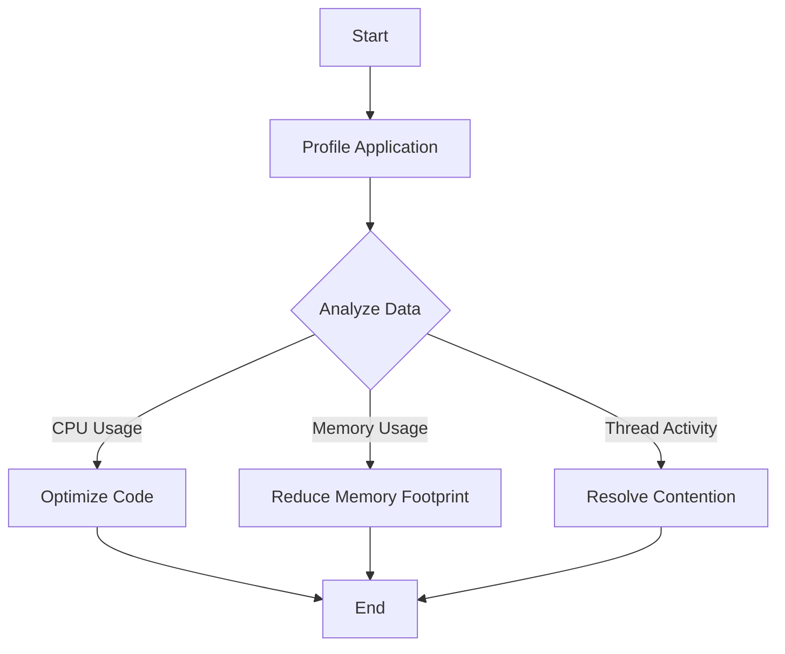
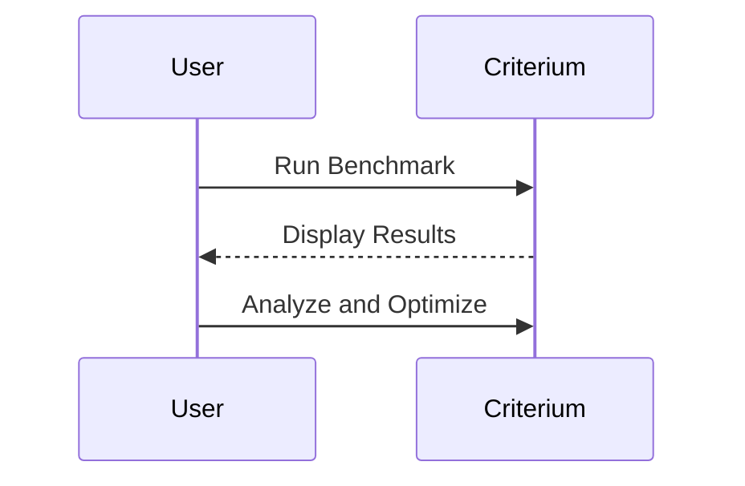

## 22.1 Profiling and Optimization Tools

As we transition from Java to Clojure, understanding how to effectively profile and optimize our applications is crucial for maintaining and enhancing performance. In this section, we will explore various tools and techniques to identify performance bottlenecks and optimize Clojure applications. We will draw parallels with Java profiling tools and introduce Clojure-specific tools like Criterium. By the end of this section, you will be equipped with the knowledge to ensure your Clojure applications run efficiently and effectively.

### Identifying Performance Bottlenecks

Before diving into specific tools, it's essential to understand the concept of performance bottlenecks. A bottleneck is a point in the application where the performance is limited by a single component, causing the entire system to slow down. Identifying these bottlenecks is the first step in optimization.

#### Common Bottlenecks in Clojure

1. **Inefficient Algorithms**: Algorithms that are not optimized for performance can slow down your application.
2. **Excessive Memory Usage**: High memory consumption can lead to frequent garbage collection, impacting performance.
3. **Concurrency Issues**: Improper handling of concurrency can lead to contention and slowdowns.
4. **I/O Operations**: Slow input/output operations can be a significant bottleneck, especially in data-intensive applications.

### Profiling Tools

Profiling tools help us identify where our application spends most of its time and resources. Let's explore some of the tools available for profiling Clojure applications.

#### VisualVM

VisualVM is a powerful tool for profiling Java applications, and since Clojure runs on the JVM, it can be used to profile Clojure applications as well. VisualVM provides insights into CPU usage, memory consumption, thread activity, and more.

##### Setting Up VisualVM

1. **Download and Install**: VisualVM can be downloaded from its [official website](https://visualvm.github.io/).
2. **Configure for Clojure**: Ensure your Clojure application is running with the necessary JVM arguments to enable JMX (Java Management Extensions) for monitoring.
3. **Connect to Application**: Use VisualVM to connect to your running Clojure application and start profiling.

##### Using VisualVM

- **CPU Profiling**: Identify methods consuming the most CPU time.
- **Memory Profiling**: Analyze memory usage and detect memory leaks.
- **Thread Analysis**: Monitor thread activity and identify deadlocks or contention.

```java
// Java Example: Profiling a simple Java application
public class Example {
    public static void main(String[] args) {
        while (true) {
            performTask();
        }
    }

    private static void performTask() {
        // Simulate a task
        try {
            Thread.sleep(100);
        } catch (InterruptedException e) {
            e.printStackTrace();
        }
    }
}
```

```clojure
;; Clojure Example: Profiling a simple Clojure application
(defn perform-task []
  ;; Simulate a task
  (Thread/sleep 100))

(defn -main []
  (while true
    (perform-task)))
```

##### Visualizing Data with VisualVM

VisualVM provides various visualizations to help you understand your application's performance. Use these visualizations to pinpoint bottlenecks and areas for optimization.



*Diagram: Workflow of Profiling and Optimization with VisualVM.*

### Criterium

Criterium is a Clojure-specific benchmarking library that provides accurate and reliable performance measurements. It is particularly useful for micro-benchmarking individual functions or code blocks.

#### Setting Up Criterium

1. **Add Dependency**: Include Criterium in your `project.clj` or `deps.edn` file.
   ```clojure
   ;; Leiningen
   [criterium "0.4.6"]

   ;; deps.edn
   {:deps {criterium {:mvn/version "0.4.6"}}}
   ```

2. **Require Criterium**: Use the `criterium.core` namespace in your Clojure code.
   ```clojure
   (require '[criterium.core :refer [quick-bench]])
   ```

#### Using Criterium

- **Benchmarking Functions**: Use `quick-bench` to measure the performance of a function.
- **Statistical Analysis**: Criterium provides statistical analysis of the benchmark results, including mean, median, and standard deviation.

```clojure
;; Example: Benchmarking a Clojure function
(defn example-function [n]
  (reduce + (range n)))

(quick-bench (example-function 10000))
```

#### Interpreting Criterium Results

Criterium provides detailed output, including execution time, standard deviation, and garbage collection impact. Use this information to identify performance improvements.



*Diagram: Interaction between User and Criterium during benchmarking.*

### Comparing VisualVM and Criterium

While VisualVM provides a broad overview of application performance, Criterium focuses on micro-benchmarking specific functions. Use VisualVM for high-level profiling and Criterium for detailed function-level analysis.

| Feature         | VisualVM                        | Criterium                         |
|-----------------|---------------------------------|-----------------------------------|
| **Scope**       | Application-wide profiling      | Function-level benchmarking       |
| **Usage**       | CPU, memory, thread analysis    | Execution time, statistical analysis |
| **Setup**       | Requires JVM setup              | Simple Clojure dependency         |
| **Output**      | Visual graphs and reports       | Detailed statistical data         |

### Best Practices for Profiling and Optimization

1. **Profile Before Optimizing**: Always profile your application before making optimizations to ensure you are addressing the right issues.
2. **Focus on Hotspots**: Concentrate on optimizing the parts of your code that consume the most resources.
3. **Iterative Approach**: Optimize in small increments and re-profile after each change to measure the impact.
4. **Consider Trade-offs**: Optimization can sometimes lead to increased complexity. Balance performance gains with maintainability.

### Knowledge Check

- **What are common performance bottlenecks in Clojure applications?**
- **How does VisualVM help in profiling Clojure applications?**
- **What is the primary use of Criterium in Clojure?**
- **Why is it important to profile before optimizing?**

### Try It Yourself

Experiment with VisualVM and Criterium by profiling a sample Clojure application. Modify the code to introduce inefficiencies and observe how the tools help identify them. Try optimizing the code and re-profiling to see the improvements.

### Further Reading

- [Official VisualVM Documentation](https://visualvm.github.io/)
- [Criterium GitHub Repository](https://github.com/hugoduncan/criterium)
- [Clojure Performance Tips](https://clojure.org/guides/performance)

## **Quiz: Are You Ready to Migrate from Java to Clojure?**



### What is a performance bottleneck?

- [x] A point in the application where performance is limited by a single component
- [ ] A tool used for profiling applications
- [ ] A type of Clojure data structure
- [ ] A method for optimizing code

> **Explanation:** A performance bottleneck is a point in the application where performance is limited by a single component, causing the entire system to slow down.

### Which tool provides application-wide profiling for Clojure applications?

- [x] VisualVM
- [ ] Criterium
- [ ] Leiningen
- [ ] deps.edn

> **Explanation:** VisualVM provides application-wide profiling, including CPU, memory, and thread analysis.

### What is the primary focus of Criterium?

- [ ] Application-wide profiling
- [x] Function-level benchmarking
- [ ] Memory leak detection
- [ ] Thread analysis

> **Explanation:** Criterium focuses on function-level benchmarking, providing detailed statistical analysis of execution time.

### Why is it important to profile before optimizing?

- [x] To ensure you are addressing the right issues
- [ ] To increase code complexity
- [ ] To reduce application size
- [ ] To improve code readability

> **Explanation:** Profiling before optimizing ensures you are addressing the right issues and not making unnecessary changes.

### What should you focus on when optimizing code?

- [x] Hotspots that consume the most resources
- [ ] All parts of the code equally
- [ ] Only the user interface
- [ ] Only the database queries

> **Explanation:** Focus on hotspots that consume the most resources to achieve the most significant performance improvements.

### What is a common trade-off when optimizing code?

- [x] Increased complexity
- [ ] Decreased performance
- [ ] Improved readability
- [ ] Reduced functionality

> **Explanation:** Optimization can sometimes lead to increased complexity, so it's important to balance performance gains with maintainability.

### How can VisualVM help with thread analysis?

- [x] By monitoring thread activity and identifying deadlocks
- [ ] By reducing thread count
- [ ] By increasing thread priority
- [ ] By disabling threads

> **Explanation:** VisualVM helps with thread analysis by monitoring thread activity and identifying deadlocks or contention.

### What is the role of statistical analysis in Criterium?

- [x] To provide detailed insights into execution time and variability
- [ ] To simplify code
- [ ] To increase execution speed
- [ ] To reduce memory usage

> **Explanation:** Statistical analysis in Criterium provides detailed insights into execution time and variability, helping identify performance improvements.

### Which tool requires JVM setup for profiling?

- [x] VisualVM
- [ ] Criterium
- [ ] Leiningen
- [ ] deps.edn

> **Explanation:** VisualVM requires JVM setup to enable JMX for monitoring and profiling applications.

### True or False: Criterium can be used for application-wide profiling.

- [ ] True
- [x] False

> **Explanation:** Criterium is used for function-level benchmarking, not application-wide profiling.



By understanding and utilizing these profiling and optimization tools, you can ensure your Clojure applications are running at peak performance, providing a seamless transition from Java OOP to Clojure's functional paradigm.
