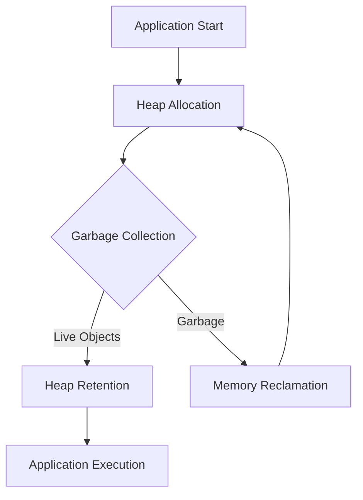

## 22.2 JVM Tuning for Clojure Applications

As we transition from Java's object-oriented paradigm to Clojure's functional programming model, understanding how to optimize the Java Virtual Machine (JVM) for Clojure applications becomes crucial. Clojure runs on the JVM, and while it inherits many of Java's strengths, it also introduces unique characteristics that require specific tuning strategies. In this section, we'll delve into JVM tuning techniques tailored for Clojure, focusing on garbage collection strategies, memory management, and JVM settings to enhance performance.

### Understanding JVM and Clojure

Before diving into tuning, let's briefly revisit how Clojure interacts with the JVM. Clojure is a dynamic, functional language that compiles to JVM bytecode, allowing it to leverage the JVM's robust ecosystem. However, Clojure's emphasis on immutability and functional constructs can lead to different performance considerations compared to Java.

#### Key Differences:
- **Immutability**: Clojure's immutable data structures can lead to increased memory usage and garbage collection activity.
- **Functional Paradigm**: Higher-order functions and lazy sequences may impact execution patterns and memory allocation.

### JVM Tuning Essentials

JVM tuning involves adjusting various parameters to optimize performance, particularly in terms of memory management and garbage collection. Let's explore these aspects in detail.

#### Memory Management

Memory management is a critical component of JVM tuning. It involves configuring heap size, stack size, and other memory-related parameters to ensure efficient resource utilization.

##### Heap Size Configuration

The heap is where all Java objects reside, and its size can significantly impact application performance. Clojure applications, with their immutable data structures, may require different heap configurations compared to Java applications.

- **Initial Heap Size (`-Xms`)**: Set this to a value that minimizes the need for frequent resizing. A good starting point is 50% of the maximum heap size.
- **Maximum Heap Size (`-Xmx`)**: Determine this based on your application's memory requirements and available system resources. Monitor memory usage to adjust as needed.

```shell
# Example JVM options for heap size
java -Xms512m -Xmx2048m -jar your-clojure-app.jar
```

##### Stack Size Configuration

The stack size (`-Xss`) determines the memory allocated for each thread's stack. Clojure's use of recursion and functional constructs may necessitate larger stack sizes.

- **Default Stack Size**: The default is often sufficient, but if you encounter `StackOverflowError`, consider increasing it.

```shell
# Example JVM option for stack size
java -Xss1m -jar your-clojure-app.jar
```

#### Garbage Collection Strategies

Garbage collection (GC) is the process of reclaiming memory occupied by objects that are no longer in use. Clojure's functional nature can lead to frequent object creation, making GC tuning essential.

##### Choosing the Right Garbage Collector

The JVM offers several garbage collectors, each with its strengths and trade-offs. Selecting the right one depends on your application's characteristics and performance goals.

- **G1 Garbage Collector**: Suitable for applications with large heaps and low-latency requirements. It divides the heap into regions and performs incremental collections.
- **Z Garbage Collector (ZGC)**: Designed for low-latency applications, ZGC handles large heaps efficiently with minimal pause times.
- **Shenandoah**: Another low-pause-time collector, Shenandoah is ideal for applications requiring consistent response times.

```shell
# Example JVM options for G1 Garbage Collector
java -XX:+UseG1GC -jar your-clojure-app.jar
```

##### Tuning Garbage Collection Parameters

Once you've chosen a garbage collector, fine-tuning its parameters can further optimize performance.

- **Pause Time Goals**: Set pause time goals to balance throughput and latency. For G1, use `-XX:MaxGCPauseMillis`.
- **Heap Region Size**: Adjust the region size for G1 using `-XX:G1HeapRegionSize` to optimize memory allocation.

```shell
# Example JVM options for G1 GC tuning
java -XX:+UseG1GC -XX:MaxGCPauseMillis=200 -XX:G1HeapRegionSize=16m -jar your-clojure-app.jar
```

### Monitoring and Profiling

Effective JVM tuning requires continuous monitoring and profiling to identify bottlenecks and validate improvements.

#### Tools for Monitoring

- **JVisualVM**: A comprehensive tool for monitoring and profiling Java applications. It provides insights into memory usage, GC activity, and thread behavior.
- **JConsole**: A lightweight monitoring tool that offers real-time data on memory consumption and thread activity.

#### Profiling Techniques

Profiling helps identify performance hotspots and optimize code execution.

- **CPU Profiling**: Use tools like YourKit or VisualVM to analyze CPU usage and identify inefficient code paths.
- **Memory Profiling**: Detect memory leaks and excessive allocations using memory profilers.

### Practical Example: Tuning a Clojure Application

Let's walk through a practical example of tuning a Clojure application. We'll use a sample application that processes large datasets, a common scenario in enterprise environments.

#### Step 1: Analyze Memory Usage

Begin by analyzing the application's memory usage to determine appropriate heap size settings.

```shell
# Run the application with initial heap settings
java -Xms512m -Xmx2048m -jar data-processor.jar
```

- **Monitor Memory Usage**: Use JVisualVM to monitor heap usage and identify peak memory consumption.

#### Step 2: Select and Configure Garbage Collector

Based on the application's characteristics, choose a suitable garbage collector. For this example, we'll use the G1 GC.

```shell
# Configure G1 GC with pause time goals
java -XX:+UseG1GC -XX:MaxGCPauseMillis=200 -jar data-processor.jar
```

- **Adjust Parameters**: Fine-tune GC parameters based on observed performance.

#### Step 3: Profile and Optimize Code

Profile the application to identify performance bottlenecks.

- **CPU Profiling**: Use VisualVM to analyze CPU usage and optimize inefficient code paths.
- **Memory Profiling**: Detect and address memory leaks or excessive allocations.

### Try It Yourself

Experiment with the JVM tuning techniques discussed in this section. Modify the heap size, garbage collector, and GC parameters to observe their impact on your Clojure application's performance. Use monitoring and profiling tools to validate improvements and identify further optimization opportunities.

### Visual Aids

Below is a diagram illustrating the data flow and memory management in a Clojure application running on the JVM.



**Diagram Description**: This flowchart represents the memory management process in a Clojure application. It shows how heap allocation leads to garbage collection, which in turn affects memory reclamation and application execution.

### References and Links

- [Clojure Official Documentation](https://clojure.org/reference)
- [Java Garbage Collection Tuning Guide](https://docs.oracle.com/javase/8/docs/technotes/guides/vm/gctuning/index.html)
- [VisualVM Monitoring and Profiling](https://visualvm.github.io/)
- [YourKit Java Profiler](https://www.yourkit.com/java/profiler/)

### Knowledge Check

- What are the key differences between Clojure's functional paradigm and Java's OOP model in terms of memory management?
- How does the choice of garbage collector impact application performance?
- What tools can be used to monitor and profile JVM applications?

### Summary

In this section, we've explored the intricacies of JVM tuning for Clojure applications. By understanding memory management, selecting appropriate garbage collectors, and leveraging monitoring tools, you can optimize your Clojure applications for performance and scalability. Embrace these strategies to ensure your enterprise applications run efficiently on the JVM.

## **Quiz: Are You Ready to Migrate from Java to Clojure?**



### What is the primary reason for adjusting the JVM heap size in Clojure applications?

- [x] To optimize memory usage and reduce garbage collection overhead.
- [ ] To increase CPU performance.
- [ ] To enhance network throughput.
- [ ] To improve disk I/O operations.

> **Explanation:** Adjusting the heap size helps manage memory usage efficiently, reducing the frequency and impact of garbage collection.

### Which garbage collector is recommended for low-latency Clojure applications?

- [x] Z Garbage Collector (ZGC)
- [ ] Serial Garbage Collector
- [ ] Parallel Garbage Collector
- [ ] CMS Garbage Collector

> **Explanation:** ZGC is designed for low-latency applications, providing minimal pause times even with large heaps.

### How can you monitor JVM memory usage in real-time?

- [x] Using JVisualVM
- [ ] By checking system logs
- [ ] Through manual code inspection
- [ ] By observing application output

> **Explanation:** JVisualVM provides real-time monitoring of JVM memory usage, offering insights into heap and garbage collection activity.

### What is the effect of increasing the stack size (`-Xss`) in a Clojure application?

- [x] It allows deeper recursion without `StackOverflowError`.
- [ ] It increases the heap size.
- [ ] It reduces CPU usage.
- [ ] It enhances garbage collection efficiency.

> **Explanation:** Increasing the stack size allows for deeper recursion, which is beneficial for functional constructs in Clojure.

### Which tool is used for CPU profiling in JVM applications?

- [x] VisualVM
- [ ] JConsole
- [x] YourKit
- [ ] Eclipse

> **Explanation:** Both VisualVM and YourKit are popular tools for CPU profiling, helping identify performance bottlenecks.

### What is the purpose of setting `-XX:MaxGCPauseMillis`?

- [x] To limit the maximum pause time during garbage collection.
- [ ] To increase the heap size.
- [ ] To enhance CPU performance.
- [ ] To improve network latency.

> **Explanation:** `-XX:MaxGCPauseMillis` sets a target for the maximum pause time, balancing throughput and latency.

### How does Clojure's immutability affect garbage collection?

- [x] It may lead to increased garbage collection activity.
- [ ] It reduces the need for garbage collection.
- [x] It results in frequent object creation.
- [ ] It eliminates garbage collection entirely.

> **Explanation:** Immutability often results in more object creation, which can increase garbage collection activity.

### Which JVM option is used to specify the initial heap size?

- [x] `-Xms`
- [ ] `-Xmx`
- [ ] `-Xss`
- [ ] `-XX:MaxGCPauseMillis`

> **Explanation:** `-Xms` specifies the initial heap size, helping manage memory allocation from the start.

### What is the advantage of using G1 Garbage Collector for Clojure applications?

- [x] It provides incremental collections with low pause times.
- [ ] It maximizes CPU usage.
- [ ] It enhances disk I/O performance.
- [ ] It reduces network latency.

> **Explanation:** G1 GC is designed for applications with large heaps, offering incremental collections and low pause times.

### True or False: JVM tuning is a one-time process that doesn't require ongoing adjustments.

- [ ] True
- [x] False

> **Explanation:** JVM tuning is an ongoing process that requires continuous monitoring and adjustments based on application performance and workload changes.


