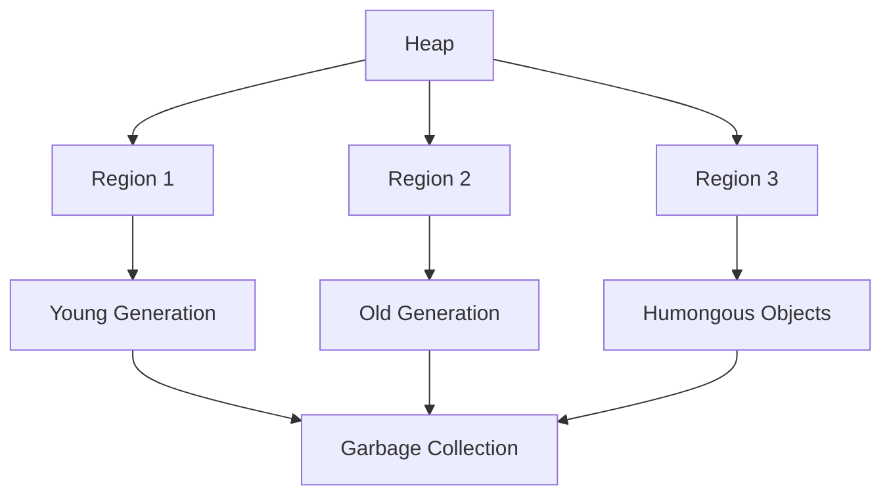

## 22.2 JVM Tuning for Clojure Applications

As experienced Java developers transitioning to Clojure, understanding how to fine-tune the Java Virtual Machine (JVM) for optimal performance is crucial. Clojure, being a hosted language on the JVM, inherits both the strengths and challenges of the JVM environment. In this section, we will explore how to adjust JVM settings to enhance the performance of Clojure applications, with a particular focus on garbage collection strategies.

### Understanding the JVM and Its Impact on Clojure

The JVM is a powerful platform that provides a robust environment for executing Java bytecode. Clojure, being a dynamic language, compiles down to Java bytecode, allowing it to leverage the JVM's capabilities. However, the performance of Clojure applications can be significantly influenced by how the JVM is configured. 

#### Key JVM Components Affecting Performance

1. **Garbage Collector (GC):** Manages memory allocation and reclamation. The choice of GC algorithm can impact application latency and throughput.
2. **Heap Memory:** The memory allocated for the runtime data area from which memory for all class instances and arrays is allocated.
3. **Thread Management:** The JVM's ability to manage threads efficiently is crucial for Clojure's concurrency model.
4. **Just-In-Time (JIT) Compilation:** Converts bytecode into native machine code, optimizing performance at runtime.

### Garbage Collection Strategies

Garbage collection is a critical aspect of JVM performance tuning. It automatically reclaims memory by removing objects that are no longer in use, which can impact application performance if not managed properly.

#### Common Garbage Collection Algorithms

1. **Serial GC:** Suitable for single-threaded applications. It uses a single thread for garbage collection, which can lead to pauses in application execution.
2. **Parallel GC (Throughput Collector):** Uses multiple threads for garbage collection, reducing pause times and improving throughput for multi-threaded applications.
3. **CMS (Concurrent Mark-Sweep) GC:** Aims to minimize pauses by performing most of the garbage collection concurrently with the application.
4. **G1 (Garbage-First) GC:** Designed for applications with large heaps, it divides the heap into regions and prioritizes garbage collection in regions with the most garbage.

#### Choosing the Right Garbage Collector

For Clojure applications, the choice of garbage collector can depend on the application's specific requirements:

- **Low Latency Applications:** Consider using CMS or G1 GC to minimize pause times.
- **High Throughput Applications:** Parallel GC can be beneficial for maximizing throughput.
- **Large Heap Applications:** G1 GC is often preferred for applications with large heaps due to its region-based approach.

### JVM Tuning Parameters

To optimize the JVM for Clojure applications, several parameters can be adjusted:

1. **Heap Size (`-Xms`, `-Xmx`):** Set the initial and maximum heap size to ensure sufficient memory allocation. For example:
   ```shell
   java -Xms512m -Xmx4g -jar your-clojure-app.jar
   ```

2. **Garbage Collector Selection (`-XX:+UseG1GC`, `-XX:+UseConcMarkSweepGC`):** Choose the appropriate garbage collector based on your application's needs.

3. **GC Logging (`-Xlog:gc`):** Enable garbage collection logging to monitor and analyze GC behavior.

4. **Thread Stack Size (`-Xss`):** Adjust the stack size for threads, which can be crucial for applications with deep recursion.

5. **JIT Compiler Options (`-XX:+TieredCompilation`):** Enable tiered compilation for improved startup performance and optimized runtime execution.

### Code Example: Configuring JVM for a Clojure Application

Let's consider a simple Clojure application and how we might configure the JVM for optimal performance.

```clojure
(ns myapp.core
  (:gen-class))

(defn -main
  [& args]
  (println "Hello, Clojure!"))

;; To run this application with optimized JVM settings:
;; java -Xms512m -Xmx4g -XX:+UseG1GC -Xlog:gc -jar myapp.jar
```

### Visualizing Garbage Collection

Understanding how garbage collection works can be enhanced with visual aids. Below is a diagram illustrating the G1 Garbage Collector's region-based approach.



**Diagram Description:** The G1 Garbage Collector divides the heap into regions, each containing a mix of young, old, and humongous objects. Garbage collection prioritizes regions with the most garbage.

### Monitoring and Profiling

To ensure that your JVM tuning efforts are effective, it's essential to monitor and profile your application:

- **JVisualVM:** A tool for monitoring and troubleshooting Java applications. It provides insights into memory usage, thread activity, and garbage collection.
- **JProfiler:** A comprehensive profiling tool that offers detailed information about CPU, memory, and thread usage.
- **GCViewer:** A tool for visualizing garbage collection logs, helping to identify patterns and optimize GC settings.

### Try It Yourself: Experiment with JVM Settings

Encourage experimentation by modifying the JVM settings for your Clojure applications. Try different garbage collectors and heap sizes to observe their impact on performance. Use tools like JVisualVM to monitor changes and gather insights.

### References and Further Reading

- [Official Clojure Documentation](https://clojure.org/reference/documentation)
- [Java Performance Tuning](https://www.oracle.com/java/technologies/javase/performance.html)
- [Garbage Collection Tuning Guide](https://docs.oracle.com/javase/8/docs/technotes/guides/vm/gctuning/index.html)

### Knowledge Check

1. What is the primary role of the garbage collector in the JVM?
2. How does the G1 Garbage Collector differ from the CMS Garbage Collector?
3. Why is it important to monitor garbage collection behavior in Clojure applications?

### Summary

In this section, we've explored how to tune the JVM for Clojure applications, focusing on garbage collection strategies and performance optimization. By understanding the JVM's components and adjusting its settings, you can significantly enhance the performance of your Clojure applications. Remember to monitor and profile your applications to ensure that your tuning efforts are effective.

## **Quiz: Are You Ready to Optimize JVM for Clojure?**



### What is the primary role of the garbage collector in the JVM?

- [x] To automatically reclaim memory by removing unused objects
- [ ] To manage thread execution
- [ ] To compile Java bytecode into machine code
- [ ] To handle network connections

> **Explanation:** The garbage collector's primary role is to automatically reclaim memory by removing objects that are no longer in use, thus preventing memory leaks.

### Which garbage collector is designed for applications with large heaps?

- [ ] Serial GC
- [ ] Parallel GC
- [x] G1 GC
- [ ] CMS GC

> **Explanation:** The G1 Garbage Collector is designed for applications with large heaps, using a region-based approach to prioritize garbage collection in regions with the most garbage.

### What JVM parameter is used to set the maximum heap size?

- [ ] -Xms
- [x] -Xmx
- [ ] -Xss
- [ ] -XX:+UseG1GC

> **Explanation:** The `-Xmx` parameter is used to set the maximum heap size for the JVM.

### Which tool can be used to monitor and troubleshoot Java applications?

- [ ] GCViewer
- [x] JVisualVM
- [ ] JProfiler
- [ ] Eclipse

> **Explanation:** JVisualVM is a tool for monitoring and troubleshooting Java applications, providing insights into memory usage, thread activity, and garbage collection.

### What is the benefit of enabling tiered compilation in the JVM?

- [x] Improved startup performance
- [x] Optimized runtime execution
- [ ] Reduced memory usage
- [ ] Simplified code structure

> **Explanation:** Enabling tiered compilation in the JVM improves startup performance and optimizes runtime execution by using both client and server compilers.

### Which garbage collector aims to minimize pauses by performing most of the garbage collection concurrently with the application?

- [ ] Serial GC
- [ ] Parallel GC
- [ ] G1 GC
- [x] CMS GC

> **Explanation:** The CMS (Concurrent Mark-Sweep) Garbage Collector aims to minimize pauses by performing most of the garbage collection concurrently with the application.

### What is the purpose of GC logging in JVM tuning?

- [x] To monitor and analyze garbage collection behavior
- [ ] To manage thread execution
- [ ] To compile Java bytecode into machine code
- [ ] To handle network connections

> **Explanation:** GC logging is used to monitor and analyze garbage collection behavior, helping to identify patterns and optimize GC settings.

### Which JVM parameter is used to adjust the stack size for threads?

- [ ] -Xms
- [ ] -Xmx
- [x] -Xss
- [ ] -XX:+UseG1GC

> **Explanation:** The `-Xss` parameter is used to adjust the stack size for threads in the JVM.

### What is the advantage of using the Parallel GC?

- [ ] Low latency
- [x] High throughput
- [ ] Reduced memory usage
- [ ] Simplified code structure

> **Explanation:** The Parallel GC is beneficial for maximizing throughput by using multiple threads for garbage collection.

### True or False: The JVM's JIT compiler converts Java bytecode into native machine code.

- [x] True
- [ ] False

> **Explanation:** The JVM's Just-In-Time (JIT) compiler converts Java bytecode into native machine code, optimizing performance at runtime.


