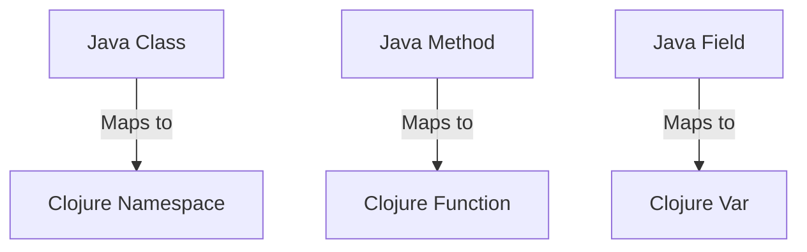

## 22.3 Writing Efficient Clojure Code

As we transition from Java's Object-Oriented Programming (OOP) to Clojure's functional paradigm, writing efficient code becomes paramount. Clojure offers a unique set of features that, when leveraged correctly, can lead to highly performant applications. In this section, we will explore best practices for writing efficient Clojure code and avoiding common performance pitfalls.

### Understanding Clojure's Performance Model

Before diving into specific techniques, it's essential to understand Clojure's performance model. Clojure runs on the Java Virtual Machine (JVM), which means it inherits many of the performance characteristics of Java. However, Clojure's functional nature introduces new considerations:

- **Immutability**: Clojure's data structures are immutable, which can lead to performance benefits in concurrent applications but may require different optimization strategies compared to mutable Java objects.
- **Lazy Evaluation**: Clojure's sequences are often lazy, meaning they compute elements only as needed. This can improve performance by avoiding unnecessary computations but requires careful management to prevent memory leaks.
- **Functional Composition**: Clojure encourages the use of small, composable functions. While this can lead to cleaner code, it may introduce overhead if not managed properly.

### Best Practices for High-Performance Clojure Code

#### 1. Leverage Persistent Data Structures

Clojure's persistent data structures are designed to be efficient for both read and write operations. They use structural sharing to minimize copying, which is crucial for performance.

```clojure
;; Example of using a persistent vector
(def my-vector (conj [1 2 3] 4)) ; => [1 2 3 4]
```

**Tip**: Use Clojure's built-in data structures like vectors, maps, and sets for most use cases. They are optimized for performance and concurrency.

#### 2. Optimize Function Calls

Function calls in Clojure can be more expensive than in Java due to the dynamic nature of the language. To mitigate this:

- **Use `defn` for Named Functions**: Named functions are faster than anonymous functions because they are compiled once.
- **Avoid Excessive Recursion**: While recursion is idiomatic in functional programming, excessive recursion can lead to stack overflow. Use Clojure's `recur` for tail-call optimization.

```clojure
;; Tail-recursive function using recur
(defn factorial [n]
  (loop [acc 1 n n]
    (if (zero? n)
      acc
      (recur (* acc n) (dec n)))))
```

#### 3. Embrace Laziness Wisely

Lazy sequences can improve performance by deferring computation, but they can also lead to memory issues if not handled properly.

- **Realize Sequences When Necessary**: Use functions like `doall` or `dorun` to realize sequences when side effects are needed or to prevent memory leaks.

```clojure
;; Realizing a lazy sequence
(def lazy-seq (map inc (range 1000000)))
(doall lazy-seq) ; Forces realization
```

#### 4. Use Transients for Performance-Critical Code

Transients provide a way to perform mutable operations on persistent data structures for performance-critical sections of code.

```clojure
;; Using transients for efficient updates
(defn build-large-vector []
  (persistent!
    (reduce conj! (transient []) (range 1000000))))
```

**Note**: Transients should be used sparingly and only within a single thread.

#### 5. Profile and Optimize Hotspots

Use profiling tools to identify performance bottlenecks in your Clojure code. The JVM ecosystem offers several tools, such as VisualVM and YourKit, that can help pinpoint slow code paths.

- **Focus on Hotspots**: Optimize only the parts of the code that are proven to be slow. Premature optimization can lead to complex and hard-to-maintain code.

#### 6. Minimize Reflection

Reflection in Clojure occurs when the type of an object is not known at compile time, leading to slower method calls. Use type hints to avoid reflection.

```clojure
;; Using type hints to avoid reflection
(defn add [^long a ^long b]
  (+ a b))
```

#### 7. Parallelize Workloads

Clojure provides several ways to parallelize workloads, such as `pmap` for parallel mapping and `future` for asynchronous computation.

```clojure
;; Parallel mapping with pmap
(defn process-data [data]
  (pmap expensive-computation data))
```

**Caution**: Ensure that the workload is suitable for parallelization and that the overhead of parallel execution does not outweigh the benefits.

### Avoiding Common Performance Pitfalls

#### 1. Overusing Global State

While Clojure encourages immutability, global state can still be a performance bottleneck if not managed correctly. Use atoms, refs, and agents judiciously.

```clojure
;; Using an atom for shared state
(def counter (atom 0))
(swap! counter inc)
```

#### 2. Inefficient Data Access Patterns

Accessing data in inefficient ways can degrade performance. Prefer using maps and sets for fast lookups.

```clojure
;; Efficient data access with maps
(def user-data {:name "Alice" :age 30})
(get user-data :name) ; => "Alice"
```

#### 3. Unnecessary Sequence Realization

Avoid realizing sequences unnecessarily, as this can lead to increased memory usage and slower performance.

```clojure
;; Avoid unnecessary realization
(defn process-large-seq [seq]
  (map inc seq)) ; Lazy processing
```

### Code Examples and Exercises

Let's explore some practical examples and exercises to reinforce these concepts.

#### Example: Efficient Data Processing

Consider a scenario where we need to process a large dataset efficiently.

```clojure
(defn process-large-dataset [data]
  (->> data
       (filter even?)
       (map #(* % 2))
       (reduce +)))

;; Try It Yourself: Modify the code to use `pmap` for parallel processing.
```

#### Exercise: Optimize a Recursive Function

Given the following recursive function, optimize it using `recur` for tail-call optimization.

```clojure
(defn sum-to-n [n]
  (if (zero? n)
    0
    (+ n (sum-to-n (dec n)))))

;; Solution: Use `recur` to optimize the function.
(defn sum-to-n [n]
  (loop [acc 0 n n]
    (if (zero? n)
      acc
      (recur (+ acc n) (dec n)))))
```

### Visual Aids

To better understand the transition from Java OOP to Clojure's functional paradigm, let's visualize how Java classes map to Clojure namespaces and functions.



**Diagram Description**: This diagram illustrates how Java classes, methods, and fields map to Clojure namespaces, functions, and vars, respectively.

### References and Further Reading

- [Clojure Official Documentation](https://clojure.org/reference)
- [Clojure Community Resources](https://clojure.org/community/resources)
- [Transitioning from OOP to Functional Programming](https://www.lispcast.com/oo-to-fp/)
- [Clojure Performance Tips](https://clojure.org/guides/performance)

### Knowledge Check

To reinforce your understanding, consider the following questions and exercises:

1. What are the benefits of using persistent data structures in Clojure?
2. How can you avoid reflection in Clojure code?
3. Why is it important to profile your Clojure applications?
4. What are the potential pitfalls of using lazy sequences?

### Encouraging Engagement

Embracing functional programming can be challenging, but with each step, you'll gain a deeper understanding and see tangible benefits in your codebase. Experiment with the examples provided, and don't hesitate to explore further.

### Quiz: Are You Ready to Migrate from Java to Clojure?



### What is a key benefit of Clojure's persistent data structures?

- [x] They provide efficient read and write operations through structural sharing.
- [ ] They allow for mutable state management.
- [ ] They are only suitable for small datasets.
- [ ] They require manual memory management.

> **Explanation:** Clojure's persistent data structures use structural sharing to provide efficient read and write operations, making them suitable for concurrent applications.

### How can you avoid reflection in Clojure?

- [x] Use type hints to specify the expected types of function arguments.
- [ ] Avoid using functions altogether.
- [ ] Use global variables instead of local ones.
- [ ] Always use anonymous functions.

> **Explanation:** Type hints help the Clojure compiler avoid reflection by specifying the expected types of function arguments.

### Why is profiling important in Clojure applications?

- [x] It helps identify performance bottlenecks and optimize hotspots.
- [ ] It is only necessary for debugging.
- [ ] It automatically optimizes the code.
- [ ] It is not applicable to Clojure.

> **Explanation:** Profiling helps identify performance bottlenecks, allowing developers to focus optimization efforts on the most critical parts of the code.

### What is a potential pitfall of using lazy sequences?

- [x] They can lead to memory leaks if not managed properly.
- [ ] They always improve performance.
- [ ] They require manual realization.
- [ ] They are not suitable for any use case.

> **Explanation:** Lazy sequences can lead to memory leaks if not realized properly, as they defer computation until needed.

### Which of the following is a best practice for optimizing function calls in Clojure?

- [x] Use `defn` for named functions to reduce overhead.
- [ ] Use recursion without `recur`.
- [ ] Avoid using functions altogether.
- [ ] Use global variables for all computations.

> **Explanation:** Using `defn` for named functions reduces overhead compared to anonymous functions, as they are compiled once.

### What is the purpose of using transients in Clojure?

- [x] To perform mutable operations on persistent data structures for performance-critical code.
- [ ] To manage global state.
- [ ] To avoid using functions.
- [ ] To handle exceptions.

> **Explanation:** Transients allow for mutable operations on persistent data structures, improving performance in critical sections of code.

### How can you parallelize workloads in Clojure?

- [x] Use `pmap` for parallel mapping and `future` for asynchronous computation.
- [ ] Use only single-threaded operations.
- [ ] Avoid using sequences.
- [ ] Use global variables for parallelism.

> **Explanation:** `pmap` and `future` are tools in Clojure for parallelizing workloads and performing asynchronous computations.

### What is a common performance pitfall in Clojure?

- [x] Overusing global state can lead to bottlenecks.
- [ ] Using too many functions.
- [ ] Avoiding recursion.
- [ ] Using persistent data structures.

> **Explanation:** Overusing global state can lead to performance bottlenecks, as it may require synchronization and can limit scalability.

### How can you efficiently access data in Clojure?

- [x] Use maps and sets for fast lookups.
- [ ] Use lists for all data structures.
- [ ] Avoid using data structures.
- [ ] Use global variables for data access.

> **Explanation:** Maps and sets provide efficient data access patterns, allowing for fast lookups and updates.

### True or False: Clojure's lazy sequences always improve performance.

- [ ] True
- [x] False

> **Explanation:** While lazy sequences can improve performance by deferring computation, they can also lead to memory issues if not managed properly.



By following these best practices and understanding Clojure's performance characteristics, you can write efficient and high-performance Clojure code. As you continue your journey from Java OOP to Clojure, remember that the functional paradigm offers powerful tools for building scalable and maintainable applications.
