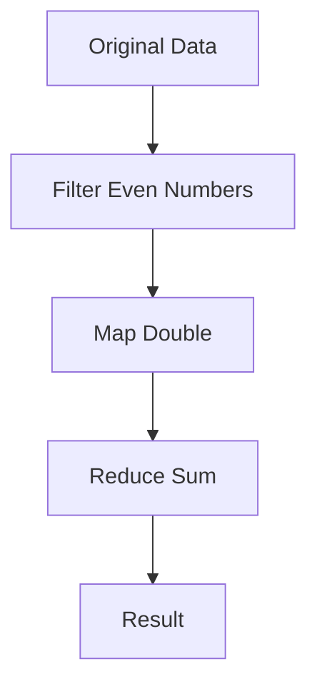

## 22.3 Writing Efficient Clojure Code

As experienced Java developers transitioning to Clojure, understanding how to write efficient code is crucial for leveraging the full potential of Clojure's functional programming paradigm. In this section, we will explore best practices for high-performance Clojure code, avoid common performance pitfalls, and highlight Clojure's unique features that contribute to code efficiency.

### Understanding Clojure's Performance Model

Clojure is a dynamic, functional language that runs on the Java Virtual Machine (JVM). It inherits the performance characteristics of the JVM while introducing its own paradigms, such as immutability and functional programming. To write efficient Clojure code, it's essential to understand these paradigms and how they interact with the JVM.

#### Immutability and Persistent Data Structures

Clojure's core data structures (lists, vectors, maps, and sets) are immutable and persistent. This means that any modification to a data structure results in a new structure, sharing as much of the original structure as possible. This approach provides thread safety and simplifies reasoning about code but can introduce performance overhead if not used correctly.

**Example:**

```clojure
(def original-vector [1 2 3 4 5])
(def new-vector (conj original-vector 6))

;; original-vector remains unchanged
```

In this example, `new-vector` is a new structure that shares most of its data with `original-vector`, making the operation efficient.

#### Avoiding Common Performance Pitfalls

1. **Avoid Unnecessary Laziness:**
   Clojure's sequences are lazy by default, meaning they are not realized until needed. While this can be efficient, it can also lead to performance issues if not managed properly.

   **Example:**

   ```clojure
   (defn process-sequence [seq]
     (doall (map inc seq))) ; Forces realization of the sequence
   ```

   Use `doall` or `dorun` to realize sequences when necessary to avoid holding onto large, unevaluated sequences.

2. **Minimize Reflection:**
   Clojure uses reflection to determine the types of objects at runtime, which can be costly. Use type hints to avoid reflection.

   **Example:**

   ```clojure
   (defn add-numbers [^long a ^long b]
     (+ a b))
   ```

   Type hints (`^long`) help the compiler generate more efficient bytecode.

3. **Optimize Recursion with Tail Calls:**
   Clojure supports tail call optimization through the `recur` keyword, which allows for efficient recursion without growing the call stack.

   **Example:**

   ```clojure
   (defn factorial [n]
     (loop [acc 1 n n]
       (if (zero? n)
         acc
         (recur (* acc n) (dec n)))))
   ```

   Use `loop` and `recur` to implement tail-recursive functions.

### Leveraging Clojure's Unique Features

#### Higher-Order Functions and Functional Composition

Clojure excels at functional composition, allowing you to build complex operations from simple functions. This approach not only makes code more readable but can also improve performance by reducing intermediate data structures.

**Example:**

```clojure
(defn process-data [data]
  (->> data
       (filter even?)
       (map #(* % 2))
       (reduce +)))
```

The `->>` macro threads data through a series of transformations, optimizing the flow of data.

#### Concurrency with Atoms, Refs, and Agents

Clojure provides several concurrency primitives that allow for efficient state management in a multi-threaded environment.

- **Atoms:** For managing independent, synchronous state changes.
- **Refs:** For coordinated, synchronous state changes using Software Transactional Memory (STM).
- **Agents:** For asynchronous state changes.

**Example:**

```clojure
(def counter (atom 0))

(defn increment-counter []
  (swap! counter inc))
```

Use `swap!` with atoms for efficient, thread-safe state updates.

### Code Examples and Comparisons

Let's compare a simple Java and Clojure example to highlight efficiency differences.

**Java Example:**

```java
public int sumEvenNumbers(List<Integer> numbers) {
    int sum = 0;
    for (int number : numbers) {
        if (number % 2 == 0) {
            sum += number;
        }
    }
    return sum;
}
```

**Clojure Equivalent:**

```clojure
(defn sum-even-numbers [numbers]
  (reduce + (filter even? numbers)))
```

The Clojure version is more concise and leverages functional programming to efficiently process the list.

### Visualizing Data Flow and Immutability

To better understand how data flows through Clojure's functional constructs, let's visualize a simple data transformation pipeline.



This diagram illustrates how data is transformed step-by-step, emphasizing the efficiency of functional composition.

### References and Further Reading

- [Official Clojure Documentation](https://clojure.org/reference)
- [ClojureDocs](https://clojuredocs.org/)
- [Clojure Performance Tips](https://clojure.org/guides/performance)

### Knowledge Check

- What is the primary benefit of Clojure's persistent data structures?
- How can you avoid reflection in Clojure code?
- What is the purpose of the `recur` keyword in Clojure?

### Encouraging Tone

Now that we've explored how to write efficient Clojure code, let's apply these concepts to optimize your applications. Remember, the key to efficiency in Clojure lies in understanding its functional paradigm and leveraging its unique features.

### Quiz: Are You Ready to Migrate from Java to Clojure?



### What is a primary advantage of Clojure's immutable data structures?

- [x] They provide thread safety.
- [ ] They allow for mutable state.
- [ ] They are always faster than mutable structures.
- [ ] They require less memory.

> **Explanation:** Immutable data structures in Clojure provide thread safety by ensuring that data cannot be changed once created.

### How can you avoid reflection in Clojure?

- [x] Use type hints.
- [ ] Use lazy sequences.
- [ ] Use atoms.
- [ ] Use macros.

> **Explanation:** Type hints help the Clojure compiler generate more efficient bytecode by avoiding reflection.

### What does the `recur` keyword do in Clojure?

- [x] It allows for tail call optimization.
- [ ] It creates a new thread.
- [ ] It initializes an atom.
- [ ] It defines a macro.

> **Explanation:** `recur` is used for tail call optimization, allowing recursive functions to execute without growing the call stack.

### Which Clojure construct is used for asynchronous state changes?

- [x] Agents
- [ ] Atoms
- [ ] Refs
- [ ] Vars

> **Explanation:** Agents are used for asynchronous state changes in Clojure.

### What is a common pitfall when using lazy sequences in Clojure?

- [x] Holding onto large, unevaluated sequences.
- [ ] Using type hints.
- [ ] Using `recur`.
- [ ] Using `swap!`.

> **Explanation:** Lazy sequences can lead to performance issues if large, unevaluated sequences are held in memory.

### What is the purpose of the `->>` macro in Clojure?

- [x] It threads data through a series of transformations.
- [ ] It initializes an atom.
- [ ] It defines a macro.
- [ ] It creates a new thread.

> **Explanation:** The `->>` macro is used to thread data through a series of transformations, optimizing data flow.

### How do you perform a synchronous state change in Clojure?

- [x] Use atoms or refs.
- [ ] Use agents.
- [ ] Use lazy sequences.
- [ ] Use macros.

> **Explanation:** Atoms and refs are used for synchronous state changes in Clojure.

### What is a benefit of using higher-order functions in Clojure?

- [x] They allow for functional composition.
- [ ] They enable mutable state.
- [ ] They require less memory.
- [ ] They create new threads.

> **Explanation:** Higher-order functions enable functional composition, allowing complex operations to be built from simple functions.

### Which Clojure feature helps in managing independent state changes?

- [x] Atoms
- [ ] Refs
- [ ] Agents
- [ ] Vars

> **Explanation:** Atoms are used for managing independent, synchronous state changes.

### True or False: Clojure's persistent data structures are always faster than mutable structures.

- [ ] True
- [x] False

> **Explanation:** While Clojure's persistent data structures offer benefits like immutability and thread safety, they are not always faster than mutable structures, especially for certain operations.



By following these best practices and understanding Clojure's unique features, you can write efficient, high-performance Clojure code that leverages the full power of functional programming.
