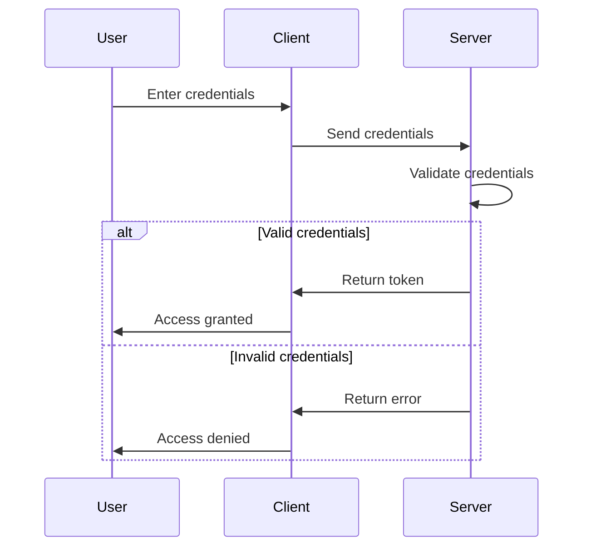

## 23.1 Secure Coding Practices

As enterprises transition from Java Object-Oriented Programming (OOP) to Clojure's functional programming paradigm, it is crucial to adopt secure coding practices to protect applications from vulnerabilities. This section delves into the essential aspects of securing Clojure applications, focusing on common vulnerabilities and implementing robust authentication and authorization mechanisms.

### Protecting Against Common Vulnerabilities

In the realm of software security, understanding and mitigating common vulnerabilities is paramount. Let's explore some prevalent vulnerabilities and how Clojure's functional paradigm can help address them.

#### 1. Injection Attacks

Injection attacks, such as SQL injection, occur when untrusted data is sent to an interpreter as part of a command or query. This can lead to unauthorized data access or manipulation.

**Mitigation Strategies:**

- **Use Parameterized Queries:** Always use parameterized queries or prepared statements to prevent SQL injection. Clojure's libraries, such as `clojure.java.jdbc`, support parameterized queries.

  ```clojure
  (require '[clojure.java.jdbc :as jdbc])

  (defn get-user [db user-id]
    (jdbc/query db ["SELECT * FROM users WHERE id = ?" user-id]))
  ```

- **Sanitize Inputs:** Ensure all inputs are sanitized and validated before processing. Use libraries like `clojure.spec` for input validation.

  ```clojure
  (require '[clojure.spec.alpha :as s])

  (s/def ::user-id int?)

  (defn validate-user-id [user-id]
    (if (s/valid? ::user-id user-id)
      user-id
      (throw (ex-info "Invalid user ID" {:user-id user-id}))))
  ```

#### 2. Cross-Site Scripting (XSS)

XSS attacks occur when malicious scripts are injected into web pages viewed by other users. This can lead to data theft or session hijacking.

**Mitigation Strategies:**

- **Escape User Input:** Always escape user input when rendering HTML. Libraries like `hiccup` can help with HTML escaping.

  ```clojure
  (require '[hiccup.core :refer [html]])

  (defn render-user-input [input]
    (html [:div (hiccup.util/escape-html input)]))
  ```

- **Content Security Policy (CSP):** Implement CSP headers to restrict the sources from which content can be loaded.

#### 3. Cross-Site Request Forgery (CSRF)

CSRF attacks trick users into performing actions they did not intend to perform. This can lead to unauthorized actions on behalf of the user.

**Mitigation Strategies:**

- **Use Anti-CSRF Tokens:** Implement anti-CSRF tokens in forms and validate them on the server side.

  ```clojure
  (defn generate-csrf-token []
    (str (java.util.UUID/randomUUID)))

  (defn validate-csrf-token [token session-token]
    (when-not (= token session-token)
      (throw (ex-info "Invalid CSRF token" {:token token}))))
  ```

- **SameSite Cookies:** Set cookies with the `SameSite` attribute to prevent them from being sent with cross-site requests.

### Implementing Authentication and Authorization

Authentication and authorization are critical components of secure applications. Let's explore how to implement these mechanisms in Clojure.

#### Authentication

Authentication verifies the identity of a user. In Clojure, you can implement authentication using libraries like `buddy-auth`.

**Steps to Implement Authentication:**

1. **Set Up Dependencies:**

   Add `buddy-auth` to your `project.clj` or `deps.edn` file.

   ```clojure
   ;; project.clj
   :dependencies [[buddy/buddy-auth "3.0.1"]]

   ;; deps.edn
   {:deps {buddy/buddy-auth {:mvn/version "3.0.1"}}}
   ```

2. **Configure Authentication Middleware:**

   Use middleware to handle authentication logic.

   ```clojure
   (require '[buddy.auth.middleware :refer [wrap-authentication]]
            '[buddy.auth.backends.session :refer [session-backend]])

   (def app
     (wrap-authentication
       your-handler
       (session-backend {:authfn your-auth-function})))
   ```

3. **Implement Authentication Logic:**

   Define a function to authenticate users.

   ```clojure
   (defn your-auth-function [request]
     (let [user (find-user-by-credentials (:username request) (:password request))]
       (if user
         {:identity user}
         nil)))
   ```

#### Authorization

Authorization determines what an authenticated user is allowed to do. Use libraries like `buddy-auth` to implement role-based access control (RBAC).

**Steps to Implement Authorization:**

1. **Define Roles and Permissions:**

   Define roles and associated permissions.

   ```clojure
   (def roles
     {:admin #{:read :write :delete}
      :user #{:read}})

   (defn has-permission? [role permission]
     (contains? (roles role) permission))
   ```

2. **Implement Authorization Logic:**

   Use middleware to enforce authorization.

   ```clojure
   (require '[buddy.auth.accessrules :refer [restrict]])

   (defn admin-only [handler]
     (restrict handler {:handler (fn [request]
                                   (has-permission? (:role (:identity request)) :delete))
                        :on-error (fn [_] {:status 403 :body "Forbidden"})}))
   ```

3. **Apply Authorization Middleware:**

   Apply the middleware to routes requiring authorization.

   ```clojure
   (def app
     (-> your-handler
         (admin-only)))
   ```

### Code Examples and Exercises

Let's solidify our understanding with some exercises and code examples.

#### Exercise 1: Implementing Secure Input Validation

**Task:** Implement a function that validates email input using `clojure.spec`.

```clojure
(require '[clojure.spec.alpha :as s])

(s/def ::email (s/and string? #(re-matches #".+@.+\..+" %)))

(defn validate-email [email]
  (if (s/valid? ::email email)
    email
    (throw (ex-info "Invalid email" {:email email}))))
```

**Try It Yourself:** Modify the regex pattern to allow only specific domains (e.g., `example.com`).

#### Exercise 2: Implementing Role-Based Access Control

**Task:** Implement a function that checks if a user has the `:write` permission.

```clojure
(defn can-write? [role]
  (has-permission? role :write))
```

**Try It Yourself:** Extend the roles to include a `:guest` role with no permissions.

### Visual Aids

To better understand the flow of authentication and authorization, let's look at a sequence diagram illustrating the process.



**Diagram Description:** This sequence diagram illustrates the authentication process, where a user enters credentials, the client sends them to the server, and the server validates them. If valid, a token is returned; otherwise, an error is sent.

### References and Links

- [Clojure Official Documentation](https://clojure.org/reference)
- [Buddy Auth Library](https://funcool.github.io/buddy-auth/latest/)
- [OWASP Top Ten Security Risks](https://owasp.org/www-project-top-ten/)
- [Clojure Spec Guide](https://clojure.org/guides/spec)

### Knowledge Check

Let's test your understanding of secure coding practices in Clojure with some questions.

1. **What is the primary purpose of using parameterized queries?**

   - [x] To prevent SQL injection attacks.
   - [ ] To improve query performance.
   - [ ] To simplify query syntax.
   - [ ] To enable dynamic query generation.

   > **Explanation:** Parameterized queries prevent SQL injection by separating query logic from data.

2. **Which library can be used for authentication in Clojure?**

   - [x] Buddy Auth
   - [ ] Ring
   - [ ] Compojure
   - [ ] Hiccup

   > **Explanation:** Buddy Auth is a library specifically designed for authentication in Clojure applications.

3. **What is the role of CSRF tokens in web applications?**

   - [x] To prevent unauthorized actions by verifying the source of requests.
   - [ ] To encrypt user data.
   - [ ] To enhance session management.
   - [ ] To improve page load speed.

   > **Explanation:** CSRF tokens help prevent unauthorized actions by ensuring requests originate from the intended source.

4. **How can you enforce role-based access control in Clojure?**

   - [x] By using middleware to check user roles and permissions.
   - [ ] By encrypting user credentials.
   - [ ] By using parameterized queries.
   - [ ] By implementing CSP headers.

   > **Explanation:** Middleware can be used to enforce role-based access control by checking user roles and permissions.

5. **What is the purpose of escaping user input in web applications?**

   - [x] To prevent XSS attacks by ensuring input is not executed as code.
   - [ ] To improve input validation.
   - [ ] To enhance data storage efficiency.
   - [ ] To simplify input processing.

   > **Explanation:** Escaping user input prevents XSS attacks by ensuring input is treated as data, not code.

### Encouraging Engagement

Embracing secure coding practices in Clojure can be challenging, but with each step, you'll gain a deeper understanding and see tangible benefits in your codebase. Remember, security is an ongoing process, and staying informed about the latest threats and mitigation strategies is crucial.

### Summary

In this section, we've explored secure coding practices in Clojure, focusing on protecting against common vulnerabilities and implementing robust authentication and authorization mechanisms. By adopting these practices, you can safeguard your applications and ensure they remain resilient against evolving threats.

## **Quiz: Are You Ready to Migrate from Java to Clojure?**



### What is the primary purpose of using parameterized queries?

- [x] To prevent SQL injection attacks.
- [ ] To improve query performance.
- [ ] To simplify query syntax.
- [ ] To enable dynamic query generation.

> **Explanation:** Parameterized queries prevent SQL injection by separating query logic from data.

### Which library can be used for authentication in Clojure?

- [x] Buddy Auth
- [ ] Ring
- [ ] Compojure
- [ ] Hiccup

> **Explanation:** Buddy Auth is a library specifically designed for authentication in Clojure applications.

### What is the role of CSRF tokens in web applications?

- [x] To prevent unauthorized actions by verifying the source of requests.
- [ ] To encrypt user data.
- [ ] To enhance session management.
- [ ] To improve page load speed.

> **Explanation:** CSRF tokens help prevent unauthorized actions by ensuring requests originate from the intended source.

### How can you enforce role-based access control in Clojure?

- [x] By using middleware to check user roles and permissions.
- [ ] By encrypting user credentials.
- [ ] By using parameterized queries.
- [ ] By implementing CSP headers.

> **Explanation:** Middleware can be used to enforce role-based access control by checking user roles and permissions.

### What is the purpose of escaping user input in web applications?

- [x] To prevent XSS attacks by ensuring input is not executed as code.
- [ ] To improve input validation.
- [ ] To enhance data storage efficiency.
- [ ] To simplify input processing.

> **Explanation:** Escaping user input prevents XSS attacks by ensuring input is treated as data, not code.

### Which of the following is a common vulnerability in web applications?

- [x] SQL Injection
- [ ] Data Compression
- [ ] Load Balancing
- [ ] Caching

> **Explanation:** SQL Injection is a common vulnerability where attackers can execute arbitrary SQL code.

### What is the benefit of using `clojure.spec` for input validation?

- [x] It provides a declarative way to define and enforce data constraints.
- [ ] It automatically encrypts user data.
- [ ] It improves database performance.
- [ ] It simplifies network communication.

> **Explanation:** `clojure.spec` allows developers to define and enforce data constraints declaratively.

### How does the `SameSite` attribute in cookies help with security?

- [x] It prevents cookies from being sent with cross-site requests.
- [ ] It encrypts cookie data.
- [ ] It enhances cookie storage efficiency.
- [ ] It simplifies cookie management.

> **Explanation:** The `SameSite` attribute helps prevent cookies from being sent with cross-site requests, mitigating CSRF attacks.

### What is the main advantage of using middleware for authentication?

- [x] It centralizes authentication logic, making it easier to manage and update.
- [ ] It encrypts all network traffic.
- [ ] It improves application performance.
- [ ] It simplifies database queries.

> **Explanation:** Middleware centralizes authentication logic, making it easier to manage and update.

### True or False: Clojure's immutable data structures inherently prevent all security vulnerabilities.

- [ ] True
- [x] False

> **Explanation:** While Clojure's immutable data structures provide certain security benefits, they do not inherently prevent all security vulnerabilities.




