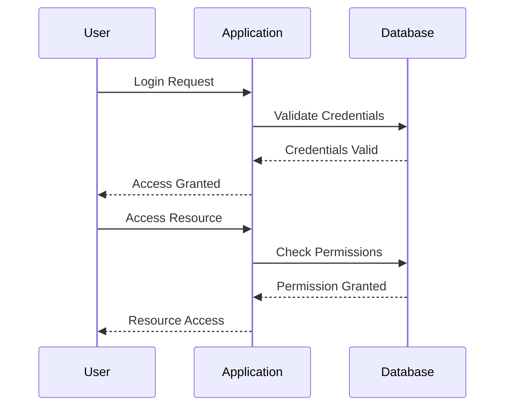

## 23.1 Secure Coding Practices

As we transition from Java's Object-Oriented Programming (OOP) to Clojure's functional paradigm, it's crucial to maintain a strong focus on security. In this section, we will explore secure coding practices in Clojure, emphasizing protection against common vulnerabilities and implementing robust authentication and authorization mechanisms. Our goal is to ensure that your enterprise applications remain secure and resilient in the face of evolving threats.

### Introduction to Secure Coding in Clojure

Secure coding is an essential aspect of software development, aiming to protect applications from vulnerabilities that could be exploited by malicious actors. In Clojure, secure coding involves understanding the language's unique features and leveraging them to build secure applications. While Java developers may be familiar with certain security practices, Clojure's functional nature offers new opportunities and challenges.

#### Key Security Concepts

- **Immutability**: Clojure's immutable data structures reduce the risk of unintended data modifications, a common source of vulnerabilities in mutable languages.
- **Pure Functions**: By avoiding side effects, pure functions enhance predictability and reduce the attack surface.
- **Concurrency Models**: Clojure's concurrency primitives, such as atoms, refs, and agents, provide safe ways to manage state in concurrent applications.

### Protecting Against Common Vulnerabilities

To build secure Clojure applications, it's important to understand and mitigate common vulnerabilities. Let's explore some key areas where Clojure developers should focus their efforts.

#### Input Validation and Sanitization

Input validation is critical to prevent injection attacks, such as SQL injection and cross-site scripting (XSS). In Clojure, we can leverage the language's expressive capabilities to validate and sanitize inputs effectively.

```clojure
(defn sanitize-input [input]
  ;; Remove potentially harmful characters
  (clojure.string/replace input #"[<>]" ""))

(defn validate-input [input]
  ;; Ensure input meets expected criteria
  (when (re-matches #"\A[a-zA-Z0-9]+\z" input)
    input))
```

In this example, we use regular expressions to validate and sanitize user input, ensuring that only alphanumeric characters are allowed.

#### Secure Data Handling

Handling sensitive data securely is paramount. Clojure's immutable data structures provide a solid foundation for secure data handling, but additional measures are necessary.

- **Encryption**: Use libraries like [Buddy](https://funcool.github.io/buddy-core/latest/) for encryption and decryption of sensitive data.
- **Environment Variables**: Store sensitive configuration data in environment variables rather than hardcoding them in your application.

```clojure
(require '[buddy.core.crypto :as crypto])

(def secret-key (System/getenv "SECRET_KEY"))

(defn encrypt-data [data]
  (crypto/encrypt data secret-key))

(defn decrypt-data [encrypted-data]
  (crypto/decrypt encrypted-data secret-key))
```

By encrypting sensitive data, we ensure that even if data is exposed, it remains unreadable without the decryption key.

#### Error Handling and Logging

Proper error handling and logging are crucial for identifying and mitigating security issues. Clojure provides tools to handle exceptions gracefully and log important events.

- **Exception Handling**: Use `try` and `catch` blocks to handle exceptions without exposing sensitive information.

```clojure
(defn safe-divide [numerator denominator]
  (try
    (/ numerator denominator)
    (catch ArithmeticException e
      (println "Division by zero error"))))
```

- **Logging**: Use libraries like [Timbre](https://github.com/ptaoussanis/timbre) for structured logging.

```clojure
(require '[taoensso.timbre :as timbre])

(timbre/info "Application started")
```

### Implementing Authentication and Authorization

Authentication and authorization are fundamental components of secure applications. Let's explore how to implement these mechanisms in Clojure.

#### Authentication

Authentication verifies the identity of users accessing the application. In Clojure, we can implement authentication using libraries like [Friend](https://github.com/cemerick/friend).

```clojure
(require '[cemerick.friend :as friend])

(defn login-handler [request]
  (friend/authenticate
    {:username "user"
     :password "pass"}))
```

In this example, we use Friend to authenticate users based on their credentials. It's important to store passwords securely, using hashing algorithms like bcrypt.

#### Authorization

Authorization determines what authenticated users are allowed to do. Clojure's functional nature allows us to define fine-grained access controls.

```clojure
(defn admin-only [handler]
  (fn [request]
    (if (friend/authorized? request :admin)
      (handler request)
      {:status 403 :body "Forbidden"})))
```

Here, we define a middleware function that restricts access to admin users. By composing functions, we can build complex authorization logic.

### Best Practices for Secure Clojure Development

To ensure your Clojure applications are secure, follow these best practices:

- **Use Libraries Wisely**: Choose well-maintained libraries with a strong focus on security.
- **Keep Dependencies Updated**: Regularly update dependencies to patch known vulnerabilities.
- **Conduct Security Audits**: Perform regular security audits to identify and address potential vulnerabilities.
- **Educate Your Team**: Ensure all team members are aware of secure coding practices and understand their importance.

### Visual Aids

To better understand the flow of data through authentication and authorization processes, let's visualize these concepts using Mermaid.js diagrams.



**Diagram Description**: This sequence diagram illustrates the authentication and authorization process in a Clojure application. The user sends a login request, which is validated against the database. Once authenticated, the user's permissions are checked before granting access to resources.

### Knowledge Check

To reinforce your understanding of secure coding practices in Clojure, consider the following questions:

- How does immutability contribute to security in Clojure?
- What are the benefits of using pure functions in secure coding?
- How can you prevent injection attacks in Clojure applications?
- Why is it important to encrypt sensitive data?
- What role does logging play in identifying security issues?

### Try It Yourself

Experiment with the code examples provided in this section. Try modifying the input validation logic to allow additional characters, or implement a custom authorization middleware for your application.

### References and Further Reading

For more information on secure coding practices in Clojure, consider the following resources:

- [Clojure Documentation](https://clojure.org/)
- [Buddy Library](https://funcool.github.io/buddy-core/latest/)
- [Friend Library](https://github.com/cemerick/friend)
- [Timbre Logging](https://github.com/ptaoussanis/timbre)

### Conclusion

By adopting secure coding practices in Clojure, you can build robust and resilient applications that protect against common vulnerabilities. As you continue your journey from Java to Clojure, remember to leverage the language's unique features to enhance security and maintainability.

## **Quiz: Are You Ready to Migrate from Java to Clojure?**



### How does immutability contribute to security in Clojure?

- [x] Reduces the risk of unintended data modifications
- [ ] Increases the complexity of code
- [ ] Makes data handling slower
- [ ] Requires more memory

> **Explanation:** Immutability ensures that data cannot be changed once created, reducing the risk of unintended modifications that could lead to vulnerabilities.


### What is the primary benefit of using pure functions in secure coding?

- [x] Reduces the attack surface by avoiding side effects
- [ ] Increases code complexity
- [ ] Requires more computational resources
- [ ] Makes debugging more difficult

> **Explanation:** Pure functions do not have side effects, which makes them predictable and reduces the potential for security vulnerabilities.


### How can you prevent injection attacks in Clojure applications?

- [x] Validate and sanitize user inputs
- [ ] Use mutable data structures
- [ ] Avoid using libraries
- [ ] Disable logging

> **Explanation:** Validating and sanitizing user inputs helps prevent injection attacks by ensuring that only safe data is processed.


### Why is it important to encrypt sensitive data?

- [x] To ensure data remains unreadable without the decryption key
- [ ] To increase data processing speed
- [ ] To reduce storage requirements
- [ ] To simplify data access

> **Explanation:** Encrypting sensitive data ensures that even if data is exposed, it remains unreadable without the appropriate decryption key.


### What role does logging play in identifying security issues?

- [x] Helps track and identify suspicious activities
- [ ] Increases application performance
- [ ] Reduces the need for input validation
- [ ] Simplifies code structure

> **Explanation:** Logging helps track application activities and can be used to identify suspicious activities or security breaches.


### Which library is commonly used for encryption in Clojure?

- [x] Buddy
- [ ] Timbre
- [ ] Ring
- [ ] Compojure

> **Explanation:** The Buddy library is commonly used for encryption and decryption in Clojure applications.


### What is the purpose of authentication in secure applications?

- [x] To verify the identity of users accessing the application
- [ ] To increase application performance
- [ ] To simplify code structure
- [ ] To reduce memory usage

> **Explanation:** Authentication verifies the identity of users accessing the application, ensuring that only authorized users can access certain resources.


### How can you implement authorization in Clojure?

- [x] By defining middleware functions that restrict access based on user roles
- [ ] By using mutable data structures
- [ ] By disabling logging
- [ ] By avoiding the use of libraries

> **Explanation:** Authorization can be implemented by defining middleware functions that restrict access based on user roles or permissions.


### What is a common practice for storing sensitive configuration data?

- [x] Storing in environment variables
- [ ] Hardcoding in the application
- [ ] Storing in plain text files
- [ ] Avoiding storage altogether

> **Explanation:** Storing sensitive configuration data in environment variables is a common practice to enhance security.


### True or False: Regularly updating dependencies is important for security.

- [x] True
- [ ] False

> **Explanation:** Regularly updating dependencies is important to patch known vulnerabilities and ensure the application remains secure.


