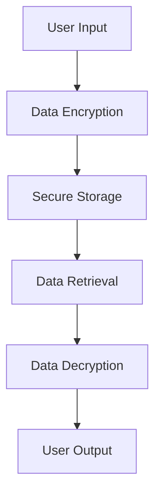

## 23.2 Handling Sensitive Data

In today's digital landscape, handling sensitive data with care is paramount for any enterprise. As we transition from Java OOP to Clojure, understanding how to secure data effectively is crucial. This section will guide you through the best practices for data encryption, secure storage, and ensuring compliance with industry regulations using Clojure's functional programming paradigm.

### Introduction to Data Security in Clojure

Data security involves protecting data from unauthorized access, corruption, or theft throughout its lifecycle. In Clojure, we leverage its immutable data structures and functional programming features to enhance security. Let's explore how Clojure's features can be utilized to handle sensitive data securely.

### Data Encryption and Secure Storage

#### Understanding Encryption

Encryption is the process of converting data into a coded format to prevent unauthorized access. In Clojure, we can use libraries like `buddy-core` for cryptographic operations. Encryption ensures that even if data is intercepted, it remains unreadable without the decryption key.

#### Implementing Encryption in Clojure

Let's demonstrate how to encrypt and decrypt data using Clojure:

```clojure
(ns secure-data.core
  (:require [buddy.core.crypto :as crypto]
            [buddy.core.codecs :as codecs]))

(def secret-key "my-secret-key")

;; Encrypting data
(defn encrypt-data [plain-text]
  (let [encrypted (crypto/encrypt plain-text secret-key)]
    (codecs/bytes->hex encrypted)))

;; Decrypting data
(defn decrypt-data [encrypted-text]
  (let [encrypted-bytes (codecs/hex->bytes encrypted-text)]
    (crypto/decrypt encrypted-bytes secret-key)))

;; Example usage
(def encrypted (encrypt-data "Sensitive Information"))
(println "Encrypted:" encrypted)

(def decrypted (decrypt-data encrypted))
(println "Decrypted:" decrypted)
```

**Explanation:**

- We use `buddy-core` for encryption and decryption.
- `encrypt-data` function encrypts plain text using a secret key.
- `decrypt-data` function decrypts the encrypted text back to plain text.
- The example demonstrates encrypting and decrypting a string.

#### Secure Storage Practices

Secure storage involves protecting data at rest. In Clojure, we can use databases with built-in encryption or encrypt data before storing it. Consider using libraries like `clojure.java.jdbc` for database interactions.

**Best Practices:**

- **Encrypt data before storage:** Always encrypt sensitive data before storing it in a database or file system.
- **Use secure libraries:** Utilize well-maintained libraries for encryption and database interactions.
- **Regularly update encryption keys:** Change encryption keys periodically to enhance security.

### Compliance with Industry Regulations

Compliance with regulations such as GDPR, HIPAA, and PCI-DSS is essential for handling sensitive data. These regulations mandate specific security measures to protect personal and financial information.

#### GDPR Compliance

The General Data Protection Regulation (GDPR) requires organizations to protect personal data and privacy. Key aspects include:

- **Data Minimization:** Only collect data necessary for specific purposes.
- **Consent Management:** Obtain explicit consent for data processing.
- **Data Breach Notification:** Notify authorities and affected individuals of data breaches promptly.

#### Implementing GDPR Compliance in Clojure

To comply with GDPR, implement the following strategies in your Clojure applications:

- **Data Anonymization:** Use techniques like data masking to anonymize personal data.
- **Access Controls:** Implement role-based access controls to restrict data access.
- **Audit Logs:** Maintain logs of data access and processing activities.

#### HIPAA Compliance

The Health Insurance Portability and Accountability Act (HIPAA) mandates the protection of health information. Key requirements include:

- **Data Encryption:** Encrypt health information both in transit and at rest.
- **Access Controls:** Implement strict access controls and authentication mechanisms.
- **Audit Trails:** Maintain detailed logs of data access and modifications.

#### Implementing HIPAA Compliance in Clojure

For HIPAA compliance, consider the following:

- **Secure Communication:** Use HTTPS and secure protocols for data transmission.
- **Data Integrity:** Ensure data integrity through checksums and hash functions.
- **Regular Audits:** Conduct regular security audits to identify vulnerabilities.

### Comparing Java and Clojure Security Practices

Java developers transitioning to Clojure will find similarities and differences in security practices. Let's compare key aspects:

#### Java Security Practices

- **Use of Libraries:** Java relies on libraries like Bouncy Castle for encryption.
- **Object-Oriented Security Models:** Java uses classes and interfaces for security implementations.
- **Complex Configuration:** Java security often involves complex configurations and XML files.

#### Clojure Security Practices

- **Functional Approach:** Clojure's functional paradigm simplifies security implementations.
- **Immutable Data Structures:** Immutability reduces the risk of accidental data modification.
- **Simplified Configuration:** Clojure's configuration is often more straightforward, using EDN or JSON.

### Visualizing Data Flow and Security

To better understand how data flows and is secured in a Clojure application, let's visualize the process:



**Diagram Explanation:**

- **User Input:** Data is collected from users.
- **Data Encryption:** Data is encrypted before storage.
- **Secure Storage:** Encrypted data is stored securely.
- **Data Retrieval:** Data is retrieved for processing.
- **Data Decryption:** Data is decrypted for use.
- **User Output:** Decrypted data is presented to users.

### Try It Yourself

Experiment with the provided encryption code by modifying the secret key or the data to be encrypted. Observe how changes affect the encryption and decryption process. This hands-on approach will deepen your understanding of data encryption in Clojure.

### Knowledge Check

- **What is the primary purpose of data encryption?**
- **How does Clojure's immutability enhance data security?**
- **What are the key requirements of GDPR compliance?**
- **How can you implement role-based access controls in Clojure?**

### Conclusion

Handling sensitive data securely is a critical aspect of enterprise application development. By leveraging Clojure's functional programming features, we can implement robust security measures, ensuring data protection and compliance with industry regulations. As you continue your migration journey, remember that security is an ongoing process that requires vigilance and adaptation to emerging threats.

### Further Reading

- [Clojure Official Documentation](https://clojure.org/reference)
- [Buddy Core Library](https://funcool.github.io/buddy-core/latest/)
- [GDPR Compliance Guide](https://gdpr.eu/)
- [HIPAA Compliance Guide](https://www.hhs.gov/hipaa/for-professionals/index.html)

## **Quiz: Are You Ready to Migrate from Java to Clojure?**



### What is the primary purpose of data encryption?

- [x] To prevent unauthorized access to data
- [ ] To increase data processing speed
- [ ] To reduce data storage requirements
- [ ] To simplify data retrieval

> **Explanation:** Data encryption is primarily used to prevent unauthorized access by converting data into a coded format.

### How does Clojure's immutability enhance data security?

- [x] It reduces the risk of accidental data modification
- [ ] It increases data processing speed
- [ ] It simplifies data encryption
- [ ] It enhances data retrieval

> **Explanation:** Immutability ensures that data cannot be changed once created, reducing the risk of accidental or malicious modifications.

### What are the key requirements of GDPR compliance?

- [x] Data minimization and consent management
- [ ] Increased data storage capacity
- [ ] Faster data processing
- [ ] Simplified data retrieval

> **Explanation:** GDPR requires organizations to minimize data collection and manage consent for data processing.

### How can you implement role-based access controls in Clojure?

- [x] By defining roles and permissions in the application
- [ ] By encrypting all data
- [ ] By using complex XML configurations
- [ ] By increasing data storage capacity

> **Explanation:** Role-based access controls involve defining roles and permissions to restrict data access based on user roles.

### Which library is commonly used for encryption in Clojure?

- [x] Buddy Core
- [ ] Bouncy Castle
- [ ] Apache Commons
- [ ] Spring Security

> **Explanation:** Buddy Core is a popular library in Clojure for cryptographic operations, including encryption.

### What is a key aspect of HIPAA compliance?

- [x] Encrypting health information both in transit and at rest
- [ ] Increasing data processing speed
- [ ] Reducing data storage requirements
- [ ] Simplifying data retrieval

> **Explanation:** HIPAA requires encryption of health information to protect it during transmission and storage.

### What is the benefit of using HTTPS for secure communication?

- [x] It encrypts data during transmission
- [ ] It increases data processing speed
- [ ] It reduces data storage requirements
- [ ] It simplifies data retrieval

> **Explanation:** HTTPS encrypts data during transmission, ensuring secure communication over the internet.

### What is a common practice for secure data storage?

- [x] Encrypting data before storage
- [ ] Storing data in plain text
- [ ] Increasing data storage capacity
- [ ] Simplifying data retrieval

> **Explanation:** Encrypting data before storage ensures that it remains secure even if the storage medium is compromised.

### How often should encryption keys be updated?

- [x] Regularly, to enhance security
- [ ] Never, to maintain consistency
- [ ] Only when data is changed
- [ ] Only when storage capacity increases

> **Explanation:** Regularly updating encryption keys enhances security by reducing the risk of key compromise.

### True or False: Clojure's functional programming paradigm simplifies security implementations.

- [x] True
- [ ] False

> **Explanation:** Clojure's functional programming paradigm, with its emphasis on immutability and simplicity, can simplify security implementations.


