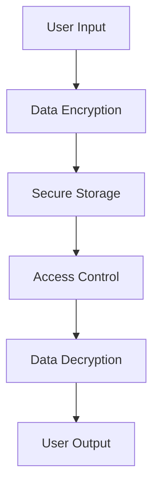

## 23.2 Handling Sensitive Data

In today's digital landscape, handling sensitive data securely is paramount for any enterprise. As we transition from Java to Clojure, understanding how to manage sensitive data effectively in a functional programming paradigm is crucial. This section will guide you through the best practices for data encryption, secure storage, and compliance with industry regulations, leveraging Clojure's unique features to enhance security.

### Understanding Sensitive Data

Sensitive data encompasses any information that must be protected from unauthorized access to safeguard the privacy and security of individuals or organizations. This includes personally identifiable information (PII), financial data, health records, and proprietary business information. Mishandling such data can lead to severe consequences, including legal penalties, financial losses, and reputational damage.

### Data Encryption and Secure Storage

Data encryption is a fundamental technique for protecting sensitive data. It involves converting data into a coded format that can only be deciphered by authorized parties possessing the correct decryption key. In Clojure, we can utilize libraries and tools to implement robust encryption and secure storage solutions.

#### Encryption in Clojure

Clojure provides several libraries for encryption, such as [Buddy](https://funcool.github.io/buddy-core/latest/), which offers a comprehensive suite of cryptographic functions. Let's explore how to encrypt and decrypt data using Buddy.

```clojure
(ns secure-data.core
  (:require [buddy.core.crypto :as crypto]
            [buddy.core.codecs :as codecs]))

;; Define a secret key for encryption
(def secret-key (codecs/hex->bytes "0123456789abcdef0123456789abcdef"))

;; Encrypt a message
(defn encrypt-message [message]
  (crypto/encrypt message secret-key))

;; Decrypt a message
(defn decrypt-message [encrypted-message]
  (crypto/decrypt encrypted-message secret-key))

;; Example usage
(let [message "Sensitive Data"
      encrypted (encrypt-message message)
      decrypted (decrypt-message encrypted)]
  (println "Original:" message)
  (println "Encrypted:" encrypted)
  (println "Decrypted:" decrypted))
```

In this example, we define a secret key and use it to encrypt and decrypt a message. The `buddy.core.crypto` namespace provides the `encrypt` and `decrypt` functions, which handle the encryption process.

#### Secure Storage Solutions

Storing sensitive data securely is as important as encrypting it. Clojure's immutable data structures and functional paradigm offer unique advantages for secure storage, such as reducing the risk of accidental data leaks.

##### Using Datomic for Secure Data Storage

[Datomic](https://www.datomic.com/) is a distributed database designed for immutable data storage, making it an excellent choice for secure data management. Its architecture ensures that data is never overwritten, only appended, which aligns with functional programming principles.

```clojure
(ns secure-data.datomic
  (:require [datomic.api :as d]))

;; Connect to a Datomic database
(def conn (d/connect "datomic:mem://secure-db"))

;; Define a schema for sensitive data
(def schema [{:db/ident :user/email
              :db/valueType :db.type/string
              :db/cardinality :db.cardinality/one
              :db/unique :db.unique/identity}])

;; Transact the schema
(d/transact conn {:tx-data schema})

;; Add a user with sensitive data
(defn add-user [email]
  (d/transact conn {:tx-data [{:user/email email}]}))

;; Query for a user by email
(defn find-user [email]
  (d/q '[:find ?e
         :in $ ?email
         :where [?e :user/email ?email]]
       (d/db conn) email))

;; Example usage
(add-user "user@example.com")
(println "User found:" (find-user "user@example.com"))
```

In this example, we define a schema for storing user email addresses in Datomic. The database's immutability ensures that once data is stored, it cannot be altered, providing an additional layer of security.

### Compliance with Industry Regulations

Compliance with industry regulations is essential for handling sensitive data. Regulations such as the General Data Protection Regulation (GDPR) and the Health Insurance Portability and Accountability Act (HIPAA) mandate specific requirements for data protection.

#### GDPR Compliance

The GDPR is a comprehensive data protection regulation that applies to organizations handling personal data of EU citizens. It emphasizes data minimization, user consent, and the right to access and delete personal data.

##### Implementing GDPR Principles in Clojure

To comply with GDPR, we must ensure that our Clojure applications handle personal data responsibly. This includes obtaining explicit consent from users, providing data access and deletion mechanisms, and minimizing data collection.

```clojure
(ns secure-data.gdpr
  (:require [ring.util.response :as response]))

;; Example consent form handler
(defn consent-form-handler [request]
  (if (get-in request [:params :consent])
    (response/response "Consent granted")
    (response/response "Consent required")))

;; Example data access handler
(defn data-access-handler [request]
  (let [user-id (get-in request [:params :user-id])]
    ;; Fetch and return user data
    (response/response (str "User data for ID: " user-id))))

;; Example data deletion handler
(defn data-deletion-handler [request]
  (let [user-id (get-in request [:params :user-id])]
    ;; Delete user data
    (response/response (str "User data deleted for ID: " user-id))))
```

In this example, we define handlers for user consent, data access, and data deletion. These handlers can be integrated into a web application to ensure GDPR compliance.

#### HIPAA Compliance

HIPAA is a US regulation that governs the protection of health information. It requires organizations to implement safeguards for data privacy and security.

##### Implementing HIPAA Safeguards in Clojure

To comply with HIPAA, we must implement administrative, physical, and technical safeguards to protect health information.

```clojure
(ns secure-data.hipaa
  (:require [clojure.java.io :as io]))

;; Example technical safeguard: data encryption
(defn encrypt-health-data [data]
  ;; Encrypt health data using a secure method
  (crypto/encrypt data secret-key))

;; Example physical safeguard: secure file storage
(defn store-health-data [data file-path]
  (with-open [writer (io/writer file-path)]
    (.write writer (encrypt-health-data data))))

;; Example administrative safeguard: access control
(defn access-control [user-role]
  (case user-role
    :admin "Full access"
    :doctor "Limited access"
    :patient "View only"
    "No access"))

;; Example usage
(store-health-data "Patient health data" "secure-data.txt")
(println "Access level:" (access-control :doctor))
```

In this example, we demonstrate technical, physical, and administrative safeguards for HIPAA compliance. We encrypt health data, store it securely, and implement access control based on user roles.

### Best Practices for Handling Sensitive Data

To ensure the secure handling of sensitive data in Clojure, follow these best practices:

1. **Use Strong Encryption**: Always use strong encryption algorithms and keys to protect sensitive data.
2. **Minimize Data Collection**: Collect only the data necessary for your application's functionality.
3. **Implement Access Controls**: Restrict access to sensitive data based on user roles and responsibilities.
4. **Regularly Audit and Monitor**: Conduct regular audits and monitoring to detect and respond to security incidents.
5. **Stay Informed About Regulations**: Keep up to date with industry regulations and ensure your applications comply with them.

### Visualizing Data Flow and Security

To better understand how data flows through a secure Clojure application, let's visualize the process using a flowchart.



**Figure 1**: Flowchart illustrating the secure handling of sensitive data in a Clojure application. Data is encrypted upon input, stored securely, accessed through controlled mechanisms, and decrypted for output.

### References and Further Reading

- [Buddy Cryptographic Library](https://funcool.github.io/buddy-core/latest/)
- [Datomic Database](https://www.datomic.com/)
- [General Data Protection Regulation (GDPR)](https://gdpr-info.eu/)
- [Health Insurance Portability and Accountability Act (HIPAA)](https://www.hhs.gov/hipaa/index.html)

### Knowledge Check

To reinforce your understanding of handling sensitive data in Clojure, consider the following questions:

1. What are the key differences between encryption and secure storage?
2. How does Clojure's immutability benefit secure data management?
3. What are the main principles of GDPR compliance?
4. How can you implement access control in a Clojure application?
5. Why is it important to minimize data collection?

### Try It Yourself

Experiment with the provided code examples by modifying the encryption keys, adding new data fields, or implementing additional compliance features. This hands-on practice will deepen your understanding of secure data management in Clojure.

## **Quiz: Are You Ready to Migrate from Java to Clojure?**



### What is the primary purpose of data encryption?

- [x] To convert data into a coded format that can only be deciphered by authorized parties
- [ ] To store data in a database
- [ ] To delete sensitive data
- [ ] To compress data for storage

> **Explanation:** Data encryption is used to convert data into a coded format that can only be deciphered by authorized parties, ensuring its confidentiality and security.

### Which Clojure library is commonly used for encryption?

- [x] Buddy
- [ ] Ring
- [ ] Compojure
- [ ] Luminus

> **Explanation:** The Buddy library in Clojure provides a comprehensive suite of cryptographic functions for encryption and decryption.

### What is a key advantage of using Datomic for secure data storage?

- [x] Immutability ensures data is never overwritten, only appended
- [ ] It is a relational database
- [ ] It supports SQL queries
- [ ] It is open-source

> **Explanation:** Datomic's immutability ensures that data is never overwritten, only appended, which aligns with functional programming principles and enhances security.

### What is one of the main principles of GDPR compliance?

- [x] Data minimization
- [ ] Data duplication
- [ ] Data sharing
- [ ] Data encryption

> **Explanation:** GDPR emphasizes data minimization, which means collecting only the data necessary for a specific purpose.

### How can access control be implemented in a Clojure application?

- [x] By restricting access based on user roles and responsibilities
- [ ] By encrypting all data
- [ ] By using a relational database
- [ ] By storing data in plain text

> **Explanation:** Access control can be implemented by restricting access to sensitive data based on user roles and responsibilities, ensuring that only authorized users can access certain data.

### What is a technical safeguard for HIPAA compliance?

- [x] Data encryption
- [ ] Data sharing
- [ ] Data duplication
- [ ] Data deletion

> **Explanation:** Data encryption is a technical safeguard required for HIPAA compliance to protect health information.

### Why is it important to minimize data collection?

- [x] To reduce the risk of data breaches and ensure compliance with regulations
- [ ] To increase data storage costs
- [ ] To simplify data analysis
- [ ] To enhance data sharing

> **Explanation:** Minimizing data collection reduces the risk of data breaches and ensures compliance with regulations like GDPR, which emphasize data minimization.

### What is the role of access control in data security?

- [x] To restrict access to sensitive data based on user roles
- [ ] To encrypt all data
- [ ] To store data in a database
- [ ] To delete sensitive data

> **Explanation:** Access control restricts access to sensitive data based on user roles, ensuring that only authorized users can access certain data.

### Which regulation governs the protection of health information in the US?

- [x] HIPAA
- [ ] GDPR
- [ ] CCPA
- [ ] PCI DSS

> **Explanation:** HIPAA (Health Insurance Portability and Accountability Act) is a US regulation that governs the protection of health information.

### True or False: Clojure's immutable data structures enhance secure data management.

- [x] True
- [ ] False

> **Explanation:** True. Clojure's immutable data structures reduce the risk of accidental data leaks and provide a more secure way to manage sensitive data.



Now that we've explored how to handle sensitive data securely in Clojure, let's apply these concepts to enhance the security of your enterprise applications. By leveraging Clojure's functional programming paradigm and robust libraries, you can ensure that your sensitive data is protected against unauthorized access and comply with industry regulations.
