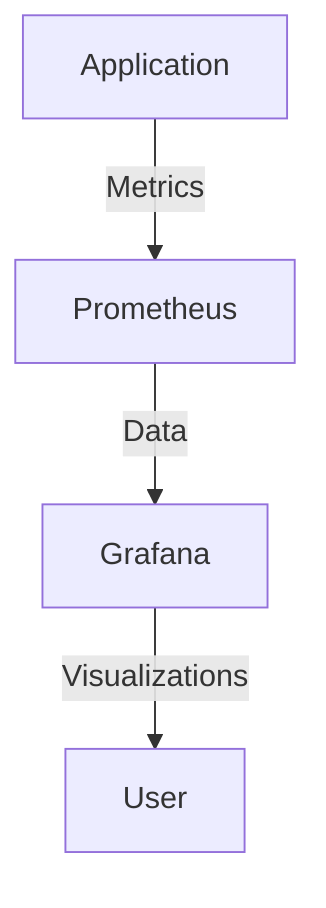

## 23.3 Auditing and Monitoring

In today's fast-paced enterprise environment, ensuring the security and performance of applications is paramount. As you transition from Java to Clojure, understanding how to implement effective auditing and monitoring solutions becomes crucial. This section will guide you through the process of setting up robust logging and monitoring systems in Clojure, drawing parallels with Java practices to ease the transition.

### Introduction to Auditing and Monitoring

Auditing and monitoring are essential components of any enterprise application. They provide insights into application behavior, help detect anomalies, and ensure compliance with security policies. In Java, developers often rely on frameworks like Log4j or SLF4J for logging and tools like Prometheus or Grafana for monitoring. Clojure, with its functional programming paradigm, offers unique approaches to these tasks.

### Implementing Logging in Clojure

Logging is the backbone of any auditing system. It involves recording application events to track the application's behavior over time. In Clojure, logging can be implemented using libraries like `clojure.tools.logging` and `timbre`.

#### Setting Up Logging with `clojure.tools.logging`

`clojure.tools.logging` is a popular choice for logging in Clojure applications. It provides a simple API that integrates with existing Java logging frameworks.

```clojure
(ns my-app.core
  (:require [clojure.tools.logging :as log]))

(defn process-data [data]
  (log/info "Processing data" data)
  ;; Process data
  (log/debug "Data processed successfully"))
```

In this example, we use `log/info` and `log/debug` to log informational and debug messages, respectively. These logs can be configured to output to various destinations, such as the console or a file.

#### Advanced Logging with Timbre

Timbre is another powerful logging library in Clojure that offers more flexibility and features than `clojure.tools.logging`.

```clojure
(ns my-app.core
  (:require [taoensso.timbre :as timbre]))

(timbre/info "Starting application")

(defn process-data [data]
  (timbre/debug "Processing data" data)
  ;; Process data
  (timbre/info "Data processed successfully"))
```

Timbre allows for dynamic log level configuration, custom appenders, and more, making it suitable for complex applications.

### Monitoring Clojure Applications

Monitoring involves tracking the application's performance and health metrics in real-time. This is crucial for identifying bottlenecks and ensuring optimal performance.

#### Integrating with Prometheus

Prometheus is a widely-used monitoring tool that can be integrated with Clojure applications using libraries like `io.prometheus.client`.

```clojure
(ns my-app.metrics
  (:import [io.prometheus.client CollectorRegistry Counter]))

(def requests (Counter/build "requests_total" "Total requests").register))

(defn track-request []
  (.inc requests))
```

In this example, we define a counter metric to track the total number of requests. Prometheus can scrape these metrics and visualize them using tools like Grafana.

#### Using Grafana for Visualization

Grafana is a powerful visualization tool that can be used alongside Prometheus to create dashboards for monitoring application metrics.



This diagram illustrates the flow of data from the application to Prometheus and then to Grafana for visualization.

### Responding to Security Incidents

Effective auditing and monitoring not only help in tracking application performance but also play a critical role in responding to security incidents.

#### Setting Up Alerts

Alerts can be configured in Prometheus to notify developers of potential security incidents.

```yaml
groups:
- name: example
  rules:
  - alert: HighErrorRate
    expr: job:request_errors:rate5m{job="my-app"} > 0.05
    for: 10m
    labels:
      severity: critical
    annotations:
      summary: "High error rate detected"
```

This configuration sets up an alert for a high error rate in the application, notifying the team to investigate further.

#### Incident Response Workflow

Having a well-defined incident response workflow is crucial for minimizing the impact of security incidents.

1. **Detection**: Use monitoring tools to detect anomalies.
2. **Analysis**: Investigate the root cause of the incident.
3. **Containment**: Implement measures to contain the incident.
4. **Eradication**: Remove the cause of the incident.
5. **Recovery**: Restore systems to normal operation.
6. **Lessons Learned**: Analyze the incident to prevent future occurrences.

### Best Practices for Auditing and Monitoring

- **Centralize Logs**: Use a centralized logging system to aggregate logs from different parts of the application.
- **Automate Monitoring**: Automate the monitoring process to reduce manual intervention.
- **Regularly Review Logs**: Regularly review logs to identify patterns and potential issues.
- **Implement Redundancy**: Ensure redundancy in monitoring systems to prevent data loss.

### Conclusion

Auditing and monitoring are critical for maintaining the security and performance of Clojure applications. By leveraging Clojure's functional programming paradigm and integrating with powerful tools like Prometheus and Grafana, you can build robust systems that provide valuable insights into your application's behavior.

### Knowledge Check

- How can you integrate logging in a Clojure application?
- What are the benefits of using Prometheus for monitoring?
- Describe the incident response workflow.

### Further Reading

- [Clojure Tools Logging Documentation](https://clojure.github.io/tools.logging/)
- [Timbre Logging Library](https://github.com/ptaoussanis/timbre)
- [Prometheus Monitoring](https://prometheus.io/)
- [Grafana Visualization](https://grafana.com/)

## **Quiz: Are You Ready to Migrate from Java to Clojure?**



### What is the primary purpose of logging in an application?

- [x] To track application events and behavior
- [ ] To increase application performance
- [ ] To replace monitoring tools
- [ ] To manage application state

> **Explanation:** Logging is used to track application events and behavior, providing insights into how the application is functioning.

### Which Clojure library is commonly used for logging?

- [x] clojure.tools.logging
- [ ] clojure.core.async
- [ ] clojure.data.json
- [ ] clojure.java.jdbc

> **Explanation:** `clojure.tools.logging` is a popular library for logging in Clojure applications.

### What tool is often used alongside Prometheus for visualization?

- [x] Grafana
- [ ] Kibana
- [ ] Splunk
- [ ] Tableau

> **Explanation:** Grafana is commonly used with Prometheus to visualize monitoring data.

### What is the first step in the incident response workflow?

- [x] Detection
- [ ] Analysis
- [ ] Containment
- [ ] Recovery

> **Explanation:** Detection is the first step in the incident response workflow, where anomalies are identified.

### How can alerts be configured in Prometheus?

- [x] Using alerting rules in configuration files
- [ ] By writing custom Java code
- [ ] Through manual monitoring
- [ ] Using a third-party service

> **Explanation:** Alerts in Prometheus are configured using alerting rules defined in configuration files.

### What is a key benefit of centralizing logs?

- [x] Easier aggregation and analysis of logs
- [ ] Improved application performance
- [ ] Reduced storage requirements
- [ ] Increased application complexity

> **Explanation:** Centralizing logs makes it easier to aggregate and analyze them, providing a comprehensive view of application behavior.

### Which of the following is NOT a step in the incident response workflow?

- [ ] Detection
- [ ] Analysis
- [x] Deployment
- [ ] Recovery

> **Explanation:** Deployment is not a step in the incident response workflow.

### What is the role of Prometheus in monitoring?

- [x] Collecting and storing metrics
- [ ] Visualizing data
- [ ] Logging application events
- [ ] Managing application state

> **Explanation:** Prometheus is used for collecting and storing metrics, which can then be visualized using tools like Grafana.

### Why is it important to regularly review logs?

- [x] To identify patterns and potential issues
- [ ] To increase application performance
- [ ] To reduce storage costs
- [ ] To simplify application code

> **Explanation:** Regularly reviewing logs helps identify patterns and potential issues, allowing for proactive maintenance.

### True or False: Timbre is a Clojure library used for monitoring.

- [ ] True
- [x] False

> **Explanation:** Timbre is a Clojure library used for logging, not monitoring.


