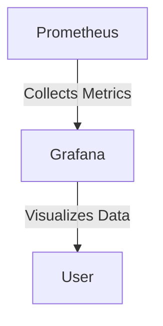

## 23.3 Auditing and Monitoring

In the realm of enterprise software, auditing and monitoring are critical components that ensure the security, reliability, and performance of applications. As organizations transition from Java OOP to Clojure, understanding how to implement effective logging and monitoring solutions becomes essential. This section will guide you through the principles and practices of auditing and monitoring in Clojure, drawing parallels with Java OOP concepts to facilitate a smooth transition.

### Introduction to Auditing and Monitoring

Auditing and monitoring serve as the backbone of a secure and resilient application infrastructure. **Auditing** involves tracking and recording user activities and system events to ensure compliance with policies and regulations. **Monitoring**, on the other hand, involves observing the system's performance and behavior in real-time to detect anomalies and respond to incidents promptly.

#### Key Objectives

- **Implement Logging and Monitoring Solutions**: Learn how to set up robust logging and monitoring frameworks in Clojure.
- **Respond to Security Incidents**: Develop strategies to detect, analyze, and respond to security threats effectively.

### Implementing Logging Solutions in Clojure

Logging is a fundamental aspect of both auditing and monitoring. It provides a historical record of system activities, which is invaluable for troubleshooting, performance tuning, and security analysis.

#### Logging in Java vs. Clojure

In Java, logging is typically handled using frameworks like Log4j or SLF4J. These frameworks provide a structured way to log messages with varying levels of severity (e.g., DEBUG, INFO, WARN, ERROR).

Clojure, being a JVM language, can leverage these existing Java logging frameworks. However, Clojure's functional nature and immutable data structures offer unique advantages in structuring and managing log data.

#### Setting Up Logging in Clojure

To set up logging in Clojure, we can use the [tools.logging](https://github.com/clojure/tools.logging) library, which provides a simple and idiomatic way to integrate with existing Java logging frameworks.

```clojure
(ns myapp.core
  (:require [clojure.tools.logging :as log]))

(defn process-data [data]
  (log/info "Processing data" data)
  ;; Processing logic here
  (log/debug "Data processed successfully"))

(defn handle-error [error]
  (log/error "An error occurred:" error))
```

In this example, we use `clojure.tools.logging` to log messages at different levels. The `log/info` and `log/debug` functions are used to log informational and debug messages, respectively, while `log/error` is used for error messages.

#### Configuring Logging Levels

Configuring logging levels is crucial for controlling the verbosity of log output. In production environments, you might want to log only warnings and errors, while in development, you might include debug and info messages.

```clojure
;; Configure logging levels in resources/logback.xml
<configuration>
  <appender name="STDOUT" class="ch.qos.logback.core.ConsoleAppender">
    <encoder>
      <pattern>%d{HH:mm:ss.SSS} [%thread] %-5level %logger{36} - %msg%n</pattern>
    </encoder>
  </appender>

  <root level="info">
    <appender-ref ref="STDOUT" />
  </root>
</configuration>
```

### Monitoring Solutions in Clojure

Monitoring involves collecting and analyzing metrics to ensure that the application is running smoothly and efficiently. It helps in identifying performance bottlenecks and potential security threats.

#### Monitoring Tools and Libraries

Several tools and libraries can be used for monitoring Clojure applications. Prominent among these are:

- **Prometheus**: A powerful open-source monitoring solution that collects metrics and provides a flexible query language.
- **Grafana**: A visualization tool that integrates with Prometheus to display metrics in an intuitive dashboard.
- **New Relic**: A commercial solution offering comprehensive monitoring and analytics.

#### Integrating Prometheus with Clojure

Prometheus can be integrated with Clojure applications using libraries like [clj-prometheus](https://github.com/clj-commons/clj-prometheus), which provides a simple API for defining and collecting metrics.

```clojure
(ns myapp.metrics
  (:require [clj-prometheus.core :as prometheus]))

(def request-counter
  (prometheus/counter :http_requests_total
                      "Total number of HTTP requests"
                      {:method "GET"}))

(defn record-request []
  (prometheus/inc! request-counter))
```

In this example, we define a counter metric `http_requests_total` to track the number of HTTP requests. The `record-request` function increments this counter each time an HTTP request is processed.

#### Visualizing Metrics with Grafana

Once metrics are collected by Prometheus, they can be visualized using Grafana. Grafana provides a rich set of features for creating interactive dashboards and alerts.



*Diagram: Integration of Prometheus and Grafana for Monitoring Clojure Applications.*

### Responding to Security Incidents

Effective auditing and monitoring enable organizations to respond swiftly to security incidents. This involves detecting anomalies, analyzing logs, and taking corrective actions.

#### Incident Detection and Response

1. **Anomaly Detection**: Use monitoring tools to identify unusual patterns or spikes in metrics that may indicate a security threat.
2. **Log Analysis**: Examine logs to trace the source and nature of the incident.
3. **Corrective Actions**: Implement measures to mitigate the impact of the incident and prevent future occurrences.

#### Automating Incident Response

Automation can significantly enhance the speed and effectiveness of incident response. Tools like [PagerDuty](https://www.pagerduty.com/) and [OpsGenie](https://www.atlassian.com/software/opsgenie) can be integrated with monitoring solutions to automate alerting and incident management.

### Best Practices for Auditing and Monitoring

- **Centralize Logging**: Use a centralized logging system to aggregate logs from different components, making it easier to search and analyze.
- **Define Clear Metrics**: Identify key performance indicators (KPIs) and define metrics that align with business goals.
- **Implement Alerts**: Set up alerts for critical metrics to ensure timely response to potential issues.
- **Regularly Review Logs**: Conduct periodic reviews of logs to identify patterns and improve system performance and security.

### Conclusion

Auditing and monitoring are indispensable for maintaining the security and reliability of enterprise applications. By leveraging Clojure's functional programming paradigm and integrating with powerful monitoring tools, organizations can enhance their ability to detect and respond to security incidents. As you transition from Java OOP to Clojure, embrace these practices to build a robust and secure application infrastructure.

### Further Reading

- [Clojure Official Documentation](https://clojure.org/reference)
- [Clojure Community Resources](https://clojure.org/community/resources)
- [Transitioning from OOP to Functional Programming](https://www.lispcast.com/oo-to-fp/)

## **Quiz: Are You Ready to Migrate from Java to Clojure?**



### What is the primary purpose of auditing in enterprise applications?

- [x] To track and record user activities and system events
- [ ] To improve application performance
- [ ] To enhance user interface design
- [ ] To increase code readability

> **Explanation:** Auditing involves tracking and recording user activities and system events to ensure compliance with policies and regulations.

### Which Clojure library is commonly used for logging?

- [x] clojure.tools.logging
- [ ] clj-http
- [ ] ring.middleware
- [ ] clojure.core.async

> **Explanation:** The `clojure.tools.logging` library provides a simple and idiomatic way to integrate logging in Clojure applications.

### What is the role of Prometheus in monitoring?

- [x] To collect and analyze metrics
- [ ] To visualize data
- [ ] To send alerts
- [ ] To manage user authentication

> **Explanation:** Prometheus is a monitoring solution that collects and analyzes metrics from applications.

### How can Grafana be used in conjunction with Prometheus?

- [x] To visualize metrics collected by Prometheus
- [ ] To collect metrics from applications
- [ ] To send alerts based on metrics
- [ ] To manage application configurations

> **Explanation:** Grafana is used to visualize metrics collected by Prometheus, providing interactive dashboards and alerts.

### What is a key benefit of automating incident response?

- [x] Enhances the speed and effectiveness of incident response
- [ ] Reduces the need for monitoring tools
- [ ] Eliminates the need for logging
- [ ] Increases application performance

> **Explanation:** Automation enhances the speed and effectiveness of incident response by enabling quick detection and management of incidents.

### Which tool can be used for automating alerting and incident management?

- [x] PagerDuty
- [ ] Log4j
- [ ] Leiningen
- [ ] ClojureScript

> **Explanation:** PagerDuty is a tool that can be integrated with monitoring solutions to automate alerting and incident management.

### What is the advantage of centralizing logging?

- [x] Makes it easier to search and analyze logs
- [ ] Increases application performance
- [ ] Reduces the need for monitoring
- [ ] Enhances user interface design

> **Explanation:** Centralizing logging aggregates logs from different components, making it easier to search and analyze.

### What should be done regularly to improve system performance and security?

- [x] Review logs periodically
- [ ] Increase logging levels
- [ ] Reduce the number of metrics
- [ ] Disable alerts

> **Explanation:** Regularly reviewing logs helps identify patterns and improve system performance and security.

### What is the purpose of setting up alerts for critical metrics?

- [x] To ensure timely response to potential issues
- [ ] To reduce the number of logs
- [ ] To enhance application performance
- [ ] To improve user interface design

> **Explanation:** Alerts for critical metrics ensure timely response to potential issues, helping maintain system reliability.

### True or False: Clojure cannot leverage existing Java logging frameworks.

- [ ] True
- [x] False

> **Explanation:** Clojure, being a JVM language, can leverage existing Java logging frameworks like Log4j or SLF4J.


