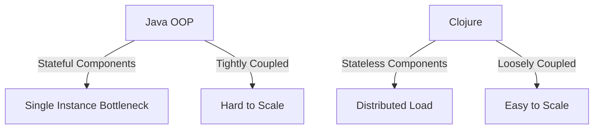

## 24.1 Handling Increased Load

As enterprises transition from Java OOP to Clojure, one of the critical challenges they face is ensuring that their applications can handle increased load effectively. This section delves into designing scalable applications using Clojure, focusing on load balancing and resource management. By leveraging Clojure's functional programming paradigm, we can build systems that are not only robust but also capable of scaling efficiently to meet growing demands.

### Designing Applications for Scalability

Scalability is the ability of a system to handle a growing amount of work by adding resources to the system. In the context of Clojure applications, this involves designing systems that can efficiently manage increased load without compromising performance or reliability.

#### Key Principles of Scalability

1. **Decoupling Components**: Ensure that components are loosely coupled so they can be scaled independently. This is akin to Java's microservices architecture, where each service can be scaled based on its specific load requirements.

2. **Statelessness**: Design components to be stateless wherever possible. Stateless components are easier to scale because they do not require session information to be shared across instances.

3. **Concurrency**: Utilize Clojure's concurrency primitives, such as atoms, refs, and agents, to manage state changes efficiently. This is crucial for handling multiple requests simultaneously without bottlenecks.

4. **Asynchronous Processing**: Implement asynchronous processing to handle tasks that can be performed independently of the main application flow. This reduces wait times and improves overall throughput.

5. **Load Balancing**: Distribute incoming requests across multiple instances to ensure no single instance becomes a bottleneck.

#### Clojure's Functional Paradigm and Scalability

Clojure's functional programming paradigm inherently supports scalability through immutability and pure functions. Immutability ensures that data structures are thread-safe, allowing multiple threads to read data without locks. Pure functions, which do not have side effects, can be executed concurrently without risk of data corruption.

### Load Balancing in Clojure Applications

Load balancing is a critical aspect of handling increased load. It involves distributing incoming network traffic across multiple servers to ensure that no single server is overwhelmed.

#### Types of Load Balancers

1. **Hardware Load Balancers**: These are physical devices that distribute traffic across servers. They are reliable but can be expensive.

2. **Software Load Balancers**: These are applications that run on standard hardware to distribute traffic. Examples include Nginx and HAProxy.

3. **Cloud-Based Load Balancers**: Services provided by cloud providers, such as AWS Elastic Load Balancing, which offer scalable and flexible load balancing solutions.

#### Implementing Load Balancing

To implement load balancing in a Clojure application, follow these steps:

1. **Choose a Load Balancer**: Select a load balancer that fits your infrastructure and budget. For cloud-based applications, consider using the load balancing services provided by your cloud provider.

2. **Configure the Load Balancer**: Set up the load balancer to distribute traffic based on your application's needs. This may involve configuring health checks, session persistence, and SSL termination.

3. **Integrate with Clojure Application**: Ensure your Clojure application is stateless or uses a shared session store to handle distributed requests effectively.

4. **Monitor and Adjust**: Continuously monitor the performance of your load balancer and adjust configurations as needed to optimize performance.

#### Code Example: Asynchronous Processing with Clojure

```clojure
(ns myapp.async
  (:require [clojure.core.async :as async]))

(defn process-request [request]
  ;; Simulate processing a request
  (Thread/sleep 1000)
  (str "Processed: " request))

(defn handle-requests [requests]
  (let [results (async/chan)]
    (doseq [request requests]
      (async/go
        (async/>! results (process-request request))))
    (async/close! results)
    (async/<!! (async/into [] results))))

;; Example usage
(handle-requests ["req1" "req2" "req3"])
```

In this example, we use Clojure's `core.async` library to process requests asynchronously. This allows us to handle multiple requests concurrently, improving the application's ability to scale under increased load.

### Resource Management in Clojure Applications

Effective resource management is crucial for handling increased load. This involves optimizing the use of CPU, memory, and I/O resources to ensure that the application performs efficiently.

#### Strategies for Resource Management

1. **Efficient Data Structures**: Use Clojure's persistent data structures, which are optimized for immutability and concurrency, to manage data efficiently.

2. **Garbage Collection Tuning**: Optimize JVM garbage collection settings to reduce pause times and improve throughput. This is particularly important for applications with high memory usage.

3. **Caching**: Implement caching strategies to reduce the load on backend systems. Caching can be done at various levels, including in-memory caches, distributed caches, and HTTP caching.

4. **Profiling and Monitoring**: Use profiling tools to identify bottlenecks and optimize resource usage. Monitoring tools can help track resource usage and alert you to potential issues before they impact performance.

#### Code Example: Using Caching in Clojure

```clojure
(ns myapp.cache
  (:require [clojure.core.cache :as cache]))

(def my-cache (atom (cache/lru-cache-factory {} :limit 100)))

(defn fetch-data [key]
  (if-let [cached-value (cache/lookup @my-cache key)]
    cached-value
    (let [value (str "Data for " key)]
      (swap! my-cache cache/miss key value)
      value)))

;; Example usage
(fetch-data "key1")
(fetch-data "key2")
```

In this example, we use Clojure's `core.cache` library to implement a simple LRU (Least Recently Used) cache. This reduces the need to fetch data from a slower backend system, improving performance under load.

### Visual Aids

To better understand how Clojure's functional paradigm supports scalability, let's look at a diagram comparing Java OOP and Clojure's approach to handling increased load.



**Diagram Description**: This diagram illustrates the differences between Java OOP and Clojure in handling increased load. Java OOP often involves stateful components and tightly coupled systems, leading to single instance bottlenecks and difficulty in scaling. In contrast, Clojure's stateless components and loosely coupled systems allow for distributed load and easier scalability.

### References and Links

- [Clojure Official Documentation](https://clojure.org/reference)
- [Clojure Community Resources](https://clojure.org/community/resources)
- [Transitioning from OOP to Functional Programming](https://www.lispcast.com/oo-to-fp/)
- [AWS Elastic Load Balancing](https://aws.amazon.com/elasticloadbalancing/)
- [Nginx Load Balancing](https://www.nginx.com/resources/glossary/load-balancing/)

### Knowledge Check

1. **What are the key principles of scalability in Clojure applications?**
2. **How does Clojure's functional paradigm support scalability?**
3. **What are the different types of load balancers, and how do they differ?**
4. **How can asynchronous processing improve scalability in Clojure applications?**
5. **What strategies can be used for effective resource management in Clojure applications?**

### Encouraging Engagement

Embracing functional programming with Clojure can be challenging, but with each step, you'll gain a deeper understanding and see tangible benefits in your codebase. By focusing on scalability, load balancing, and resource management, you can ensure that your applications are ready to handle increased load and meet the demands of your enterprise.

### Quiz: Are You Ready to Migrate from Java to Clojure?



### What is a key principle of scalability in Clojure applications?

- [x] Decoupling components
- [ ] Using mutable state
- [ ] Tightly coupling components
- [ ] Ignoring concurrency

> **Explanation:** Decoupling components allows them to be scaled independently, which is crucial for scalability.

### How does Clojure's functional paradigm support scalability?

- [x] Through immutability and pure functions
- [ ] By using mutable state
- [ ] By tightly coupling components
- [ ] Through complex inheritance hierarchies

> **Explanation:** Immutability and pure functions allow for safe concurrent execution, supporting scalability.

### What is a benefit of using a cloud-based load balancer?

- [x] Scalability and flexibility
- [ ] High cost
- [ ] Limited to on-premises use
- [ ] Requires specialized hardware

> **Explanation:** Cloud-based load balancers offer scalable and flexible solutions, making them ideal for dynamic environments.

### How can asynchronous processing improve scalability?

- [x] By handling tasks independently of the main application flow
- [ ] By increasing wait times
- [ ] By using synchronous processing
- [ ] By reducing throughput

> **Explanation:** Asynchronous processing reduces wait times and improves throughput, enhancing scalability.

### What is a strategy for effective resource management?

- [x] Implementing caching
- [ ] Increasing garbage collection pause times
- [ ] Using inefficient data structures
- [ ] Ignoring profiling tools

> **Explanation:** Caching reduces load on backend systems, improving resource management.

### What is a benefit of using Clojure's persistent data structures?

- [x] They are optimized for immutability and concurrency
- [ ] They require locks for thread safety
- [ ] They are mutable
- [ ] They are inefficient for concurrent use

> **Explanation:** Clojure's persistent data structures are immutable and optimized for concurrency, making them ideal for scalable applications.

### What is a characteristic of stateless components?

- [x] They do not require session information to be shared
- [ ] They are stateful
- [ ] They require session information to be shared
- [ ] They are tightly coupled

> **Explanation:** Stateless components do not require session information to be shared, making them easier to scale.

### What is a benefit of using Clojure's `core.async` library?

- [x] It allows for asynchronous processing
- [ ] It requires synchronous processing
- [ ] It increases wait times
- [ ] It reduces throughput

> **Explanation:** `core.async` enables asynchronous processing, improving scalability.

### What is a key difference between Java OOP and Clojure in handling increased load?

- [x] Clojure uses stateless components
- [ ] Java OOP uses stateless components
- [ ] Clojure uses tightly coupled systems
- [ ] Java OOP uses loosely coupled systems

> **Explanation:** Clojure's use of stateless components allows for distributed load and easier scalability.

### True or False: Clojure's functional paradigm inherently supports scalability.

- [x] True
- [ ] False

> **Explanation:** Clojure's functional paradigm, with its emphasis on immutability and pure functions, inherently supports scalability.


