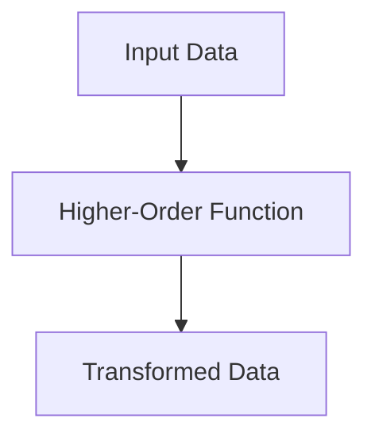
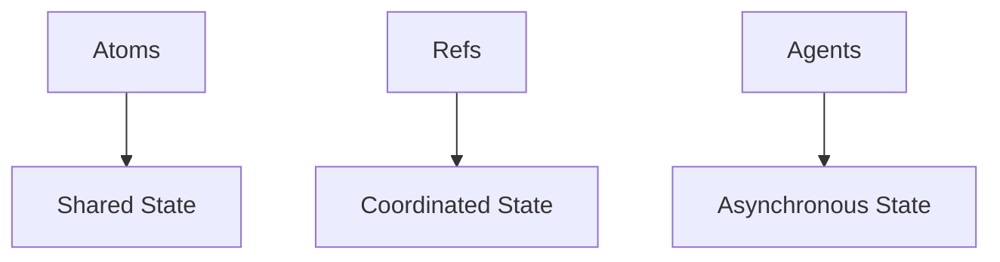

## 24.1 Handling Increased Load

As enterprises grow, their applications must scale to handle increased load efficiently. Transitioning from Java OOP to Clojure offers unique opportunities to leverage functional programming paradigms for scalability. In this section, we will explore strategies for designing scalable Clojure applications, focusing on load balancing and resource management. We will draw parallels with Java concepts to facilitate a smooth transition for experienced Java developers.

### Designing Applications for Scalability

Scalability is the ability of a system to handle increased load by adding resources. In Clojure, scalability is achieved through functional programming principles, immutability, and efficient concurrency models. Let's explore these concepts and how they contribute to scalable applications.

#### Functional Programming and Immutability

Functional programming emphasizes pure functions and immutability, which are key to building scalable systems. In Clojure, data structures are immutable, meaning they cannot be changed after creation. This immutability allows for safe concurrent access, reducing the complexity of managing shared state.

**Java Example: Mutable State**

```java
// Java code with mutable state
public class Counter {
    private int count = 0;

    public synchronized void increment() {
        count++;
    }

    public synchronized int getCount() {
        return count;
    }
}
```

**Clojure Example: Immutable State**

```clojure
;; Clojure code with immutable state
(defn increment [counter]
  (inc counter))

(def counter 0)
(def new-counter (increment counter))
```

In the Clojure example, the `increment` function returns a new value without modifying the original `counter`. This approach eliminates race conditions and makes the code inherently thread-safe.

#### Concurrency Models

Clojure provides several concurrency primitives, such as atoms, refs, and agents, to manage state changes safely and efficiently. These primitives enable developers to design systems that can scale horizontally by distributing load across multiple threads or nodes.

**Atoms for Shared State**

Atoms are used for managing shared, synchronous, and independent state. They provide a way to update state atomically, ensuring consistency.

```clojure
(def counter (atom 0))

(defn increment-counter []
  (swap! counter inc))
```

In this example, `swap!` ensures that updates to `counter` are atomic, preventing race conditions.

**Refs for Coordinated State**

Refs are used for coordinated, synchronous updates to multiple pieces of state. They leverage Software Transactional Memory (STM) to ensure consistency.

```clojure
(def account-a (ref 100))
(def account-b (ref 200))

(defn transfer [amount]
  (dosync
    (alter account-a - amount)
    (alter account-b + amount)))
```

The `dosync` block ensures that the transfer operation is atomic and consistent across both accounts.

**Agents for Asynchronous State**

Agents are used for managing asynchronous state changes. They allow updates to be processed in the background, improving responsiveness.

```clojure
(def log-agent (agent []))

(defn log-message [message]
  (send log-agent conj message))
```

In this example, `send` queues the update to `log-agent`, allowing the application to continue processing other tasks.

### Load Balancing and Resource Management

Load balancing and resource management are critical for handling increased load in enterprise applications. Let's explore strategies for implementing these concepts in Clojure.

#### Load Balancing

Load balancing distributes incoming requests across multiple servers or processes to ensure optimal resource utilization and prevent any single server from becoming a bottleneck.

**Round-Robin Load Balancing**

Round-robin is a simple load balancing strategy that distributes requests evenly across a pool of servers.

```clojure
(def servers ["server1" "server2" "server3"])
(defn round-robin [requests]
  (map #(nth servers (mod % (count servers))) requests))
```

In this example, requests are distributed evenly across the servers using the modulo operation.

**Weighted Load Balancing**

Weighted load balancing assigns different weights to servers based on their capacity, allowing more powerful servers to handle more requests.

```clojure
(def server-weights {"server1" 1 "server2" 2 "server3" 3})
(defn weighted-round-robin [requests]
  (let [total-weight (reduce + (vals server-weights))]
    (map #(nth (keys server-weights) (mod % total-weight)) requests)))
```

This approach ensures that servers with higher weights receive more requests.

#### Resource Management

Efficient resource management is essential for maintaining performance under increased load. Clojure's functional programming model simplifies resource management by reducing side effects and improving predictability.

**Thread Pool Management**

Managing thread pools effectively is crucial for handling concurrent requests. Clojure's `future` and `pmap` functions provide simple ways to parallelize tasks.

```clojure
(defn process-tasks [tasks]
  (pmap (fn [task] (do-some-work task)) tasks))
```

`pmap` processes tasks in parallel, utilizing available CPU cores efficiently.

**Memory Management**

Clojure's garbage collection and persistent data structures help manage memory efficiently. However, developers should be mindful of memory usage, especially when dealing with large datasets.

**Profiling and Optimization**

Profiling tools can help identify bottlenecks and optimize performance. Clojure's `criterium` library provides benchmarking capabilities to measure function execution times.

```clojure
(require '[criterium.core :refer [quick-bench]])

(quick-bench (do-some-work))
```

### Visual Aids

To better understand the flow of data and concurrency models in Clojure, let's use some diagrams.

#### Flow of Data Through Higher-Order Functions



*Caption: This diagram illustrates how input data flows through a higher-order function to produce transformed data.*

#### Concurrency Models in Clojure



*Caption: This diagram shows the different concurrency models in Clojure and their respective use cases.*

### References and Links

For further reading on Clojure's concurrency models and functional programming principles, consider the following resources:

- [Official Clojure Documentation](https://clojure.org/reference/documentation)
- [ClojureDocs](https://clojuredocs.org/)
- [Clojure Concurrency](https://clojure.org/reference/concurrency)

### Knowledge Check

To reinforce your understanding of handling increased load in Clojure applications, consider the following questions:

1. How does immutability contribute to scalability in Clojure?
2. What are the differences between atoms, refs, and agents in Clojure?
3. How can load balancing improve the performance of a Clojure application?
4. What strategies can be used for effective resource management in Clojure?

### Encouraging Tone

Now that we've explored how Clojure's functional programming principles and concurrency models can help handle increased load, let's apply these concepts to design scalable enterprise applications. Remember, the key to success is leveraging Clojure's strengths to build efficient, maintainable, and scalable systems.

### Best Practices for Tags

- "Clojure"
- "Functional Programming"
- "Scalability"
- "Concurrency"
- "Load Balancing"
- "Resource Management"
- "Java Interoperability"
- "Enterprise Applications"

## **Quiz: Are You Ready to Migrate from Java to Clojure?**



### How does immutability contribute to scalability in Clojure?

- [x] It allows safe concurrent access to data.
- [ ] It increases memory usage.
- [ ] It makes code harder to read.
- [ ] It requires more complex algorithms.

> **Explanation:** Immutability ensures that data cannot be changed, allowing safe concurrent access and reducing the complexity of managing shared state.

### What is the primary use of atoms in Clojure?

- [x] Managing shared, synchronous, and independent state.
- [ ] Coordinating updates to multiple pieces of state.
- [ ] Managing asynchronous state changes.
- [ ] Handling large datasets.

> **Explanation:** Atoms are used for managing shared, synchronous, and independent state, ensuring atomic updates.

### How does round-robin load balancing work?

- [x] It distributes requests evenly across a pool of servers.
- [ ] It assigns different weights to servers based on capacity.
- [ ] It processes requests in a random order.
- [ ] It prioritizes requests based on importance.

> **Explanation:** Round-robin load balancing distributes requests evenly across servers, ensuring optimal resource utilization.

### Which concurrency model in Clojure is used for asynchronous state changes?

- [x] Agents
- [ ] Atoms
- [ ] Refs
- [ ] Futures

> **Explanation:** Agents are used for managing asynchronous state changes, allowing updates to be processed in the background.

### What is the purpose of the `dosync` block in Clojure?

- [x] To ensure atomic and consistent updates across multiple refs.
- [ ] To manage asynchronous state changes.
- [ ] To handle errors in Clojure applications.
- [ ] To optimize memory usage.

> **Explanation:** The `dosync` block ensures that updates to multiple refs are atomic and consistent, leveraging Software Transactional Memory (STM).

### How can `pmap` improve performance in Clojure applications?

- [x] By parallelizing tasks and utilizing available CPU cores.
- [ ] By managing shared state atomically.
- [ ] By coordinating updates to multiple pieces of state.
- [ ] By handling asynchronous state changes.

> **Explanation:** `pmap` processes tasks in parallel, utilizing available CPU cores efficiently to improve performance.

### What is the advantage of using weighted load balancing?

- [x] It allows more powerful servers to handle more requests.
- [ ] It distributes requests evenly across servers.
- [ ] It processes requests in a random order.
- [ ] It prioritizes requests based on importance.

> **Explanation:** Weighted load balancing assigns different weights to servers based on their capacity, allowing more powerful servers to handle more requests.

### Which Clojure library provides benchmarking capabilities?

- [x] Criterium
- [ ] Core.async
- [ ] Ring
- [ ] Compojure

> **Explanation:** The `criterium` library provides benchmarking capabilities to measure function execution times and optimize performance.

### What is a key benefit of using functional programming in Clojure?

- [x] Reduced side effects and improved predictability.
- [ ] Increased memory usage.
- [ ] More complex algorithms.
- [ ] Harder to read code.

> **Explanation:** Functional programming reduces side effects and improves predictability, making it easier to build scalable systems.

### True or False: Immutability in Clojure eliminates race conditions.

- [x] True
- [ ] False

> **Explanation:** Immutability ensures that data cannot be changed, eliminating race conditions and making code inherently thread-safe.


