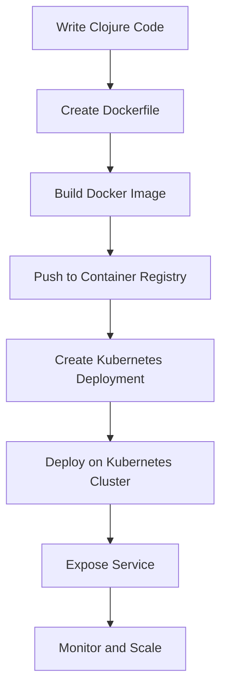

## 24.2 Microservices and Cloud Deployment

As enterprises increasingly adopt cloud-native architectures, deploying applications as microservices has become a standard practice. This approach offers numerous benefits, including enhanced scalability, resilience, and flexibility. In this section, we will explore how to effectively deploy Clojure applications in cloud environments using microservices architecture and container orchestration tools. We will draw parallels with Java-based deployments to help you leverage your existing knowledge while transitioning to Clojure.

### Understanding Microservices Architecture

Microservices architecture is a design pattern where an application is composed of small, independent services that communicate over a network. Each service is responsible for a specific business capability and can be developed, deployed, and scaled independently.

#### Key Characteristics of Microservices:

- **Decentralization**: Each service is autonomous and can be developed using different technologies.
- **Resilience**: Failure in one service does not affect the entire system.
- **Scalability**: Services can be scaled independently based on demand.
- **Flexibility**: Easier to update and deploy individual services without affecting others.

#### Comparison with Monolithic Architecture:

In contrast, a monolithic architecture involves building an application as a single, unified unit. While simpler to develop initially, monolithic applications can become difficult to scale and maintain as they grow.

**Java Example:**

```java
// Monolithic Java Application
public class MonolithicApp {
    public static void main(String[] args) {
        // All components are tightly coupled
        UserService userService = new UserService();
        OrderService orderService = new OrderService();
        PaymentService paymentService = new PaymentService();

        // Business logic
    }
}
```

**Clojure Example:**

```clojure
;; Microservices in Clojure
(defn user-service []
  ;; Independent service logic
  )

(defn order-service []
  ;; Independent service logic
  )

(defn payment-service []
  ;; Independent service logic
  )
```

### Deploying Clojure Applications in Cloud Environments

Deploying applications in the cloud involves several steps, including containerization, orchestration, and monitoring. Let's explore each of these components in detail.

#### Containerization with Docker

Containers are lightweight, portable units that package an application and its dependencies, ensuring consistent behavior across different environments. Docker is a popular tool for containerization.

**Steps to Containerize a Clojure Application:**

1. **Create a Dockerfile**: Define the environment and dependencies for your Clojure application.

   ```dockerfile
   # Use the official Clojure image
   FROM clojure:latest

   # Set the working directory
   WORKDIR /app

   # Copy the project files
   COPY . .

   # Install dependencies and build the application
   RUN lein uberjar

   # Define the command to run the application
   CMD ["java", "-jar", "target/myapp.jar"]
   ```

2. **Build the Docker Image**: Use the Docker CLI to build the image.

   ```bash
   docker build -t my-clojure-app .
   ```

3. **Run the Container**: Start the container using the built image.

   ```bash
   docker run -p 8080:8080 my-clojure-app
   ```

#### Orchestration with Kubernetes

Kubernetes is a powerful orchestration tool that automates the deployment, scaling, and management of containerized applications.

**Key Concepts in Kubernetes:**

- **Pods**: The smallest deployable units that can contain one or more containers.
- **Services**: Abstractions that define a logical set of pods and a policy to access them.
- **Deployments**: Manage the deployment and scaling of pods.

**Deploying a Clojure Application with Kubernetes:**

1. **Define a Deployment**: Create a YAML file to specify the deployment configuration.

   ```yaml
   apiVersion: apps/v1
   kind: Deployment
   metadata:
     name: clojure-app-deployment
   spec:
     replicas: 3
     selector:
       matchLabels:
         app: clojure-app
     template:
       metadata:
         labels:
           app: clojure-app
       spec:
         containers:
         - name: clojure-app
           image: my-clojure-app
           ports:
           - containerPort: 8080
   ```

2. **Apply the Deployment**: Use the `kubectl` command to apply the configuration.

   ```bash
   kubectl apply -f deployment.yaml
   ```

3. **Expose the Service**: Create a service to expose the application to external traffic.

   ```yaml
   apiVersion: v1
   kind: Service
   metadata:
     name: clojure-app-service
   spec:
     type: LoadBalancer
     ports:
     - port: 80
       targetPort: 8080
     selector:
       app: clojure-app
   ```

   ```bash
   kubectl apply -f service.yaml
   ```

#### Monitoring and Logging

Monitoring and logging are crucial for maintaining the health and performance of microservices. Tools like Prometheus and Grafana can be used to monitor metrics, while ELK Stack (Elasticsearch, Logstash, Kibana) is popular for logging.

**Integrating Monitoring with Clojure:**

- **Prometheus**: Use the [clj-prometheus](https://github.com/clj-commons/clj-prometheus) library to expose metrics from your Clojure application.
- **Grafana**: Visualize the metrics collected by Prometheus.
- **ELK Stack**: Collect and analyze logs from your Clojure services.

### Leveraging Cloud Providers

Cloud providers like AWS, Google Cloud, and Azure offer managed services that simplify the deployment and management of microservices.

#### AWS Elastic Kubernetes Service (EKS)

AWS EKS is a managed Kubernetes service that simplifies running Kubernetes on AWS without needing to install and operate your own Kubernetes control plane.

**Steps to Deploy on AWS EKS:**

1. **Create an EKS Cluster**: Use the AWS Management Console or CLI to create a cluster.
2. **Configure kubectl**: Set up `kubectl` to interact with your EKS cluster.
3. **Deploy Applications**: Use Kubernetes manifests to deploy your Clojure applications.
4. **Monitor and Scale**: Utilize AWS CloudWatch for monitoring and auto-scaling.

#### Google Kubernetes Engine (GKE)

GKE is a managed Kubernetes service on Google Cloud that offers a fully managed environment for deploying, managing, and scaling containerized applications.

**Deploying on GKE:**

1. **Create a GKE Cluster**: Use the Google Cloud Console or `gcloud` CLI.
2. **Deploy Applications**: Use Kubernetes manifests to deploy your Clojure applications.
3. **Monitor and Scale**: Use Google Cloud's monitoring and logging services.

### Best Practices for Microservices and Cloud Deployment

- **Design for Failure**: Implement retries, circuit breakers, and fallbacks to handle failures gracefully.
- **Automate Everything**: Use CI/CD pipelines to automate testing, building, and deployment.
- **Secure Your Services**: Implement authentication, authorization, and encryption.
- **Optimize Resource Usage**: Use autoscaling and resource quotas to manage costs.

### Try It Yourself

Now that we've explored how to deploy Clojure applications using microservices architecture, try containerizing a simple Clojure web application and deploying it on a Kubernetes cluster. Experiment with scaling the application and monitoring its performance.

### Visual Aids

Below is a diagram illustrating the flow of deploying a Clojure application using Docker and Kubernetes:



### References and Links

- [Official Clojure Documentation](https://clojure.org/)
- [Docker Documentation](https://docs.docker.com/)
- [Kubernetes Documentation](https://kubernetes.io/docs/)
- [AWS EKS Documentation](https://docs.aws.amazon.com/eks/)
- [Google GKE Documentation](https://cloud.google.com/kubernetes-engine/docs)

### Knowledge Check

- What are the key characteristics of microservices architecture?
- How does containerization benefit cloud deployment?
- What are the steps to deploy a Clojure application using Kubernetes?
- How can you monitor and log Clojure applications in a cloud environment?

### Quiz: Are You Ready to Migrate from Java to Clojure?



### What is a key benefit of microservices architecture?

- [x] Independent scalability of services
- [ ] Tightly coupled components
- [ ] Single point of failure
- [ ] Unified technology stack

> **Explanation:** Microservices architecture allows each service to be scaled independently, enhancing scalability and flexibility.

### Which tool is commonly used for containerization?

- [x] Docker
- [ ] Kubernetes
- [ ] Prometheus
- [ ] Grafana

> **Explanation:** Docker is a popular tool for containerizing applications, ensuring consistent behavior across environments.

### What is the role of Kubernetes in cloud deployment?

- [x] Orchestrating containerized applications
- [ ] Monitoring application performance
- [ ] Logging application data
- [ ] Building Docker images

> **Explanation:** Kubernetes automates the deployment, scaling, and management of containerized applications.

### Which cloud provider offers Elastic Kubernetes Service (EKS)?

- [x] AWS
- [ ] Google Cloud
- [ ] Azure
- [ ] IBM Cloud

> **Explanation:** AWS offers Elastic Kubernetes Service (EKS) as a managed Kubernetes service.

### What is a common tool for monitoring Clojure applications?

- [x] Prometheus
- [ ] Docker
- [ ] Kubernetes
- [ ] Jenkins

> **Explanation:** Prometheus is commonly used to monitor metrics from applications, including those written in Clojure.

### How can you expose a Clojure application to external traffic in Kubernetes?

- [x] Create a Service
- [ ] Create a Pod
- [ ] Create a Deployment
- [ ] Create a ConfigMap

> **Explanation:** A Service in Kubernetes is used to expose applications to external traffic.

### What is the purpose of a Dockerfile?

- [x] Define the environment and dependencies for an application
- [ ] Monitor application performance
- [ ] Scale applications automatically
- [ ] Log application data

> **Explanation:** A Dockerfile specifies the environment and dependencies needed to run an application in a container.

### Which tool is used for visualizing metrics collected by Prometheus?

- [x] Grafana
- [ ] Docker
- [ ] Kubernetes
- [ ] Jenkins

> **Explanation:** Grafana is used to visualize metrics collected by Prometheus, providing insights into application performance.

### What is a key practice for securing microservices?

- [x] Implementing authentication and encryption
- [ ] Using a single point of failure
- [ ] Tightly coupling services
- [ ] Ignoring resource usage

> **Explanation:** Implementing authentication, authorization, and encryption is crucial for securing microservices.

### True or False: Kubernetes can only be used with Docker containers.

- [ ] True
- [x] False

> **Explanation:** Kubernetes can orchestrate containers from various runtimes, not just Docker.



By understanding and implementing these concepts, you can effectively deploy and manage Clojure applications in cloud environments, leveraging the power of microservices architecture and container orchestration tools.
