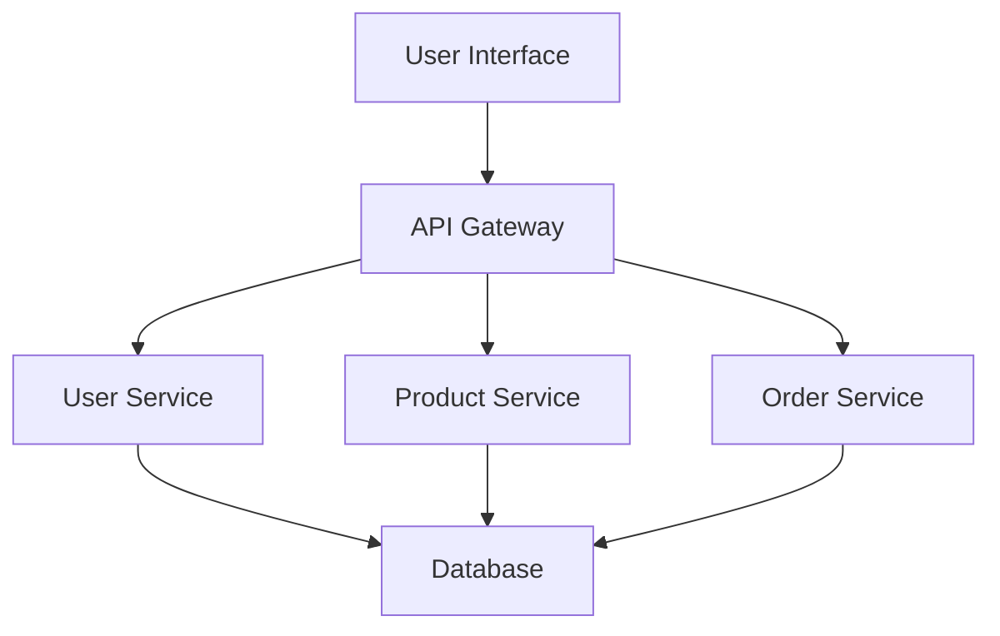

## 24.2 Microservices and Cloud Deployment

As enterprises transition from Java Object-Oriented Programming (OOP) to Clojure's functional paradigm, deploying applications in cloud environments becomes a critical aspect of scaling and maintaining modern software systems. This section delves into the intricacies of deploying Clojure applications using microservices architecture, leveraging containers, and utilizing orchestration tools to ensure seamless cloud deployment.

### Introduction to Microservices Architecture

Microservices architecture is a design pattern where applications are composed of small, independent services that communicate over a network. This approach contrasts with monolithic architectures, where all components are tightly integrated into a single application. Microservices offer several advantages, including improved scalability, flexibility, and resilience.

#### Key Characteristics of Microservices

- **Decentralization**: Each service is developed, deployed, and scaled independently.
- **Resilience**: Failure in one service does not affect the entire system.
- **Scalability**: Services can be scaled independently based on demand.
- **Technology Agnostic**: Different services can be developed using different technologies.

### Transitioning from Java OOP to Clojure Microservices

Migrating from Java OOP to Clojure involves rethinking how applications are structured and deployed. Clojure's functional programming model aligns well with the principles of microservices, offering benefits such as immutability, simplicity, and ease of concurrency.

#### Mapping Java OOP Concepts to Clojure

- **Classes and Objects**: In Clojure, use namespaces and data structures instead of classes and objects.
- **Inheritance**: Favor composition over inheritance by using protocols and multimethods.
- **State Management**: Leverage immutable data structures and functional state management techniques.

### Deploying Clojure Applications in Cloud Environments

Cloud environments provide the infrastructure needed to deploy and scale applications efficiently. Clojure applications can be deployed in various cloud platforms, such as AWS, Google Cloud, and Azure, using containers and orchestration tools.

#### Leveraging Containers

Containers encapsulate an application and its dependencies, ensuring consistency across different environments. Docker is a popular containerization platform that simplifies the deployment of Clojure applications.

##### Dockerizing a Clojure Application

1. **Create a Dockerfile**: Define the environment and dependencies for your Clojure application.

    ```dockerfile
    # Use the official Clojure image
    FROM clojure:latest

    # Set the working directory
    WORKDIR /app

    # Copy the project files
    COPY . /app

    # Install dependencies and build the application
    RUN lein deps && lein uberjar

    # Define the command to run the application
    CMD ["java", "-jar", "target/myapp.jar"]
    ```

2. **Build the Docker Image**: Use the Docker CLI to build the image.

    ```bash
    docker build -t my-clojure-app .
    ```

3. **Run the Container**: Deploy the containerized application.

    ```bash
    docker run -p 8080:8080 my-clojure-app
    ```

#### Orchestration Tools

Orchestration tools manage the deployment, scaling, and operation of containerized applications. Kubernetes is a leading orchestration platform that automates the deployment of Clojure microservices.

##### Deploying Clojure Microservices with Kubernetes

1. **Define a Kubernetes Deployment**: Specify the desired state of your application.

    ```yaml
    apiVersion: apps/v1
    kind: Deployment
    metadata:
      name: clojure-app
    spec:
      replicas: 3
      selector:
        matchLabels:
          app: clojure-app
      template:
        metadata:
          labels:
            app: clojure-app
        spec:
          containers:
          - name: clojure-app
            image: my-clojure-app:latest
            ports:
            - containerPort: 8080
    ```

2. **Create a Service**: Expose your application to external traffic.

    ```yaml
    apiVersion: v1
    kind: Service
    metadata:
      name: clojure-app-service
    spec:
      type: LoadBalancer
      ports:
      - port: 80
        targetPort: 8080
      selector:
        app: clojure-app
    ```

3. **Deploy to Kubernetes**: Use `kubectl` to apply the configuration.

    ```bash
    kubectl apply -f deployment.yaml
    kubectl apply -f service.yaml
    ```

### Best Practices for Microservices and Cloud Deployment

Deploying Clojure applications in a microservices architecture requires careful planning and execution. Here are some best practices to consider:

#### Design for Failure

- Implement retries and circuit breakers to handle transient failures.
- Use health checks to monitor the status of services.

#### Optimize for Scalability

- Use horizontal scaling to add more instances of a service.
- Employ load balancing to distribute traffic evenly across services.

#### Ensure Security

- Use secure communication protocols (e.g., HTTPS) between services.
- Implement authentication and authorization mechanisms.

#### Monitor and Log

- Use centralized logging and monitoring tools to track application performance.
- Set up alerts for critical issues and anomalies.

### Real-World Example: Migrating a Java Monolith to Clojure Microservices

Consider a Java-based e-commerce platform that needs to be migrated to a Clojure microservices architecture. The platform consists of several components, including user management, product catalog, and order processing.

#### Migration Steps

1. **Identify Boundaries**: Break down the monolith into smaller, independent services.
2. **Refactor Code**: Translate Java classes and methods into Clojure functions and namespaces.
3. **Containerize Services**: Use Docker to package each service.
4. **Deploy to Cloud**: Use Kubernetes to manage the deployment and scaling of services.

#### Outcomes and Benefits

- **Improved Scalability**: Services can be scaled independently based on demand.
- **Enhanced Resilience**: Failures in one service do not affect the entire platform.
- **Faster Deployment**: Continuous integration and deployment pipelines streamline updates.

### Visual Aids

#### Microservices Architecture Diagram



*Diagram: A high-level view of a microservices architecture for an e-commerce platform.*

### References and Further Reading

- [Clojure Official Documentation](https://clojure.org/reference)
- [Docker Documentation](https://docs.docker.com/)
- [Kubernetes Documentation](https://kubernetes.io/docs/home/)
- [Transitioning from OOP to Functional Programming](https://www.lispcast.com/oo-to-fp/)

### Knowledge Check

- **What are the key characteristics of microservices architecture?**
- **How does Clojure's functional paradigm align with microservices principles?**
- **What are the steps to containerize a Clojure application using Docker?**
- **How can Kubernetes be used to manage Clojure microservices?**
- **What are some best practices for deploying microservices in cloud environments?**

### Exercises

1. **Dockerize a Sample Clojure Application**: Create a Dockerfile for a simple Clojure web application and deploy it using Docker.
2. **Deploy a Clojure Microservice on Kubernetes**: Set up a Kubernetes cluster and deploy a Clojure microservice using the provided YAML configuration.
3. **Implement a Circuit Breaker Pattern**: Add a circuit breaker to a Clojure microservice to handle failures gracefully.

### Summary

Deploying Clojure applications in cloud environments using microservices architecture offers numerous benefits, including scalability, resilience, and flexibility. By leveraging containers and orchestration tools, enterprises can efficiently manage and scale their applications. As you transition from Java OOP to Clojure, embrace the functional paradigm and explore the possibilities of microservices and cloud deployment.

## **Quiz: Are You Ready to Migrate from Java to Clojure?**



### What is a key advantage of microservices architecture?

- [x] Improved scalability
- [ ] Tightly coupled components
- [ ] Single point of failure
- [ ] Monolithic design

> **Explanation:** Microservices architecture allows for improved scalability by enabling independent scaling of services.

### How does Clojure's functional paradigm benefit microservices?

- [x] Immutability and simplicity
- [ ] Complex state management
- [ ] Tight coupling of services
- [ ] Inheritance-based design

> **Explanation:** Clojure's functional paradigm, with its emphasis on immutability and simplicity, aligns well with the principles of microservices.

### What tool is commonly used for containerizing applications?

- [x] Docker
- [ ] Maven
- [ ] Gradle
- [ ] Ant

> **Explanation:** Docker is a popular tool for containerizing applications, providing consistency across environments.

### Which orchestration tool is widely used for managing containerized applications?

- [x] Kubernetes
- [ ] Jenkins
- [ ] Ansible
- [ ] Puppet

> **Explanation:** Kubernetes is a leading orchestration tool for automating the deployment and scaling of containerized applications.

### What is a best practice for ensuring security in microservices?

- [x] Use secure communication protocols
- [ ] Ignore authentication
- [ ] Allow open access to all services
- [ ] Disable logging

> **Explanation:** Using secure communication protocols, such as HTTPS, is a best practice for ensuring security in microservices.

### What is the purpose of a Dockerfile?

- [x] Define the environment and dependencies for an application
- [ ] Compile Java code
- [ ] Manage database connections
- [ ] Create user interfaces

> **Explanation:** A Dockerfile is used to define the environment and dependencies needed to run an application in a container.

### How can Kubernetes help with scaling applications?

- [x] By managing replicas of services
- [ ] By reducing the number of servers
- [ ] By increasing code complexity
- [ ] By disabling monitoring

> **Explanation:** Kubernetes helps with scaling applications by managing replicas of services, allowing for horizontal scaling.

### What is a circuit breaker pattern used for?

- [x] Handling failures gracefully
- [ ] Increasing service dependencies
- [ ] Reducing code readability
- [ ] Disabling error handling

> **Explanation:** The circuit breaker pattern is used to handle failures gracefully, preventing cascading failures in microservices.

### What is a common challenge when migrating from monolithic to microservices architecture?

- [x] Identifying service boundaries
- [ ] Reducing code quality
- [ ] Increasing deployment time
- [ ] Decreasing system resilience

> **Explanation:** Identifying service boundaries is a common challenge when migrating from a monolithic to a microservices architecture.

### True or False: Microservices architecture is inherently more secure than monolithic architecture.

- [ ] True
- [x] False

> **Explanation:** Microservices architecture is not inherently more secure; it requires careful implementation of security practices.


