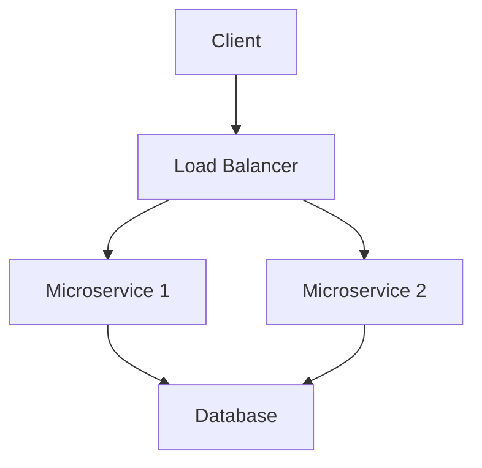

## 24.3 Distributed Systems Considerations

As enterprises transition from Java Object-Oriented Programming (OOP) to Clojure's functional programming paradigm, understanding the intricacies of distributed systems becomes crucial. Distributed systems are inherently complex due to their need to manage multiple interconnected components across various environments. This section delves into the challenges and solutions associated with distributed architectures, focusing on ensuring consistency, reliability, and scalability when migrating to Clojure.

### Understanding Distributed Systems

Distributed systems consist of multiple independent components that communicate and coordinate their actions by passing messages. These systems are designed to achieve a common goal, such as handling large-scale computations or managing vast amounts of data across different locations. Key characteristics of distributed systems include:

- **Scalability**: The ability to handle growing amounts of work by adding resources.
- **Fault Tolerance**: The system's capacity to continue operating properly in the event of the failure of some of its components.
- **Consistency**: Ensuring that all nodes in the system reflect the same data at any given time.
- **Latency**: The time taken for a message to travel from one node to another.

### Challenges in Distributed Systems

#### 1. Consistency

Consistency in distributed systems refers to the guarantee that all nodes see the same data at the same time. In Java, consistency is often managed through synchronized methods and locks, which can be complex and error-prone. Clojure, with its immutable data structures and Software Transactional Memory (STM), offers a more straightforward approach to achieving consistency.

**Example: Clojure's STM for Consistency**

```clojure
(def account-balance (ref 1000))

(defn transfer [amount]
  (dosync
    (alter account-balance - amount)))
```

In this example, `dosync` ensures that the transaction is atomic, consistent, isolated, and durable (ACID), making it easier to maintain consistency across distributed nodes.

#### 2. Reliability

Reliability involves ensuring that the system continues to function correctly even when parts of it fail. Java applications often rely on exception handling and retry mechanisms to manage reliability. Clojure provides robust error handling through its `ex-info` and custom exception mechanisms, allowing developers to create more resilient systems.

**Example: Error Handling in Clojure**

```clojure
(defn safe-divide [numerator denominator]
  (try
    (/ numerator denominator)
    (catch ArithmeticException e
      (println "Cannot divide by zero"))))
```

This function demonstrates how Clojure can handle errors gracefully, ensuring that the system remains reliable even when unexpected conditions occur.

#### 3. Scalability

Scalability is the ability of a system to handle increased load by adding resources. Java applications often use multi-threading and distributed computing frameworks like Apache Hadoop to achieve scalability. Clojure, with its emphasis on immutability and functional programming, simplifies the development of scalable applications.

**Example: Parallel Processing in Clojure**

```clojure
(defn process-data [data]
  (pmap #(do-something %) data))
```

Using `pmap`, Clojure can process data in parallel, leveraging multiple cores to improve performance and scalability.

### Ensuring Consistency and Reliability in Clojure

#### Leveraging Clojure's Immutability

Clojure's immutable data structures are a cornerstone for building consistent and reliable distributed systems. By ensuring that data cannot be modified once created, Clojure eliminates many of the concurrency issues that plague mutable state in Java applications.

**Benefits of Immutability:**

- **Thread Safety**: Immutable data structures are inherently thread-safe, reducing the need for complex synchronization.
- **Predictability**: Functions that operate on immutable data are easier to reason about, leading to more predictable and reliable systems.

#### Using Clojure's Concurrency Primitives

Clojure provides several concurrency primitives, such as atoms, refs, and agents, which facilitate the development of distributed systems by managing state changes in a controlled manner.

- **Atoms**: For managing independent, synchronous updates to shared state.
- **Refs**: For coordinated, synchronous updates to shared state using STM.
- **Agents**: For asynchronous updates to shared state.

**Example: Using Atoms for State Management**

```clojure
(def counter (atom 0))

(defn increment-counter []
  (swap! counter inc))
```

In this example, `swap!` ensures that updates to the `counter` atom are atomic, providing a simple yet effective way to manage state in a distributed system.

### Designing for Scalability

#### Embracing Microservices Architecture

Microservices architecture is a popular approach for building scalable distributed systems. By breaking down applications into smaller, independent services, enterprises can scale individual components as needed. Clojure's lightweight nature and interoperability with Java make it an excellent choice for developing microservices.

**Example: Clojure Microservice**

```clojure
(ns my-microservice.core
  (:require [ring.adapter.jetty :refer [run-jetty]]
            [compojure.core :refer [defroutes GET]]
            [compojure.route :as route]))

(defroutes app-routes
  (GET "/" [] "Hello, World!")
  (route/not-found "Not Found"))

(defn -main []
  (run-jetty app-routes {:port 3000}))
```

This simple Clojure microservice uses the Ring and Compojure libraries to handle HTTP requests, demonstrating how Clojure can be used to build scalable web services.

#### Utilizing Cloud Services

Cloud platforms like AWS, Google Cloud, and Azure offer scalable infrastructure that can be leveraged to deploy Clojure applications. By using cloud services, enterprises can dynamically allocate resources based on demand, ensuring that their systems remain responsive and cost-effective.

**Example: Deploying a Clojure Application on AWS**

1. **Containerize the Application**: Use Docker to create a container image of your Clojure application.
2. **Deploy to AWS ECS**: Use AWS Elastic Container Service (ECS) to deploy and manage your containerized application.
3. **Scale with Auto Scaling**: Configure AWS Auto Scaling to automatically adjust the number of running containers based on traffic.

### Addressing Latency and Network Partitioning

Latency and network partitioning are common challenges in distributed systems. Clojure's functional programming paradigm, combined with its rich ecosystem of libraries, provides tools to address these issues effectively.

#### Reducing Latency

Latency can be minimized by optimizing data processing and leveraging caching mechanisms. Clojure's lazy sequences and transducers offer efficient ways to process large datasets with minimal overhead.

**Example: Using Transducers for Efficient Data Processing**

```clojure
(defn process-large-dataset [dataset]
  (transduce (map inc) + dataset))
```

Transducers allow for efficient data transformation without the need for intermediate collections, reducing latency in data processing pipelines.

#### Handling Network Partitioning

Network partitioning occurs when there is a loss of communication between nodes in a distributed system. Clojure's emphasis on immutability and state management primitives can help mitigate the effects of network partitioning by ensuring that state changes are consistent and recoverable.

**Example: Using Refs for Consistent State Updates**

```clojure
(def shared-state (ref {}))

(defn update-state [key value]
  (dosync
    (alter shared-state assoc key value)))
```

By using `refs` and `dosync`, Clojure ensures that state updates are atomic and consistent, even in the presence of network partitions.

### Visualizing Distributed Systems in Clojure

To better understand how distributed systems operate in Clojure, let's visualize the architecture and data flow using Mermaid.js diagrams.

#### Architecture Diagram



**Diagram Description:** This diagram illustrates a simple distributed system architecture with a load balancer distributing requests to multiple microservices, which in turn interact with a shared database.

#### Data Flow Diagram


**Diagram Description:** This diagram shows the data flow within a microservice, from receiving a user request to processing data and updating the database before sending a response.

### Best Practices for Distributed Systems in Clojure

1. **Design for Failure**: Assume that components will fail and design your system to handle failures gracefully.
2. **Use Immutable Data**: Leverage Clojure's immutable data structures to simplify concurrency and state management.
3. **Embrace Asynchronous Processing**: Use Clojure's agents and core.async library for non-blocking, asynchronous processing.
4. **Optimize for Latency**: Use lazy sequences and transducers to minimize latency in data processing.
5. **Leverage Cloud Services**: Utilize cloud platforms for scalable infrastructure and services.

### Conclusion

Migrating from Java OOP to Clojure for distributed systems offers numerous benefits, including improved consistency, reliability, and scalability. By leveraging Clojure's functional programming paradigm, immutable data structures, and concurrency primitives, enterprises can build robust distributed systems that meet the demands of modern applications. As you continue your migration journey, remember to embrace the unique features of Clojure and apply best practices to ensure a successful transition.

For further reading, explore the [Clojure Official Documentation](https://clojure.org/reference) and [Clojure Community Resources](https://clojure.org/community/resources) to deepen your understanding of Clojure's capabilities in distributed systems.

---

## **Quiz: Are You Ready to Migrate from Java to Clojure?**



### What is a key benefit of using Clojure's immutable data structures in distributed systems?

- [x] They simplify concurrency and state management.
- [ ] They increase the complexity of data handling.
- [ ] They require more memory than mutable structures.
- [ ] They are only useful for small datasets.

> **Explanation:** Immutable data structures are inherently thread-safe, reducing the need for complex synchronization and simplifying concurrency and state management.

### How does Clojure's STM help maintain consistency in distributed systems?

- [x] By ensuring atomic, consistent, isolated, and durable transactions.
- [ ] By allowing unrestricted access to shared state.
- [ ] By using locks and synchronized methods.
- [ ] By increasing the complexity of state management.

> **Explanation:** Clojure's STM provides a mechanism for managing state changes in a controlled manner, ensuring transactions are atomic, consistent, isolated, and durable (ACID).

### Which Clojure concurrency primitive is best suited for asynchronous updates to shared state?

- [x] Agents
- [ ] Atoms
- [ ] Refs
- [ ] Vars

> **Explanation:** Agents are designed for asynchronous updates to shared state, allowing non-blocking operations.

### What is a common challenge in distributed systems that Clojure's functional programming paradigm helps address?

- [x] Consistency
- [ ] Increased memory usage
- [ ] Reduced performance
- [ ] Limited scalability

> **Explanation:** Clojure's functional programming paradigm, with its emphasis on immutability and pure functions, helps address consistency challenges in distributed systems.

### How can Clojure's transducers help reduce latency in data processing?

- [x] By eliminating the need for intermediate collections.
- [ ] By increasing the complexity of data transformations.
- [ ] By requiring more memory for processing.
- [ ] By slowing down data processing pipelines.

> **Explanation:** Transducers allow for efficient data transformation without the need for intermediate collections, reducing latency in data processing pipelines.

### What is a key advantage of using microservices architecture in distributed systems?

- [x] It allows for independent scaling of components.
- [ ] It increases the complexity of deployment.
- [ ] It limits the flexibility of the system.
- [ ] It requires more resources than monolithic architectures.

> **Explanation:** Microservices architecture allows for independent scaling of components, making it easier to manage and scale distributed systems.

### How does Clojure's `dosync` function contribute to state management in distributed systems?

- [x] It ensures atomic and consistent state updates.
- [ ] It allows for unrestricted access to shared state.
- [ ] It increases the complexity of state management.
- [ ] It is only useful for small datasets.

> **Explanation:** The `dosync` function ensures that state updates are atomic and consistent, providing a controlled mechanism for managing state changes.

### What is a benefit of deploying Clojure applications on cloud platforms?

- [x] Dynamic resource allocation based on demand.
- [ ] Increased complexity of deployment.
- [ ] Limited scalability.
- [ ] Higher costs than on-premises solutions.

> **Explanation:** Cloud platforms offer dynamic resource allocation based on demand, ensuring that systems remain responsive and cost-effective.

### Which Clojure library is commonly used for building web services?

- [x] Ring
- [ ] Core.async
- [ ] Transducers
- [ ] Refs

> **Explanation:** The Ring library is commonly used for building web services in Clojure, providing a simple and flexible way to handle HTTP requests.

### True or False: Clojure's functional programming paradigm inherently increases the complexity of distributed systems.

- [ ] True
- [x] False

> **Explanation:** Clojure's functional programming paradigm simplifies distributed systems by emphasizing immutability and pure functions, reducing complexity.




