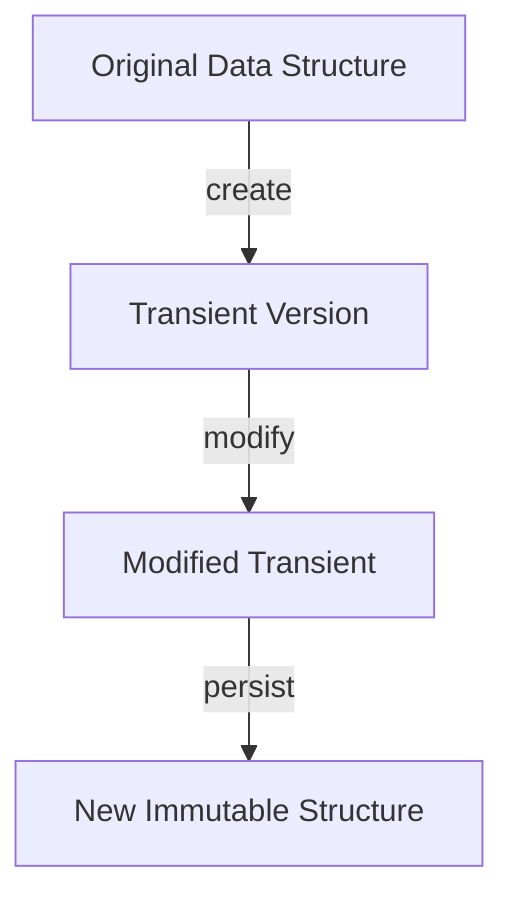
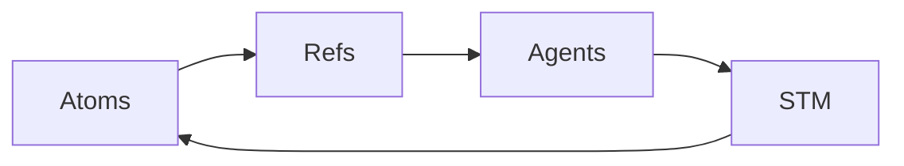

## 25.1 Emerging Trends in Clojure Development

As we delve into the emerging trends in Clojure development, it's essential to recognize how these advancements can enhance your transition from Java to Clojure. This section will explore the latest language features, innovative libraries, and frameworks that are shaping the future of Clojure. We'll also provide practical examples and insights to help you leverage these trends effectively in your enterprise applications.

### Staying Updated with the Latest Language Features

Clojure, as a dynamic and evolving language, continually introduces new features that enhance its expressiveness and efficiency. Staying updated with these features is crucial for developers aiming to harness the full potential of Clojure.

#### 1. Enhanced Immutability and Data Structures

Clojure's commitment to immutability is one of its defining characteristics. Recent updates have introduced more sophisticated immutable data structures that offer improved performance and flexibility.

- **Transient Data Structures**: These are temporary mutable versions of persistent data structures that allow for efficient batch updates before being converted back to immutable forms. This feature is particularly useful in scenarios where performance is critical.

```clojure
;; Example of using transient data structures
(defn update-collection [coll]
  (persistent! (reduce conj! (transient coll) [4 5 6])))

;; Usage
(update-collection [1 2 3]) ;; => [1 2 3 4 5 6]
```

- **New Collection Types**: Clojure continues to expand its collection types, offering more options for developers to choose the most efficient data structure for their needs.

#### 2. Improved Concurrency Models

Concurrency remains a significant focus in Clojure, with ongoing enhancements to its concurrency primitives. Understanding these improvements can help you build more robust and scalable applications.

- **Core.async Enhancements**: The core.async library has seen updates that simplify asynchronous programming, making it easier to manage complex workflows.

```clojure
(require '[clojure.core.async :as async])

;; Example of using core.async channels
(let [ch (async/chan)]
  (async/go
    (async/>! ch "Hello, Clojure!"))
  (println (async/<!! ch))) ;; => "Hello, Clojure!"
```

- **STM (Software Transactional Memory) Improvements**: Clojure's STM system has been refined to offer better performance and easier integration with other concurrency models.

#### 3. Language Syntax and Semantics

Clojure's syntax continues to evolve, with new constructs that simplify code and enhance readability.

- **Destructuring Enhancements**: Recent updates have improved destructuring capabilities, allowing for more concise and expressive code.

```clojure
;; Enhanced destructuring example
(let [{:keys [name age]} {:name "Alice" :age 30}]
  (println name age)) ;; => "Alice 30"
```

- **Pattern Matching**: While not yet a core feature, pattern matching is gaining traction in the Clojure community, with libraries providing powerful pattern matching capabilities.

### Exploring New Libraries and Frameworks

The Clojure ecosystem is rich with libraries and frameworks that extend the language's capabilities. Keeping abreast of these developments can significantly enhance your productivity and the functionality of your applications.

#### 1. Web Development Frameworks

Clojure's web development landscape is continually evolving, with frameworks that offer both simplicity and power.

- **Reitit**: A fast data-driven routing library for Clojure/Script, Reitit is gaining popularity for its flexibility and performance.

```clojure
(require '[reitit.ring :as ring])

;; Example of a simple Reitit route
(def app
  (ring/ring-handler
    (ring/router
      [["/hello" {:get (fn [_] {:status 200 :body "Hello, World!"})}]])))

;; Usage with a Ring server
```

- **Luminus**: A comprehensive framework for building web applications, Luminus integrates various libraries to provide a cohesive development experience.

#### 2. Data Processing and Analysis

Clojure's functional nature makes it well-suited for data processing and analysis, with libraries that simplify these tasks.

- **Tablecloth**: A data processing library built on top of tech.ml.dataset, Tablecloth offers a user-friendly API for data manipulation.

```clojure
(require '[tablecloth.api :as tc])

;; Example of using Tablecloth for data manipulation
(def data (tc/dataset {:a [1 2 3] :b [4 5 6]}))
(tc/select-columns data [:a]) ;; => {:a [1 2 3]}
```

- **Clojure Data Science (ClojureD)**: An emerging ecosystem for data science in Clojure, ClojureD provides tools for machine learning, data visualization, and more.

#### 3. Testing and Quality Assurance

Testing is a critical aspect of software development, and Clojure offers robust tools to ensure code quality.

- **Test.check**: A property-based testing library that allows for more comprehensive test coverage by generating test cases.

```clojure
(require '[clojure.test.check :as tc])
(require '[clojure.test.check.generators :as gen])
(require '[clojure.test.check.properties :as prop])

;; Example of a simple property test
(def prop-reverse-idempotent
  (prop/for-all [v (gen/vector gen/int)]
    (= v (reverse (reverse v)))))

(tc/quick-check 100 prop-reverse-idempotent)
```

- **Kaocha**: A flexible and extensible test runner that supports various testing libraries and provides a unified testing experience.

### Leveraging Clojure's Unique Features

Clojure's unique features, such as its Lisp heritage and emphasis on simplicity, continue to influence its development and adoption.

#### 1. Lisp Macros and Metaprogramming

Clojure's macro system allows developers to extend the language and create domain-specific languages (DSLs).

- **Macro Enhancements**: Recent updates have made macros more powerful and easier to use, enabling more sophisticated metaprogramming.

```clojure
;; Example of a simple macro
(defmacro unless [condition & body]
  `(if (not ~condition)
     (do ~@body)))

;; Usage
(unless false
  (println "This will print")) ;; => "This will print"
```

#### 2. Interoperability with Java

Clojure's seamless interoperability with Java remains a significant advantage, allowing developers to leverage existing Java libraries and frameworks.

- **Java Interop Improvements**: Ongoing enhancements to Clojure's Java interop capabilities make it easier to integrate Clojure into Java-based systems.

```clojure
;; Example of calling Java methods from Clojure
(.toUpperCase "clojure") ;; => "CLOJURE"
```

#### 3. Community and Ecosystem Growth

The Clojure community continues to grow, with increasing contributions to open-source projects and a vibrant ecosystem of libraries and tools.

- **Community Initiatives**: Initiatives like ClojureBridge and various conferences foster community engagement and knowledge sharing.

### Visual Aids and Diagrams

To better understand these emerging trends, let's explore some visual aids that illustrate key concepts.

#### Immutability and Persistent Data Structures



*Figure 1: Flow of data through transient and persistent data structures.*

#### Concurrency Models in Clojure



*Figure 2: Concurrency models in Clojure and their interactions.*

### References and Further Reading

For more information on the topics covered in this section, consider exploring the following resources:

- [Official Clojure Documentation](https://clojure.org/)
- [ClojureDocs](https://clojuredocs.org/)
- [Clojure GitHub Repository](https://github.com/clojure/clojure)
- [Core.async Documentation](https://clojure.github.io/core.async/)
- [Reitit Documentation](https://metosin.github.io/reitit/)
- [Tablecloth Documentation](https://scicloj.github.io/tablecloth/)

### Knowledge Check

Let's test your understanding of the emerging trends in Clojure development with some questions and challenges.

1. **What are transient data structures, and how do they improve performance?**

2. **Explain how core.async simplifies asynchronous programming in Clojure.**

3. **Describe the benefits of using Reitit for web development in Clojure.**

4. **How does Clojure's macro system enhance metaprogramming capabilities?**

5. **Discuss the importance of Clojure's interoperability with Java.**

### Encouraging Tone

Now that we've explored the emerging trends in Clojure development, you're well-equipped to leverage these advancements in your projects. Embrace the power of Clojure's functional programming paradigm and stay ahead in the ever-evolving technology landscape.

### Quiz: Are You Ready to Migrate from Java to Clojure?



### What is a key advantage of using transient data structures in Clojure?

- [x] They allow for efficient batch updates before converting back to immutable forms.
- [ ] They are always mutable and replace persistent data structures.
- [ ] They are used for managing concurrency in Clojure.
- [ ] They simplify the syntax of Clojure code.

> **Explanation:** Transient data structures provide a temporary mutable version of persistent data structures, allowing for efficient batch updates before being converted back to immutable forms.

### How does core.async enhance asynchronous programming in Clojure?

- [x] By providing channels for communication between concurrent processes.
- [ ] By replacing all existing concurrency models in Clojure.
- [ ] By offering a new syntax for asynchronous operations.
- [ ] By eliminating the need for threads in Clojure applications.

> **Explanation:** Core.async provides channels that facilitate communication between concurrent processes, simplifying the management of asynchronous workflows.

### Which library is gaining popularity for its flexibility and performance in web development?

- [x] Reitit
- [ ] Luminus
- [ ] Tablecloth
- [ ] Test.check

> **Explanation:** Reitit is a fast data-driven routing library for Clojure/Script, known for its flexibility and performance in web development.

### What is a benefit of using macros in Clojure?

- [x] They allow developers to extend the language and create domain-specific languages.
- [ ] They replace functions in Clojure.
- [ ] They are used exclusively for error handling.
- [ ] They simplify the process of writing loops.

> **Explanation:** Macros in Clojure enable developers to extend the language and create domain-specific languages, enhancing metaprogramming capabilities.

### Why is Clojure's interoperability with Java important?

- [x] It allows developers to leverage existing Java libraries and frameworks.
- [ ] It replaces the need for Java in enterprise applications.
- [ ] It simplifies the syntax of Clojure code.
- [ ] It eliminates the need for concurrency models in Clojure.

> **Explanation:** Clojure's interoperability with Java allows developers to leverage existing Java libraries and frameworks, facilitating integration into Java-based systems.

### What is a recent enhancement in Clojure's concurrency models?

- [x] Improvements to Software Transactional Memory (STM).
- [ ] Introduction of new mutable data structures.
- [ ] Elimination of all concurrency models.
- [ ] Replacement of core.async with a new library.

> **Explanation:** Recent enhancements in Clojure's concurrency models include improvements to Software Transactional Memory (STM), offering better performance and integration.

### How does Tablecloth simplify data manipulation in Clojure?

- [x] By providing a user-friendly API built on top of tech.ml.dataset.
- [ ] By replacing all existing data structures in Clojure.
- [ ] By offering a new syntax for data operations.
- [ ] By eliminating the need for data processing libraries.

> **Explanation:** Tablecloth simplifies data manipulation in Clojure by providing a user-friendly API built on top of tech.ml.dataset, making data processing more accessible.

### What is a feature of Kaocha in Clojure testing?

- [x] It supports various testing libraries and provides a unified testing experience.
- [ ] It replaces all existing testing frameworks in Clojure.
- [ ] It eliminates the need for test cases.
- [ ] It simplifies the syntax of Clojure code.

> **Explanation:** Kaocha is a flexible and extensible test runner that supports various testing libraries, providing a unified testing experience in Clojure.

### What is the role of pattern matching in Clojure?

- [x] It provides powerful pattern matching capabilities through libraries.
- [ ] It replaces all existing control structures in Clojure.
- [ ] It simplifies the syntax of Clojure code.
- [ ] It eliminates the need for functions in Clojure.

> **Explanation:** Pattern matching in Clojure provides powerful capabilities through libraries, allowing for more expressive and concise code.

### True or False: Clojure's community and ecosystem are stagnant and not growing.

- [ ] True
- [x] False

> **Explanation:** False. The Clojure community continues to grow, with increasing contributions to open-source projects and a vibrant ecosystem of libraries and tools.


