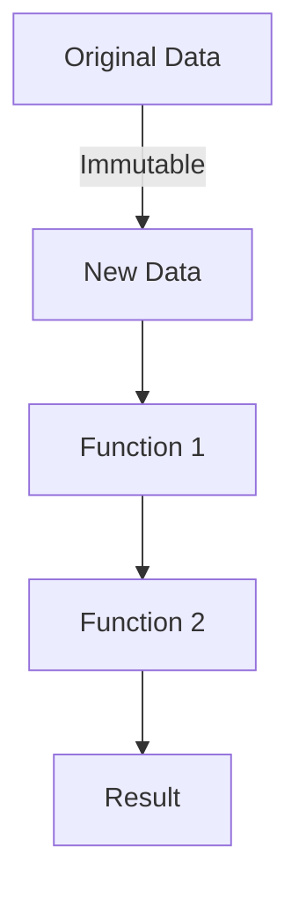
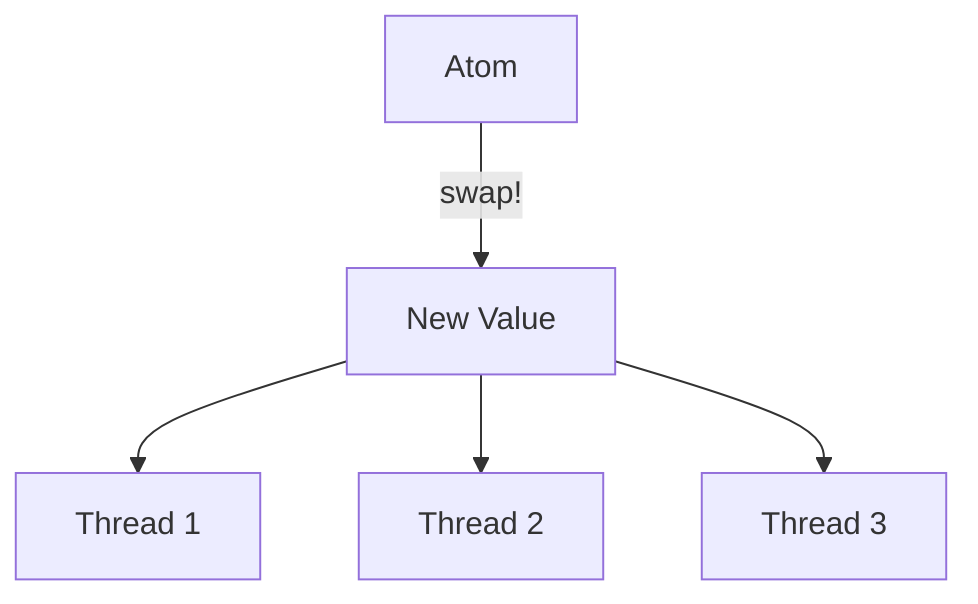

## 25.2 Continuous Evolution of Enterprise Systems

In today's rapidly changing business environment, enterprise systems must evolve continuously to remain competitive and meet emerging demands. This section explores how Clojure, with its functional programming paradigm, supports the continuous evolution of enterprise systems. We will delve into adapting to changing business needs and embracing innovation and technological advancements.

### Adapting to Changing Business Needs

Enterprise systems must be flexible and adaptable to accommodate new business requirements, regulatory changes, and market dynamics. Clojure's functional programming model offers several advantages that facilitate this adaptability.

#### 1. **Immutability and Stability**

Clojure's emphasis on immutability ensures that data structures are stable and predictable. This stability is crucial when systems need to adapt quickly to new requirements without introducing bugs or inconsistencies.

```clojure
;; Example of immutable data structure in Clojure
(def customer {:id 1 :name "Alice" :balance 1000})

;; Attempting to change the balance
(def updated-customer (assoc customer :balance 1200))

;; Original customer remains unchanged
(println customer) ;; => {:id 1, :name "Alice", :balance 1000}
(println updated-customer) ;; => {:id 1, :name "Alice", :balance 1200}
```

In contrast, Java developers often deal with mutable objects, which can lead to unintended side effects when changes are made.

```java
// Java example with mutable object
class Customer {
    int id;
    String name;
    double balance;

    Customer(int id, String name, double balance) {
        this.id = id;
        this.name = name;
        this.balance = balance;
    }

    void updateBalance(double newBalance) {
        this.balance = newBalance;
    }
}

Customer customer = new Customer(1, "Alice", 1000);
customer.updateBalance(1200);
System.out.println(customer.balance); // 1200
```

#### 2. **Modularity and Reusability**

Clojure encourages modularity through its use of namespaces and functions, making it easier to reuse code and adapt systems to new requirements.

```clojure
;; Define a namespace for customer operations
(ns customer.operations)

(defn update-balance [customer new-balance]
  (assoc customer :balance new-balance))

;; Reuse the function in different contexts
(ns billing.system
  (:require [customer.operations :as ops]))

(defn process-payment [customer amount]
  (ops/update-balance customer (- (:balance customer) amount)))
```

Java developers can achieve modularity through classes and interfaces, but Clojure's functional approach often results in more concise and flexible code.

#### 3. **Concurrency and Scalability**

Clojure's concurrency models, such as atoms, refs, and agents, allow for scalable and responsive systems that can handle increasing loads and complex interactions.

```clojure
;; Using an atom for managing state
(def account-balance (atom 1000))

;; Update balance concurrently
(swap! account-balance + 200)
(println @account-balance) ;; => 1200
```

Java's concurrency mechanisms, while powerful, can be more complex and error-prone due to mutable state and thread synchronization issues.

#### 4. **Rapid Prototyping and Iteration**

Clojure's REPL (Read-Eval-Print Loop) environment supports rapid prototyping and iterative development, allowing developers to test and refine ideas quickly.

```clojure
;; Start a REPL session and experiment with code
(defn greet [name]
  (str "Hello, " name "!"))

(greet "World") ;; => "Hello, World!"
```

Java developers can use tools like JUnit for testing, but the interactive nature of the Clojure REPL provides immediate feedback and accelerates the development process.

### Embracing Innovation and Technological Advancements

To stay ahead in the competitive technology landscape, enterprises must embrace innovation and leverage new technologies. Clojure's design and ecosystem support this pursuit of innovation.

#### 1. **Interoperability with Java**

Clojure runs on the Java Virtual Machine (JVM), allowing seamless integration with existing Java libraries and frameworks. This interoperability enables enterprises to leverage their existing Java investments while adopting Clojure's functional programming benefits.

```clojure
;; Calling a Java method from Clojure
(import 'java.util.Date)

(defn current-time []
  (.toString (Date.)))

(current-time) ;; => "Mon Nov 25 12:34:56 UTC 2024"
```

#### 2. **Rich Ecosystem and Libraries**

Clojure boasts a rich ecosystem of libraries and tools that support various domains, from web development to data analysis. The Clojure community actively contributes to open-source projects, fostering innovation and collaboration.

- **Ring**: A library for building web applications.
- **Compojure**: A routing library for Ring.
- **Luminus**: A framework for building web applications.

#### 3. **Functional Programming Paradigm**

Clojure's functional programming paradigm encourages developers to think differently about problem-solving, leading to innovative solutions that are often more concise and expressive than their imperative counterparts.

```clojure
;; Example of functional composition
(defn square [x] (* x x))
(defn add-one [x] (+ x 1))

(defn square-and-add-one [x]
  (-> x
      square
      add-one))

(square-and-add-one 4) ;; => 17
```

In Java, achieving similar functionality might require more boilerplate code and less intuitive constructs.

#### 4. **Support for Modern Architectures**

Clojure is well-suited for modern architectures such as microservices and cloud-native applications. Its lightweight nature and emphasis on immutability make it ideal for distributed systems.

```clojure
;; Example of a simple microservice endpoint using Ring
(require '[ring.adapter.jetty :refer [run-jetty]]
         '[ring.util.response :refer [response]])

(defn handler [request]
  (response "Hello, Microservice!"))

(run-jetty handler {:port 3000})
```

Java developers can also build microservices, but Clojure's simplicity and expressiveness often result in more maintainable and scalable solutions.

### Visualizing Clojure's Advantages

To better understand how Clojure supports the continuous evolution of enterprise systems, let's visualize some key concepts using diagrams.

#### **Immutability and Data Flow**



*Caption: This diagram illustrates how data flows through a series of functions in Clojure, with each function producing a new immutable data structure.*

#### **Concurrency with Atoms**



*Caption: This diagram shows how multiple threads can safely update an atom's value using the `swap!` function.*

### References and Further Reading

- [Official Clojure Documentation](https://clojure.org/)
- [ClojureDocs](https://clojuredocs.org/)
- [GitHub - Clojure Libraries](https://github.com/clojure)

### Knowledge Check

To reinforce your understanding of how Clojure supports the continuous evolution of enterprise systems, consider the following questions and exercises.

1. **What are the benefits of immutability in Clojure, and how do they compare to Java's mutable objects?**

2. **How does Clojure's REPL environment facilitate rapid prototyping and iterative development?**

3. **Experiment with the provided Clojure code examples. Try modifying the `update-balance` function to apply a discount to the customer's balance.**

4. **Explore the Clojure ecosystem. Identify a library or tool that could benefit your current project and experiment with its features.**

5. **Discuss how Clojure's functional programming paradigm encourages innovative problem-solving compared to Java's object-oriented approach.**

### Encouraging Tone

Now that we've explored how Clojure facilitates the continuous evolution of enterprise systems, let's apply these concepts to modernize and enhance your applications. Embrace the power of functional programming to adapt to changing business needs and drive innovation within your organization.

### Quiz: Are You Ready to Migrate from Java to Clojure?



### What is one of the main advantages of immutability in Clojure?

- [x] It ensures data stability and predictability.
- [ ] It allows for mutable state changes.
- [ ] It makes debugging more difficult.
- [ ] It requires more memory usage.

> **Explanation:** Immutability ensures that data structures remain stable and predictable, reducing the risk of unintended side effects.

### How does Clojure's REPL environment benefit developers?

- [x] It allows for rapid prototyping and immediate feedback.
- [ ] It complicates the development process.
- [ ] It is only useful for debugging.
- [ ] It replaces the need for testing.

> **Explanation:** The REPL environment supports rapid prototyping by providing immediate feedback, allowing developers to test and refine ideas quickly.

### What is a key feature of Clojure's concurrency model?

- [x] It uses atoms, refs, and agents for managing state.
- [ ] It relies solely on synchronized blocks.
- [ ] It does not support concurrency.
- [ ] It requires manual thread management.

> **Explanation:** Clojure's concurrency model uses atoms, refs, and agents to manage state safely and efficiently.

### How does Clojure's functional programming paradigm encourage innovation?

- [x] By promoting concise and expressive code.
- [ ] By enforcing strict object-oriented principles.
- [ ] By limiting the use of functions.
- [ ] By discouraging code reuse.

> **Explanation:** Clojure's functional programming paradigm encourages concise and expressive code, leading to innovative solutions.

### What is a benefit of Clojure's interoperability with Java?

- [x] It allows seamless integration with existing Java libraries.
- [ ] It requires rewriting all Java code.
- [ ] It limits access to Java's features.
- [ ] It only works with specific Java versions.

> **Explanation:** Clojure's interoperability with Java allows developers to leverage existing Java libraries and frameworks seamlessly.

### How does Clojure support modern architectures like microservices?

- [x] By being lightweight and emphasizing immutability.
- [ ] By requiring complex configurations.
- [ ] By discouraging distributed systems.
- [ ] By being incompatible with cloud environments.

> **Explanation:** Clojure's lightweight nature and emphasis on immutability make it well-suited for modern architectures like microservices.

### What is the role of namespaces in Clojure?

- [x] They help organize code and promote modularity.
- [ ] They are used for defining classes.
- [ ] They limit code reuse.
- [ ] They complicate dependency management.

> **Explanation:** Namespaces in Clojure help organize code and promote modularity, making it easier to reuse and adapt code.

### How does Clojure's functional composition benefit developers?

- [x] It allows for building complex functions from simpler ones.
- [ ] It discourages code reuse.
- [ ] It complicates function definitions.
- [ ] It limits the use of higher-order functions.

> **Explanation:** Functional composition in Clojure allows developers to build complex functions from simpler ones, promoting code reuse and clarity.

### What is a challenge when transitioning from Java to Clojure?

- [x] Adapting to the functional programming paradigm.
- [ ] Losing access to Java libraries.
- [ ] Dealing with increased code verbosity.
- [ ] Managing mutable state more frequently.

> **Explanation:** Transitioning from Java to Clojure involves adapting to the functional programming paradigm, which can be a shift for developers accustomed to object-oriented programming.

### True or False: Clojure's emphasis on immutability makes it unsuitable for enterprise systems.

- [ ] True
- [x] False

> **Explanation:** Clojure's emphasis on immutability actually enhances the stability and predictability of enterprise systems, making it suitable for such environments.


