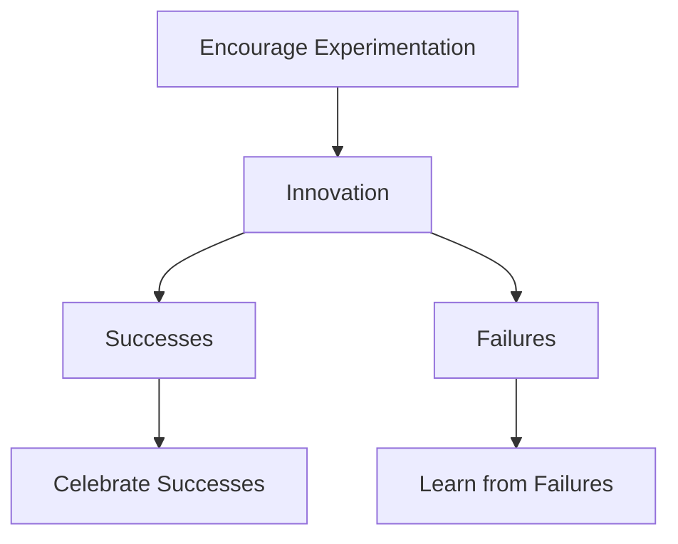
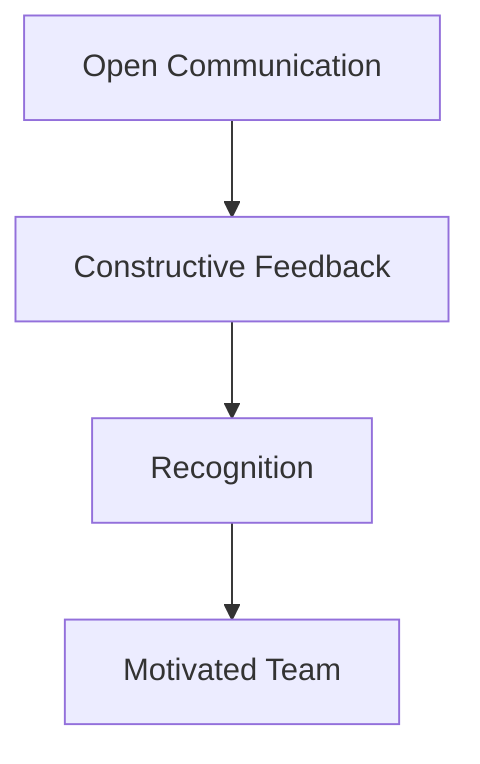
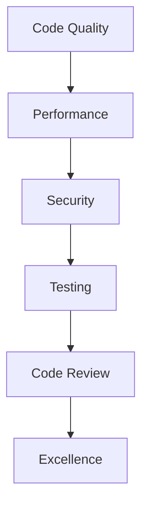

## 25.3 Building a Sustainable Development Culture

Transitioning from Java Object-Oriented Programming (OOP) to Clojure's functional programming paradigm is not just a technical shift; it is a cultural transformation that can significantly impact your organization's development practices. In this section, we will explore how to build a sustainable development culture that supports long-term growth and continuous improvement, with a focus on investing in team development and learning.

### Fostering Long-Term Growth and Improvement

To create a sustainable development culture, it is essential to focus on long-term growth and continuous improvement. This involves cultivating an environment where learning is encouraged, collaboration is prioritized, and innovation is rewarded.

#### Encourage Continuous Learning

Continuous learning is the cornerstone of a sustainable development culture. Encourage your team to stay updated with the latest trends in functional programming and Clojure. Provide access to resources such as online courses, workshops, and conferences. Consider setting up a learning budget that allows team members to pursue certifications or attend relevant events.

**Example:**

```clojure
;; Encourage team members to explore new Clojure libraries and share their findings
(defn explore-new-library [library-name]
  (println "Exploring the features of" library-name))

(explore-new-library "Re-frame")
```

#### Promote Collaboration and Knowledge Sharing

Collaboration and knowledge sharing are vital for fostering a culture of continuous improvement. Encourage pair programming, code reviews, and regular team meetings to discuss challenges and share solutions. Create an internal knowledge base where team members can document their learnings and best practices.

**Try It Yourself:**

- Pair up with a colleague to refactor a piece of Java code into Clojure.
- Share your experience and insights in a team meeting.

#### Reward Innovation and Experimentation

Innovation and experimentation should be encouraged and rewarded. Allow team members to experiment with new ideas and approaches, even if they don't always succeed. Celebrate successes and learn from failures to create a culture where innovation thrives.

**Visual Aid:**



### Investing in Team Development and Learning

Investing in your team's development is crucial for building a sustainable development culture. This involves providing training opportunities, fostering mentorship, and creating a supportive environment for growth.

#### Provide Training Opportunities

Offer training programs that focus on Clojure and functional programming concepts. These can include formal courses, workshops, or in-house training sessions led by experienced team members. Tailor the training to address the specific needs and skill levels of your team.

**Example:**

```clojure
;; Example of a training session agenda
(def training-agenda
  ["Introduction to Clojure"
   "Functional Programming Concepts"
   "Hands-on Coding Exercises"
   "Q&A Session"])

(doseq [topic training-agenda]
  (println "Covering topic:" topic))
```

#### Foster Mentorship and Pair Programming

Mentorship and pair programming are effective ways to accelerate learning and build strong team relationships. Pair experienced developers with those new to Clojure to facilitate knowledge transfer and skill development. Encourage mentors to provide guidance and support, helping mentees overcome challenges and grow in their roles.

**Try It Yourself:**

- Pair with a mentor to work on a Clojure project.
- Reflect on the experience and identify areas for improvement.

#### Create a Supportive Environment

A supportive environment is essential for team development. Encourage open communication, provide constructive feedback, and recognize individual and team achievements. Create a culture where team members feel valued and motivated to contribute to the organization's success.

**Visual Aid:**



### Embracing the Functional Paradigm

Transitioning to Clojure involves embracing the functional programming paradigm, which can be a significant shift for teams accustomed to Java OOP. To facilitate this transition, it's important to draw parallels between Java OOP concepts and their equivalents in Clojure.

#### Understanding Immutability

In Java, objects are often mutable, meaning their state can change over time. In contrast, Clojure emphasizes immutability, where data structures cannot be modified after they are created. This shift can lead to more predictable and reliable code.

**Java Example:**

```java
// Mutable Java object
class Counter {
    private int count = 0;

    public void increment() {
        count++;
    }

    public int getCount() {
        return count;
    }
}
```

**Clojure Equivalent:**

```clojure
;; Immutable Clojure data structure
(defn increment [count]
  (inc count))

(def count 0)
(def new-count (increment count))
```

#### Leveraging Higher-Order Functions

Higher-order functions are a key feature of functional programming. They allow you to pass functions as arguments, return functions as results, and create more abstract and reusable code.

**Java Example:**

```java
// Java method that takes a function as an argument
public static int applyFunction(int x, Function<Integer, Integer> func) {
    return func.apply(x);
}
```

**Clojure Equivalent:**

```clojure
;; Clojure higher-order function
(defn apply-function [x func]
  (func x))

(apply-function 5 inc) ; => 6
```

### Building a Culture of Quality and Excellence

A sustainable development culture prioritizes quality and excellence in all aspects of software development. This involves adopting best practices, maintaining high standards, and continuously striving for improvement.

#### Adopt Best Practices

Adopt best practices for Clojure development, such as writing clean and idiomatic code, using version control effectively, and following a consistent coding style. Encourage team members to stay informed about industry standards and incorporate them into their work.

**Example:**

```clojure
;; Example of idiomatic Clojure code
(defn greet [name]
  (str "Hello, " name "!"))

(greet "World") ; => "Hello, World!"
```

#### Maintain High Standards

Set high standards for code quality, performance, and security. Implement rigorous testing and code review processes to ensure that these standards are met. Encourage team members to take pride in their work and strive for excellence.

**Visual Aid:**



#### Strive for Continuous Improvement

Continuous improvement is a key component of a sustainable development culture. Encourage team members to regularly reflect on their work, identify areas for improvement, and implement changes to enhance their skills and processes.

**Try It Yourself:**

- Conduct a retrospective meeting to discuss recent projects.
- Identify areas for improvement and create an action plan.

### Conclusion

Building a sustainable development culture is an ongoing process that requires commitment and effort from the entire organization. By fostering long-term growth and improvement, investing in team development and learning, embracing the functional paradigm, and prioritizing quality and excellence, you can create an environment where your team can thrive and succeed with Clojure.

For further reading, explore the [Clojure Official Documentation](https://clojure.org/reference) and the [Clojure Community Resources](https://clojure.org/community/resources) to deepen your understanding of Clojure and its ecosystem.

## **Quiz: Are You Ready to Migrate from Java to Clojure?**



### What is a key feature of functional programming that Clojure emphasizes?

- [x] Immutability
- [ ] Inheritance
- [ ] Polymorphism
- [ ] Encapsulation

> **Explanation:** Clojure emphasizes immutability, where data structures cannot be modified after they are created, leading to more predictable and reliable code.

### How can you encourage continuous learning in your team?

- [x] Provide access to online courses and workshops
- [ ] Limit access to new resources
- [ ] Discourage attending conferences
- [ ] Avoid setting up a learning budget

> **Explanation:** Providing access to online courses and workshops encourages continuous learning and helps team members stay updated with the latest trends.

### What is an effective way to promote collaboration and knowledge sharing?

- [x] Encourage pair programming and code reviews
- [ ] Limit team meetings
- [ ] Discourage knowledge sharing
- [ ] Avoid creating a knowledge base

> **Explanation:** Encouraging pair programming and code reviews promotes collaboration and knowledge sharing among team members.

### What should you do to reward innovation and experimentation?

- [x] Celebrate successes and learn from failures
- [ ] Punish failures
- [ ] Avoid experimentation
- [ ] Limit innovation

> **Explanation:** Celebrating successes and learning from failures creates a culture where innovation and experimentation are encouraged and rewarded.

### How can you invest in team development?

- [x] Offer training programs and foster mentorship
- [ ] Limit training opportunities
- [ ] Discourage mentorship
- [ ] Avoid providing guidance

> **Explanation:** Offering training programs and fostering mentorship are effective ways to invest in team development and accelerate learning.

### What is a benefit of leveraging higher-order functions in Clojure?

- [x] Creating more abstract and reusable code
- [ ] Increasing code complexity
- [ ] Limiting code reusability
- [ ] Reducing code abstraction

> **Explanation:** Higher-order functions allow you to create more abstract and reusable code by passing functions as arguments and returning functions as results.

### How can you maintain high standards in software development?

- [x] Implement rigorous testing and code review processes
- [ ] Avoid testing
- [ ] Limit code reviews
- [ ] Discourage high standards

> **Explanation:** Implementing rigorous testing and code review processes helps maintain high standards for code quality, performance, and security.

### What is a key component of a sustainable development culture?

- [x] Continuous improvement
- [ ] Stagnation
- [ ] Resistance to change
- [ ] Avoiding reflection

> **Explanation:** Continuous improvement is a key component of a sustainable development culture, encouraging team members to regularly reflect on their work and implement changes.

### How can you create a supportive environment for team development?

- [x] Encourage open communication and provide constructive feedback
- [ ] Limit communication
- [ ] Avoid feedback
- [ ] Discourage recognition

> **Explanation:** Encouraging open communication and providing constructive feedback create a supportive environment where team members feel valued and motivated.

### True or False: Transitioning to Clojure involves embracing the functional programming paradigm.

- [x] True
- [ ] False

> **Explanation:** Transitioning to Clojure involves embracing the functional programming paradigm, which is a significant shift from Java OOP.


