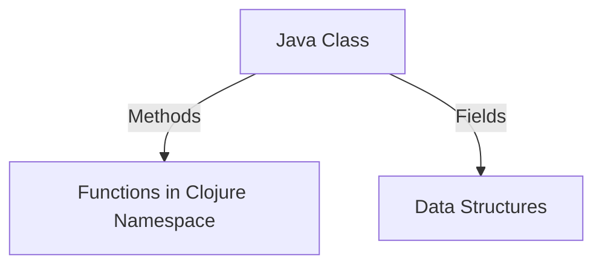

## Appendix A: Clojure vs. Java Syntax Cheat Sheet

Transitioning from Java's Object-Oriented Programming (OOP) paradigm to Clojure's functional programming approach can be a transformative journey for developers. This cheat sheet provides a quick reference guide comparing common Java syntax with their equivalents in Clojure, aiding developers in transitioning between the two languages. By understanding these differences, you'll be better equipped to leverage Clojure's expressive language features in your enterprise applications.

### **1. Basic Syntax and Structure**

#### **Java: Hello World**

```java
public class HelloWorld {
    public static void main(String[] args) {
        System.out.println("Hello, World!");
    }
}
```

#### **Clojure: Hello World**

```clojure
(ns hello-world.core)

(defn -main []
  (println "Hello, World!"))
```

**Explanation:** In Clojure, we define a namespace using `ns` and a main function with `defn`. The `println` function is used for output, similar to Java's `System.out.println`.

### **2. Variables and Data Types**

#### **Java: Variables and Types**

```java
int number = 10;
String text = "Hello";
boolean isTrue = true;
```

#### **Clojure: Variables and Types**

```clojure
(def number 10)
(def text "Hello")
(def is-true true)
```

**Explanation:** Clojure uses `def` to define variables, which are immutable by default. Unlike Java, Clojure does not require explicit type declarations, as it is dynamically typed.

### **3. Control Structures**

#### **Java: Conditional Statements**

```java
if (number > 5) {
    System.out.println("Greater than 5");
} else {
    System.out.println("Less than or equal to 5");
}
```

#### **Clojure: Conditional Statements**

```clojure
(if (> number 5)
  (println "Greater than 5")
  (println "Less than or equal to 5"))
```

**Explanation:** Clojure uses the `if` function, with the condition and branches as arguments. The `>` function checks if `number` is greater than 5.

### **4. Loops and Iteration**

#### **Java: For Loop**

```java
for (int i = 0; i < 5; i++) {
    System.out.println(i);
}
```

#### **Clojure: Looping with `for`**

```clojure
(doseq [i (range 5)]
  (println i))
```

**Explanation:** Clojure's `doseq` is used for side-effectful iteration over a sequence. The `range` function generates a sequence of numbers.

### **5. Functions and Methods**

#### **Java: Method Definition**

```java
public int add(int a, int b) {
    return a + b;
}
```

#### **Clojure: Function Definition**

```clojure
(defn add [a b]
  (+ a b))
```

**Explanation:** Clojure functions are defined using `defn`, with parameters in a vector. The `+` function adds the numbers.

### **6. Collections**

#### **Java: List and Map**

```java
List<String> list = new ArrayList<>();
list.add("apple");

Map<String, Integer> map = new HashMap<>();
map.put("apple", 1);
```

#### **Clojure: List and Map**

```clojure
(def list '("apple"))
(def map {"apple" 1})
```

**Explanation:** Clojure provides literal syntax for collections. Lists are defined with `'`, and maps with `{}`.

### **7. Object-Oriented vs. Functional Approach**

#### **Java: Class and Object**

```java
public class Car {
    private String model;

    public Car(String model) {
        this.model = model;
    }

    public String getModel() {
        return model;
    }
}

Car car = new Car("Toyota");
System.out.println(car.getModel());
```

#### **Clojure: Data Structures and Functions**

```clojure
(def car {:model "Toyota"})

(defn get-model [car]
  (:model car))

(println (get-model car))
```

**Explanation:** Clojure uses maps to represent data structures and functions to operate on them, promoting immutability and simplicity.

### **8. Exception Handling**

#### **Java: Try-Catch**

```java
try {
    int result = 10 / 0;
} catch (ArithmeticException e) {
    System.out.println("Division by zero");
}
```

#### **Clojure: Try-Catch**

```clojure
(try
  (/ 10 0)
  (catch ArithmeticException e
    (println "Division by zero")))
```

**Explanation:** Clojure's `try` and `catch` are similar to Java's, but use functions for exception handling.

### **9. Concurrency**

#### **Java: Thread Creation**

```java
Thread thread = new Thread(() -> System.out.println("Running in a thread"));
thread.start();
```

#### **Clojure: Concurrency with `future`**

```clojure
(def future-task (future (println "Running in a thread")))
```

**Explanation:** Clojure's `future` creates a concurrent task, simplifying thread management.

### **10. Interoperability**

#### **Java: Calling Clojure**

```java
// Assuming Clojure code is compiled and available
Clojure.var("namespace", "function-name").invoke(args);
```

#### **Clojure: Calling Java**

```clojure
(.methodName (JavaClass. args))
```

**Explanation:** Clojure can seamlessly call Java methods using the dot notation, facilitating interoperability.

### **Visual Aids**

#### **Diagram: Java Classes vs. Clojure Namespaces**



**Caption:** This diagram illustrates how Java classes map to Clojure namespaces and functions, emphasizing the shift from OOP to functional programming.

### **References and Links**

- [Clojure Official Documentation](https://clojure.org/reference)
- [Clojure Community Resources](https://clojure.org/community/resources)
- [Transitioning from OOP to Functional Programming](https://www.lispcast.com/oo-to-fp/)

### **Knowledge Check**

- **Question:** How does Clojure handle immutability compared to Java?
- **Exercise:** Convert a simple Java class with methods to a Clojure namespace with functions.

### **Encouraging Engagement**

Embracing functional programming can be challenging, but with each step, you'll gain a deeper understanding and see tangible benefits in your codebase. Experiment with the provided code examples and try modifying them to solidify your understanding.

### **Quiz: Are You Ready to Migrate from Java to Clojure?**



### What is the primary difference between Java's OOP and Clojure's functional approach?

- [x] Java uses classes and objects, while Clojure uses functions and immutable data structures.
- [ ] Java is dynamically typed, while Clojure is statically typed.
- [ ] Java supports concurrency, while Clojure does not.
- [ ] Java is a functional language, while Clojure is object-oriented.

> **Explanation:** Java relies on classes and objects, whereas Clojure emphasizes functions and immutable data structures.

### How do you define a variable in Clojure?

- [x] Using the `def` keyword.
- [ ] Using the `var` keyword.
- [ ] Using the `let` keyword.
- [ ] Using the `set` keyword.

> **Explanation:** Clojure uses the `def` keyword to define variables, which are immutable by default.

### What is the equivalent of Java's `for` loop in Clojure?

- [x] `doseq`
- [ ] `loop`
- [ ] `while`
- [ ] `foreach`

> **Explanation:** `doseq` is used in Clojure for iterating over sequences with side effects.

### How do you handle exceptions in Clojure?

- [x] Using `try` and `catch`.
- [ ] Using `throw` and `catch`.
- [ ] Using `try` and `finally`.
- [ ] Using `catch` and `finally`.

> **Explanation:** Clojure uses `try` and `catch` for exception handling, similar to Java.

### What is the syntax for calling a Java method in Clojure?

- [x] `(.methodName (JavaClass. args))`
- [ ] `JavaClass.methodName(args)`
- [ ] `methodName(JavaClass, args)`
- [ ] `JavaClass::methodName(args)`

> **Explanation:** Clojure uses the dot notation to call Java methods.

### How does Clojure achieve concurrency?

- [x] Using `future` and other concurrency primitives.
- [ ] Using `synchronized` blocks.
- [ ] Using `volatile` variables.
- [ ] Using `atomic` operations.

> **Explanation:** Clojure provides concurrency primitives like `future` to manage concurrent tasks.

### What is the purpose of Clojure's `ns` keyword?

- [x] To define a namespace.
- [ ] To define a variable.
- [ ] To define a function.
- [ ] To define a class.

> **Explanation:** The `ns` keyword is used to define a namespace in Clojure.

### How are lists defined in Clojure?

- [x] Using the `'` character.
- [ ] Using square brackets `[]`.
- [ ] Using curly braces `{}`.
- [ ] Using the `list` keyword.

> **Explanation:** Lists in Clojure are defined using the `'` character.

### What is the equivalent of Java's `System.out.println` in Clojure?

- [x] `println`
- [ ] `print`
- [ ] `format`
- [ ] `write`

> **Explanation:** Clojure uses the `println` function for output.

### True or False: Clojure is statically typed.

- [ ] True
- [x] False

> **Explanation:** Clojure is a dynamically typed language, unlike Java which is statically typed.



By understanding these syntax differences, you can effectively transition from Java to Clojure, leveraging the strengths of functional programming to enhance your enterprise applications.
