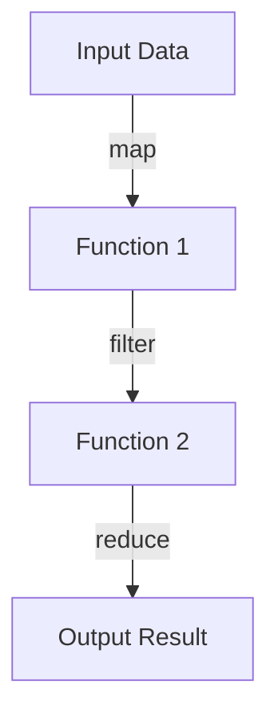
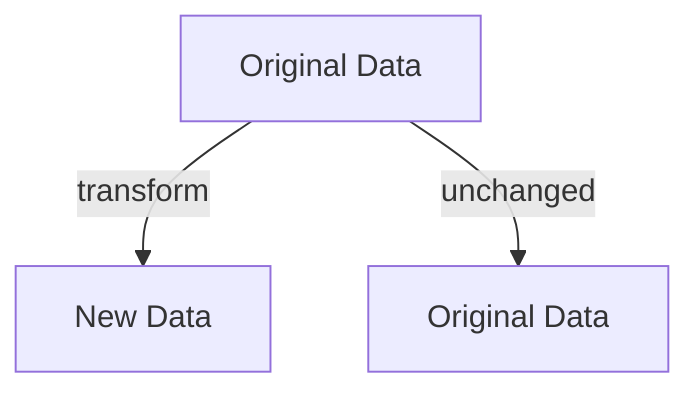

## Appendix A: Clojure vs. Java Syntax Cheat Sheet

Transitioning from Java to Clojure involves understanding the differences in syntax and paradigms between these two languages. This cheat sheet provides a quick reference guide comparing common Java syntax with their equivalents in Clojure, aiding developers in making a smooth transition. Let's dive into the core differences and similarities, enhancing your understanding of Clojure's functional programming paradigm.

### Introduction to Syntax Differences

Java is a statically typed, object-oriented language, while Clojure is a dynamically typed, functional language. This fundamental difference influences their syntax and how developers approach problem-solving. Let's explore these differences through various programming constructs.

### Variables and Data Types

In Java, variables are declared with explicit types, whereas Clojure uses dynamic typing and immutability by default.

**Java Example:**

```java
int number = 10;
String greeting = "Hello, World!";
```

**Clojure Example:**

```clojure
(def number 10) ; Immutable by default
(def greeting "Hello, World!")
```

**Key Points:**

- **Immutability**: Clojure variables are immutable by default, promoting safer concurrent programming.
- **Dynamic Typing**: Clojure does not require explicit type declarations, allowing for more flexible code.

### Control Structures

Java uses traditional control structures like `if`, `for`, and `while`, whereas Clojure leverages expressions and recursion.

**Java Example:**

```java
if (number > 5) {
    System.out.println("Greater than 5");
} else {
    System.out.println("Less than or equal to 5");
}
```

**Clojure Example:**

```clojure
(if (> number 5)
  (println "Greater than 5")
  (println "Less than or equal to 5"))
```

**Key Points:**

- **Expression-Based**: Clojure uses expressions rather than statements, which always return a value.
- **Recursion Over Loops**: Clojure favors recursion and higher-order functions over traditional loops.

### Functions and Methods

Functions are first-class citizens in Clojure, unlike Java, where methods are tied to classes.

**Java Example:**

```java
public int add(int a, int b) {
    return a + b;
}
```

**Clojure Example:**

```clojure
(defn add [a b]
  (+ a b))
```

**Key Points:**

- **First-Class Functions**: Functions can be passed as arguments, returned from other functions, and assigned to variables in Clojure.
- **No Class Ties**: Functions in Clojure are not bound to classes, promoting modularity.

### Collections

Clojure provides immutable, persistent data structures, whereas Java collections are mutable by default.

**Java Example:**

```java
List<Integer> numbers = new ArrayList<>();
numbers.add(1);
numbers.add(2);
```

**Clojure Example:**

```clojure
(def numbers [1 2]) ; Vector
```

**Key Points:**

- **Immutability**: Clojure's collections are immutable, enhancing safety in concurrent environments.
- **Rich Set of Functions**: Clojure provides a rich set of functions for manipulating collections.

### Object-Oriented vs. Functional Paradigms

Java's object-oriented paradigm contrasts with Clojure's functional approach, focusing on data and functions.

**Java Example:**

```java
class Car {
    private String model;
    
    public Car(String model) {
        this.model = model;
    }
    
    public String getModel() {
        return model;
    }
}
```

**Clojure Example:**

```clojure
(def car {:model "Toyota"})

(defn get-model [car]
  (:model car))
```

**Key Points:**

- **Data-Centric**: Clojure focuses on data and functions rather than objects and classes.
- **Protocols and Multimethods**: Clojure uses protocols and multimethods for polymorphism.

### Error Handling

Java uses exceptions for error handling, while Clojure provides a more functional approach.

**Java Example:**

```java
try {
    int result = divide(10, 0);
} catch (ArithmeticException e) {
    System.out.println("Cannot divide by zero");
}
```

**Clojure Example:**

```clojure
(try
  (/ 10 0)
  (catch ArithmeticException e
    (println "Cannot divide by zero")))
```

**Key Points:**

- **Functional Error Handling**: Clojure's error handling aligns with its functional nature, using constructs like `try` and `catch`.
- **`ex-info` for Custom Exceptions**: Clojure provides `ex-info` for creating rich, custom exceptions.

### Concurrency

Clojure offers advanced concurrency models, such as atoms, refs, and agents, compared to Java's thread-based model.

**Java Example:**

```java
synchronized (lock) {
    counter++;
}
```

**Clojure Example:**

```clojure
(def counter (atom 0))

(swap! counter inc)
```

**Key Points:**

- **Software Transactional Memory (STM)**: Clojure's STM provides a robust model for managing shared state.
- **Atoms, Refs, and Agents**: These constructs offer different concurrency models for various use cases.

### Interoperability with Java

Clojure runs on the JVM, allowing seamless interoperability with Java.

**Calling Java from Clojure:**

```clojure
(.toUpperCase "hello") ; Calls Java's String method
```

**Embedding Clojure in Java:**

```java
import clojure.java.api.Clojure;
import clojure.lang.IFn;

public class ClojureInterop {
    public static void main(String[] args) {
        IFn plus = Clojure.var("clojure.core", "+");
        System.out.println(plus.invoke(1, 2));
    }
}
```

**Key Points:**

- **Seamless Interoperability**: Clojure can call Java methods and vice versa, facilitating gradual migration.
- **Leverage Existing Libraries**: Utilize Java libraries within Clojure applications.

### Visual Aids

To further illustrate these concepts, let's include some diagrams using Mermaid.js.

#### Data Flow in Higher-Order Functions



*Caption: This diagram shows the flow of data through a series of higher-order functions in Clojure.*

#### Immutability and Persistent Data Structures



*Caption: Immutability ensures that original data remains unchanged, while transformations produce new data structures.*

### Knowledge Check

Let's reinforce your understanding with some questions and exercises.

1. **What is the primary difference between Java's and Clojure's approach to variables?**
2. **How does Clojure handle collections differently from Java?**
3. **Try modifying the Clojure function examples to include additional parameters.**

### Encouraging Tone

Now that we've explored the syntax differences between Java and Clojure, you're well on your way to mastering Clojure's functional programming paradigm. Remember, practice is key, and experimenting with code will solidify your understanding.

### References and Links

For further reading, consider exploring the following resources:

- [Official Clojure Documentation](https://clojure.org/)
- [ClojureDocs](https://clojuredocs.org/)
- [Clojure GitHub Repository](https://github.com/clojure/clojure)

### Quiz: Are You Ready to Migrate from Java to Clojure?



### What is a key feature of Clojure's variables?

- [x] Immutability
- [ ] Static Typing
- [ ] Class Binding
- [ ] Explicit Type Declaration

> **Explanation:** Clojure's variables are immutable by default, promoting safer concurrent programming.


### How does Clojure handle collections?

- [x] Immutably
- [ ] Mutably
- [ ] Dynamically
- [ ] Statically

> **Explanation:** Clojure collections are immutable, enhancing safety in concurrent environments.


### What is a first-class citizen in Clojure?

- [x] Functions
- [ ] Classes
- [ ] Objects
- [ ] Interfaces

> **Explanation:** Functions are first-class citizens in Clojure, allowing them to be passed as arguments and returned from other functions.


### What concurrency model does Clojure use?

- [x] Software Transactional Memory (STM)
- [ ] Thread-based
- [ ] Lock-based
- [ ] Event-driven

> **Explanation:** Clojure uses Software Transactional Memory (STM) for managing shared state.


### How does Clojure achieve polymorphism?

- [x] Protocols and Multimethods
- [ ] Inheritance
- [ ] Interfaces
- [ ] Abstract Classes

> **Explanation:** Clojure uses protocols and multimethods for polymorphism, aligning with its functional nature.


### What is a benefit of Clojure's interoperability with Java?

- [x] Seamless integration with Java libraries
- [ ] Requires rewriting Java code
- [ ] Limited to specific Java versions
- [ ] Only supports basic Java types

> **Explanation:** Clojure can seamlessly integrate with Java libraries, facilitating gradual migration.


### How does Clojure handle error management?

- [x] Functional error handling
- [ ] Exception hierarchies
- [ ] Checked exceptions
- [ ] Error codes

> **Explanation:** Clojure's error handling aligns with its functional nature, using constructs like `try` and `catch`.


### What is a characteristic of Clojure's syntax?

- [x] Expression-based
- [ ] Statement-based
- [ ] Class-based
- [ ] Interface-based

> **Explanation:** Clojure uses expressions rather than statements, which always return a value.


### What is a common use of higher-order functions in Clojure?

- [x] Data transformation
- [ ] Class instantiation
- [ ] Object creation
- [ ] Interface implementation

> **Explanation:** Higher-order functions in Clojure are commonly used for data transformation.


### True or False: Clojure requires explicit type declarations.

- [ ] True
- [x] False

> **Explanation:** Clojure is dynamically typed and does not require explicit type declarations.



By understanding these syntax differences and leveraging Clojure's unique features, you can effectively transition from Java to Clojure, embracing the power of functional programming.
