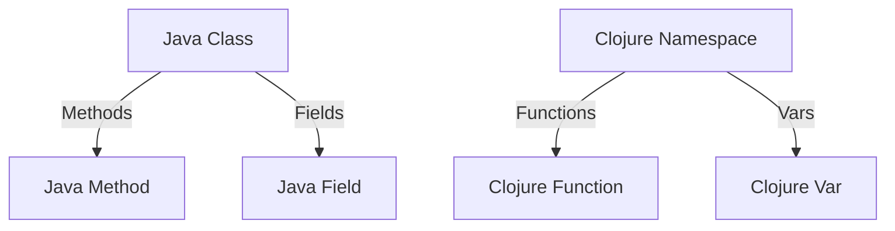

## 3.1 Introduction to Clojure Syntax

Transitioning from Java's Object-Oriented Programming (OOP) to Clojure's functional programming paradigm can be both exciting and challenging. One of the first steps in this journey is understanding the syntax of Clojure, which is quite different from Java. In this section, we will explore the fundamental syntax of Clojure, focusing on writing basic expressions and functions. By drawing parallels between Java and Clojure, we aim to make this transition smoother for Java developers.

### Understanding the Syntax Differences Between Java and Clojure

Clojure is a Lisp dialect, which means its syntax is minimalistic and based on S-expressions (symbolic expressions). This is a stark contrast to Java's verbose syntax. Let's explore some key differences:

- **Parentheses**: In Clojure, parentheses are used to denote function calls and expressions, whereas in Java, they are used for method calls and control structures.
- **Prefix Notation**: Clojure uses prefix notation for function calls, meaning the function name comes before its arguments. In Java, infix notation is common, especially for operators.
- **Immutability**: Clojure emphasizes immutability, meaning data structures are immutable by default. Java, on the other hand, often uses mutable objects.
- **Data Structures**: Clojure provides a rich set of immutable data structures, such as lists, vectors, maps, and sets, which differ from Java's collections framework.

### Writing Basic Expressions and Functions

Let's start by writing some basic expressions in Clojure and compare them with their Java counterparts.

#### Basic Arithmetic Expressions

In Java, arithmetic expressions are written using infix notation:

```java
int sum = 1 + 2;
int product = 3 * 4;
```

In Clojure, arithmetic expressions use prefix notation:

```clojure
(def sum (+ 1 2))
(def product (* 3 4))
```

Here, `+` and `*` are functions, and the numbers are their arguments. The `def` keyword is used to define a variable.

#### Defining Functions

In Java, a simple function to add two numbers might look like this:

```java
public int add(int a, int b) {
    return a + b;
}
```

In Clojure, you define a function using the `defn` keyword:

```clojure
(defn add [a b]
  (+ a b))
```

- **`defn`**: Used to define a function.
- **`[a b]`**: The parameters of the function.
- **`(+ a b)`**: The body of the function, which is an expression that adds `a` and `b`.

#### Conditional Expressions

Java uses `if-else` statements for conditional logic:

```java
public String checkNumber(int n) {
    if (n > 0) {
        return "Positive";
    } else if (n < 0) {
        return "Negative";
    } else {
        return "Zero";
    }
}
```

In Clojure, conditional logic is expressed using the `cond` function:

```clojure
(defn check-number [n]
  (cond
    (> n 0) "Positive"
    (< n 0) "Negative"
    :else "Zero"))
```

- **`cond`**: A conditional expression that evaluates each condition in sequence.
- **`:else`**: Acts as a default case if none of the conditions are true.

#### Working with Data Structures

Clojure provides several immutable data structures. Let's explore some of them:

##### Lists

Lists are a fundamental data structure in Clojure, used primarily for code and data representation.

```clojure
(def my-list '(1 2 3 4 5))
```

- **`'(1 2 3 4 5)`**: A list of numbers. The quote (`'`) prevents evaluation.

##### Vectors

Vectors are similar to arrays in Java but are immutable.

```clojure
(def my-vector [1 2 3 4 5])
```

- **`[1 2 3 4 5]`**: A vector of numbers.

##### Maps

Maps are key-value pairs, similar to Java's `HashMap`.

```clojure
(def my-map {:name "Alice" :age 30})
```

- **`{:name "Alice" :age 30}`**: A map with keys `:name` and `:age`.

##### Sets

Sets are collections of unique values.

```clojure
(def my-set #{1 2 3 4 5})
```

- **`#{1 2 3 4 5}`**: A set of numbers.

### Try It Yourself: Experiment with Clojure Syntax

To deepen your understanding, try modifying the code examples above:

- Change the arithmetic operations in the `add` function to subtraction or multiplication.
- Add more conditions to the `check-number` function.
- Create a new vector with different data types, such as strings or booleans.
- Define a map with additional key-value pairs and access its values.

### Visual Aids: Understanding Clojure's Syntax Structure

Let's visualize how Java classes and methods map to Clojure namespaces and functions.



**Diagram Description**: This diagram illustrates the mapping between Java classes and Clojure namespaces. Java methods correspond to Clojure functions, while Java fields map to Clojure vars.

### References and Links

For further reading and exploration, consider the following resources:

- [Clojure Official Documentation](https://clojure.org/reference)
- [Clojure Community Resources](https://clojure.org/community/resources)
- [Transitioning from OOP to Functional Programming](https://www.lispcast.com/oo-to-fp/)

### Knowledge Check

To reinforce your understanding, consider these questions:

1. How does Clojure's use of parentheses differ from Java's?
2. What is the significance of prefix notation in Clojure?
3. How do you define a function in Clojure, and how does it compare to Java?
4. What are the key differences between Clojure's data structures and Java's collections?

### Exercises

1. Write a Clojure function that calculates the factorial of a number using recursion.
2. Create a Clojure map representing a book with keys for title, author, and year, and write a function to retrieve the title.
3. Implement a Clojure function that takes a vector of numbers and returns a new vector with each number squared.

### Encouraging Engagement

Embracing functional programming can be challenging, but with each step, you'll gain a deeper understanding and see tangible benefits in your codebase. Remember, practice is key to mastering Clojure's syntax and functional paradigm.

### Summary

In this section, we've explored the fundamental syntax of Clojure, focusing on expressions, functions, and data structures. By understanding these concepts, you're well on your way to transitioning from Java OOP to Clojure's functional programming paradigm. As you continue your journey, keep experimenting and exploring the rich features Clojure has to offer.

## **Quiz: Are You Ready to Migrate from Java to Clojure?**



### How does Clojure's use of parentheses differ from Java's?

- [x] Clojure uses parentheses to denote function calls and expressions.
- [ ] Clojure uses parentheses for method calls only.
- [ ] Clojure uses parentheses for control structures only.
- [ ] Clojure does not use parentheses.

> **Explanation:** In Clojure, parentheses are used to denote function calls and expressions, unlike Java, where they are used for method calls and control structures.

### What is the significance of prefix notation in Clojure?

- [x] It places the function name before its arguments.
- [ ] It places the arguments before the function name.
- [ ] It is used for defining variables.
- [ ] It is used for conditional expressions.

> **Explanation:** Prefix notation in Clojure means the function name comes before its arguments, which is different from Java's infix notation.

### How do you define a function in Clojure?

- [x] Using the `defn` keyword.
- [ ] Using the `function` keyword.
- [ ] Using the `define` keyword.
- [ ] Using the `method` keyword.

> **Explanation:** In Clojure, functions are defined using the `defn` keyword, followed by the function name, parameters, and body.

### What is the default nature of data structures in Clojure?

- [x] Immutable
- [ ] Mutable
- [ ] Dynamic
- [ ] Static

> **Explanation:** Clojure emphasizes immutability, meaning data structures are immutable by default, unlike Java's often mutable objects.

### Which Clojure data structure is similar to Java's `HashMap`?

- [x] Map
- [ ] List
- [ ] Vector
- [ ] Set

> **Explanation:** Clojure's map is similar to Java's `HashMap`, as both are key-value pair collections.

### How are conditional expressions handled in Clojure?

- [x] Using the `cond` function.
- [ ] Using the `if-else` statement.
- [ ] Using the `switch` statement.
- [ ] Using the `case` statement.

> **Explanation:** Conditional logic in Clojure is expressed using the `cond` function, which evaluates each condition in sequence.

### What is the purpose of the `def` keyword in Clojure?

- [x] To define a variable.
- [ ] To define a function.
- [ ] To define a class.
- [ ] To define a method.

> **Explanation:** The `def` keyword in Clojure is used to define a variable, similar to declaring a variable in Java.

### How do you create a list in Clojure?

- [x] Using the quote (`'`) before parentheses.
- [ ] Using square brackets (`[]`).
- [ ] Using curly braces (`{}`).
- [ ] Using angle brackets (`<>`).

> **Explanation:** In Clojure, a list is created using parentheses with a quote (`'`) to prevent evaluation.

### What is the primary use of vectors in Clojure?

- [x] To store ordered collections of elements.
- [ ] To store key-value pairs.
- [ ] To store unique elements.
- [ ] To store mutable data.

> **Explanation:** Vectors in Clojure are used to store ordered collections of elements, similar to arrays in Java.

### True or False: Clojure's syntax is based on S-expressions.

- [x] True
- [ ] False

> **Explanation:** Clojure's syntax is indeed based on S-expressions, which are symbolic expressions used in Lisp dialects.


