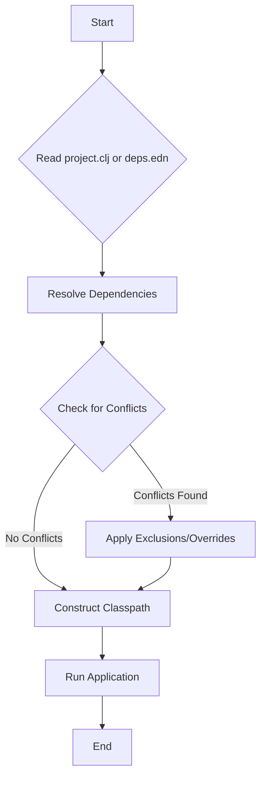

## 8.2.2 Understanding Classpaths in Clojure Projects

In the world of Clojure development, understanding how classpaths work is crucial for effective project management and dependency resolution. Classpaths are the backbone of how Clojure and Java applications locate and load classes and resources. This section delves into the intricacies of classpaths, their configuration, and their impact on dependency management in Clojure projects.

### Introduction to Classpaths

A classpath is essentially a parameter—a list of paths—that tells the Java Virtual Machine (JVM) where to look for user-defined classes and packages when running a Java application. In the context of Clojure, which runs on the JVM, the classpath serves the same purpose. It is a critical component that determines how your Clojure application finds and loads libraries and resources.

#### The Role of Classpaths

1. **Locating Classes and Resources**: The classpath specifies directories and JAR files that the JVM searches to find compiled classes and resources. This includes both your application code and any third-party libraries.

2. **Dependency Resolution**: Classpaths play a pivotal role in resolving dependencies. When you include a library in your project, its classes and resources must be accessible via the classpath.

3. **Isolation and Modularity**: By controlling what is included in the classpath, you can manage the scope of your application’s dependencies, ensuring that only necessary libraries are loaded, which helps in avoiding conflicts.

### Configuring Classpaths in Clojure

Clojure projects typically use build tools like Leiningen or tools.deps.alpha to manage dependencies and classpaths. Each tool has its own way of defining and configuring the classpath.

#### Using Leiningen

Leiningen is a popular build automation tool for Clojure. It simplifies dependency management and project configuration.

- **`project.clj`**: This file is the heart of a Leiningen project. It defines the project’s dependencies, which are automatically added to the classpath.

```clojure
(defproject my-clojure-app "0.1.0-SNAPSHOT"
  :description "A simple Clojure application"
  :dependencies [[org.clojure/clojure "1.10.3"]
                 [ring/ring-core "1.9.0"]
                 [compojure "1.6.2"]])
```

- **Classpath Construction**: When you run a Leiningen task, it constructs the classpath by resolving the dependencies specified in `project.clj`. It downloads any missing dependencies and includes them in the classpath.

- **Profiles**: Leiningen supports profiles, which allow you to customize the classpath for different environments (e.g., development, testing, production).

```clojure
:profiles {:dev {:dependencies [[midje "1.9.9"]]}
           :prod {:dependencies [[ring/ring-jetty-adapter "1.9.0"]]}}
```

#### Using tools.deps.alpha

tools.deps.alpha is a more recent addition to the Clojure ecosystem, offering a flexible and declarative way to manage dependencies.

- **`deps.edn`**: This file is used to declare dependencies and configure the classpath.

```clojure
{:deps {org.clojure/clojure {:mvn/version "1.10.3"}
        ring/ring-core {:mvn/version "1.9.0"}
        compojure {:mvn/version "1.6.2"}}}
```

- **Classpath Resolution**: tools.deps.alpha resolves dependencies by reading `deps.edn` and constructing the classpath dynamically. It supports Maven and local repositories.

- **Aliases**: Similar to Leiningen profiles, tools.deps.alpha uses aliases to modify the classpath for different contexts.

```clojure
:aliases {:dev {:extra-deps {midje {:mvn/version "1.9.9"}}}
          :prod {:extra-deps {ring/ring-jetty-adapter {:mvn/version "1.9.0"}}}}
```

### Classpath and Dependency Resolution

Understanding how classpaths affect dependency resolution is key to managing Clojure projects effectively.

#### Dependency Conflicts

When multiple libraries depend on different versions of the same library, conflicts can arise. This is known as "dependency hell."

- **Version Conflicts**: If two libraries require different versions of a dependency, the version that appears first in the classpath is used. This can lead to runtime errors if the wrong version is loaded.

- **Conflict Resolution**: Both Leiningen and tools.deps.alpha provide mechanisms to resolve conflicts, such as exclusions and overrides.

```clojure
:dependencies [[some-lib "1.0.0" :exclusions [conflicting-lib]]]
```

#### Classpath Order

The order of entries in the classpath can affect which classes are loaded. Generally, entries are processed in the order they appear, with the first match being used.

- **Local Over Global**: Local project classes and resources are typically prioritized over those in external JARs.

- **Explicit Ordering**: You can explicitly control the order of dependencies to ensure that the correct versions are loaded.

### Best Practices for Managing Classpaths

Effective classpath management is crucial for maintaining a healthy Clojure project. Here are some best practices:

#### Keep Dependencies Minimal

- **Avoid Unnecessary Dependencies**: Only include libraries that are essential for your application. This reduces the risk of conflicts and minimizes the classpath size.

#### Use Profiles and Aliases

- **Environment-Specific Configurations**: Use profiles in Leiningen or aliases in tools.deps.alpha to tailor the classpath for different environments. This allows you to include development tools only when needed.

#### Monitor Classpath Size

- **Classpath Bloat**: A large classpath can slow down application startup and increase memory usage. Regularly review and prune your dependencies.

#### Resolve Conflicts Early

- **Proactive Conflict Resolution**: Address dependency conflicts as soon as they arise. Use exclusion and override mechanisms to ensure that the correct versions are used.

#### Document Dependencies

- **Dependency Documentation**: Maintain clear documentation of your project’s dependencies and their versions. This aids in troubleshooting and onboarding new team members.

### Practical Code Examples

Let's explore some practical examples to illustrate classpath management in Clojure.

#### Example 1: Resolving a Dependency Conflict

Suppose you have a project that depends on two libraries, both of which require different versions of the same dependency.

```clojure
:dependencies [[lib-a "1.0.0"]
               [lib-b "2.0.0"]]
```

If `lib-a` requires `conflicting-lib` version `1.0.0` and `lib-b` requires version `2.0.0`, you can exclude the conflicting dependency from one of the libraries:

```clojure
:dependencies [[lib-a "1.0.0" :exclusions [conflicting-lib]]
               [lib-b "2.0.0"]]
```

Then, explicitly include the desired version of `conflicting-lib`:

```clojure
:dependencies [[lib-a "1.0.0" :exclusions [conflicting-lib]]
               [lib-b "2.0.0"]
               [conflicting-lib "2.0.0"]]
```

#### Example 2: Using Aliases in tools.deps.alpha

In a `deps.edn` file, you can define aliases to manage different classpath configurations.

```clojure
{:deps {org.clojure/clojure {:mvn/version "1.10.3"}
        ring/ring-core {:mvn/version "1.9.0"}
        compojure {:mvn/version "1.6.2"}}

 :aliases {:dev {:extra-deps {midje {:mvn/version "1.9.9"}}}
           :prod {:extra-deps {ring/ring-jetty-adapter {:mvn/version "1.9.0"}}}}}
```

To use the development alias, run:

```bash
clj -A:dev
```

This command includes the `midje` library in the classpath, which is useful for testing.

### Diagrams and Visualizations

To better understand how classpaths work, let's visualize the dependency resolution process using a flowchart.



### Common Pitfalls and Optimization Tips

#### Pitfalls

- **Classpath Pollution**: Including too many unnecessary libraries can lead to a bloated classpath, increasing the risk of conflicts and slowing down your application.

- **Ignoring Conflicts**: Failing to address dependency conflicts can result in runtime errors and unpredictable behavior.

#### Optimization Tips

- **Dependency Analysis Tools**: Use tools like `lein deps :tree` or `clj -Stree` to analyze your project’s dependency tree and identify potential conflicts.

- **Classpath Caching**: Leverage classpath caching mechanisms provided by build tools to speed up subsequent builds.

### Conclusion

Understanding and managing classpaths is a fundamental skill for Clojure developers. By configuring classpaths effectively, you can ensure smooth dependency resolution, minimize conflicts, and optimize your application’s performance. Whether using Leiningen or tools.deps.alpha, the principles of classpath management remain consistent: keep dependencies minimal, resolve conflicts proactively, and tailor the classpath to your project’s needs.

## Quiz Time!



### What is the primary role of a classpath in a Clojure project?

- [x] To specify where the JVM should look for classes and resources
- [ ] To define the entry point of the application
- [ ] To manage the application's memory usage
- [ ] To configure the application's network settings

> **Explanation:** The classpath tells the JVM where to find user-defined classes and packages, which is essential for loading libraries and resources.

### Which file is used to define dependencies in a Leiningen project?

- [ ] deps.edn
- [x] project.clj
- [ ] build.gradle
- [ ] pom.xml

> **Explanation:** In Leiningen, dependencies are defined in the `project.clj` file.

### How does tools.deps.alpha handle dependency resolution?

- [ ] By using a build.gradle file
- [x] By reading the deps.edn file
- [ ] By manually specifying classpaths
- [ ] By using a pom.xml file

> **Explanation:** tools.deps.alpha reads the `deps.edn` file to resolve dependencies and construct the classpath.

### What is a common method to resolve dependency conflicts in Clojure?

- [ ] Increasing memory allocation
- [x] Using exclusions and overrides
- [ ] Changing the JVM version
- [ ] Modifying the source code

> **Explanation:** Exclusions and overrides are used to resolve dependency conflicts by specifying which versions of libraries to include or exclude.

### What is the purpose of using profiles in Leiningen?

- [ ] To manage network configurations
- [x] To customize the classpath for different environments
- [ ] To define the main entry point of the application
- [ ] To optimize memory usage

> **Explanation:** Profiles in Leiningen allow you to customize the classpath for different environments, such as development or production.

### Which command would you use to include a development alias in tools.deps.alpha?

- [ ] lein run
- [x] clj -A:dev
- [ ] mvn compile
- [ ] gradle build

> **Explanation:** The `clj -A:dev` command includes the development alias, adding extra dependencies to the classpath.

### What is a potential consequence of classpath pollution?

- [ ] Faster application startup
- [x] Increased risk of dependency conflicts
- [ ] Improved memory efficiency
- [ ] Enhanced network performance

> **Explanation:** Classpath pollution can lead to a bloated classpath, increasing the risk of dependency conflicts and slowing down the application.

### How can you analyze your project's dependency tree in Leiningen?

- [ ] Using clj -Stree
- [x] Using lein deps :tree
- [ ] Using mvn dependency:tree
- [ ] Using gradle dependencies

> **Explanation:** The `lein deps :tree` command analyzes the project's dependency tree, helping identify potential conflicts.

### True or False: Classpath order does not affect which classes are loaded.

- [ ] True
- [x] False

> **Explanation:** Classpath order can affect which classes are loaded, as the JVM uses the first match it finds in the classpath.

### What is the benefit of classpath caching?

- [ ] It increases the application's memory usage.
- [ ] It complicates dependency resolution.
- [x] It speeds up subsequent builds.
- [ ] It reduces the need for dependency documentation.

> **Explanation:** Classpath caching speeds up subsequent builds by avoiding redundant dependency resolution.


