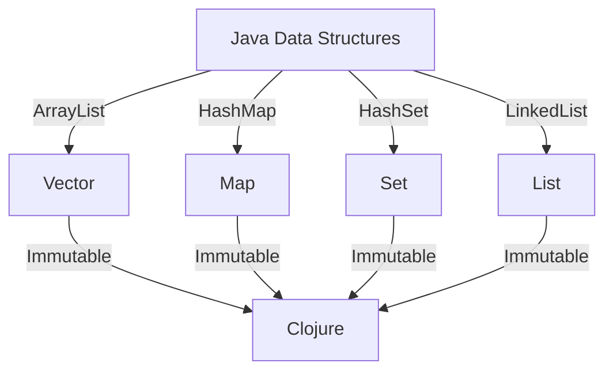

## 3.2 Data Types and Structures

As we transition from Java's object-oriented paradigm to Clojure's functional programming model, understanding Clojure's data types and structures is crucial. Clojure offers a rich set of immutable, persistent data structures that provide significant advantages in terms of performance, scalability, and simplicity. In this section, we will explore these data structures—lists, vectors, maps, and sets—and demonstrate how they can be leveraged effectively in enterprise applications.

### Understanding Immutability and Persistence

Before diving into specific data structures, let's clarify two key concepts: immutability and persistence. In Clojure, all core data structures are immutable, meaning once a structure is created, it cannot be changed. This immutability simplifies reasoning about code and enhances concurrency, as there are no concerns about shared mutable state.

Persistence, in this context, refers to the ability of data structures to efficiently share structure and history. When a new version of a data structure is created, it shares as much of the old structure as possible, minimizing memory usage and improving performance.

### Lists

Lists in Clojure are linked lists, optimized for sequential access. They are ideal for scenarios where you need to process elements in order, such as recursive algorithms.

#### Creating and Using Lists

To create a list in Clojure, use the `list` function or the quote syntax `'`.

```clojure
(def my-list (list 1 2 3 4 5))
(def another-list '(6 7 8 9 10))

;; Accessing elements
(first my-list)   ; => 1
(rest my-list)    ; => (2 3 4 5)

;; Adding elements
(cons 0 my-list)  ; => (0 1 2 3 4 5)
```

#### Key Operations

- **Accessing Elements**: Use `first` to get the first element and `rest` to get the remaining elements.
- **Adding Elements**: Use `cons` to add an element to the front of a list.
- **Transforming Lists**: Use `map`, `filter`, and `reduce` for functional transformations.

### Vectors

Vectors are indexed collections, similar to Java's `ArrayList`, but immutable. They provide efficient random access and are suitable for scenarios where you need to frequently access elements by index.

#### Creating and Using Vectors

Vectors can be created using the `vector` function or the literal syntax `[]`.

```clojure
(def my-vector [1 2 3 4 5])

;; Accessing elements
(nth my-vector 2) ; => 3

;; Adding elements
(conj my-vector 6) ; => [1 2 3 4 5 6]
```

#### Key Operations

- **Accessing Elements**: Use `nth` for indexed access.
- **Adding Elements**: Use `conj` to add elements to the end.
- **Updating Elements**: Use `assoc` to create a new vector with an updated element.

### Maps

Maps are key-value pairs, akin to Java's `HashMap`, but immutable. They are perfect for representing associative data.

#### Creating and Using Maps

Maps can be created using the `hash-map` function or the literal syntax `{}`.

```clojure
(def my-map {:a 1 :b 2 :c 3})

;; Accessing values
(get my-map :b)   ; => 2
(:b my-map)       ; => 2

;; Adding/updating entries
(assoc my-map :d 4) ; => {:a 1 :b 2 :c 3 :d 4}
```

#### Key Operations

- **Accessing Values**: Use `get` or keyword as a function.
- **Adding/Updating Entries**: Use `assoc` to add or update key-value pairs.
- **Removing Entries**: Use `dissoc` to remove entries.

### Sets

Sets are collections of unique elements, similar to Java's `HashSet`. They are useful for membership tests and eliminating duplicates.

#### Creating and Using Sets

Sets can be created using the `hash-set` function or the literal syntax `#{}`.

```clojure
(def my-set #{1 2 3 4 5})

;; Checking membership
(contains? my-set 3) ; => true

;; Adding elements
(conj my-set 6)      ; => #{1 2 3 4 5 6}
```

#### Key Operations

- **Checking Membership**: Use `contains?` to check if an element exists.
- **Adding Elements**: Use `conj` to add elements.
- **Removing Elements**: Use `disj` to remove elements.

### Leveraging Clojure's Persistent Data Structures

Clojure's persistent data structures are designed to be efficient and scalable. They allow you to create new versions of data structures without copying the entire structure, thanks to structural sharing. This feature is particularly beneficial in concurrent applications, where immutability ensures thread safety without locks.

#### Performance Considerations

While immutable data structures might seem less efficient than mutable ones, Clojure's implementation ensures that common operations are fast. For example, adding an element to a vector is an O(1) operation, and accessing an element by index is also O(1).

#### Practical Applications

In enterprise applications, leveraging these data structures can lead to more robust and maintainable code. For instance, using maps to represent configuration settings or vectors to handle collections of data can simplify your codebase and reduce bugs.

### Try It Yourself

Experiment with the following code snippets to deepen your understanding of Clojure's data structures:

1. Modify a vector by adding and removing elements, and observe how the original vector remains unchanged.
2. Create a map representing a simple database record and update it with new fields.
3. Use a set to filter out duplicate values from a list.

### Visual Aids

To better understand how these data structures relate to each other and to Java's equivalents, consider the following diagram:



*Diagram: Mapping Java data structures to their Clojure equivalents.*

### References and Links

For further reading and deeper insights into Clojure's data structures, consider the following resources:

- [Clojure Official Documentation](https://clojure.org/reference)
- [Clojure Community Resources](https://clojure.org/community/resources)
- [Transitioning from OOP to Functional Programming](https://www.lispcast.com/oo-to-fp/)

### Knowledge Check

To reinforce your understanding, consider these questions:

- How does immutability benefit concurrent programming?
- What are the performance implications of using persistent data structures?
- How do you update a map in Clojure?

### Encouraging Engagement

Embracing Clojure's functional paradigm can be challenging, but with each step, you'll gain a deeper understanding and see tangible benefits in your codebase. Remember, the key to mastering these concepts is practice and experimentation.

### Summary

In this section, we've explored Clojure's core data structures—lists, vectors, maps, and sets—and their immutable nature. By leveraging these structures, you can write more efficient, scalable, and maintainable code. As you continue your journey into Clojure, keep experimenting and applying these concepts to real-world scenarios.

## **Quiz: Are You Ready to Migrate from Java to Clojure?**



### What is a key advantage of Clojure's immutable data structures?

- [x] They simplify reasoning about code and enhance concurrency.
- [ ] They allow for direct modification of data in place.
- [ ] They require less memory than mutable structures.
- [ ] They are faster than Java's mutable structures.

> **Explanation:** Immutability simplifies reasoning about code and enhances concurrency by eliminating concerns about shared mutable state.

### How do you create a list in Clojure?

- [x] Using the `list` function or quote syntax `'`.
- [ ] Using the `array` function.
- [ ] Using the `vector` function.
- [ ] Using the `set` function.

> **Explanation:** Lists in Clojure can be created using the `list` function or the quote syntax `'`.

### Which function is used to add an element to the front of a list?

- [x] `cons`
- [ ] `conj`
- [ ] `assoc`
- [ ] `dissoc`

> **Explanation:** The `cons` function is used to add an element to the front of a list in Clojure.

### What is the time complexity of accessing an element by index in a vector?

- [x] O(1)
- [ ] O(n)
- [ ] O(log n)
- [ ] O(n^2)

> **Explanation:** Accessing an element by index in a Clojure vector is an O(1) operation.

### How do you update a key-value pair in a map?

- [x] Using the `assoc` function.
- [ ] Using the `conj` function.
- [x] Using the `merge` function.
- [ ] Using the `dissoc` function.

> **Explanation:** The `assoc` function is used to update key-value pairs in a map, and `merge` can be used to combine maps.

### What is a set in Clojure?

- [x] A collection of unique elements.
- [ ] A collection of key-value pairs.
- [ ] A sequence of elements.
- [ ] An ordered collection of elements.

> **Explanation:** A set in Clojure is a collection of unique elements.

### How do you check if an element exists in a set?

- [x] Using the `contains?` function.
- [ ] Using the `get` function.
- [x] Using the `some` function.
- [ ] Using the `assoc` function.

> **Explanation:** The `contains?` function is used to check if an element exists in a set, and `some` can be used to test for membership.

### What is the benefit of structural sharing in persistent data structures?

- [x] It minimizes memory usage and improves performance.
- [ ] It allows for direct modification of data.
- [ ] It simplifies the data structure's API.
- [ ] It increases the complexity of the data structure.

> **Explanation:** Structural sharing minimizes memory usage and improves performance by sharing structure between versions of data structures.

### Which data structure is most similar to Java's `ArrayList`?

- [x] Vector
- [ ] List
- [ ] Map
- [ ] Set

> **Explanation:** Clojure's vector is most similar to Java's `ArrayList` in terms of indexed access.

### True or False: Clojure's data structures are mutable by default.

- [x] False
- [ ] True

> **Explanation:** Clojure's data structures are immutable by default, which is a core feature of the language.


