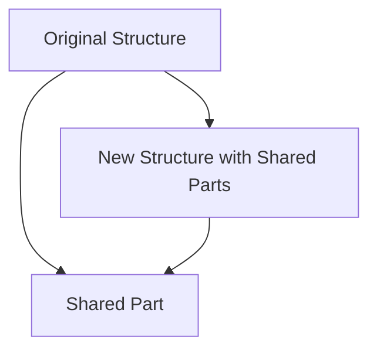

## 3.2 Data Types and Structures

As we transition from Java's object-oriented paradigm to Clojure's functional programming model, understanding Clojure's data types and structures is crucial. Clojure's approach to data is fundamentally different from Java's, emphasizing immutability and persistence. In this section, we will explore Clojure's core data structures: lists, vectors, maps, and sets. We will also delve into the concept of persistent data structures and how they can be leveraged to build scalable and maintainable enterprise applications.

### Understanding Immutability

Before we dive into specific data structures, let's discuss immutability—a cornerstone of functional programming. In Clojure, data structures are immutable, meaning once they are created, they cannot be changed. This contrasts with Java, where objects can be modified after creation. Immutability offers several advantages, including thread safety, easier reasoning about code, and eliminating side effects.

#### Java vs. Clojure: A Quick Comparison

In Java, you might use a `List` or `Map` from the `java.util` package, which allows you to add, remove, or modify elements. Here's a simple Java example:

```java
import java.util.ArrayList;
import java.util.List;

public class JavaListExample {
    public static void main(String[] args) {
        List<String> list = new ArrayList<>();
        list.add("Java");
        list.add("Clojure");
        list.set(1, "Scala");
        System.out.println(list); // Output: [Java, Scala]
    }
}
```

In Clojure, you would use a list or vector, but you cannot modify it directly. Instead, you create a new version of the data structure with the desired changes:

```clojure
(def clojure-list '("Java" "Clojure"))
(def updated-list (conj (rest clojure-list) "Scala"))
(println updated-list) ; Output: ("Scala")
```

### Exploring Clojure's Core Data Structures

Clojure provides several built-in data structures, each with unique characteristics and use cases. Let's explore each one in detail.

#### Lists

Lists in Clojure are linked lists, optimized for sequential access. They are ideal for scenarios where you need to process elements in order. Lists are created using the `list` function or by quoting a sequence of elements.

```clojure
(def my-list (list 1 2 3 4))
(def another-list '(5 6 7 8))
```

Lists are immutable, so operations like `conj` (which adds an element) return a new list:

```clojure
(def extended-list (conj my-list 0))
(println extended-list) ; Output: (0 1 2 3 4)
```

**Key Characteristics:**
- **Sequential Access:** Lists are best for operations that require accessing elements in sequence.
- **Immutable:** Any modification results in a new list.
- **Performance:** Adding elements to the front is efficient.

#### Vectors

Vectors are indexed collections, similar to Java's `ArrayList`. They provide efficient random access and are often used when you need to access elements by index.

```clojure
(def my-vector [1 2 3 4])
```

Vectors support operations like `assoc` for updating elements:

```clojure
(def updated-vector (assoc my-vector 2 99))
(println updated-vector) ; Output: [1 2 99 4]
```

**Key Characteristics:**
- **Indexed Access:** Vectors allow fast access by index.
- **Immutable:** Updates create a new vector.
- **Performance:** Efficient for random access and updates.

#### Maps

Maps in Clojure are key-value pairs, similar to Java's `HashMap`. They are used for associative data and provide efficient lookup by key.

```clojure
(def my-map {:name "Clojure" :type "Language"})
```

Maps support operations like `assoc` and `dissoc` for adding and removing key-value pairs:

```clojure
(def updated-map (assoc my-map :year 2007))
(println updated-map) ; Output: {:name "Clojure", :type "Language", :year 2007}
```

**Key Characteristics:**
- **Associative Access:** Maps provide efficient key-based access.
- **Immutable:** Changes result in a new map.
- **Performance:** Suitable for associative data with fast lookup.

#### Sets

Sets are collections of unique elements, similar to Java's `HashSet`. They are used when you need to ensure uniqueness.

```clojure
(def my-set #{1 2 3 4})
```

Sets support operations like `conj` for adding elements and `disj` for removing elements:

```clojure
(def updated-set (conj my-set 5))
(println updated-set) ; Output: #{1 2 3 4 5}
```

**Key Characteristics:**
- **Uniqueness:** Sets ensure all elements are unique.
- **Immutable:** Modifications create a new set.
- **Performance:** Efficient for membership tests and uniqueness.

### Leveraging Persistent Data Structures

Clojure's data structures are persistent, meaning they efficiently share structure between versions. This is achieved through structural sharing, which allows new versions of a data structure to reuse parts of the old version, minimizing memory usage and improving performance.

#### Structural Sharing

Structural sharing is a technique where new data structures share parts of the old structure, avoiding the need to copy the entire structure. This is particularly useful for large data sets, where copying would be inefficient.

**Diagram: Structural Sharing in Persistent Data Structures**



**Description:** The diagram illustrates how a new structure can share parts of the original structure, reducing memory usage and improving performance.

### Practical Applications in Enterprise Systems

In enterprise applications, leveraging Clojure's persistent data structures can lead to more scalable and maintainable systems. Here are some practical applications:

- **Concurrency:** Immutability ensures thread safety, making it easier to write concurrent applications without worrying about data races.
- **Versioning:** Persistent data structures allow for easy versioning of data, as each change results in a new version.
- **Undo/Redo Functionality:** Structural sharing makes it efficient to implement undo/redo functionality, as previous versions of data are retained.

### Try It Yourself: Experimenting with Clojure Data Structures

Now that we've explored Clojure's data structures, let's try modifying some code examples to deepen your understanding. Experiment with adding, removing, and updating elements in lists, vectors, maps, and sets. Observe how each operation results in a new data structure.

### Further Reading and Resources

To continue your journey with Clojure, consider exploring the following resources:

- [Official Clojure Documentation](https://clojure.org/reference/data_structures)
- [ClojureDocs](https://clojuredocs.org/)
- [Clojure GitHub Repository](https://github.com/clojure/clojure)

### Key Takeaways

- Clojure's data structures are immutable and persistent, offering advantages in concurrency and memory efficiency.
- Lists, vectors, maps, and sets each have unique characteristics and use cases.
- Structural sharing allows for efficient memory usage and performance in large data sets.

## **Quiz: Are You Ready to Migrate from Java to Clojure?**



### What is a key advantage of immutability in Clojure?

- [x] Thread safety
- [ ] Faster execution
- [ ] Larger memory usage
- [ ] Simpler syntax

> **Explanation:** Immutability ensures that data cannot be changed, which makes it inherently thread-safe.

### Which Clojure data structure is best for indexed access?

- [ ] List
- [x] Vector
- [ ] Map
- [ ] Set

> **Explanation:** Vectors provide efficient indexed access, similar to arrays in Java.

### How does Clojure achieve efficient memory usage with persistent data structures?

- [ ] By copying data structures
- [x] Through structural sharing
- [ ] By using mutable data
- [ ] By compressing data

> **Explanation:** Structural sharing allows new data structures to share parts of the old structure, minimizing memory usage.

### What operation would you use to add an element to a Clojure list?

- [ ] append
- [ ] add
- [x] conj
- [ ] insert

> **Explanation:** The `conj` function is used to add elements to a list in Clojure.

### Which Clojure data structure ensures all elements are unique?

- [ ] List
- [ ] Vector
- [ ] Map
- [x] Set

> **Explanation:** Sets are collections of unique elements, ensuring no duplicates.

### What is the result of modifying a Clojure data structure?

- [ ] The original structure is changed
- [x] A new structure is created
- [ ] An error is thrown
- [ ] The structure is compressed

> **Explanation:** Clojure data structures are immutable, so any modification results in a new structure.

### Which operation would you use to update a key-value pair in a Clojure map?

- [ ] update
- [x] assoc
- [ ] put
- [ ] insert

> **Explanation:** The `assoc` function is used to add or update key-value pairs in a map.

### What is a practical application of persistent data structures in enterprise systems?

- [ ] Faster execution
- [x] Easy versioning of data
- [ ] Larger memory usage
- [ ] Simpler syntax

> **Explanation:** Persistent data structures allow for easy versioning of data, as each change results in a new version.

### How does Clojure's approach to data differ from Java's?

- [ ] Clojure uses mutable data
- [x] Clojure emphasizes immutability
- [ ] Clojure has simpler syntax
- [ ] Clojure uses larger memory

> **Explanation:** Clojure emphasizes immutability, whereas Java often uses mutable data structures.

### True or False: Clojure's data structures are mutable.

- [ ] True
- [x] False

> **Explanation:** Clojure's data structures are immutable, meaning they cannot be changed after creation.



Now that we've explored Clojure's data structures, let's apply these concepts to manage state effectively in your applications. By leveraging immutability and persistence, you can build robust, scalable systems that are easier to maintain and reason about.
