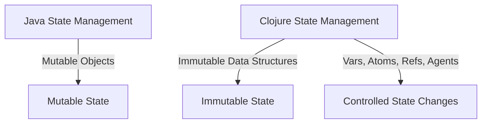

## 3.3 Variables and State Management

In this section, we delve into the core concepts of variables and state management in Clojure, a critical aspect of transitioning from Java's object-oriented paradigm to Clojure's functional programming model. Understanding how to manage state effectively in Clojure is essential for building robust, scalable applications. We will explore the use of vars, atoms, refs, and agents, and how these constructs facilitate state management in a functional paradigm.

### Introduction to State Management in Clojure

State management is a fundamental aspect of programming, and it is handled quite differently in functional programming compared to object-oriented programming (OOP). In Java, state is typically managed through mutable objects, where fields within classes can be changed over time. This approach can lead to complex state management issues, especially in concurrent environments.

Clojure, on the other hand, embraces immutability and provides a set of constructs designed to manage state changes in a controlled and predictable manner. By leveraging immutability, Clojure reduces the risks associated with mutable state, such as race conditions and inconsistent data.

### Working with Vars

Vars in Clojure are used to define global variables. They are similar to static fields in Java but come with additional features that make them suitable for functional programming.

```clojure
(def my-var 10)
```

In the example above, `my-var` is a var that holds the value `10`. Vars are mutable, but their mutability is controlled. You can change the value of a var using the `alter-var-root` function:

```clojure
(alter-var-root #'my-var (constantly 20))
```

#### Key Characteristics of Vars

- **Dynamic Binding**: Vars can be dynamically rebound within a thread using `binding`. This is useful for thread-local state.
- **Global Scope**: Vars are globally accessible within their namespace.
- **Controlled Mutability**: While vars are mutable, changes are typically made during development or configuration, not during the normal execution of a program.

### Atoms: Managing Independent State

Atoms are used for managing independent, synchronous state changes. They provide a way to manage state that can be updated atomically, ensuring consistency without locks.

```clojure
(def my-atom (atom 0))

;; Update the atom
(swap! my-atom inc)
```

In this example, `my-atom` is an atom initialized to `0`. The `swap!` function is used to update the atom's value by applying the `inc` function, which increments the value.

#### Advantages of Atoms

- **Atomic Updates**: Changes to atoms are atomic, meaning they are applied consistently without interference from other threads.
- **Simple API**: Atoms provide a straightforward API for state updates, using functions like `swap!` and `reset!`.
- **Ideal for Independent State**: Atoms are best suited for managing state that does not depend on other state changes.

### Refs: Coordinated State Changes

Refs are used for coordinated, synchronous state changes. They are part of Clojure's Software Transactional Memory (STM) system, which allows for safe, coordinated updates to multiple pieces of state.

```clojure
(def my-ref (ref 0))

;; Update the ref
(dosync
  (ref-set my-ref 10))
```

In this example, `my-ref` is a ref initialized to `0`. The `dosync` block is used to ensure that the `ref-set` operation is part of a transaction, providing consistency across multiple refs.

#### Benefits of Using Refs

- **Transactional Consistency**: Refs ensure that state changes are consistent and atomic across multiple refs.
- **Automatic Retry**: If a transaction fails due to a conflict, it is automatically retried.
- **Ideal for Coordinated State**: Refs are suitable for managing state that needs to be updated in coordination with other state changes.

### Agents: Asynchronous State Management

Agents are used for managing asynchronous state changes. They allow for state updates to be performed in the background, without blocking the main thread.

```clojure
(def my-agent (agent 0))

;; Send an update to the agent
(send my-agent inc)
```

In this example, `my-agent` is an agent initialized to `0`. The `send` function is used to asynchronously apply the `inc` function to the agent's state.

#### Features of Agents

- **Asynchronous Updates**: Agents perform updates asynchronously, allowing for non-blocking state changes.
- **Error Handling**: Agents provide mechanisms for handling errors that occur during state updates.
- **Best for Background Tasks**: Agents are ideal for tasks that can be performed in the background, such as logging or monitoring.

### Managing State in a Functional Paradigm

In a functional programming paradigm, managing state involves embracing immutability and using constructs like vars, atoms, refs, and agents to handle state changes in a controlled manner. This approach reduces complexity and improves the reliability of concurrent applications.

#### Immutability and Its Benefits

- **Predictability**: Immutable data structures are predictable, as they cannot be changed once created.
- **Concurrency**: Immutability simplifies concurrency, as there are no race conditions or data corruption issues.
- **Ease of Reasoning**: Code is easier to reason about when data is immutable, as functions do not have side effects.

### Transitioning from Java to Clojure

For Java developers, transitioning to Clojure's state management model involves a shift in mindset. Instead of relying on mutable objects, developers must learn to think in terms of immutable data and controlled state changes.

#### Key Differences

- **Mutable vs. Immutable**: Java's mutable objects are replaced by Clojure's immutable data structures.
- **Synchronous vs. Asynchronous**: Clojure provides both synchronous (atoms, refs) and asynchronous (agents) state management options.
- **Transactional Memory**: Clojure's STM system offers a powerful alternative to Java's synchronized blocks and locks.

### Code Examples and Exercises

Let's explore some code examples to solidify our understanding of these concepts.

#### Example 1: Using Atoms

```clojure
(def counter (atom 0))

(defn increment-counter []
  (swap! counter inc))

(increment-counter) ; counter is now 1
(increment-counter) ; counter is now 2
```

**Try It Yourself**: Modify the `increment-counter` function to accept a parameter that specifies the amount to increment by.

#### Example 2: Coordinated State with Refs

```clojure
(def account-a (ref 100))
(def account-b (ref 200))

(defn transfer [from to amount]
  (dosync
    (alter from - amount)
    (alter to + amount)))

(transfer account-a account-b 50)
```

**Try It Yourself**: Add error handling to ensure that the transfer does not proceed if `from` does not have enough funds.

#### Example 3: Asynchronous Updates with Agents

```clojure
(def logger (agent []))

(defn log-message [msg]
  (send logger conj msg))

(log-message "Starting process")
(log-message "Process completed")
```

**Try It Yourself**: Implement a function that retrieves and prints all log messages from the agent.

### Visual Aids

To further illustrate these concepts, let's use a diagram to compare Java's and Clojure's state management approaches.



**Diagram Description**: This diagram highlights the difference between Java's mutable state management and Clojure's immutable, controlled state management approach.

### References and Further Reading

For more information on Clojure's state management constructs, consider exploring the following resources:

- [Clojure Official Documentation](https://clojure.org/reference)
- [Clojure Community Resources](https://clojure.org/community/resources)
- [Transitioning from OOP to Functional Programming](https://www.lispcast.com/oo-to-fp/)

### Knowledge Check

To reinforce your understanding, consider the following questions:

1. What are the primary differences between vars and atoms in Clojure?
2. How do refs ensure transactional consistency in Clojure?
3. In what scenarios would you prefer using agents over atoms?

### Encouraging Engagement

Embracing functional programming can be challenging, but with each step, you'll gain a deeper understanding and see tangible benefits in your codebase. Remember, the key to mastering Clojure's state management is practice and experimentation.

### Summary

In this section, we've explored the intricacies of variables and state management in Clojure. By understanding and leveraging vars, atoms, refs, and agents, you can effectively manage state in a functional programming paradigm. This knowledge is crucial for transitioning from Java's mutable state model to Clojure's immutable, controlled approach.

## **Quiz: Are You Ready to Migrate from Java to Clojure?**



### What is the primary advantage of using atoms in Clojure?

- [x] Atomic updates without locks
- [ ] Synchronous updates with locks
- [ ] Asynchronous updates with locks
- [ ] Mutable state management

> **Explanation:** Atoms provide atomic updates without the need for locks, ensuring consistency in state changes.

### How do refs in Clojure ensure consistency?

- [x] By using transactions
- [ ] By using locks
- [ ] By using asynchronous updates
- [ ] By using mutable objects

> **Explanation:** Refs use transactions to ensure consistency across multiple state changes, allowing for coordinated updates.

### Which construct is best suited for asynchronous state updates in Clojure?

- [x] Agents
- [ ] Atoms
- [ ] Refs
- [ ] Vars

> **Explanation:** Agents are designed for asynchronous state updates, allowing tasks to be performed in the background.

### What is a key benefit of immutability in Clojure?

- [x] Predictability and ease of reasoning
- [ ] Increased complexity
- [ ] Mutable state management
- [ ] Synchronous updates

> **Explanation:** Immutability leads to predictability and ease of reasoning, as data cannot be changed once created.

### In what scenario would you use `dosync` in Clojure?

- [x] When performing coordinated updates with refs
- [ ] When updating atoms
- [ ] When sending messages to agents
- [ ] When defining vars

> **Explanation:** `dosync` is used to perform coordinated updates with refs, ensuring transactional consistency.

### What is the purpose of the `swap!` function in Clojure?

- [x] To atomically update the value of an atom
- [ ] To asynchronously update the value of an agent
- [ ] To set the value of a ref
- [ ] To define a var

> **Explanation:** `swap!` is used to atomically update the value of an atom by applying a function.

### How can you handle errors in agents?

- [x] By providing an error handler function
- [ ] By using locks
- [ ] By using transactions
- [ ] By using mutable objects

> **Explanation:** Agents allow for error handling by providing an error handler function that can be invoked if an error occurs during state updates.

### What is a key difference between vars and refs?

- [x] Vars are for global state, refs are for coordinated state changes
- [ ] Vars are for asynchronous updates, refs are for synchronous updates
- [ ] Vars are immutable, refs are mutable
- [ ] Vars use transactions, refs use locks

> **Explanation:** Vars are used for global state, while refs are used for coordinated state changes with transactional consistency.

### Which Clojure construct is similar to Java's static fields?

- [x] Vars
- [ ] Atoms
- [ ] Refs
- [ ] Agents

> **Explanation:** Vars are similar to Java's static fields, as they are globally accessible within their namespace.

### True or False: Clojure's state management constructs eliminate the need for locks.

- [x] True
- [ ] False

> **Explanation:** Clojure's state management constructs, such as atoms, refs, and agents, eliminate the need for locks by providing atomic and transactional updates.


